**GLOSSARY:**
برازندگی: برازندگی

**ترجمه:**
# بخش دوم

نظریه بازی‌ها

# فصل ۶

# بازی‌ها

در فصل ابتدایی کتاب، بر این نکته تأکید کردیم که «ارتباط‌پذیری» یک سیستم اجتماعی، طبیعی یا فناوری پیچیده به دو چیز اشاره دارد: اول، ساختار پایه‌ای از پیوندهای متقابل؛ و دوم، وابستگی متقابل در رفتارهای افرادی که در این سیستم زندگی می‌کنند، به‌گونه‌ای که نتیجه برای هر فرد به‌صورت حداقل ضمنی بر اساس رفتارهای ترکیبی همه بستگی دارد. اولین مسئله – ساختار شبکه – در بخش اول کتاب با استفاده از نظریه گراف بررسی شد. در این بخش دوم کتاب، ما به بررسی ارتباط‌پذیری در سطح رفتار می‌پردازیم و مدل‌های پایه‌ای برای آن را به زبان نظریه بازی‌ها توسعه می‌دهیم.

نظریه بازی‌ها برای بررسی موقعیت‌هایی طراحی شده است که در آن‌ها نتیجه تصمیم یک فرد تنها به نحوه انتخاب‌های او بین گزینه‌های مختلف بستگی ندارد، بلکه به انتخاب‌های افرادی که با آن‌ها در تعامل هستند نیز بستگی دارد. ایده‌های نظریه بازی‌ها در بسیاری از زمینه‌ها ظاهر می‌شوند. برخی زمینه‌ها به‌طور حرفه‌ای بازی هستند؛ به‌عنوان مثال، انتخاب نحوه هدف‌گیری یک ضربه پنالتی فوتبال و نحوه دفاع در برابر آن می‌تواند با استفاده از نظریه بازی‌ها مدل‌سازی شود. سایر زمینه‌ها معمولاً بازی نامیده نمی‌شوند، اما می‌توانند با همان ابزارها تحلیل شوند. نمونه‌ها شامل تعیین قیمت یک محصول جدید هنگامی که شرکت‌های دیگر محصولات مشابهی دارند؛ تصمیم‌گیری درباره نحوه اینکه در حراجی عرضه کنیم؛ انتخاب مسیر در اینترنت یا از طریق یک شبکه حمل‌ونقل؛ تصمیم‌گیری برای پذیرفتن یک رویکرد تهاجمی یا ملایم در روابط بین‌الملل؛ یا انتخاب استفاده از داروهای بهبوددهنده عملکرد در ورزش حرفه‌ای است.

در این نمونه‌ها، نتیجه هر تصمیم‌گیرنده به تصمیمات افراد دیگر بستگی دارد. این امر یک عامل استراتژیک را معرفی می‌کند که نظریه بازی‌ها برای تحلیل آن طراحی شده است.

همان‌طور که در فصل ۷ خواهیم دید، ایده‌های نظریه بازی‌ها در زمینه‌هایی نیز مرتبط هستند که در آن‌ها کسی به‌طور آشکار تصمیمی نمی‌گیرد. زیست‌شناسی تکاملی شاید بهترین نمونه را ارائه می‌دهد. یک اصل پایه این است که جهش‌ها هنگامی که برازندگی موجودات حامل جهش را بهبود می‌بخشند، احتمال موفقیت بیشتری در جمعیت دارند. اما اغلب، این برازندگی نمی‌تواند به‌صورت انفرادی ارزیابی شود؛ بلکه به آنچه که سایر موجودات (غیرجهش‌یافته) انجام می‌دهند و نحوه تعامل رفتار جهش‌یافته با رفتارهای غیرجهش‌یافته بستگی دارد. در چنین موقعیت‌هایی، استدلال درباره موفقیت یا شکست جهش شامل تعاریف نظریه بازی‌ها است و در واقع بسیار شبیه به فرآیند استدلال درباره تصمیماتی است که بازیگران هوشمند اتخاذ می‌کنند.

انواع مشابهی از استدلال به موفقیت یا شکست رفتارهای فرهنگی جدید و قراردادها نیز اعمال شده‌اند — این بستگی به الگوهای موجود رفتاری دارد که در آن‌ها معرفی می‌شوند. این نشان می‌دهد که ایده‌های نظریه بازی‌ها فراتر از یک مدل برای نحوه استدلال افراد درباره تعاملاتشان با دیگران است؛ نظریه بازی‌ها به‌طور کلی به سؤالی می‌پردازد که چه رفتارهایی تمایل دارند هنگام اجرای در جمعیت بزرگ‌تر خود را حفظ کنند.

ایده‌های نظریه بازی‌ها در بسیاری از نقاط کتاب ظاهر خواهند شد. فصل‌های ۸ و ۹ دو کاربرد اولیه و اساسی را توصیف می‌کنند: به ترافیک شبکه، که در آن زمان سفر به تصمیمات مسیریابی دیگران بستگی دارد؛ و به حراج‌ها، که در آن موفقیت یک پیشنهاددهنده به نحوه رفتار سایر پیشنهاددهندگان بستگی دارد. در بخش‌های بعدی کتاب نمونه‌های بیشتری خواهیم دید، از جمله نحوه تعیین قیمت در بازارها و نحوه انتخاب افراد برای پذیرش ایده‌های جدید در موقعیت‌هایی که تصمیمات پذیرش تحت تأثیر رفتار دیگران قرار می‌گیرند.

بنابراین، به‌عنوان اولین گام، ما با بحث درباره ایده‌های پایه‌ای نظریه بازی‌ها شروع می‌کنیم. در حال حاضر، این شامل توصیف موقعیت‌هایی است که افراد با یکدیگر تعامل دارند، در ابتدا بدون ساختار گراف همراه. پس از اینکه این ایده‌ها تثبیت شوند، در فصل‌های بعدی گراف‌ها را دوباره به تصویر می‌آوریم و شروع به بررسی نحوه مطالعه همزمان ساختار و رفتار می‌کنیم.

# ۶.۱ بازی چیست؟

نظریه بازی‌ها به موقعیت‌هایی مربوط می‌شود که در آن‌ها تصمیم‌گیرندگان با یکدیگر تعامل دارند و خوشبختی هر شرکت‌کننده از نتیجه نه تنها به تصمیمات خودش، بلکه به تصمیمات انجام‌شده توسط همه بستگی دارد.

برای ملموس‌تر کردن تعاریف، شروع با یک مثال مفید است.

نمونه اول. فرض کنید دانشجوی دانشگاه هستید و دو کار بزرگ برای فردا دارید: یک امتحان و یک ارائه. باید تصمیم بگیرید که برای امتحان بخوانید یا برای ارائه آماده شوید. برای سادگی و تمیز کردن مثال، چند فرضیه قرار می‌دهیم. اول، فرض می‌کنیم که می‌توانید یا برای امتحان بخوانید یا برای ارائه آماده شوید، اما نه هر دو. دوم، فرض می‌کنیم که برآورد دقیقی از نمره مورد انتظار خود در پیامدهای مختلف تصمیم‌ها دارید.

نتیجه امتحان به‌راحتی قابل پیش‌بینی است: اگر بخوانید، نمره مورد انتظار شما ۹۲ خواهد بود، در حالی که اگر نخوانید، نمره مورد انتظار شما ۸۰ خواهد بود.

ارائه کمی پیچیده‌تر است. برای ارائه، شما با یک شریک همکاری می‌کنید. اگر هر دو شما برای ارائه آماده شوید، ارائه بسیار خوب پیش خواهد رفت و نمره مشترک مورد انتظار شما ۱۰۰ خواهد بود. اگر تنها یکی از شما آماده شود (و دیگری نه)، نمره مشترک مورد انتظار ۹۲ خواهد بود؛ و اگر هیچ‌کدام آماده نشوند، نمره مشترک مورد انتظار ۸۴ خواهد بود.

چالش در استدلال درباره این موضوع این است که شریک شما نیز امتحان مشابهی فردا دارد و فرض می‌کنیم که او نیز نتیجه مورد انتظار مشابهی دارد: ۹۲ اگر بخواند و ۸۰ اگر نخواند. او نیز باید بین خواندن برای امتحان و آماده شدن برای ارائه انتخاب کند. فرض می‌کنیم که هیچ‌کدام شما نمی‌توانید به دیگری دسترسی پیدا کنید، بنابراین نمی‌توانید به‌طور مشترک درباره اقدامات بحث کنید؛ هر کدام شما باید به‌صورت مستقل تصمیم بگیرید، با این دانش که دیگری نیز تصمیم می‌گیرد.

هر دو شما علاقه‌مند به حداکثر کردن نمره میانگین خود هستید و می‌توانیم از بحث بالا استفاده کنیم تا بفهمیم چگونه این نمره میانگین توسط نحوه سرمایه‌گذاری انرژی شما تعیین می‌شود:

• اگر هر دو شما برای ارائه آماده شوید، هر دو در ارائه ۱۰۰ و در امتحان ۸۰ می‌گیرید، که میانگین آن ۹۰ می‌شود.   
• اگر هر دو برای امتحان بخوانید، هر دو در امتحان ۹۲ و در ارائه ۸۴ می‌گیرید، که میانگین آن ۸۸ می‌شود.   
• اگر یکی از شما برای امتحان بخواند و دیگری برای ارائه آماده شود، نتیجه به شرح زیر است.   
– کسی که برای ارائه آماده می‌شود در ارائه ۹۲ و در امتحان ۸۰ می‌گیرد، که میانگین آن ۸۶ می‌شود.   
– از سوی دیگر، کسی که برای امتحان می‌خواند همچنان در ارائه ۹۲ می‌گیرد — چون نمره مشترک است، این فرد از آنچه که یکی از شما برای آن آماده شده است بهره می‌برد. این فرد همچنین با مطالعه در امتحان ۹۲ می‌گیرد و بنابراین میانگین ۹۲ دارد.

روش جدولی ساده‌ای برای خلاصه کردن همه این نتایج وجود دارد، به شرح زیر. ما دو انتخاب شما — آماده شدن برای ارائه یا مطالعه برای امتحان — را به‌عنوان سطرهای یک جدول $2 \times 2$ نمایش می‌دهیم. انتخاب‌های شریک شما را به‌عنوان ستون‌ها نمایش می‌دهیم. بنابراین هر سلول در این جدول نمایانگر تصمیم هر یک از شماست. در هر سلول، نمره میانگینی که هر کدام دریافت می‌کنید را ثبت می‌کنیم: اول نمره شما، سپس نمره شریک شما. با نوشتن همه این‌ها، جدول نشان‌داده‌شده در شکل ۶.۱ را داریم.

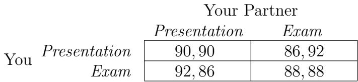  
شکل ۶.۱: امتحان یا ارائه؟

این تنظیم موقعیت را توصیف می‌کند؛ حالا باید بفهمید چه کاری انجام دهید: آماده شدن برای ارائه یا مطالعه برای امتحان؟ به‌وضوح، نمره میانگین شما نه تنها به انتخاب بین این دو گزینه بستگی دارد، بلکه به تصمیم شریک شما نیز بستگی دارد. بنابراین، بخشی از تصمیم‌گیری شما این است که درباره اینکه شریک شما چه کاری احتمالاً انجام خواهد داد استدلال کنید. فکر کردن درباره پیامدهای استراتژیک اقدامات خود، که در آن باید تأثیر تصمیمات دیگران را در نظر بگیرید، دقیقاً نوع استدلالی است که نظریه بازی‌ها برای تسهیل آن طراحی شده است. بنابراین، قبل از پرداختن به نتیجه واقعی این سناریوی امتحان-ارائه، مفید است که برخی از تعاریف پایه‌ای نظریه بازی‌ها را معرفی کنیم و سپس بحث را به این زبان ادامه دهیم.

اجزای اصلی یک بازی. موقعیتی که توصیف کردیم نمونه‌ای از یک بازی است. برای اهداف ما، بازی هر موقعیتی است که دارای سه جنبه زیر باشد.

(i) مجموعه‌ای از شرکت‌کنندگان وجود دارد که آن‌ها را بازیکنان می‌نامیم. در مثال ما، شما و شریک شما دو بازیکن هستند.   
(ii) هر بازیکن مجموعه‌ای از گزینه‌ها برای رفتار دارد؛ ما به این‌ها استراتژی‌های ممکن بازیکن اشاره می‌کنیم. در مثال، شما و شریک شما هر کدام دو استراتژی ممکن دارید: آماده شدن برای ارائه یا مطالعه برای امتحان.   
(iii) برای هر انتخاب استراتژی‌ها، هر بازیکن پاداشی دریافت می‌کند که ممکن است به استراتژی‌های انتخاب‌شده توسط همه بستگی داشته باشد. پاداش‌ها معمولاً اعداد هستند و هر بازیکن پاداش‌های بزرگ‌تر را به پاداش‌های کوچک‌تر ترجیح می‌دهد. در مثال فعلی، پاداش هر بازیکن نمره میانگینی است که در امتحان و ارائه دریافت می‌کند. ما معمولاً پاداش‌ها را در یک ماتریس پاداش مانند شکل ۶.۱ می‌نویسیم.

علاقه ما در استدلال درباره نحوه رفتار بازیکنان در یک بازی خاص است. در حال حاضر بر روی بازی‌هایی با تنها دو بازیکن تمرکز می‌کنیم، اما این ایده‌ها به‌خوبی برای بازی‌های با هر تعداد بازیکن نیز قابل اعمال هستند. همچنین، بر روی بازی‌های ساده و یک‌باره تمرکز خواهیم کرد: بازی‌هایی که در آن‌ها بازیکنان به‌صورت همزمان و مستقل اقدامات خود را انتخاب می‌کنند و تنها یک‌بار این کار را انجام می‌دهند. در بخش ۶.۱۰ پایان این فصل، بحث می‌کنیم که چگونه می‌توانیم نظریه را برای بازی‌های پویا تفسیر مجدد کنیم، که در آن‌ها اقدامات می‌توانند به‌صورت متوالی در طول زمان اجرا شوند.

# ۶.۲ استدلال درباره رفتار در یک بازی

پس از نوشتن توصیف یک بازی، که شامل بازیکنان، استراتژی‌ها و پاداش‌ها است، می‌توانیم بپرسیم که بازیکنان چگونه احتمالاً رفتار خواهند کرد — یعنی چگونه استراتژی‌ها را انتخاب خواهند کرد.

فرضیات پایه. برای قابل حل کردن این سؤال، چند فرضیه خواهیم کرد. اول، فرض می‌کنیم که همه چیزی که یک بازیکن اهمیت می‌دهد در پاداش‌های او خلاصه شده است. در بازی امتحان-ارائه توصیف‌شده در بخش ۶.۱، این به این معناست که دو بازیکن تنها به دنبال حداکثر کردن نمره میانگین خود هستند. با این حال، هیچ چیز در چارچوب نظریه بازی‌ها نیاز ندارد که بازیکنان تنها به پاداش‌های شخصی اهمیت دهند. به‌عنوان مثال، یک بازیکن خودطلب ممکن است به هر دو منفعت خود و منفعت بازیکن دیگر اهمیت دهد. اگر این‌گونه باشد، پاداش‌ها باید این موضوع را منعکس کنند؛ پس از تعریف پاداش‌ها، باید توصیف کاملی از خوشبختی هر بازیکن برای هر یک از نتایج ممکن بازی باشند.

همچنین فرض می‌کنیم که هر بازیکن از تمام جنبه‌های ساختار بازی آگاه است. ابتدا، این به این معناست که هر بازیکن لیست استراتژی‌های ممکن خود را می‌داند. در بسیاری از زمینه‌ها منطقی است که فرض کنیم هر بازیکن بداند که بازیکن دیگر چه کسی است (در بازی دو نفره)، استراتژی‌های موجود برای این بازیکن دیگر، و پاداش او برای هر انتخاب استراتژی چه خواهد بود. در بازی امتحان-ارائه، این متناسب با فرضیه است که متوجه می‌شوید شما و شریک شما هر کدام با انتخاب بین مطالعه برای امتحان یا آماده شدن برای ارائه مواجه هستید و برآورد دقیقی از نتیجه مورد انتظار در مسیرهای اقدام مختلف دارید. تحقیقات گسترده‌ای درباره نحوه تحلیل بازی‌هایی وجود دارد که در آن‌ها بازیکنان دانش کمتری درباره ساختار پایه‌ای دارند، و در واقع جان هارسانی برای کارهایش در بازی‌های با اطلاعات ناقص جایزه نوبل اقتصاد ۱۹۹۴ را به اشتراک گرفت [208].

**GLOSSARY:**
Fitness: برازندگی

در نهایت، فرض می‌کنیم که هر فرد استراتژی‌ای را انتخاب می‌کند که سود خود را با توجه به باورهایش درباره استراتژی استفاده شده توسط بازیکن دیگر بیشینه کند. این مدل رفتار فردی، که معمولاً عقلانیت نامیده می‌شود، در واقع ترکیبی از دو ایده است. اولین ایده این است که هر بازیکن می‌خواهد سود خود را بیشینه کند. از آنجایی که سود فرد به چیزی تعریف می‌شود که فرد به آن اهمیت می‌دهد، این فرضیه منطقی به نظر می‌رسد. دومین ایده این است که هر بازیکن در واقع موفق می‌شود استراتژی بهینه را انتخاب کند. در محیط‌های ساده و برای بازی‌هایی که توسط بازیکنان تجربه‌دار انجام می‌شوند، این نیز منطقی به نظر می‌رسد. در بازی‌های پیچیده یا برای بازی‌هایی که توسط بازیکنان بی‌تجربه انجام می‌شوند، این حتماً کمتر منطقی است. بررسی بازیکنانی که اشتباه می‌کنند و از بازی درس می‌گیرند، جالب است. ادبیات گسترده‌ای وجود دارد که چنین مسائلی را تحلیل می‌کند [175]، اما ما در اینجا به این مسائل نخواهیم پرداخت.

استدلال درباره رفتار در بازی امتحان یا ارائه. بیایید به بازی امتحان یا ارائه برگردیم و بپرسیم که چگونه باید انتظار داشته باشیم که شما و همراه شما — دو بازیکن در این بازی — رفتار کنید.

اول از همه، این موضوع را از دیدگاه شما بررسی می‌کنیم. (استدلال برای همراه شما متقارن خواهد بود، زیرا بازی از دیدگاه او همانند است.) اگر می‌توانستید رفتار همراه خود را پیش‌بینی کنید، تصمیم گیری آسان‌تر بود، اما برای شروع، بیایید در نظر بگیریم که برای هر انتخاب احتمالی استراتژی توسط همراه شما، چه کاری باید انجام دهید.

• اول، اگر می‌دانستید همراه شما قرار است برای امتحان درس بخواند، آنگاه با درس خواندن نیز سود 88 خواهید داشت و با آماده‌سازی ارائه فقط سود 86. بنابراین در این حالت، باید برای امتحان درس بخوانید.

• از طرف دیگر، اگر می‌دانستید همراه شما قرار است برای ارائه آماده شود، آنگاه با آماده‌سازی ارائه نیز سود 90 خواهید داشت، اما با درس خواندن برای امتحان سود 92. بنابراین در این حالت نیز، باید برای امتحان درس بخوانید.

این روش بررسی هر گزینه همراه شما به صورت جداگانه، روش بسیار مفیدی برای تحلیل وضعیت فعلی است: نشان می‌دهد که بی‌تفاوت از آنچه همراه شما انجام می‌دهد، باید برای امتحان درس بخوانید.

وقتی یک بازیکن استراتژی داشته باشد که نسبت به همه گزینه‌های دیگر به طور قطع بهتر باشد، بی‌توجه به اینکه بازیکن دیگر چه کاری انجام دهد، به آن استراتژی غالب سخت‌گیرانه می‌گوییم. وقتی بازیکنی استراتژی غالب سخت‌گیرانه داشته باشد، باید انتظار داشته باشیم که قطعاً آن را اجرا کند. در بازی امتحان یا ارائه، درس خواندن برای امتحان نیز برای همراه شما یک استراتژی غالب سخت‌گیرانه است (با استدلال مشابه)، بنابراین باید انتظار داشته باشیم که نتیجه این باشد که هر دو شما درس بخوانید و هر کدام معدل 88 بگیرید.

بنابراین این بازی تحلیل بسیار شفافی دارد و راحت است که پیش‌بینی نتیجه را ببینیم. با این حال، چیزی در این نتیجه شگفت‌انگیز است. اگر شما و همراه شما بتوانید به طوری توافق کنید که هر دو برای ارائه آماده شوید، هر کدام معدل 90 خواهید گرفت — به عبارت دیگر، هر دو بهتر خواهید بود. اما با وجود اینکه هر دو این موضوع را می‌فهمید، این سود 90 با بازی عقلانی قابل دستیابی نیست. استدلال فوق به وضوح نشان می‌دهد که چرا: حتی اگر شخصاً تعهد کنید که برای ارائه آماده شوید — با امید به دستیابی به نتیجه‌ای که هر دو 90 می‌گیرید — و حتی اگر همراه شما بداند که شما این کار را انجام می‌دهید، همراه شما همچنان انگیزه‌ای برای درس خواندن برای امتحان دارد تا سود 92 بالاتری برای خود به دست آورد.

این نتیجه به فرض ما بستگی دارد که سودها واقعاً همه چیزی را که هر بازیکن در نتیجه ارزش می‌دهد منعکس می‌کنند — در این مورد، اینکه شما و همراه شما تنها به بیشینه کردن معدل خود اهمیت می‌دهید. اگر به عنوان مثال، به معدل همراه شما نیز اهمیت می‌دادید، آنگاه سودهای این بازی متفاوت خواهد بود و نتیجه ممکن است متفاوت باشد. به طور مشابه، اگر به این موضوع اهمیت می‌دادید که همراه شما به خاطر عدم آماده‌سازی برای ارائه مشترک از شما خشمگین است، آنگاه این نیز باید به سودها گنجانده شود و دوباره ممکن است بر نتایج تأثیر بگذارد. اما با سودهای موجود، ما با موقعیت جالبی روبرو هستیم که در آن نتیجه‌ای وجود دارد که برای هر دو بهتر است — معدل 90 برای هر کدام — و با این حال، با بازی عقلانی این بازی قابل دستیابی نیست.

داستان مرتبط: دیلمای زندانی. نتیجه بازی امتحان یا ارائه به شدت با یکی از معروف‌ترین مثال‌ها در توسعه نظریه بازی‌ها، یعنی دیلمای زندانی، مرتبط است. اینجا نحوه کار این مثال آمده است.

فرض کنید دو متهم توسط پلیس دستگیر شده‌اند و در اتاق‌های جداگانه بازجویی می‌شوند. پلیس به شدت مشکوک است که این دو فرد مسئول سرقت هستند، اما شواهد کافی برای محکوم کردن هر کدام از آن‌ها به سرقت وجود ندارد. با این حال، هر دو از دستگیری مقاومت کرده‌اند و می‌توانند به این جرم کمتر محکوم شوند که حکم آن یک سال زندان است. به هر یک از متهمان داستان زیر گفته می‌شود. «اگر اعتراف کنید و همراه شما اعتراف نکند، شما آزاد خواهید شد و همراه شما به جرم سرقت محکوم خواهد شد. اعتراف شما کافی است تا او را به سرقت محکوم کنید و او به زندان 10 ساله فرستاده خواهد شد. اگر هر دو اعتراف کنید، دیگر نیازی به شهادت یکی از شما علیه دیگری نیست و هر دو شما به جرم سرقت محکوم خواهید شد. (اگرچه در این حالت حکم شما کمتر خواهد بود — فقط 4 سال — به دلیل اعتراف شما.) در نهایت، اگر هیچ‌یک از شما اعتراف نکنید، نمی‌توانیم هیچ‌یک از شما را به سرقت محکوم کنیم، بنابراین هر کدام را به مقاومت در برابر دستگیری متهم خواهیم کرد. همراه شما همین پیشنهاد را دریافت کرده است. آیا می‌خواهید اعتراف کنید؟»

برای فرموله کردن این داستان به عنوان یک بازی، باید بازیکنان، استراتژی‌های ممکن و سودها را شناسایی کنیم. دو متهم بازیکنان هستند و هر کدام باید بین دو استراتژی ممکن — اعتراف ( $\ C$ ) یا عدم اعتراف ( $N C$ ) — انتخاب کنند. در نهایت، سودها می‌توانند از داستان فوق خلاصه شوند مانند شکل 6.2. (توجه کنید که سودها همه 0 یا کمتر هستند، زیرا برای متهمان هیچ نتیجه خوبی وجود ندارد، تنها تفاوت در درجات بدی وجود دارد.)

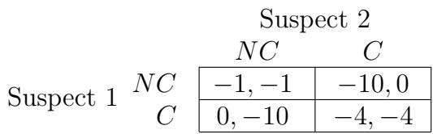  
شکل 6.2: دیلمای زندانی

همانند بازی امتحان یا ارائه، می‌توانیم بررسی کنیم که یکی از متهمان — مثلاً متهم 1 — چگونه باید درباره گزینه‌هایش استدلال کند.

• اگر متهم 2 قرار باشد اعتراف کند، آنگاه متهم 1 با اعتراف سود $- 4$ دریافت می‌کند و با عدم اعتراف سود $- 1 0$. بنابراین در این حالت، متهم 1 باید اعتراف کند.   
• اگر متهم 2 قرار باشد اعتراف نکند، آنگاه متهم 1 با اعتراف سود 0 دریافت می‌کند و با عدم اعتراف سود $- 1$. بنابراین در این حالت نیز، متهم 1 باید اعتراف کند.

بنابراین اعتراف یک استراتژی غالب سخت‌گیرانه است — بهترین انتخاب است بی‌توجه به اینکه بازیکن دیگر چه انتخابی کند. در نتیجه، باید انتظار داشته باشیم که هر دو متهم اعتراف کنند، هر کدام سود $- 4$ دریافت کنند.

بنابراین ما همان پدیده شگفت‌انگیزی را در بازی امتحان یا ارائه داریم: نتیجه‌ای وجود دارد که متهمان می‌دانند برای هر دو بهتر است — که هر دو اعتراف نکنند — اما در بازی عقلانی، راهی برای دستیابی به این نتیجه وجود ندارد. در عوض، به نتیجه‌ای می‌رسند که برای هر دو بدتر است. و در اینجا نیز مهم است که سودها همه جنبه‌های نتیجه بازی را منعکس کنند؛ اگر به عنوان مثال، متهمان بتوانند به طور قابل اعتماد با تهدید انتقام برای اعتراف یکدیگر تهدید کنند، به طوری که اعتراف گزینه کمتر مطلوبی شود، آنگاه این موضوع بر سودها و در نتیجه بر نتیجه تأثیر خواهد گذاشت.

تفسیرهای دیلمای زندانی. دیلمای زندانی از زمان معرفی آن در اوایل دهه 1950 [343, 346] موضوع ادبیات فراوانی بوده است، زیرا به عنوان تصویری بسیار ساده‌شده از دشواری ایجاد همکاری در برابر منافع فردی عمل می‌کند. هرچند هیچ مدلی به این سادگی نمی‌تواند دقیقاً سناریوهای پیچیده دنیای واقعی را به تصویر بکشد، اما دیلمای زندانی به عنوان چارچوب تفسیری برای بسیاری از موقعیت‌های واقعی استفاده شده است.

به عنوان مثال، استفاده از داروهای بهبوددهنده عملکرد در ورزش حرفه‌ای به عنوان موردی از بازی دیلمای زندانی مدل‌سازی شده است [210, 367]. در اینجا ورزشکاران بازیکنان هستند و دو استراتژی ممکن استفاده از داروهای بهبوددهنده عملکرد یا عدم استفاده است. اگر شما از دارو استفاده کنید و حریف شما نکند، مزیتی در رقابت خواهید داشت، اما آسیب‌های بلندمدت خواهید دید (و ممکن است دستگیر شوید). اگر ورزشی را در نظر بگیریم که تشخیص استفاده از این داروها دشوار باشد و فرض کنیم ورزشکاران در چنین ورزشی نقصان را عامل کمتری نسبت به مزایای رقابتی ببینند، می‌توانیم این موقعیت را با سودهای عددی که به شکل زیر باشد، بگیریم. (اعداد در اینجا دلخواه هستند؛ ما فقط به اندازه نسبی آن‌ها علاقه‌مندیم.)

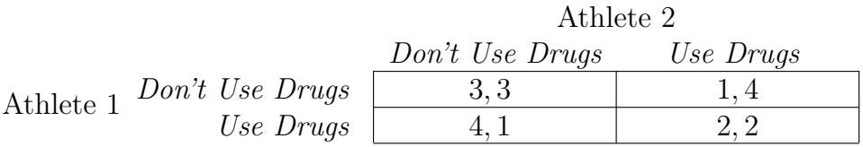  
شکل 6.3: داروهای بهبوددهنده عملکرد

در اینجا، بهترین نتیجه (با سود 4) استفاده از دارو هنگامی است که حریف شما از آن استفاده نکند، زیرا در این صورت شانس برنده شدن را بیشینه می‌کنید. با این حال، سود هر دو استفاده از دارو (2) از سود هر دو عدم استفاده از دارو (3) بدتر است، زیرا در هر دو حالت شما به طور مساوی مسابقه می‌دهید، اما در حالت اول شما همچنین به خود آسیب می‌رسانید. اکنون می‌بینیم که استفاده از دارو یک استراتژی غالب سخت‌گیرانه است و بنابراین موقعیتی داریم که بازیکنان از دارو استفاده می‌کنند، هرچند درک می‌کنند که نتیجه بهتری برای هر دو وجود دارد.

به طور کلی‌تر، چنین موقعیت‌هایی اغلب به عنوان رقابت‌های نظامی شناخته می‌شوند، در که دو رقیب از سلاح‌های به طور فزاینده خطرناک استفاده می‌کنند تنها برای حفظ تساوی. در مثال فوق، داروهای بهبوددهنده عملکرد نقش سلاح‌ها را ایفا می‌کنند، اما دیلمای زندانی همچنین برای تفسیر رقابت‌های نظامی واقعی بین کشورهای رقیب استفاده شده است، که در آن سلاح‌ها متناظر با تسلیحات نظامی کشورها هستند.

برای پایان دادن به بحث ما درباره دیلمای زندانی، باید توجه کنیم که این دیلمای زندانی فقط زمانی رخ می‌دهد که سودها به شکل خاصی تنظیم شده باشند — همانطور که در بقیه فصل خواهیم دید، بسیاری از موقعیت‌ها وجود دارند که ساختار بازی و رفتار ناشی از آن بسیار متفاوت است. در واقع، حتی تغییرات ساده در یک بازی می‌تواند آن را از یک مورد دیلمای زندانی به چیزی بی‌خطرتر تبدیل کند. به عنوان مثال، بازگشت به بازی امتحان یا ارائه، فرض کنید که همه چیز را مانند قبل نگه می‌داریم، به جز اینکه امتحان را بسیار ساده‌تر می‌کنیم، به طوری که اگر درس بخوانید 100 می‌گیرید و اگر نخوانید 96. سپس می‌توانیم بررسی کنیم که ماتریس سود حالا به شکل زیر می‌شود.

شکل 6.4: بازی امتحان یا ارائه با امتحان آسان‌تر.   

<table><tr><td colspan="3">همراه شما</td></tr><tr><td rowspan="2">ارائه شما</td><td>ارائه</td><td>امتحان</td></tr><tr><td>98,98</td><td>94,96</td></tr><tr><td>امتحان</td><td>96,94</td><td>92,92</td></tr></table>

علاوه بر این، می‌توانیم بررسی کنیم که با این سودهای جدید، آماده‌سازی برای ارائه اکنون یک استراتژی غالب سخت‌گیرانه می‌شود؛ بنابراین می‌توانیم انتظار داشته باشیم که هر دو بازیکن این استراتژی را اجرا کنند و هر دو از این تصمیم بهره خواهند برد. معایب سناریوی قبلی دیگر ظاهر نمی‌شوند: مانند سایر پدیده‌های خطرناک، دیلمای زندانی فقط زمانی ظاهر می‌شود که شرایط مناسب باشد.

# 6.3 بهترین پاسخ‌ها و استراتژی‌های غالب

در استدلال درباره بازی‌های بخش قبلی، از دو مفهوم اساسی استفاده کردیم که در بحث نظریه بازی‌ها مرکزی خواهند بود. بنابراین، تعریف دقیق آن‌ها در اینجا مفید است و سپس به بررسی برخی از پیامدهای آن‌ها می‌پردازیم.

واژه‌نامه:
برازندگی: برازندگی

اولین مفهوم، پاسخ بهینه است: این بهترین انتخاب یک بازیکن است، با توجه به باوری که درباره آنچه بازیکن دیگر انجام خواهد داد دارد. برای مثال، در بازی امتحان یا ارائه، بهترین انتخاب شما را در پاسخ به هر انتخاب ممکن شریک خود تعیین کردیم.

این را با نمادگذاری کمی دقیق‌تر می‌کنیم، به شرح زیر. اگر $S$ استراتژی انتخاب‌شده توسط بازیکن ۱ باشد و $T$ استراتژی انتخاب‌شده توسط بازیکن ۲ باشد، آنگاه در ماتریس پرداخت، ورودی متناظر با جفت استراتژی‌های انتخاب‌شده $( S , T )$ وجود دارد. ما $P _ { 1 } ( S , T )$ را برای نمایش پرداخت بازیکن ۱ ناشی از این جفت استراتژی‌ها و $P _ { 2 } ( S , T )$ را برای نمایش پرداخت بازیکن ۲ ناشی از این جفت استراتژی‌ها خواهیم نوشت. حالا، می‌گوییم که استراتژی $S$ برای بازیکن ۱ پاسخ بهینه به استراتژی $T$ برای بازیکن ۲ است اگر $S$ پرداختی حداقل به اندازه هر استراتژی دیگر همراه با $T$ ایجاد کند: $$
P _ { 1 } ( S , T ) \ge P _ { 1 } ( S ^ { \prime } , T )
$$ برای همه استراتژی‌های دیگر $S ^ { \prime }$ بازیکن ۱. به طور طبیعی، تعریف کاملاً متقارنی برای بازیکن ۲ وجود دارد که در اینجا نمی‌نویسیم. (در ادامه، تعاریف را از دیدگاه بازیکن ۱ ارائه خواهیم داد، اما در هر مورد، تشابه مستقیمی برای بازیکن ۲ وجود دارد.)

توجه کنید که این تعریف اجازه می‌دهد که چندین استراتژی مختلف بازیکن ۱ به عنوان پاسخ بهینه به استراتژی $T$ برابر شوند. این می‌تواند پیش‌بینی کردن اینکه بازیکن ۱ از کدام یک از این استراتژی‌های مختلف استفاده خواهد کرد را دشوار کند. می‌توانیم تأکید کنیم که یک انتخاب به‌طور منحصربه‌فرد بهترین است با گفتن اینکه استراتژی $S$ بازیکن ۱ پاسخ بهینه دقیق به استراتژی $T$ برای بازیکن ۲ است اگر $S$ پرداختی به‌طور قطع بالاتر از هر استراتژی دیگر همراه با $T$ ایجاد کند: $$
P _ { 1 } ( S , T ) > P _ { 1 } ( S ^ { \prime } , T )
$$ برای همه استراتژی‌های دیگر $S ^ { \prime }$ بازیکن ۱. هنگامی که یک بازیکن پاسخ بهینه دقیق به $T$ دارد، این به‌وضوح استراتژی است که باید هنگام مواجهه با $T$ اجرا کند.

مفهوم دوم، که در تحلیل بخش قبلی مرکزی بود، استراتژی غالب دقیق است. تعریف آن را از نظر پاسخ‌های بهینه به شرح زیر می‌توانیم بیان کنیم.

• می‌گوییم که یک استراتژی غالب برای بازیکن ۱ استراتژی است که پاسخ بهینه به هر استراتژی بازیکن ۲ باشد.
• می‌گوییم که یک استراتژی غالب دقیق برای بازیکن ۱ استراتژی است که پاسخ بهینه دقیق به هر استراتژی بازیکن ۲ باشد.

در بخش قبلی، مشاهده کردیم که اگر یک بازیکن استراتژی غالب دقیق داشته باشد، می‌توانیم انتظار داشته باشیم که آن را استفاده کند. مفهوم استراتژی غالب ضعیف‌تر است، زیرا می‌تواند در مقابل برخی استراتژی‌های مخالف به‌عنوان بهترین گزینه برابر شود. در نتیجه، یک بازیکن ممکن است چندین استراتژی غالب داشته باشد، در این صورت ممکن است مشخص نباشد که کدام یک باید اجرا شود.

تحلیل دیلمای زندانی با این واقعیت تسهیل شد که هر دو بازیکن استراتژی‌های غالب دقیق داشتند و بنابراین پیش‌بینی احتمال وقوع آن آسان بود. اما بیشتر موارد چندان واضح نخواهند بود و حالا شروع به بررسی بازی‌هایی می‌کنیم که استراتژی‌های غالب دقیق ندارند.

بازی‌ای که تنها یک بازیکن استراتژی غالب دقیق دارد. به عنوان مرحله اول، فرض کنید یک بازیکن استراتژی غالب دقیق دارد و دیگری ندارد. به عنوان مثال ملموس، داستان زیر را در نظر می‌گیریم.

فرض کنید دو شرکت هر کدام قصد تولید و بازاریابی یک محصول جدید را دارند؛ این دو محصول مستقیماً با یکدیگر رقابت خواهند کرد. فرض کنید جمعیت مصرف‌کنندگان به‌طور واضح به دو بازار هدف تقسیم می‌شود: افرادی که فقط نسخه کم‌قیمت محصول را می‌خرند و افرادی که فقط نسخه لوکس را می‌خرند. همچنین فرض کنید سود هر شرکت از فروش نسخه کم‌قیمت یا لوکس یکسان است. بنابراین برای پیگیری سود، کافی است فروش‌ها را پیگیری کنیم. هر شرکت می‌خواهد سود خود را حداکثر کند، یا به عبارت دیگر فروش خود را، و برای این کار باید تصمیم بگیرد که محصول جدیدش کم‌قیمت باشد یا لوکس.

بنابراین این بازی دو بازیکن دارد — شرکت ۱ و شرکت ۲ — و هر کدام دو استراتژی ممکن دارند: تولید محصول کم‌قیمت یا لوکس. برای تعیین پرداخت‌ها، نحوه پیش‌بینی فروش شرکت‌ها به شرح زیر است.

• اول، افرادی که نسخه کم‌قیمت را ترجیح می‌دهند ۶۰٪ جمعیت را تشکیل می‌دهند و افرادی که نسخه لوکس را ترجیح می‌دهند ۴۰٪ جمعیت را تشکیل می‌دهند. • شرکت ۱ برند بسیار محبوب‌تری است، بنابراین هنگامی که دو شرکت مستقیماً در یک بازار هدف رقابت می‌کنند، شرکت ۱ ۸۰٪ فروش و شرکت ۲ ۲۰٪ فروش را به دست می‌آورد. (اگر یک شرکت تنها تولیدکننده محصول برای یک بازار هدف خاص باشد، تمام فروش را به دست می‌آورد.)

بر اساس این، پرداخت‌ها برای انتخاب‌های مختلف استراتژی‌ها به شرح زیر تعیین می‌شود.

• اگر دو شرکت به بازارهای هدف متفاوت بازاریابی کنند، هر کدام تمام فروش در آن بازار هدف را به دست می‌آورند. بنابراین شرکتی که به بازار کم‌قیمت هدف قرار می‌دهد پرداخت .۶۰ و شرکتی که به بازار لوکس هدف قرار می‌دهد پرداخت .۴۰ را به دست می‌آورد.
• اگر هر دو شرکت به بازار کم‌قیمت هدف قرار دهند، شرکت ۱ ۸۰٪ از آن را به دست می‌آورد، که پرداخت .۴۸ است، و شرکت ۲ ۲۰٪ را به دست می‌آورد، که پرداخت .۱۲ است.
• به‌طور مشابه، اگر هر دو شرکت به بازار لوکس هدف قرار دهند، شرکت ۱ پرداخت $( . 8 ) ( . 4 ) = . 3 2 $ و شرکت ۲ پرداخت $( . 2 ) ( . 4 ) = . 0 8$ را به دست می‌آورد.

این را می‌توان در ماتریس پرداخت زیر خلاصه کرد.

شکل ۶.۵: استراتژی بازاریابی

<table><tr><td colspan="3">Firm 2</td></tr><tr><td rowspan="2">Low-Priced Firm 1</td><td>Low-Priced</td><td>Upscale</td></tr><tr><td>.48,.12</td><td>.60, .40</td></tr><tr><td>Upscale</td><td>.40, .60</td><td>.32,.08</td></tr></table>

توجه کنید که در این بازی، شرکت ۱ استراتژی غالب دقیق دارد: برای شرکت ۱، Low-Priced پاسخ بهینه دقیق به هر استراتژی شرکت ۲ است. از سوی دیگر، شرکت ۲ استراتژی غالبی ندارد: Low-Priced بهترین پاسخ آن است هنگامی که شرکت ۱ Upscale بازی می‌کند، و Upscale بهترین پاسخ آن است هنگامی که شرکت ۱ Low-Priced بازی می‌کند.

با این حال، پیش‌بینی نتیجه این بازی دشوار نیست. از آنجا که شرکت ۱ استراتژی غالب دقیق در Low-Priced دارد، می‌توانیم انتظار داشته باشیم که آن را اجرا کند. حالا، شرکت ۲ چه کاری باید انجام دهد؟ اگر شرکت ۲ پرداخت‌های شرکت ۱ را بداند و بداند که شرکت ۱ می‌خواهد سود را حداکثر کند، آنگاه شرکت ۲ می‌تواند با اطمینان پیش‌بینی کند که شرکت ۱ Low-Priced بازی خواهد کرد. سپس، از آنجا که Upscale پاسخ بهینه دقیق شرکت ۲ به Low-Priced است، می‌توانیم پیش‌بینی کنیم که شرکت ۲ Upscale بازی خواهد کرد. بنابراین پیش‌بینی کلی ما در این بازی بازاریابی این است که شرکت ۱ Low-Priced و شرکت ۲ Upscale بازی کنند، که منجر به پرداخت‌های .۶۰ و .۴۰ به ترتیب می‌شود.

توجه کنید که اگرچه استدلال را در دو مرحله توصیف می‌کنیم — اول استراتژی غالب دقیق شرکت ۱ و سپس پاسخ بهینه شرکت ۲ — اما این همچنان در زمینه بازی‌ای است که بازیکنان همزمان حرکت می‌کنند: هر دو شرکت به‌طور همزمان و محرمانه استراتژی‌های بازاریابی خود را توسعه می‌دهند. این فقط به این دلیل است که استدلال درباره استراتژی‌ها به‌طور طبیعی این منطق دو مرحله‌ای را دنبال می‌کند و منجر به پیش‌بینی نحوه اجرای همزمان می‌شود. همچنین جالب است که پیام شهودی این پیش‌بینی را در نظر بگیریم. شرکت ۱ آنقدر قوی است که می‌تواند بدون توجه به تصمیم شرکت ۲ پیش برود؛ با توجه به این، بهترین استراتژی شرکت ۲ این است که به‌طور ایمن از مسیر شرکت ۱ دور بماند.

در نهایت، باید توجه کنیم که بازی استراتژی بازاریابی چگونه از دانشی استفاده می‌کند که فرض می‌کنیم بازیکنان درباره بازی انجام‌شده و یکدیگر دارند. به‌طور خاص، فرض می‌کنیم که هر بازیکن کل ماتریس پرداخت را می‌داند. و در استدلال درباره این بازی خاص، مهم است که شرکت ۲ بداند شرکت ۱ می‌خواهد سود را حداکثر کند و شرکت ۲ بداند که شرکت ۱ از سود خود آگاه است. به‌طور کلی، فرض می‌کنیم که بازیکنان دانش مشترکی از بازی دارند: آن‌ها ساختار بازی را می‌دانند، می‌دانند که هر کدام ساختار بازی را می‌دانند، می‌دانند که هر کدام می‌دانند که هر کدام ساختار بازی را می‌دانند و به همین ترتیب. در حالی که در اینجا نیازی به محتوای فنی کامل دانش مشترک نداریم، این یک فرضیه پایه‌ای و موضوع تحقیق در ادبیات نظریه بازی‌ها [28] است. همان‌طور که قبلاً اشاره شد، تحلیل بازی‌ها در شرایطی که دانش مشترک وجود ندارد همچنان ممکن است، اما تحلیل پیچیده‌تر می‌شود [208]. همچنین ارزشمند است که توجه کنیم که فرض دانش مشترک کمی قوی‌تر از آن است که برای استدلال درباره بازی‌های ساده مانند دیلمای زندانی لازم باشد، که در آن استراتژی‌های غالب دقیق برای هر بازیکن نتیجه خاصی را بدون توجه به آنچه بازیکن دیگر انجام می‌دهد، نشان می‌دهد.

# 6.4 تعادل نش

هنگامی که هیچ‌یک از بازیکنان در یک بازی دو نفره استراتژی غالب دقیق نداشته باشند، نیاز به روش دیگری برای پیش‌بینی آنچه احتمالاً رخ خواهد داد داریم. در این بخش، روش‌هایی برای این کار توسعه خواهیم داد؛ نتیجه یک چارچوب مفید برای تحلیل بازی‌ها به‌طور کلی خواهد بود.

مثال: بازی سه مشتری. برای بیان سؤال، کمک می‌کند که یک مثال ساده از بازی‌ای را در نظر بگیریم که استراتژی‌های غالب دقیق ندارد. مانند مثال قبلی، این یک بازی بازاریابی بین دو شرکت خواهد بود؛ اما ساختاری کمی پیچیده‌تر دارد. فرض کنید دو شرکت هر کدام قصد دارند با یکی از سه مشتری بزرگ، $A$ ، $B$ و $C$ کار کنند. هر شرکت سه استراتژی ممکن دارد: مراجعه به $A$ ، $B$ یا $C$ . نتایج دو تصمیم آن‌ها به شرح زیر خواهد بود.

• اگر دو شرکت به یک مشتری مراجعه کنند، مشتری نیمی از کار خود را به هر کدام خواهد داد.   
• شرکت ۱ برای جذب کار به‌تنهایی بسیار کوچک است، بنابراین اگر به یک مشتری مراجعه کند در حالی که شرکت ۲ به مشتری دیگری مراجعه کند، شرکت ۱ پرداخت ۰ را به دست می‌آورد.   
• اگر شرکت ۲ به‌تنهایی به مشتری $B$ یا $C$ مراجعه کند، تمام کار آن‌ها را به دست خواهد آورد. با این حال، $A$ مشتری بزرگ‌تری است و تنها در صورتی با شرکت‌ها کار خواهد کرد که هر دو به $A$ مراجعه کنند.   
• به‌دلیل اینکه $A$ مشتری بزرگ‌تری است، کار با آن ارزش ۸ دارد (و بنابراین ۴ برای هر شرکت اگر تقسیم شود)، در حالی که کار با $B$ یا $C$ ارزش ۲ دارد (و بنابراین ۱ برای هر شرکت اگر تقسیم شود).

از این توصیف، می‌توانیم ماتریس پرداخت زیر را محاسبه کنیم.

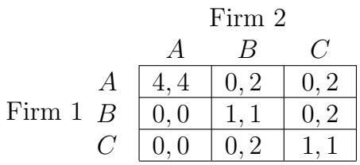  
شکل ۶.۶: بازی سه مشتری

اگر نحوه کار پرداخت‌ها در این بازی را بررسی کنیم، می‌بینیم که هیچ‌کدام از شرکت‌ها استراتژی غالبی ندارند. در واقع، هر استراتژی هر شرکت پاسخ بهینه دقیق به برخی استراتژی‌های شرکت دیگر است. برای شرکت ۱، $A$ پاسخ بهینه دقیق به استراتژی $A$ شرکت ۲ است، $B$ پاسخ بهینه دقیق به $B$ است و $C$ پاسخ بهینه دقیق به $C$ است. برای شرکت ۲، $A$ پاسخ بهینه دقیق به استراتژی $A$ شرکت ۱ است، $C$ پاسخ بهینه دقیق به $B$ است و $B$ پاسخ بهینه دقیق به $C$ است. پس چگونه باید درباره نتیجه اجرای این بازی استدلال کنیم؟

**واژه‌نامه:**
Fitness: برازندگی

تعریف تعادل نش. در سال ۱۹۵۰، جان نش اصلی ساده اما قدرتمندی برای استدلال درباره رفتار در بازی‌های کلی ارائه داد [313, 314]، و فرضیه پایه آن به شرح زیر است: حتی زمانی که استراتژی‌های غالب وجود ندارند، باید انتظار داشت که بازیکنان از استراتژی‌هایی استفاده کنند که پاسخ‌های بهینه به یکدیگر باشند. به طور دقیق‌تر، فرض کنید که بازیکن ۱ استراتژی $S$ را انتخاب می‌کند و بازیکن ۲ استراتژی $T$ را انتخاب می‌کند. ما می‌گوییم که این جفت استراتژی‌ها $( S , T )$ یک تعادل نش است اگر $S$ بهترین پاسخ به $T$ باشد و $T$ بهترین پاسخ به $S$ باشد. این مفهومی نیست که صرفاً از عقلانیت بازیکنان قابل استنتاج باشد؛ بلکه یک مفهوم تعادل است. ایده این است که اگر بازیکنان استراتژی‌هایی را انتخاب کنند که بهترین پاسخ به یکدیگر باشند، هیچ بازیکنی انگیزه‌ای برای انحراف به استراتژی دیگری نخواهد داشت — بنابراین سیستم در حالتی از تعادل قرار دارد که نیرویی آن را به سمت نتیجه دیگری هل نمی‌دهد. نش جایزه نوبل اقتصاد سال ۱۹۹۴ را به خاطر توسعه و تحلیل این ایده به اشتراک گذاشت.

برای درک مفهوم تعادل نش، ابتدا باید بپرسیم که چرا یک جفت استراتژی که پاسخ‌های بهینه به یکدیگر نیستند، تعادل تشکیل نمی‌دهند. پاسخ این است که بازیکنان نمی‌توانند هر دو باور داشته باشند که این استراتژی‌ها در بازی واقعاً استفاده خواهند شد، زیرا می‌دانند که حداقل یک بازیکن انگیزه‌ای برای انحراف به استراتژی دیگری دارد. بنابراین تعادل نش را می‌توان به عنوان تعادل در باورها در نظر گرفت. اگر هر بازیکن باور داشته باشد که بازیکن دیگر استراتژی‌ای را اجرا خواهد کرد که بخشی از تعادل نش است، او حاضر است بخش خود از تعادل نش را اجرا کند.

بیایید بازی سه مشتری را از منظر تعادل نش در نظر بگیریم. اگر شرکت ۱ $A$ را انتخاب کند و شرکت ۲ $A$ را انتخاب کند، می‌توانیم بررسی کنیم که شرکت ۱ در حال اجرای بهترین پاسخ به استراتژی شرکت ۲ است و شرکت ۲ در حال اجرای بهترین پاسخ به استراتژی شرکت ۱ است. بنابراین، جفت استراتژی‌های $( A , A )$ یک تعادل نش را تشکیل می‌دهد. علاوه بر این، می‌توان بررسی کرد که این تنها تعادل نش است. هیچ جفت استراتژی دیگری بهترین پاسخ به یکدیگر نیستند.1

# 6.5 چندین تعادل: بازی‌های هماهنگی

برای یک بازی با یک تعادل نش، مانند بازی سه مشتری در بخش قبلی، پیش‌بینی منطقی است که بازیکنان استراتژی‌های این تعادل را اجرا خواهند کرد: در هر بازی دیگری، حداقل یک بازیکن از بهترین پاسخ به آنچه دیگری انجام می‌دهد استفاده نخواهد کرد. با این حال، برخی بازی‌های طبیعی می‌توانند بیش از یک تعادل نش داشته باشند، و در این صورت پیش‌بینی رفتار بازیکنان عقلانی در بازی دشوار می‌شود. در اینجا برخی مثال‌های اساسی از این مشکل را بررسی می‌کنیم.

بازی هماهنگی. یک مثال ساده اما مرکزی، بازی هماهنگی زیر است که می‌توانیم آن را از طریق داستان زیر توجیه کنیم. فرض کنید شما و یک همکار هر کدام برای ارائه پروژه مشترک اسلایدهایی آماده می‌کنید؛ نمی‌توانید با همکار تلفنی تماس بگیرید و باید فوراً کار روی اسلایدها را شروع کنید. باید تصمیم بگیرید که نیمه اسلایدهای خود را در PowerPoint یا نرم‌افزار Keynote اپل آماده کنید. هر دو گزینه قابل قبول هستند، اما ادغام اسلایدهای شما با اسلایدهای همکار شما بسیار آسان‌تر خواهد بود اگر از همان نرم‌افزار استفاده کنید.

بنابراین یک بازی داریم که شما و همکار شما دو بازیکن هستید، انتخاب PowerPoint یا Keynote به عنوان دو استراتژی، و پرداخت‌ها مطابق شکل ۶.۷ نشان داده شده‌اند.

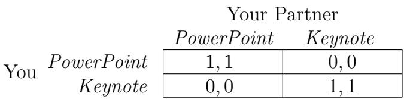  
شکل ۶.۷: بازی هماهنگی

این بازی به دلیل آنکه هدف مشترک دو بازیکن واقعاً هماهنگی روی یک استراتژی است، بازی هماهنگی نامیده می‌شود. موارد زیادی وجود دارد که در آن بازی‌های هماهنگی به وجود می‌آیند. به عنوان مثال، دو شرکت تولیدی که به طور گسترده با هم کار می‌کنند باید تصمیم بگیرند که ماشین‌آلات خود را بر اساس واحد اندازه‌گیری متریک یا انگلیسی پیکربندی کنند؛ دو پلatoon در یک ارتش باید تصمیم بگیرند که آیا به سمت چپ یا راست دشمن حمله کنند؛ دو نفر که سعی در یافتن یکدیگر در یک مرکز خرید شلوغ دارند باید تصمیم بگیرند که آیا در سمت شمال یا جنوب مرکز خرید منتظر بمانند. در هر مورد، هر انتخابی قابل قبول است، به شرطی که هر دو شرکت‌کننده انتخاب یکسانی انجام دهند.

مشکل اساسی این است که بازی دو تعادل نش دارد — یعنی (PowerPoint, PowerPoint) و (Keynote, Keynote) در مثال ما از شکل ۶.۷. اگر بازیکنان در هماهنگی روی یکی از تعادل‌های نش شکست بخورند، مثلاً به دلیل اینکه یک بازیکن انتظار دارد PowerPoint اجرا شود و دیگری Keynote، آنگاه پرداخت‌های پایینی دریافت خواهند کرد. بنابراین بازیکنان چه کار می‌کنند؟

این همچنان موضوع بحث و تحقیق فراوانی است، اما برخی پیشنهادها توجه مقالات را جلب کرده‌اند. توماس شلینگ [364] ایده نقطه کانونی را به عنوان راهی برای حل این مشکل معرفی کرد. او متوجه شد که در برخی بازی‌ها دلایل طبیعی وجود دارد (ممکن است خارج از ساختار پرداخت بازی) که بازیکنان را به تمرکز روی یکی از تعادل‌های نش سوق می‌دهد. به عنوان مثال، فرض کنید دو راننده در شب به سمت یکدیگر در جاده‌ای بدون تقسیم‌بندی در حال حرکت هستند. هر راننده باید تصمیم بگیرد که به چپ یا راست حرکت کند. اگر رانندگان هماهنگ شوند — یعنی انتخاب یکسانی از سمت — آنگاه از یکدیگر عبور می‌کنند، اما اگر هماهنگی نکنند، پرداخت بسیار پایینی به دلیل برخورد ناشی از آن دریافت می‌کنند. خوشبختانه، قراردادهای اجتماعی می‌توانند به رانندگان کمک کنند تا در این مورد بدانند چه کار کنند: اگر این بازی در ایالات متحده انجام شود، قرارداد به طور قوی پیشنهاد می‌کند که باید به راست حرکت کنند، در حالی که اگر بازی در انگلستان انجام شود، قرارداد به طور قوی پیشنهاد می‌کند که باید به چپ حرکت کنند. به عبارت دیگر، قراردادهای اجتماعی، هرچند اغلب دلیل‌دار نیستند، گاهی می‌توانند در کمک به افراد برای هماهنگی بین چندین تعادل مفید باشند.

انواع مختلف بازی هماهنگی پایه. می‌توان ساختار بازی هماهنگی پایه خود را غنی کرد تا تعدادی از مسائل مرتبط با مشکل چندین تعادل را دربرگیرد. برای گرفتن یک گسترش ساده از مثال قبلی، فرض کنید هر شما و همکار پروژه‌تان هر دو Keynote را نسبت به PowerPoint ترجیح می‌دهید. هنوز هم می‌خواهید هماهنگ شوید، اما حالا دو گزینه را نابرابر می‌بینید. این ما را به ماتریس پرداخت برای یک بازی هماهنگی نامتوازن می‌رساند، که در شکل ۶.۸ نشان داده شده است.

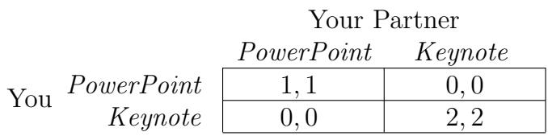  
شکل ۶.۸: بازی هماهنگی نامتوازن

توجه کنید که (PowerPoint, PowerPoint) و (Keynote, Keynote) همچنان هر دو تعادل نش برای این بازی هستند، علیرغم اینکه یکی از آنها پرداخت‌های بالاتری را به هر دو بازیکن می‌دهد. (نکته این است که اگر باور داشته باشید همکار شما PowerPoint را انتخاب خواهد کرد، شما همچنان باید PowerPoint را انتخاب کنید.) در اینجا، نظریه نقاط کانونی شلینگ پیشنهاد می‌کند که می‌توانیم ویژگی ذاتی بازی — به جای یک قرارداد اجتماعی دلخواه — را برای پیش‌بینی اینکه کدام تعادل توسط بازیکنان انتخاب خواهد شد استفاده کنیم. یعنی، می‌توانیم پیش‌بینی کنیم که وقتی بازیکنان باید انتخاب کنند، استراتژی‌هایی را انتخاب خواهند کرد تا به تعادلی برسند که پرداخت‌های بالاتری را به هر دو آنها بدهد. (برای مثال دیگر، دو نفری را در نظر بگیرید که سعی در دیدار در یک مرکز خرید شلوغ دارند. اگر سمت شمال مرکز خرید یک کتابفروشی باشد که هر دو دوست دارند، در حالی که سمت جنوب یک دکل بارگیری است، نقطه کانونی طبیعی تعادلی خواهد بود که هر دو سمت شمال را انتخاب کنند.)

اگر شما و همکار شما در مورد اینکه کدام نرم‌افزار را ترجیح می‌دهید، توافق نداشته باشید، مسائل پیچیده‌تر می‌شوند، همان‌طور که در ماتریس پرداخت شکل ۶.۹ نشان داده شده است.

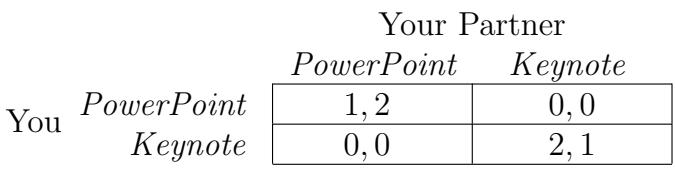  
شکل ۶.۹: جنگ جنسیت

در این حالت، دو تعادل همچنان مربوط به دو روش مختلف هماهنگی هستند، اما پرداخت شما در تعادل (Keynote, Keynote) بالاتر است، در حالی که پرداخت همکار شما در تعادل (PowerPoint, PowerPoint) بالاتر است. این بازی به طور سنتی «جنگ جنسیت» نامیده می‌شود، به دلیل داستان توجیهی زیر. یک همسر و همسر می‌خواهند با هم فیلم ببینند و باید بین یک کمدی عاشقانه و یک فیلم اکشن انتخاب کنند. آنها می‌خواهند در انتخاب خود هماهنگ شوند، اما تعادل (Romance, Romance) پرداخت بالاتری به یکی از آنها می‌دهد در حالی که تعادل (Action, Action) پرداخت بالاتری به دیگری می‌دهد.

در جنگ جنسیت، پیش‌بینی تعادلی که اجرا خواهد شد با استفاده از ساختار پرداخت یا یک قرارداد اجتماعی خالص خارجی دشوار است. بلکه، دانستن چیزی درباره قراردادهایی که بین دو بازیکن خود وجود دارد، کمک می‌کند که چگونه اختلافات خود را زمانی که روش‌های مختلف هماهنگی را ترجیح می‌دهند، حل می‌کنند.

ارزش دارد که یک تغییر نهایی بر روی بازی هماهنگی پایه را ذکر کنیم که در سال‌های اخیر توجه را جلب کرده است. این بازی شکار گوزن [374] است؛ نام آن از داستان زیر از نوشته‌های روسو الهام گرفته شده است. فرض کنید دو نفر در حال شکار هستند؛ اگر با هم کار کنند، می‌توانند گوزنی را شکار کنند (که نتیجه پرداخت بالاتری خواهد بود)، اما به تنهایی هر کدام می‌توانند خرگوشی شکار کنند. قسمت دشوار این است که اگر یک شکارچی سعی کند به تنهایی گوزنی را شکار کند، هیچ چیزی به دست نخواهد آورد، در حالی که دیگری همچنان می‌تواند خرگوشی شکار کند. بنابراین، شکارچیان دو بازیکن هستند، استراتژی‌های آنها شکار گوزن و شکار خرگوش است، و پرداخت‌ها مطابق شکل ۶.۱۰ نشان داده شده‌اند.

شکارچی ۲ شکار گوزن شکار خرگوش  
شکل ۶.۱۰: شکار گوزن  

<table><tr><td rowspan=2 colspan=2>Hunt StagHunter 1Hunt Hare</td><td rowspan=1 colspan=1>4,4</td><td rowspan=1 colspan=1>0,3</td></tr><tr><td rowspan=1 colspan=1>3,0</td><td rowspan=1 colspan=1>3,3</td></tr></table>

این تا حد زیادی مشابه بازی هماهنگی نامتوازن است، به جز اینکه اگر دو بازیکن هماهنگی نکنند، کسی که برای نتیجه با پرداخت بالاتر تلاش می‌کند، بیشتر تنبیه می‌شود تا کسی که برای پرداخت پایین‌تر تلاش می‌کند. (در واقع، کسی که برای پرداخت پایین‌تر تلاش می‌کند، هیچ تنبیهی دریافت نمی‌کند.) در نتیجه، چالش در استدلال درباره اینکه کدام تعادل انتخاب خواهد شد، بر اساس توازن بین پرداخت بالای یکی و پایین بودن ضرر ناشی از هماهنگی نکردن دیگری است.

ادعا شده است که بازی شکار گوزن برخی از چالش‌های شهودی را که توسط مسأله زندانی نیز مطرح می‌شود، منعکس می‌کند. ساختارها به وضوح متفاوت هستند، زیرا مسأله زندانی دارای استراتژی‌های غالب سخت‌گیرانه است؛ با این حال، هر دو ویژگی دارند که بازیکنان می‌توانند اگر با هم همکاری کنند، بهره‌ای ببرند، اما خطر آسیب دیدن را دارند اگر همکاری کنند در حالی که همکارشان همکاری نکند. راه دیگری برای مشاهده برخی از شباهت‌ها بین دو بازی این است که متوجه شویم اگر به بازی امتحان یا ارائه اصلی برویم و یک تغییر کوچک ایجاد کنیم، آنگاه آن را از یک مثال مسأله زندانی به چیزی بسیار شبیه به بازی شکار گوزن تغییر می‌دهیم. به طور خاص، فرض کنید که نتایج نمرات را مانند بخش ۶.۱ نگه می‌داریم، به جز اینکه برای هر شانسی برای نمره بهتر، از شما و همکار شما می‌خواهیم که برای ارائه آماده شوید. یعنی، اگر هر دو شما آماده شوید، هر دو ۱۰۰ در ارائه دریافت می‌کنید، اما اگر حداکثر یکی از شما آماده شود، هر دو نمره پایه ۸۴ را دریافت می‌کنید. با این تغییر، پرداخت‌های بازی امتحان یا ارائه به شکلی که در شکل ۶.۱۱ نشان داده شده است، می‌شوند.

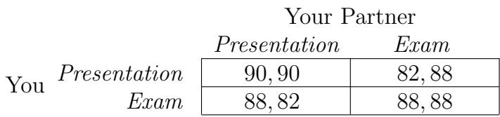

**GLOSSARY:**
Fitness: برازندگی

**Translate:**
اکنون ساختاری داریم که به شدت با بازی شکار گوزن شباهت دارد: هماهنگی در (ارائه، ارائه) یا (امتحان، امتحان) هر دو تعادل هستند، اما اگر سعی کنید به سمت تعادل با بازدهی بالاتر حرکت کنید، خطر دارید که اگر شریک شما تصمیم بگیرد برای امتحان درس بخواند، نمره پایینی بگیرید.

# 6.6 چندین تعادل: بازی شاهین و دوبرگ

تعادل‌های نش متعدد در انواع دیگری از بازی‌ها نیز رخ می‌دهند که هم‌چنان اساسی هستند، در این بازی‌ها بازیکنان در یک نوع فعالیت «ضد هماهنگی» شرکت می‌کنند. احتمالاً ساده‌ترین شکل چنین بازی‌ای، بازی شاهین و دوبرگ است که با داستان زیر توجیه می‌شود.

فرض کنید دو حیوان درگیر یک مسابقه برای تصمیم‌گیری درباره نحوه تقسیم یک قطعه غذا بین خود هستند. هر حیوان می‌تواند به صورت تهاجمی (استراتژی شاهین) یا پاسیو (استراتژی دوبرگ) رفتار کند. اگر هر دو حیوان به صورت پاسیو رفتار کنند، غذا به طور مساوی بین آنها تقسیم می‌شود و هر کدام 3 واحد بازدهی دریافت می‌کنند. اگر یکی تهاجمی و دیگری پاسیو رفتار کند، تهاجم‌گر بیشترین غذا را دریافت می‌کند و بازدهی 5 را به دست می‌آورد، در حالی که پاسیو تنها 1 واحد بازدهی دریافت می‌کند. اما اگر هر دو به صورت تهاجمی رفتار کنند، غذا نابود می‌شود (و احتمالاً به هم آسیب می‌رسانند)، و هر کدام بازدهی 0 دریافت می‌کنند. بنابراین ماتریس بازدهی در شکل 6.12 نشان داده شده است.

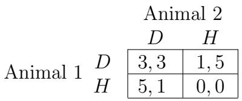  
شکل 6.12: بازی شاهین و دوبرگ

این بازی دو تعادل نش دارد: $( D , H )$ و $( H , D )$ . بدون دانستن اطلاعات بیشتر درباره حیوانات، نمی‌توانیم پیش‌بینی کنیم که کدام یک از این تعادل‌ها اجرا خواهد شد. بنابراین، مانند بازی‌های هماهنگی که قبلاً بررسی کردیم، مفهوم تعادل نش به تنگ کردن مجموعه پیش‌بینی‌های منطقی کمک می‌کند، اما پیش‌بینی منحصربه‌فردی ارائه نمی‌دهد.

بازی شاهین و دوبرگ در بسیاری از زمینه‌ها مورد مطالعه قرار گرفته است. به عنوان مثال، فرض کنید دو کشور را به جای دو حیوان قرار دهیم و فرض کنید کشورها به طور همزمان تصمیم می‌گیرند که در سیاست خارجی خود تهاجمی یا پاسیو باشند. هر کشور امیدوار است با رفتار تهاجمی سود ببرد، اما اگر هر دو به صورت تهاجمی عمل کنند، خطر جنگ واقعی را دارند که برای هر دو فاجعه‌بار خواهد بود. بنابراین در تعادل، می‌توان انتظار داشت که یکی تهاجمی و دیگری پاسیو باشد، اما نمی‌توان پیش‌بینی کرد که کدام کشور استراتژی خاصی را انتخاب خواهد کرد. برای پیش‌بینی اینکه کدام تعادل اجرا خواهد شد، نیاز به اطلاعات بیشتری درباره کشورها داریم.

بازی شاهین و دوبرگ مثال دیگری از بازی است که از تغییر جزئی در بازدهی‌های بازی امتحان یا ارائه ناشی می‌شود. دوباره به تنظیمات بخش ابتدایی مراجعه کنیم و حالا آن را تغییر دهیم به طوری که اگر شما و شریک شما هر دو برای ارائه آماده نشوید، نمره مشترک بسیار پایین 60 را دریافت کنید. (اگر یکی یا هر دوی شما آماده شوید، نمرات ارائه مانند قبل خواهد بود.) اگر میانگین نمراتی که برای انتخاب‌های مختلف استراتژی در این نسخه از بازی دریافت می‌کنید محاسبه کنیم، بازدهی‌ها در شکل 6.13 نشان داده شده‌اند.

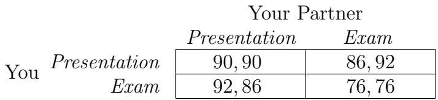  
شکل 6.13: امتحان یا ارائه؟ (نسخه شاهین و دوبرگ)

در این نسخه از بازی، دو تعادل وجود دارد: (ارائه، امتحان) و (امتحان، ارائه). به طور اساسی، یکی از شما باید به صورت پاسیو رفتار کرده و برای ارائه آماده شود، در حالی که دیگری با مطالعه برای امتحان بازدهی بالاتری کسب می‌کند. اگر هر دو سعی کنید از نقش بازیکن پاسیو اجتناب کنید، بازدهی بسیار پایینی دریافت خواهید کرد، اما از ساختار بازی به تنهایی نمی‌توان پیش‌بینی کرد که کدام یک این نقش پاسیو را ایفا خواهد کرد.

بازی شاهین و دوبرگ در ادبیات نظریه بازی با نام‌های دیگری نیز شناخته می‌شود. به عنوان مثال، اغلب به عنوان بازی مرغ‌دار شناخته می‌شود، به این دلیل که تصویر دو نوجوان را که ماشین‌های خود را به سمت هم می‌رانند و یکدیگر را به دلیل تغییر مسیر تحریک می‌کنند، به ذهن می‌آورد. دو استراتژی اینجا عبارتند از «تغییر مسیر» و «تغییر مسیر ندادن»: کسی که اول تغییر مسیر می‌دهد از دوستانش خجالت می‌کشد، اما اگر هیچ‌کدام تغییر مسیر ندهند، هر دو درگیر برخورد واقعی خواهند شد.

# 6.7 استراتژی‌های ترکیبی

در دو بخش قبلی، درباره بازی‌هایی بحث کرده‌ایم که پیچیدگی مفهومی آن‌ها ناشی از وجود چندین تعادل است. با این حال، بازی‌هایی نیز وجود دارند که هیچ تعادل نشی ندارند. برای چنین بازی‌هایی، با گسترش مجموعه استراتژی‌ها برای شامل کردن امکان تصادفی‌سازی، پیش‌بینی‌هایی درباره رفتار بازیکنان انجام می‌دهیم؛ هنگامی که بازیکنان به رفتار تصادفی اجازه داده شوند، یکی از نتایج اصلی جان نش نشان می‌دهد که تعادل‌ها همیشه وجود دارند [313, 314].

احتمالاً ساده‌ترین دسته بازی‌هایی که این پدیده را نشان می‌دهند، بازی‌های «حمله-دفاع» نامیده می‌شوند. در چنین بازی‌هایی، یک بازیکن به عنوان حمله‌کننده عمل می‌کند، در حالی که دیگری به عنوان دفاع‌کننده عمل می‌کند. حمله‌کننده می‌تواند از یکی از دو استراتژی — بیایید آن‌ها را $A$ و $B$ بنامیم — استفاده کند، در حالی که دو استراتژی دفاع‌کننده «دفاع در برابر $A ^ { \prime \prime }$» و «دفاع در برابر $B$» هستند. اگر دفاع‌کننده در برابر حمله‌ای که حمله‌کننده استفاده می‌کند دفاع کند، دفاع‌کننده بازدهی بالاتری دریافت می‌کند؛ اما اگر دفاع‌کننده در برابر حمله اشتباه دفاع کند، حمله‌کننده بازدهی بالاتری کسب می‌کند.

سکه‌های هماهنگ. یک بازی ساده حمله-دفاع به نام سکه‌های هماهنگ است که بر اساس بازی‌ای است که در آن دو نفر هر کدام یک سکه دارند و همزمان تصمیم می‌گیرند که سر ( $H$ ) یا خط ( $T$ ) را نشان دهند. بازیکن 1 سکه خود را به بازیکن 2 می‌دهد اگر سکه‌ها هماهنگ شوند، و سکه بازیکن 2 را می‌برد اگر هماهنگ نشوند. این امر منجر به ماتریس بازدهی نشان داده شده در شکل 6.14 می‌شود.

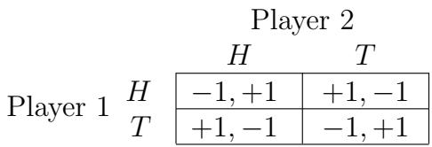  
شکل 6.14: سکه‌های هماهنگ

سکه‌های هماهنگ مثال ساده‌ای از یک دسته بزرگ از بازی‌های جالب است که در آن‌ها مجموع بازدهی‌های بازیکنان در هر پیامد صفر است. چنین بازی‌هایی به عنوان بازی‌های مجموع صفر شناخته می‌شوند و بسیاری از بازی‌های حمله-دفاع — و به طور کلی، بازی‌هایی که منافع بازیکنان در تضاد مستقیم هستند — این ساختار را دارند. بازی‌هایی مانند سکه‌های هماهنگ در واقع به عنوان توصیف‌های استعاری از تصمیمات گرفته شده در جنگ استفاده شده‌اند؛ به عنوان مثال، سرنشین‌گیری متفقین در اروپا در 6 ژوئن 1944 — یکی از لحظات محوری جنگ جهانی دوم — شامل تصمیم‌گیری متفقین برای عبور از تنگه انگلیس در نورماندی یا کاله و تصمیم متقابل ارتش آلمان برای تمرکز نیروهای دفاعی خود در نورماندی یا کاله بود. این دارای ساختار حمله-دفاعی است که به شدت با بازی سکه‌های هماهنگ شباهت دارد [123].

اولین چیزی که در مورد سکه‌های هماهنگ باید توجه کرد این است که هیچ جفت استراتژی وجود ندارد که بهترین پاسخ‌های متقابل به هم باشند. برای مشاهده این موضوع، توجه کنید که برای هر جفت استراتژی، یکی از بازیکنان بازدهی $- 1$ را دریافت می‌کند و این بازیکن با تغییر استراتژی می‌تواند بازدهی خود را به $+ 1$ بهبود بخشد. بنابراین برای هر جفت استراتژی، یکی از بازیکنان می‌خواهد رفتار خود را تغییر دهد.2

این به این معناست که اگر هر بازیکن را فقط با دو استراتژی $H$ یا $T$ در نظر بگیریم، برای این بازی تعادل نشی وجود ندارد. این امر اگر به نحو کارکرد سکه‌های هماهنگ فکر کنیم، چندان غیرمنتظره نیست. جفت استراتژی‌ها، یکی برای هر بازیکن، تشکیل یک تعادل نش می‌دهند اگر حتی با دانستن استراتژی‌های یکدیگر، هیچ بازیکنی تشویق به تغییر به استراتژی جایگزین نشود. اما در سکه‌های هماهنگ، اگر بازیکن 1 بداند که بازیکن 2 قرار است یک انتخاب خاص از $H$ یا $T$ را انجام دهد، بازیکن 1 می‌تواند از این اطلاعات استفاده کرده و انتخاب متقابل را انجام دهد و بازدهی $+ 1$ را دریافت کند. استدلال مشابهی برای بازیکن 2 نیز صادق است.

وقتی به صورت شهودی درباره نحوه اجرای این نوع بازی‌ها در زندگی واقعی فکر می‌کنیم، متوجه می‌شویم که بازیکنان معمولاً سعی می‌کنند به حریفانشان سخت کنند که آنچه را که بازی می‌کنند پیش‌بینی کنند. این امر نشان می‌دهد که در مدل‌سازی بازی‌هایی مانند سکه‌های هماهنگ، نباید استراتژی‌ها را به سادگی به عنوان $H$ یا $T$ در نظر گرفت، بلکه به عنوان راه‌هایی برای تصادفی‌سازی رفتار بین $H$ و $T$ . اکنون می‌بینیم که چگونه این را در مدلی برای اجرای این نوع بازی گنجانده‌ایم.

استراتژی‌های ترکیبی. ساده‌ترین راه برای معرفی رفتار تصادفی این است که بگوییم هر بازیکن در واقع به طور مستقیم $H$ یا $T$ را انتخاب نمی‌کند، بلکه احتمالی را انتخاب می‌کند که با آن $H$ را بازی کند. بنابراین در این مدل، استراتژی‌های ممکن برای بازیکن 1 اعداد $p$ بین 0 و 1 هستند؛ عدد مشخصی $p$ به این معناست که بازیکن 1 تعهد به بازی $H$ با احتمال $p$ و $T$ با احتمال $1 - p$ می‌دهد. به طور مشابه، استراتژی‌های ممکن برای بازیکن 2 اعداد $q$ بین 0 و $1$ هستند که نشان‌دهنده احتمالی است که بازیکن 2 $H$ را بازی خواهد کرد.

از آنجا که یک بازی شامل مجموعه‌ای از بازیکنان، استراتژی‌ها و بازدهی‌ها است، باید توجه کنیم که با اجازه دادن به تصادفی‌سازی، ما در واقع بازی را تغییر داده‌ایم. دیگر از دو استراتژی توسط هر بازیکن تشکیل نشده است، بلکه مجموعه‌ای از استراتژی‌ها که متناظر با بازه اعداد بین 0 و 1 هستند. ما به این‌ها استراتژی‌های ترکیبی می‌گوییم، زیرا شامل «مخلوط کردن» بین گزینه‌های $H$ و $T$ هستند. توجه کنید که مجموعه استراتژی‌های ترکیبی همچنان شامل دو گزینه اصلی تعهد به بازی قطعی $H$ یا $T$ است؛ این دو انتخاب به ترتیب متناظر با انتخاب احتمالات $_ 1$ یا 0 هستند و به آن‌ها دو استراتژی خالص در بازی می‌گوییم. برای سادگی در نمادگذاری، گاهی اوقات به انتخاب $p = 1$ توسط بازیکن 1 به صورت معادل «استراتژی خالص $H ^ { \ast }$ » اشاره می‌کنیم و به طور مشابه برای $p = 0$ و $q = 1$ یا $0$ .

بازدهی‌های از استراتژی‌های ترکیبی. با این مجموعه جدید از استراتژی‌ها، ما باید مجموعه جدیدی از بازدهی‌ها را نیز تعیین کنیم. ظرافت در تعریف بازدهی‌ها این است که حالا این‌ها کمیت‌های تصادفی هستند: هر بازیکن با احتمالی $+ 1$ دریافت خواهد کرد و با احتمال باقیمانده $- 1$ . هنگامی که بازدهی‌ها اعداد بودند، رتبه‌بندی آن‌ها آشکار بود: عدد بزرگ‌تر بهتر است. اکنون که بازدهی‌ها تصادفی هستند، به طور فوری مشخص نیست که چگونه آن‌ها را رتبه‌بندی کنیم: ما به روشی اصولی نیاز داریم که بگوییم یک پیامد تصادفی بهتر از دیگری است.

برای فکر کردن درباره این مسئله، بیایید با در نظر گرفتن سکه‌های هماهنگ از دیدگاه بازیکن 1 شروع کنیم و ابتدا به نحوه ارزیابی دو استراتژی خالص او — یعنی بازی قطعی $H$ یا بازی قطعی $T$ — تمرکز کنیم. فرض کنید بازیکن 2 استراتژی $q$ را انتخاب می‌کند؛ یعنی او تعهد به بازی $H$ با احتمال $q$ و $T$ با احتمال $1 - q$ می‌دهد. سپس اگر بازیکن 1 استراتژی خالص $H$ را انتخاب کند، با احتمال $q$ بازدهی $- 1$ دریافت می‌کند (زیرا سکه‌ها با احتمال $q$ هماهنگ می‌شوند، در این صورت او باخت می‌کند)، و با احتمال $1 - q$ بازدهی $+ 1$ دریافت می‌کند (زیرا سکه‌ها با احتمال $1 - q$ هماهنگ نمی‌شوند). به طور جایگزین، اگر بازیکن 1 استراتژی خالص $T$ را انتخاب کند، با احتمال $q$ $+ 1$ و با احتمال $( 1 - q )$ $- 1$ دریافت می‌کند. بنابراین حتی اگر بازیکن 1 از استراتژی خالص استفاده کند، بازدهی‌های او همچنان تصادفی هستند به دلیل تصادفی‌سازی انجام شده توسط بازیکن 2. در این حالت، چگونه باید تصمیم بگیریم که کدام یک از $H$ یا $T$ برای بازیکن 1 جذاب‌تر است؟

**واژه‌نامه:**
Fitness: برازندگی

**ترجمه:**
برای رتبه‌بندی عددی پرداخت‌های تصادفی، به هر توزیع یک عدد نسبت می‌دهیم که نشان‌دهنده جذابیت آن توزیع برای بازیکن است. پس از انجام این کار، می‌توانیم نتایج را بر اساس عدد مرتبط با آن‌ها رتبه‌بندی کنیم. عددی که برای این منظور استفاده می‌کنیم، ارزش مورد انتظار پرداخت است. به عنوان مثال، اگر بازیکن ۱ استراتژی خالص $H$ را انتخاب کند و بازیکن ۲ احتمال $q$ را انتخاب کند، مانند بالا، پرداخت مورد انتظار برای بازیکن ۱ برابر است با

$$
( - 1 ) ( q ) + ( 1 ) ( 1 - q ) = 1 - 2 q .
$$

به طور مشابه، اگر بازیکن ۱ استراتژی خالص $T$ را انتخاب کند و بازیکن ۲ احتمال $q$ را انتخاب کند، پرداخت مورد انتظار برای بازیکن ۱ برابر است با

$$
( 1 ) ( q ) + ( - 1 ) ( 1 - q ) = 2 q - 1 .
$$

ما فرض می‌کنیم که بازیکنان به دنبال بیشینه کردن پرداخت مورد انتظار خود از انتخاب استراتژی‌های ترکیبی هستند. اگرچه امید ریاضی یک کمیت طبیعی است، اما سؤال ظریفی وجود دارد که آیا بیشینه کردن امید ریاضی فرضیه منطقی برای مدل‌سازی رفتار بازیکنان است یا خیر. با این حال، تاکنون پایه‌ای محکم برای این فرض وجود دارد که بازیکنان توزیع‌های پرداخت را بر اساس ارزش‌های مورد انتظار خود رتبه‌بندی می‌کنند [288, 363, 398]، و بنابراین ما نیز از آن پیروی خواهیم کرد.

ما اکنون نسخه استراتژی ترکیبی بازی سکه‌های مطابق را تعریف کرده‌ایم: استراتژی‌ها احتمال‌های اجرای $H$ هستند، و پرداخت‌ها امیدهای پرداخت‌های از چهار نتیجه خالص $( H , H ) , ( H , T ) , ( T , H )$ و $( T , T )$ هستند. می‌توانیم بپرسیم که آیا برای این نسخه غنی‌تر بازی تعادل نش وجود دارد یا خیر.

تعادل با استراتژی‌های ترکیبی. تعادل نش را برای نسخه استراتژی ترکیبی دقیقاً به همان شکلی تعریف می‌کنیم که برای نسخه استراتژی خالص تعریف کردیم: مجموعه‌ای از دو استراتژی (که اکنون احتمال‌ها هستند) به گونه‌ای که هر کدام بهترین پاسخ به دیگری باشد.

ابتدا توجه کنیم که هیچ استراتژی خالصی نمی‌تواند بخشی از تعادل نش باشد. این استدلال مشابه استدلالی است که در آغاز این بخش انجام دادیم. فرض کنید، به عنوان مثال، استراتژی خالص $H$ (یعنی احتمال $p = 1$ ) بازیکن ۱ بخشی از تعادل نش باشد.

سپس بهترین پاسخ منحصر به فرد بازیکن ۲ نیز استراتژی خالص $H$ خواهد بود (چرا که بازیکن ۲ هنگامی که تطابق دهد، $+ 1$ دریافت می‌کند). اما استراتژی خالص $H$ بازیکن ۱ بهترین پاسخ به $H$ بازیکن ۲ نیست، بنابراین این حالت نمی‌تواند تعادل نش باشد. استدلال مشابهی برای سایر استراتژی‌های خالص ممکن توسط بازیکنان اعمال می‌شود. بنابراین به نتیجه طبیعی می‌رسیم که در هر تعادل نش، هر دو بازیکن باید احتمال‌هایی بین ۰ و ۱ استفاده کنند.

سپس بپرسیم که بهترین پاسخ بازیکن ۱ به استراتژی $q$ استفاده شده توسط بازیکن ۲ چیست. در بالا، مشخص کردیم که پرداخت مورد انتظار بازیکن ۱ از استراتژی خالص $H$ در این حالت برابر است با

$$
1 - 2 q ,
$$

در حالی که پرداخت مورد انتظار بازیکن ۱ از استراتژی خالص $T$ برابر است با

$$
2 q - 1 .
$$

حال، نکته کلیدی این است: اگر $1 - 2 q \neq 2 q - 1$ ، آنگاه یکی از استراتژی‌های خالص $H$ یا $T$ در واقع بهترین پاسخ منحصر به فرد بازیکن ۱ به اجرای $q$ توسط بازیکن ۲ است. این به این دلیل است که در این حالت یکی از $1 - 2 q$ یا $2 q - 1$ بزرگتر است، و بنابراین برای بازیکن ۱ هیچ نقطه‌ای برای قرار دادن احتمالی بر روی استراتژی خالص ضعیف‌تر وجود ندارد. اما قبلاً ثابت کردیم که استراتژی‌های خالص نمی‌توانند بخشی از هیچ تعادل نشی برای سکه‌های مطابق باشند، و چون استراتژی‌های خالص هنگامی که $1 - 2 q \neq 2 q - 1$ ، بهترین پاسخ‌ها هستند، احتمال‌هایی که این دو امید ریاضی را نابرابر می‌کنند نیز نمی‌توانند بخشی از تعادل نش باشند.

بنابراین به این نتیجه رسیده‌ایم که در هر تعادل نش برای نسخه استراتژی ترکیبی سکه‌های مطابق، باید داشته باشیم

$$
1 - 2 q = 2 q - 1 ,
$$

یا به عبارت دیگر، $q = 1 / 2$ . موقعیت هنگامی که از دیدگاه بازیکن ۲ بررسی می‌شود و پرداخت‌های ناشی از اجرای احتمال $p$ توسط بازیکن ۱ ارزیابی می‌شود، متقارن است. از این رو نتیجه می‌گیریم که در هر تعادل نش، باید همچنین $p = 1 / 2$ داشته باشیم.

بنابراین، جفت استراتژی‌های $p = 1 / 2$ و $q = 1 / 2$ تنها امکان برای تعادل نش است. می‌توانیم بررسی کنیم که این جفت استراتژی‌ها در واقع بهترین پاسخ‌های متقابل به هم هستند. در نتیجه، این تنها تعادل نش برای نسخه استراتژی ترکیبی سکه‌های مطابق است.

تفسیر تعادل استراتژی ترکیبی برای سکه‌های مطابق. پس از استخراج تعادل نش برای این بازی، مفید است که درباره معنای آن و نحوه کاربرد این استدلال در بازی‌های عمومی فکر کنیم.

ابتدا یک محیط ملموس را تصور کنید که دو نفر واقعاً برای بازی سکه‌های مطابق نشسته‌اند و هر کدام به طور واقعی به رفتار تصادفی بر اساس احتمال‌های $p$ و $q$ به ترتیب متعهد شده‌اند. اگر بازیکن ۱ باور داشته باشد که بازیکن ۲ بیش از نیمی از زمان $H$ را اجرا می‌کند، آنگاه او باید قطعاً $T$ را اجرا کند — در این صورت بازیکن ۲ نباید بیش از نیمی از زمان $H$ را اجرا کند. استدلال متقارنی اعمال می‌شود اگر بازیکن ۱ باور داشته باشد که بازیکن ۲ بیش از نیمی از زمان $T$ را اجرا می‌کند. در هیچ یک از این موارد، تعادل نش وجود نخواهد داشت. بنابراین نکته این است که انتخاب $q = 1 / 2$ توسط بازیکن ۲ باعث می‌شود بازیکن ۱ بین اجرای $H$ یا $T$ بی‌تفاوت باشد: استراتژی $q = 1 / 2$ به طور مؤثر «غیرقابل بهره‌برداری» توسط بازیکن ۱ است. این در واقع اولین ایده ما برای معرفی تصادفی‌سازی بود: هر بازیکن می‌خواهد رفتارش برای دیگری غیرقابل پیش‌بینی باشد، به گونه‌ای که رفتارش نتواند بهره‌برداری شود. باید توجه کنیم که این واقعیت که هر دو احتمال $1 / 2$ شده‌اند، نتیجه ساختار بسیار متقارن سکه‌های مطابق است؛ همان‌طور که در مثال‌های بعدی بخش بعدی خواهیم دید، هنگامی که پرداخت‌ها متقارن‌تر نباشند، تعادل نش می‌تواند شامل احتمال‌های نابرابر باشد.

این مفهوم بی‌تفاوتی یک اصل کلی در پشت محاسبه تعادل‌های استراتژی ترکیبی در بازی‌های دو بازیکنی و دو استراتژی‌ای است، هنگامی که هیچ تعادلی شامل استراتژی‌های خالص وجود ندارد: هر بازیکن باید به گونه‌ای تصادفی‌سازی کند که بازیکن دیگر بین دو گزینه‌اش بی‌تفاوت باشد. به این ترتیب، رفتار هیچ بازیکنی توسط یک استراتژی خالص قابل بهره‌برداری نیست، و دو انتخاب احتمال‌ها بهترین پاسخ‌های متقابل به هم هستند. و هرچند که جزئیات آن را در اینجا دنبال نخواهیم کرد، تعمیم این اصل برای بازی‌هایی با تعداد محدودی از بازیکنان و تعداد محدودی از استراتژی‌ها اعمال می‌شود: نتیجه ریاضی اصلی نش همراه با تعریف تعادل، اثبات این بود که هر چنین بازی‌ای حداقل یک تعادل استراتژی ترکیبی دارد [313, 314].

همچنین ارزش دارد که درباره نحوه تفسیر تعادل‌های استراتژی ترکیبی در موقعیت‌های واقعی فکر کنیم. در واقع چندین تفسیر ممکن وجود دارد که در موقعیت‌های مختلف مناسب هستند:

• گاهی، به ویژه زمانی که شرکت‌کنندگان واقعاً در یک ورزش یا بازی شرکت می‌کنند، بازیکنان به طور فعال عملیات خود را تصادفی می‌کنند [107, 337, 405]: یک تنیس‌باز ممکن است به طور تصادفی تصمیم بگیرد که توپ را به سمت مرکز یا کنار زمین سرو کند؛ یک بازیکن کارت ممکن است به طور تصادفی تصمیم بگیرد که کلاهبرداری کند یا نه؛ دو کودک ممکن است در مسابقه سال‌هاست در مدرسه ابتدایی به نام سنگ، کاغذ، قیچی بین آن‌ها تصادفی‌سازی کنند. در بخش بعدی به مثال‌هایی از این موضوع خواهیم پرداخت.

• گاهی استراتژی‌های ترکیبی بهتر به عنوان نسبت‌هایی در یک جمعیت دیده می‌شوند. فرض کنید به عنوان مثال دو گونه حیوانی، در فرآیند جستجوی غذا، به طور مکرر در بازی‌های حمله-دفاع یک به یک با ساختار سکه‌های مطابق شرکت می‌کنند. در اینجا، یک عضو از گونه اول همیشه نقش حمله‌کننده را ایفا می‌کند و یک عضو از گونه دوم همیشه نقش دفاع‌کننده را ایفا می‌کند.

فرض کنید که هر حیوان به صورت ژنتیکی به گونه‌ای سخت‌کار شده است که همیشه $H$ را اجرا کند یا همیشه $T$ را اجرا کند؛ و فرض کنید که جمعیت هر گونه نیمی از حیواناتی است که به صورت ژنتیکی $H$ را اجرا می‌کنند و نیمی از حیواناتی که به صورت ژنتیکی $T$ را اجرا می‌کنند. در این صورت، با این ترکیب جمعیت، حیوانات $H$ در هر گونه به طور میانگین، در طی تعاملات تصادفی متعدد، به اندازه حیوانات $T$ عمل می‌کنند. بنابراین کل جمعیت به نوعی در تعادل ترکیبی است، حتی اگر هر فرد به طور خالص بازی کند. این داستان ارتباط مهمی با زیست‌شناسی تکاملی را پیشنهاد می‌دهد که در واقع از طریق یک سری طولانی از تحقیقات توسعه یافته است [375, 376]؛ این موضوع در فصل ۷ مورد توجه خواهد بود.

• شاید تفسیر ظریف‌تر بر اساس یادآوری از بخش ۶.۴ باشد که تعادل نش اغلب بهتر به عنوان تعادل در باورها در نظر گرفته می‌شود. اگر هر بازیکن باور داشته باشد که شریکش بر اساس یک تعادل نش خاص بازی خواهد کرد، آنگاه او نیز می‌خواهد بر اساس آن بازی کند. در مورد سکه‌های مطابق، با تعادل ترکیبی منحصر به فرد، این به این معناست که کافی است که شما انتظار داشته باشید که هنگامی که با یک شخص دل‌خواه مواجه می‌شوید، آن شخص طرف خود را در سکه‌های مطابق با احتمال $1 / 2$ اجرا می‌کند. در این حالت، اجرای احتمال $1 / 2$ برای شما نیز منطقی است، و بنابراین این انتخاب احتمال‌ها خودتقویت‌کننده است — در تعادل است — در سراسر جمعیت.

# 6.8 استراتژی‌های ترکیبی: مثال‌ها و تحلیل تجربی

چون تعادل استراتژی ترکیبی مفهومی ظریف است، مفید است که آن را از طریق مثال‌های بیشتری درک کنیم. ما بر روی دو مثال اصلی تمرکز خواهیم کرد، هر دو از حوزه ورزش‌ها انتخاب شده‌اند و هر دو ساختار حمله-دفاع دارند. اولی استیلایزد (استیلیزه) و تا حدی استعاری است، در حالی که دومی یک آزمایش تجربی چشمگیر برای بررسی این است که آیا افراد در موقعیت‌های با ارزش بالا واقعاً بر اساس پیش‌بینی‌های تعادل استراتژی ترکیبی عمل می‌کنند یا خیر. ما این بخش را با بحثی عمومی درباره نحوه شناسایی تمام تعادل‌های یک بازی دو بازیکنی و دو استراتژی‌ای ختم می‌کنیم.

بازی دویدن-پاس. ابتدا به یک نسخه ساده‌شده از مشکلی که دو تیم فوتبال آمریکایی در طراحی بازی بعدی خود در یک بازی فوتبال با آن مواجه هستند، نگاه می‌کنیم. حمله می‌تواند انتخاب کند که بدوید یا پاس بدهد، و دفاع می‌تواند انتخاب کند که در برابر دویدن دفاع کند یا در برابر پاس دفاع کند. نحوه عملکرد پرداخت‌ها به شرح زیر است.

• اگر دفاع به درستی بازی حمله را تطابق دهد، آنگاه حمله ۰ یارد به دست می‌آورد. • اگر حمله بدوید در حالی که دفاع در برابر پاس دفاع می‌کند، حمله ۵ یارد به دست می‌آورد. • اگر حمله پاس بدهد در حالی که دفاع در برابر دویدن دفاع می‌کند، حمله ۱۰ یارد به دست می‌آورد.

بنابراین ماتریس پرداختی که در شکل ۶.۱۵ نشان داده شده است.

(اگر قوانین فوتبال آمریکایی را نمی‌دانید، می‌توانید بحث را با در نظر گرفتن ماتریس پرداخت به عنوان خودکافی دنبال کنید. به طور شهودی، نکته این است که ما یک بازی حمله-دفاع با دو بازیکن به نام‌های «حمله» و «دفاع» داریم، و حمله‌کننده گزینه قوی‌تر (پاس) و گزینه ضعیف‌تر (دویدن) دارد.)

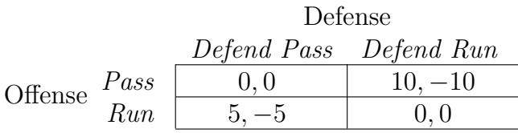  
شکل ۶.۱۵: بازی دویدن-پاس

همان‌طور که در سکه‌های مطابق، به راحتی می‌توان بررسی کرد که هیچ تعادل نشی وجود ندارد که در آن هر بازیکن از استراتژی خالص استفاده کند: هر دو باید رفتار خود را با تصادفی‌سازی غیرقابل پیش‌بینی کنند. بنابراین بیایید یک تعادل استراتژی ترکیبی برای این بازی محاسبه کنیم: فرض کنید $p$ احتمال پاس دادن حمله باشد و $q$ احتمال دفاع در برابر پاس توسط دفاع باشد. (از نتیجه نش می‌دانیم که حداقل یک تعادل استراتژی ترکیبی وجود دارد، اما مقدار واقعی $p$ و $q$ چه خواهد بود مشخص نیست.)

ما از اصلی استفاده می‌کنیم که تعادل ترکیبی زمانی ایجاد می‌شود که احتمال‌های استفاده شده توسط هر بازیکن، رقیب را بین دو گزینه‌اش بی‌تفاوت کند.

واژه‌نامه:
Fitness: برازندگی

ترجمه:
• ابتدا فرض کنید دفاع احتمال $q$ را برای دفاع در برابر پاس انتخاب می‌کند. سپس بازده مورد انتظار برای حمله از پاس دادن برابر است با

$$
( 0 ) ( q ) + ( 1 0 ) ( 1 - q ) = 1 0 - 1 0 q ,
$$

و بازده مورد انتظار برای حمله از دویدن برابر است با

$$
( 5 ) ( q ) + ( 0 ) ( 1 - q ) = 5 q .
$$

برای بی‌تفاوتی حمله بین دو استراتژی خود، باید $1 0 - 1 0 q = 5 q$ را تنظیم کنیم، بنابراین $q = 2 / 3$ .

• سپس، فرض کنید حمله احتمال $p$ را برای پاس دادن انتخاب می‌کند. سپس بازده مورد انتظار برای دفاع از دفاع در برابر پاس برابر است با

$$
( 0 ) ( p ) + ( - 5 ) ( 1 - p ) = 5 p - 5 ,
$$

و بازده مورد انتظار برای دفاع از دفاع در برابر دویدن برابر است با

$$
( - 1 0 ) ( p ) + ( 0 ) ( 1 - p ) = - 1 0 p .
$$

برای بی‌تفاوتی دفاع بین دو استراتژی خود، باید $5 p { - } 5 = - 1 0 p$ را تنظیم کنیم، بنابراین $p = 1 / 3$ .

بنابراین، تنها مقادیر احتمال ممکن که می‌توانند در تعادل استراتژی مخلوط ظاهر شوند، $p = 1 / 3$ برای حمله و $q = 2 / 3$ برای دفاع هستند، و این واقعاً یک تعادل را تشکیل می‌دهد.

همچنین متوجه شوید که بازده مورد انتظار برای حمله با این احتمالات $1 0 / 3$ است، و بازده مورد انتظار متناظر برای دفاع $- 1 0 / 3$ است. همچنین، در مقایسه با بازی سکه‌های مطابق (Matching Pennies)، توجه کنید که به دلیل ساختار نامتقارن بازده‌ها در اینجا، احتمال‌های ظاهر شده در تعادل استراتژی مخلوط نیز نامتوازن هستند.

تفسیر استراتژیک بازی دویدن-پاس. چند نکته درباره این تعادل وجود دارد. اول اینکه، پیامدهای استراتژیک احتمالات تعادلی جذاب و کمی ظریف هستند. به طور خاص، اگرچه پاس دادن سلاح قوی‌تر حمله است، اما آن را کمتر از نیمی از زمان استفاده می‌کند: تنها احتمال $p = 1 / 3$ را برای پاس دادن اختصاص می‌دهد. این ابتدا غیرمنطقی به نظر می‌رسد: چرا بیشتر از زمان خود را صرف استفاده از گزینه قوی‌تر نمی‌کنیم؟ اما محاسبه‌ای که احتمالات تعادلی را به ما داد، پاسخ این سوال را نیز ارائه می‌دهد. اگر حمله احتمال بالاتری برای پاس دادن اختصاص دهد، بهترین پاسخ دفاع این خواهد بود که همیشه در برابر پاس دفاع کند، و در نتیجه حمله در مورد مورد انتظار عملکرد بدتری خواهد داشت.

می‌توانیم ببینیم که این چگونه کار می‌کند با امتحان کردن مقدار بزرگ‌تری برای $p$ ، مانند $p = 1 / 2$ . در این حالت، دفاع همیشه در برابر پاس دفاع می‌کند، بنابراین بازده مورد انتظار حمله $5 / 2$ خواهد بود، زیرا نیمی از زمان 5 واحد به دست می‌آورد و نیمی دیگر 0:

$$
( 1 / 2 ) ( 0 ) + ( 1 / 2 ) ( 5 ) = 5 / 2 .
$$

در بالا دیدیم که با احتمالات تعادلی، حمله بازده مورد انتظاری برابر با $1 0 / 3 > 5 / 2$ دارد. علاوه بر این، چون $p = 1 / 3$ دفاع را بین دو استراتژی خود بی‌تفاوت می‌کند، حمله که از $p = 1 / 3$ استفاده می‌کند، بدون توجه به اقدامات دفاع، قطعاً $1 0 / 3 > 5 / 2$ را دریافت خواهد کرد.

یک راه برای تفکر درباره قدرت واقعی پاس به عنوان یک استراتژی این است که متوجه شویم در تعادل، دفاع در برابر پاس در $2 / 3$ از زمان‌ها دفاع می‌کند، حتی اگر حمله تنها در $1 / 3$ از زمان‌ها از آن استفاده کند. بنابراین، به نحوی تهدید پاس دادن به حمله کمک می‌کند، حتی اگر آن را نسبتاً کم استفاده کند.

این مثال به وضوح مسائل استراتژیک در فوتبال آمریکایی را بیش از حد ساده‌سازی می‌کند: استراتژی‌های بسیار بیشتری وجود دارد و تیم‌ها به مواردی بیش از تنها یارد به دست آمده در بازی بعدی نیز اهمیت می‌دهند. با این حال، این نوع تحلیل به صورت کمی بر روی آمار فوتبال آمریکایی اعمال شده است و برخی از نتایج کیفی اصلی را در سطح گسترده تأیید کرده است — به طور کلی تیم‌ها بیشتر دویده‌اند تا پاس داده باشند و بازده مورد انتظار یارد در هر بازی از دویدن برای اکثر تیم‌ها به بازده مورد انتظار یارد در هر بازی از پاس دادن نزدیک است [82, 84, 355].

بازی پنالتی. پیچیدگی فوتبال آمریکایی باعث می‌شود که آن را به طور دقیق به عنوان یک بازی دو نفره با دو استراتژی در نظر بگیریم. حالا به یک محیط دیگر، همچنین از ورزش حرفه‌ای، تمرکز می‌کنیم که چنین فرمول‌بندی‌ای می‌تواند به طور بسیار دقیق‌تر انجام شود، مانند مدل‌سازی ضربات پنالتی در فوتبال به عنوان یک بازی دو نفره.

در سال 2002، ایگناسیو پالاسیوس-هوئرتا مطالعه‌ای گسترده از ضربات پنالتی از منظر نظریه بازی انجام داد [337] و ما در اینجا به تحلیل او تمرکز می‌کنیم. همان‌طور که او مشاهده کرد، ضربات پنالتی مواد تشکیل‌دهنده بازی‌های دو نفره و دو استراتژی را به طور شگفت‌انگیزی دقیق منعکس می‌کنند. ضربه‌زن می‌تواند توپ را به سمت چپ یا راست دروازه هدف بزند و دروازه‌بان نیز می‌تواند به سمت چپ یا راست بپرد.3 توپ به اندازه‌ای سریع به دروازه می‌رسد که تصمیمات ضربه‌زن و دروازه‌بان به طور مؤثر به صورت همزمان گرفته می‌شوند؛ و بر اساس این تصمیمات، ضربه‌زن احتمالاً گل می‌زند یا نه. در واقع، ساختار این بازی بسیار شبیه به بازی سکه‌های مطابق (Matching Pennies) است: اگر دروازه‌بان به سمتی که توپ هدف گرفته است بپرد، شانس خوبی برای مسدود کردن آن دارد؛ اگر دروازه‌بان به سمت اشتباه بپرد، احتمال زیادی وجود دارد که توپ وارد دروازه شود.

بر اساس تحلیل حدود 1400 ضربه پنالتی در فوتبال حرفه‌ای، پالاسیوس-هوئرتا احتمال تجربی گل‌زنی برای هر یک از چهار خروجی اصلی را تعیین کرد: اینکه ضربه‌زن به چپ یا راست هدف می‌زند و دروازه‌بان به چپ یا راست می‌پرد. این منجر به یک ماتریس بازده به شکل شکل 6.16 شد.

شکل 6.16: بازی پنالتی (بر اساس داده‌های تجربی [337]).

<table><tr><td rowspan=1 colspan=3>GoalieL                R</td></tr><tr><td rowspan=2 colspan=1>Kicker</td><td rowspan=1 colspan=1>0.58,−0.58</td><td rowspan=1 colspan=1>0.95,−0.95</td></tr><tr><td rowspan=1 colspan=1>0.93,−0.93</td><td rowspan=1 colspan=1>0.70, −0.70</td></tr></table>

چند تفاوت در رابطه با بازی سکه‌های مطابق اصلی وجود دارد. اول اینکه، ضربه‌زن حتی زمانی که دروازه‌بان به سمت صحیح می‌پرد، شانس خوبی برای گل زدن دارد (هرچند انتخاب صحیح دروازه‌بان احتمال را به طور قابل توجهی کاهش می‌دهد). دوم، ضربه‌زن‌ها به طور کلی راست‌دست هستند، بنابراین شانس گل زدن آن‌ها بین هدف زدن به چپ و راست کاملاً متقارن نیست.4

با وجود این ملاحظات، پیش‌فرض اصلی بازی سکه‌های مطابق همچنان وجود دارد: در استراتژی‌های خالص تعادلی وجود ندارد، بنابراین باید بررسی کنیم که بازیکنان چگونه باید رفتار خود را تصادفی کنند. با استفاده از اصل بی‌تفاوتی مانند مثال‌های قبلی، می‌بینیم که اگر $q$ احتمال انتخاب $L$ توسط دروازه‌بان باشد، باید $q$ را به گونه‌ای تنظیم کنیم که ضربه‌زن بین دو گزینه خود بی‌تفاوت باشد:

$$
( . 5 8 ) ( q ) + ( . 9 5 ) ( 1 - q ) = ( . 9 3 ) ( q ) + ( . 7 0 ) ( 1 - q ) .
$$

با حل برای $q$ ، مقدار $q = . 4 2$ را به دست می‌آوریم. می‌توانیم محاسبه مشابهی را انجام دهیم تا مقدار $p$ را به دست آوریم که دروازه‌بان را بی‌تفاوت کند، که $p = . 3 9$ را به دست می‌دهد.

نکته جالب این مطالعه این است که در مجموعه داده‌های ضربات پنالتی واقعی، دروازه‌بان‌ها در 0.42 از زمان‌ها به سمت چپ می‌پرند (که با پیش‌بینی تا دو رقم اعشار مطابقت دارد) و ضربه‌زن‌ها در 0.40 از زمان‌ها به سمت چپ هدف می‌زنند (که تنها 0.01 اختلاف با پیش‌بینی دارد). این خیلی خوب است که پیش‌بینی‌های نظری در چنین محیطی مانند فوتبال حرفه‌ای تأیید شود، زیرا بازی دو نفره مورد مطالعه توسط متخصصان انجام می‌شود و نتیجه برای شرکت‌کنندگان به اندازه‌ای مهم است که به انتخاب استراتژی‌های خود توجه قابل توجهی می‌کنند.

یافتن تمام تعادل‌های نش. برای خاتمه دادن به بحث ما درباره تعادل‌های استراتژی مخلوط، به سؤال کلی چگونگی یافتن تمام تعادل‌های نش در یک بازی دو نفره و دو استراتژی می‌پردازیم.

ابتدا مهم است که توجه کنیم که یک بازی ممکن است هم تعادل‌های استراتژی خالص و هم استراتژی مخلوط داشته باشد. در نتیجه، باید ابتدا چهار خروجی خالص (داده شده توسط جفت‌های استراتژی‌های خالص) را بررسی کنیم تا ببینیم کدام‌ها (اگر چیزی وجود داشته باشد) تعادل را تشکیل می‌دهند. سپس، برای بررسی اینکه آیا تعادل‌های استراتژی مخلوط وجود دارد، باید ببینیم که آیا احتمال‌های ترکیب $p$ و $q$ وجود دارد که بهترین پاسخ‌های یکدیگر باشند. اگر تعادل استراتژی مخلوط وجود داشته باشد، می‌توانیم استراتژی بازیکن 2 $( q )$ را از شرطی که بازیکن 1 تصادفی انتخاب می‌کند، تعیین کنیم. بازیکن 1 تنها زمانی تصادفی انتخاب می‌کند که استراتژی‌های خالص او بازده مورد انتظار برابری داشته باشند. این برابری بازده مورد انتظار برای بازیکن 1 به ما یک معادله می‌دهد که می‌توانیم آن را حل کنیم تا $q$ را تعیین کنیم. همین فرآیند یک معادله برای تعیین استراتژی بازیکن 2 $p$ ارائه می‌دهد. اگر هر دو مقدار به دست آمده $p$ و $q$ به طور سخت‌گیرانه بین 0 و 1 باشند و بنابراین استراتژی‌های مخلوط معتبری باشند، آنگاه یک تعادل استراتژی مخلوط داریم.

تاکنون، مثال‌های ما از تعادل‌های استراتژی مخلوط محدود به بازی‌هایی با ساختار حمله-دفاع بوده‌اند، بنابراین هنوز مثالی را ندیده‌ایم که هم تعادل خالص و هم مخلوط را نشان دهد. با این حال، پیدا کردن چنین مثال‌هایی سخت نیست: به طور خاص، بازی‌های هماهنگی و Hawk-Dove با دو تعادل خالص، یک تعادل مخلوط سوم خواهند داشت که در آن هر بازیکن تصادفی انتخاب می‌کند. به عنوان مثال، بیایید بازی هماهنگی نامتوازن از بخش 6.5 را در نظر بگیریم:

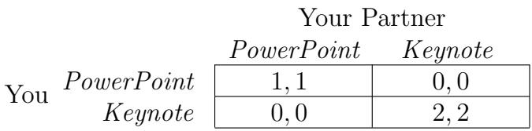  
شکل 6.17: بازی هماهنگی نامتوازن

فرض کنید شما احتمال $p$ را به طور سخت‌گیرانه بین 0 و 1 برای PowerPoint اختصاص دهید و همکار شما احتمال $q$ را به طور سخت‌گیرانه بین 0 و $1$ برای PowerPoint اختصاص دهد. سپس شما بین PowerPoint و Keynote بی‌تفاوت خواهید بود اگر

$$
( 1 ) ( q ) + ( 0 ) ( 1 - q ) = ( 0 ) ( q ) + ( 2 ) ( 1 - q ) ,
$$

یا به عبارت دیگر، اگر $q = 2 / 3$ . از آنجا که از دیدگاه همکار شما وضعیت متقارن است، ما همچنین $p = 2 / 3$ را به دست می‌آوریم. بنابراین، علاوه بر دو تعادل خالص، ما یک تعادل نیز داریم که در آن هر یک از شما PowerPoint را با احتمال 2/3 انتخاب می‌کنید. توجه کنید که برخلاف دو تعادل خالص، این تعادل مخلوط با احتمال مثبتی همراه است که شما دو نفر هماهنگ نخواهید شد؛ اما این همچنان یک تعادل است، زیرا اگر واقعاً باور داشته باشید که همکار شما PowerPoint را با احتمال $2 / 3$ و Keynote را با احتمال $1 / 3$ انتخاب می‌کند، سپس شما بین دو گزینه بی‌تفاوت خواهید بود و بازده مورد انتظار یکسانی دریافت خواهید کرد، صرف‌نظر از اینکه چه انتخابی کنید.

# 6.9 بهینگی پارتو و بهینگی اجتماعی

در یک تعادل نش، استراتژی هر بازیکن بهترین پاسخ به استراتژی‌های بازیکن دیگر است. به عبارت دیگر، بازیکنان به صورت فردی بهینه‌سازی می‌کنند. اما این به این معنی نیست که به عنوان گروه، بازیکنان حتماً به یک نتیجه‌ای برسند که به هر نحوی "خوب برای جامعه" باشد. بازی امتحان یا ارائه از بخش اول و بازی‌های مرتبط مانند چنگال زندانی، نمونه‌هایی از این موضوع هستند. (ماتریس بازده بازی امتحان یا ارائه را در شکل 6.18 دوباره رسم کرده‌ایم.)

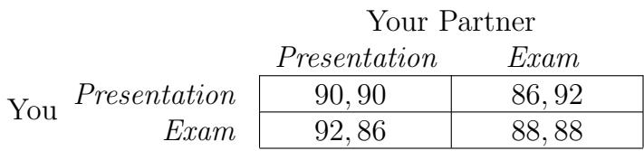  
شکل 6.18: امتحان یا ارائه؟

طبقه‌بندی نتایج در یک بازی نه تنها بر اساس ویژگی‌های استراتژیک یا تعادلی، بلکه بر اساس اینکه آیا "خوب برای جامعه" هستند یا نه، جالب است. برای استدلال درباره این موضوع، ابتدا باید راهی برای دقیق کردن آن پیدا کنیم. دو گزینه مفید برای چنین تعریفی وجود دارد، که در ادامه بحث می‌کنیم.

بهینگی پارتو. تعریف اول بهینگی پارتو است، که به اقتصاددان ایتالیایی ویلفredo پارتو که در قرن نوزدهم و اوایل قرن بیستم فعالیت می‌کرد، نسبت داده شده است.

یک انتخاب استراتژی — یکی توسط هر بازیکن — بهینه پارتو است اگر هیچ انتخاب استراتژی دیگری وجود نداشته باشد که در آن همه بازیکنان بازدهی حداقل به اندازه فعلی دریافت کنند و حداقل یک بازیکن بازدهی به طور قطعی بالاتری دریافت کند.

برای دیدن جذابیت شهودی بهینگی پارتو، بیایید یک انتخاب استراتژی که بهینه پارتو نیست را در نظر بگیریم. در این حالت، یک انتخاب جایگزین استراتژی وجود دارد که حداقل یک بازیکن را بهتر می‌کند بدون آسیب رساندن به هیچ بازیکن دیگری. در هر معنی معقولی، این انتخاب جایگزین برتر از آنچه در حال حاضر اجرا می‌شود است. اگر بازیکنان بتوانند به طور مشترک بر روی اقدامات توافق کنند و این توافق را الزامی کنند، قطعاً ترجیح می‌دهند به این انتخاب برتر استراتژی بروند.

**GLOSSARY:**
Fitness: برازندگی

**Translate:**
انگیزه اینجا به طور حیاتی به ایده‌ای وابسته است که بازیکنان می‌توانند قرارداد الزام‌آوری برای اجرای واقعی انتخاب برتر استراتژی‌ها بسازند: اگر این انتخاب جایگزین یک تعادل نش نباشد، بدون قرارداد الزام‌آور، حداقل یک بازیکن تمایل خواهد داشت به یک استراتژی متفاوت تغییر کند. به عنوان نمونه‌ای از اینکه چرا این نکته حیاتی است، به نتایج بازی امتحان یا ارائه توجه کنید. نتیجه‌ای که شما و هم‌تیمی‌تان هر دو برای امتحان مطالعه می‌کنید بهینه پارتو نیست، چرا که نتیجه‌ای که هر دو شما برای ارائه آماده می‌شوید برای هر دو شما به طور قطع بهتر است. این مشکل مرکزی این مثال است، که حالا به زبان بهینگی پارتو بیان شده است. این نشان می‌دهد که حتی اگر شما و هم‌تیمی‌تان متوجه شوید که یک راه‌حل برتر وجود دارد، بدون قرارداد الزام‌آور بین شما دو نفر، راهی برای حفظ آن وجود ندارد.

در این مثال، دو نتیجه‌ای که دقیقاً یکی از شما برای ارائه آماده می‌شود نیز بهینه پارتو هستند. در این حالت، اگرچه یکی از شما در وضعیت بدی قرار دارد، هیچ انتخاب جایگزین استراتژی وجود ندارد که همه در حداقل به همان اندازه خوب عمل کنند. بنابراین در واقع، بازی امتحان یا ارائه — و چالش زندانی — مثال‌هایی از بازی‌ها هستند که تنها نتیجه‌ای که بهینه پارتو نیست، متناظر با تعادل نش منحصربه‌فرد است.

**بهینگی اجتماعی.** شرطی قوی‌تر که حتی ساده‌تر بیان می‌شود، بهینگی اجتماعی است.

انتخاب استراتژی‌ها — یکی توسط هر بازیکن — یک حداکثرکننده رفاه اجتماعی (یا بهینه اجتماعی) است اگر مجموع سودهای بازیکنان را حداکثر کند.

در بازی امتحان یا ارائه، بهینه اجتماعی با نتیجه‌ای حاصل می‌شود که شما و هم‌تیمی‌تان هر دو برای ارائه آماده می‌شوید، که سود ترکیبی $9 0 + 9 0 = 1 8 0$ را تولید می‌کند. البته، این تعریف تنها در صورتی مناسب است که جمع کردن سودهای بازیکنان مختلف معنی‌دار باشد — همیشه مشخص نیست که بتوان رضایت من از یک نتیجه و رضایت شما را به سادگی با جمع کردن ترکیب کرد.

نتایجی که بهینه اجتماعی هستند، باید بهینه پارتو نیز باشند: اگر چنین نتیجه‌ای بهینه پارتو نباشد، نتیجه دیگری وجود دارد که در آن تمام سودها حداقل به اندازه قبلی هستند و یکی بیشتر است — و این نتیجه‌ای با مجموع سود بیشتر خواهد بود. از سوی دیگر، یک نتیجه بهینه پارتو لزوماً بهینه اجتماعی نیست. به عنوان مثال، بازی امتحان یا ارائه سه نتیجه بهینه پارتو دارد، اما تنها یکی از آنها بهینه اجتماعی است.

در نهایت، البته، اینطور نیست که تعادل‌های نش در همه بازی‌ها با هدف بهینگی اجتماعی در تضاد باشند. به عنوان مثال، در نسخه‌ای از بازی امتحان یا ارائه با امتحان آسان‌تر، که ماتریس سود را که قبلاً در شکل 6.4 دیدیم، تعادل نش منحصربه‌فرد همان بهینه اجتماعی منحصربه‌فرد است.

# 6.10 مطالب پیشرفته: استراتژی‌های مغلوب و بازی‌های پویا

در این بخش پایانی، به دو مسئله دیگر که در تحلیل بازی‌ها به وجود می‌آیند می‌پردازیم. اول، نقش استراتژی‌های مغلوب در استدلال درباره رفتار در یک بازی را بررسی می‌کنیم و متوجه می‌شویم که تحلیل استراتژی‌های مغلوب می‌تواند راهی برای پیش‌بینی بازی بر اساس عقلانیت فراهم کند، حتی وقتی هیچ بازیکنی استراتژی غالب ندارد. دوم، چگونگی بازتفسیر استراتژی‌ها و سودها در یک بازی برای رسیدگی به شرایطی که بازی واقعاً به صورت متوالی در طول زمان انجام می‌شود را بحث می‌کنیم.

با این حال، قبل از انجام این کار، با تعریف رسمی برای بازی‌هایی که بیش از دو بازیکن دارند شروع می‌کنیم.

# الف. بازی‌های چند بازیکنه

یک بازی (چند بازیکنه) مانند حالت دو بازیکنه، شامل مجموعه‌ای از بازیکنان، مجموعه‌ای از استراتژی‌ها برای هر بازیکن، و سودی برای هر بازیکن در هر نتیجه ممکن است.

به طور خاص، فرض کنید یک بازی $n$ بازیکن به نام‌های $1 , 2 , \ldots , n$ دارد. هر بازیکن مجموعه‌ای از استراتژی‌های ممکن دارد. یک نتیجه (یا استراتژی مشترک) بازی انتخاب یک استراتژی برای هر بازیکن است. در نهایت، هر بازیکن $i$ یک تابع سود $P _ { i }$ دارد که نتایج بازی را به یک سود عددی برای $i$ نگاشت می‌کند: یعنی برای هر نتیجه شامل استراتژی‌های $( S _ { 1 } , S _ { 2 } , \ldots , S _ { n } )$ ، سودی به نام $P _ { i } ( S _ { 1 } , S _ { 2 } , \ldots , S _ { n } )$ به بازیکن $i$ تعلق می‌گیرد.

حال، می‌توان گفت که استراتژی $S _ { i }$ یک بهترین پاسخ بازیکن $i$ به انتخاب استراتژی‌های $( S _ { 1 } , S _ { 2 } , \ldots , S _ { i - 1 } , S _ { i + 1 } , \ldots , S _ { n } )$ توسط سایر بازیکنان است اگر

$$
P _ { i } ( S _ { 1 } , S _ { 2 } , \ldots , S _ { i - 1 } , S _ { i } , S _ { i + 1 } , \ldots , S _ { n } ) \ge P _ { i } ( S _ { 1 } , S _ { 2 } , \ldots , S _ { i - 1 } , S _ { i } ^ { \prime } , S _ { i + 1 } , \ldots , S _ { n } )
$$

برای تمام استراتژی‌های ممکن دیگر $S _ { i } ^ { \prime }$ موجود برای بازیکن $i$ .

در نهایت، یک نتیجه شامل استراتژی‌های $( S _ { 1 } , S _ { 2 } , \ldots , S _ { n } )$ یک تعادل نش است اگر هر استراتژی آن یک بهترین پاسخ به سایرین باشد.

# ب. استراتژی‌های مغلوب و نقش آنها در استدلال استراتژیک

در بخش‌های 6.2 و 6.3، استراتژی‌های (سخت‌گیرانه) غالب — استراتژی‌هایی که (سخت‌گیرانه) بهترین پاسخ به هر انتخاب ممکن استراتژی‌های سایر بازیکنان هستند — را بحث کردیم. واضح است که اگر بازیکنی استراتژی سخت‌گیرانه غالب داشته باشد، این استراتژی باید اجرا شود. اما دیدیم که حتی برای بازی‌های دو بازیکنه و دو استراتژی، وجود استراتژی‌های غالب غیرمعمول است. این موضوع برای بازی‌های بزرگ‌تر نیز قوی‌تر است: اگرچه استراتژی‌های غالب و سخت‌گیرانه غالب ممکن است در بازی‌های با تعداد زیادی بازیکن و استراتژی وجود داشته باشند، اما نادر هستند.

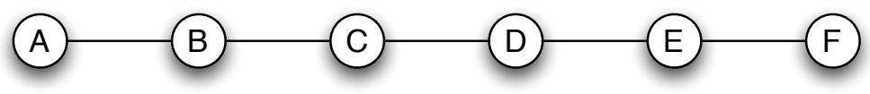  
شکل 6.19: در بازی مکان‌یابی تسهیلات، هر بازیکن استراتژی‌های مغلوب سخت‌گیرانه دارد اما استراتژی غالبی ندارد.

با این حال، حتی اگر بازیکنی استراتژی غالب نداشته باشد، ممکن است استراتژی‌هایی داشته باشد که توسط سایر استراتژی‌ها مغلوب شده‌اند. در این بخش، نقش چنین استراتژی‌های مغلوبی را در استدلال درباره رفتار در بازی‌ها بررسی می‌کنیم.

ما با تعریف رسمی شروع می‌کنیم: یک استراتژی سخت‌گیرانه مغلوب است اگر استراتژی دیگری موجود برای همان بازیکن وجود داشته باشد که در پاسخ به هر انتخاب استراتژی‌های سایر بازیکنان، سودی سخت‌گیرانه بیشتری تولید کند. در نمادگذاری که اخیراً ارائه دادیم، استراتژی $S _ { i }$ برای بازیکن $i$ سخت‌گیرانه مغلوب است اگر استراتژی دیگری $S _ { i } ^ { \prime }$ برای بازیکن $i$ وجود داشته باشد به طوری که

$$
P _ { i } ( S _ { 1 } , S _ { 2 } , \ldots , S _ { i - 1 } , S _ { i } ^ { \prime } , S _ { i + 1 } , \ldots , S _ { n } ) > P _ { i } ( S _ { 1 } , S _ { 2 } , \ldots , S _ { i - 1 } , S _ { i } , S _ { i + 1 } , \ldots , S _ { n } )
$$

برای تمام انتخاب‌های استراتژی‌های $( S _ { 1 } , S _ { 2 } , \ldots , S _ { i - 1 } , S _ { i + 1 } , \ldots , S _ { n } )$ توسط سایر بازیکنان.

حال، در بازی‌های دو بازیکنه و دو استراتژی که تاکنون بررسی کرده‌ایم، یک استراتژی دقیقاً سخت‌گیرانه مغلوب است هنگامی که استراتژی دیگر موجود برای همان بازیکن سخت‌گیرانه غالب باشد. در این زمینه، مطالعه استراتژی‌های سخت‌گیرانه مغلوب به عنوان مفهوم جداگانه معنی نخواهد داشت. با این حال، اگر بازیکنی تعداد زیادی استراتژی داشته باشد، ممکن است یک استراتژی سخت‌گیرانه مغلوب باشد بدون آنکه هیچ استراتژی غالبی وجود داشته باشد. در چنین مواردی، متوجه می‌شویم که استراتژی‌های سخت‌گیرانه مغلوب می‌توانند نقش بسیار مفیدی در استدلال درباره بازی در یک بازی ایفا کنند. به ویژه، متوجه می‌شویم که مواردی وجود دارند که استراتژی‌های غالبی نیستند، اما نتیجه بازی همچنان با استفاده از ساختار استراتژی‌های مغلوب به طور منحصربه‌فرد قابل پیش‌بینی است. به این ترتیب، استدلال بر اساس استراتژی‌های مغلوب یک رویکرد میانی جذاب بین استراتژی‌های غالب و تعادل نش تشکیل می‌دهد: از یک سو، می‌تواند قوی‌تر از استدلال صرفاً بر اساس استراتژی‌های غالب باشد؛ اما از سوی دیگر، همچنان تنها بر پیش‌فرض اینکه بازیکنان به دنبال حداکثرسازی سود هستند، تکیه می‌کند و نیازی به معرفی مفهوم تعادل ندارد.

برای دیدن اینکه این کار چگونه انجام می‌شود، مفید است که این رویکرد را در چارچوب یک مثال پایه معرفی کنیم.

**مثال: بازی مکان‌یابی تسهیلات.** مثال ما یک بازی است که در آن دو شرکت از طریق انتخاب مکان‌ها رقابت می‌کنند. فرض کنید دو شرکت هر کدام قصد دارند در یکی از شش شهر که در طول شش خروجی متوالی یک بزرگراه قرار دارند، فروشگاهی راه‌اندازی کنند. می‌توانیم ترتیب این شهرها را با یک گراف شش‌گره‌ای مانند شکل 6.19 نمایش دهیم.

حال، بر اساس توافقات اجاره‌ای، شرکت 1 امکان راه‌اندازی فروشگاه در هر یک از شهرهای $A$ ، $C$ یا $E$ را دارد، در حالی که شرکت 2 امکان راه‌اندازی فروشگاه در هر یک از شهرهای $B$ ، $\boldsymbol { D }$ یا $F$ را دارد. این تصمیمات به صورت همزمان اجرا می‌شوند. پس از راه‌اندازی دو فروشگاه، مشتریان شهرها به فروشگاهی که به آن‌ها نزدیک‌تر است می‌روند. به عنوان مثال، اگر شرکت 1 فروشگاه خود را در شهر $C$ و شرکت 2 فروشگاه خود را در شهر $B$ راه‌اندازی کنند، فروشگاه در شهر $B$ مشتریان از $A$ و $B$ را جذب می‌کند، در حالی که فروشگاه در شهر $C$ مشتریان از $C$ ، $D$ ، $E$ و $F$ را جذب می‌کند. اگر فرض کنیم که شهرها تعداد برابری مشتری دارند و سودها به طور مستقیم با تعداد مشتریان متناسب هستند، این امر منجر به سود 4 برای شرکت 1 و 2 برای شرکت 2 می‌شود، زیرا شرکت 1 مشتریان از 4 شهر را ادعا می‌کند در حالی که شرکت 2 مشتریان از 2 شهر باقی‌مانده را ادعا می‌کند. با استدلال به این شکل درباره تعداد شهرهای ادعا شده توسط هر فروشگاه بر اساس نزدیکی مکان‌ها، ماتریس سود نشان داده شده در شکل 6.20 به دست می‌آید.

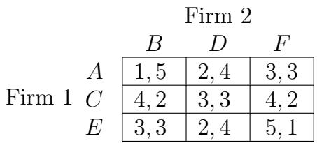  
شکل 6.20: بازی مکان‌یابی تسهیلات

این را بازی مکان‌یابی تسهیلات می‌نامیم. مکان‌یابی رقابتی تسهیلات موضوعی است که در تحقیقات عملیاتی و سایر حوزه‌ها به طور گسترده مورد مطالعه قرار گرفته است [135]. علاوه بر این، مدل‌های مرتبط به طور گسترده‌ای استفاده شده‌اند وقتی که موجودیت‌های «مکان‌یابی‌شده» فروشگاه‌های در طول یک بزرگراه یک‌بعدی نیستند، بلکه موقعیت‌های نامزدهای سیاسی در طول یک طیف ایدئولوژیک یک‌بعدی هستند — در اینجا نیز، انتخاب موقعیت خاصی نسبت به رقیب انتخاباتی می‌تواند برخی رای‌دهندگان را جذب کند و برخی دیگر را دور کند [350]. ما در فصل 23 به موضوعات مرتبط با رقابت سیاسی، اگرچه به سمتی متفاوت، باز خواهیم گشت.

می‌توانیم تأیید کنیم که هیچ بازیکنی در این بازی استراتژی غالب ندارد: به عنوان مثال، اگر شرکت 1 در گره $A$ مکان‌یابی کند، پاسخ سخت‌گیرانه شرکت 2 $B$ است، در حالی که اگر شرکت 1 در گره $E$ مکان‌یابی کند، پاسخ سخت‌گیرانه شرکت 2 $\boldsymbol { D }$ است. این موقعیت متقارن است اگر نقش دو شرکت را تعویض کنیم (و گراف را از جهت دیگر بخوانیم).

**استراتژی‌های مغلوب در بازی مکان‌یابی تسهیلات.** می‌توانیم در استدلال درباره رفتار دو بازیکن در بازی مکان‌یابی تسهیلات با تفکر درباره استراتژی‌های مغلوب آنها پیشرفت کنیم. ابتدا توجه کنید که $A$ یک استراتژی سخت‌گیرانه مغلوب برای شرکت 1 است: در هر موقعیتی که شرکت 1 امکان انتخاب $A$ را دارد، با انتخاب $C$ سودی سخت‌گیرانه بیشتری دریافت می‌کند. به طور مشابه، $F$ یک استراتژی سخت‌گیرانه مغلوب برای شرکت 2 است: در هر موقعیتی که شرکت 1 امکان انتخاب $F$ را دارد، با انتخاب $D$ سودی سخت‌گیرانه بیشتری دریافت می‌کند.

استفاده از یک استراتژی سخت‌گیرانه مغلوب هرگز در منافع بازیکن نیست، زیرا همیشه باید توسط استراتژی بهتری جایگزین شود. بنابراین شرکت 1 استراتژی $A$ را استفاده نخواهد کرد. علاوه بر این، چون شرکت 2 ساختار بازی را، از جمله سودهای شرکت 1، می‌داند، شرکت 2 می‌داند که شرکت 1 از استراتژی $A$ استفاده نخواهد کرد. این استراتژی می‌تواند به طور موثر از بازی حذف شود. استدلال مشابهی نشان می‌دهد که $F$ نیز می‌تواند از بازی حذف شود.

اکنون یک نمونه کوچک‌تر از بازی مکان‌یابی تسهیلات داریم که تنها شامل چهار گره $B$ ، $C$ ، $D$ و $E$ است و ماتریس سود نشان داده شده در شکل 6.21.

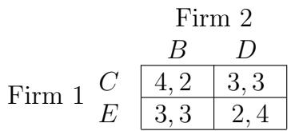  
شکل 6.21: بازی مکان‌یابی تسهیلات کوچک‌تر

**واژه‌نامه:**
برازندگی: برازندگی

حالا چیز جالبی اتفاق می‌افتد. استراتژی‌های $B$ و $E$ قبلاً به طور سخت مغلوب نبودند: آنها در صورتی که بازیکن دیگر از $A$ یا $F$ استفاده می‌کرد، مفید بودند. اما با حذف $A$ و $F ^ { \prime }$، استراتژی‌های $B$ و $E$ اکنون به طور سخت مغلوب هستند — بنابراین با همان استدلال، هر دو بازیکن می‌دانند که از آنها استفاده نخواهد شد و می‌توانیم آنها را از بازی حذف کنیم. این بازی کوچک‌تری را به ما می‌دهد که در شکل 6.22 نشان داده شده است.

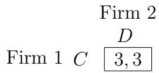  
شکل 6.22: بازی مکان‌یابی تسهیلات حتی کوچک‌تر

در این نقطه، پیش‌بینی بسیار واضحی برای بازی وجود دارد: شرکت ۱ $C$ را انتخاب خواهد کرد و شرکت ۲ $\boldsymbol { D }$ را انتخاب خواهد کرد. و استدلالی که به این نتیجه منجر شده است واضح است: پس از حذف مکرر استراتژی‌هایی که (یا شدند) به طور سخت مغلوب، تنها یک گزینه قابل قبول برای هر بازیکن باقی ماند.

فرآیندی که ما را به این بازی کاهش‌یافته رسانده است، حذف تکراری استراتژی‌های به طور سخت مغلوب نامیده می‌شود و به زودی آن را به طور کامل و عمومی توصیف خواهیم کرد. با این حال، قبل از انجام این کار، ارزش دارد که چند نکته درباره مثال بازی مکان‌یابی تسهیلات بیان کنیم.

اول اینکه، جفت استراتژی‌های $( C , D )$ واقعاً تنها تعادل نش در این بازی است، و هنگامی که در مورد حذف تکراری استراتژی‌های به طور سخت مغلوب به طور کلی بحث کنیم، خواهیم دید که این روشی مؤثر برای جستجوی تعادل‌های نش است. اما فراتر از این، این روشی مؤثر برای توجیه تعادل‌های نشی است که پیدا می‌شوند. هنگامی که برای اولین بار تعادل نش را معرفی کردیم، متوجه شدیم که آن را نمی‌توان صرفاً از فرض عقلانیت بازیکنان استنتاج کرد؛ بلکه باید فرض کنیم که بازی در یک تعادل انجام می‌شود که هیچ بازیکنی انگیزه‌ای برای انحراف از آن نداشته باشد. از سوی دیگر، هنگامی که یک تعادل نش منحصربه‌فرد از حذف تکراری استراتژی‌های به طور سخت مغلوب ظاهر می‌شود، در واقع یک پیش‌بینی است که صرفاً بر اساس فرض‌های عقلانیت بازیکنان و آگاهی آنها از بازی انجام شده است، زیرا همه مراحل منجر به آن صرفاً بر اساس حذف استراتژی‌هایی بوده که از منظر حداقل‌سازی سود، به طور سخت ضعیف‌تر از سایر استراتژی‌ها هستند.

نکته نهایی این است که حذف تکراری به اصولاً می‌تواند برای تعداد بسیار زیادی مراحل انجام شود، و بازی مکان‌یابی تسهیلات این را نشان می‌دهد. فرض کنید به جای یک مسیر به طول شش، یک مسیر به طول 1000 داشته باشیم، به طوری که گزینه‌ها برای دو شرکت همچنان به طور متناوب در امتداد این مسیر جابجا می‌شوند (که 500 استراتژی ممکن برای هر شرکت را تشکیل می‌دهد). سپس همچنان تنها دو گره بیرونی به طور سخت مغلوب خواهند بود؛ پس از حذف آنها، مسیری به طول 998 خواهیم داشت که در آن دو گره بیرونی جدید اکنون به طور سخت مغلوب شده‌اند. ما می‌توانیم به این روش ادامه دهیم و پس از 499 مرحله از این استدلال، بازی‌ای خواهیم داشت که تنها گره‌های $5 0 0 ^ { \mathrm { t h } }$ و $5 0 1 ^ { \mathrm { s t } }$ به عنوان استراتژی‌ها باقی مانده‌اند. این تنها تعادل نش برای این بازی است، و این پیش‌بینی منحصربه‌فرد می‌تواند توسط یک دنباله بسیار طولانی از حذف استراتژی‌های مغلوب توجیه شود.

همچنین جالب است که این پیش‌بینی به طور شهودی طبیعی است و در زندگی واقعی اغلب دیده می‌شود: دو فروشگاه رقیب در نزدیکی مرکز جمعیت در کنار هم موقعیت‌هایی را انتخاب می‌کنند، یا دو نامزد سیاسی در جریان رقابت برای رأی‌دهندگان در انتخابات عمومی به سمت میانه ایدئولوژیک حرکت می‌کنند. در هر مورد، این حرکت به سمت مرکز تنها راه برای حداکثر کردن قلمرویی است که می‌توانید به هزینه رقیب خود ادعا کنید.

حذف تکراری استراتژی‌های مغلوب: اصل کلی. به طور کلی، برای بازی با تعداد دلخواه بازیکنان، فرآیند حذف تکراری استراتژی‌های به طور سخت مغلوب به شرح زیر پیش می‌رود.

• ما با هر بازی $n$-نفره شروع می‌کنیم، تمام استراتژی‌های به طور سخت مغلوب را پیدا می‌کنیم و آنها را حذف می‌کنیم.   
• سپس بازی کاهش‌یافته‌ای را در نظر می‌گیریم که این استراتژی‌ها از آن حذف شده‌اند. در این بازی کاهش‌یافته، ممکن است استراتژی‌هایی وجود داشته باشند که اکنون به طور سخت مغلوب هستند، هرچند در بازی کامل مغلوب نبوده‌اند. ما این استراتژی‌ها را پیدا کرده و حذف می‌کنیم.   
• ما این فرآیند را ادامه می‌دهیم، به طور مکرر استراتژی‌های به طور سخت مغلوب را پیدا کرده و حذف می‌کنیم تا زمانی که هیچ کدام یافت نشوند.

یک واقعیت کلی مهم این است که مجموعه تعادل‌های نش بازی اصلی با مجموعه تعادل‌های نش بازی نهایی کاهش‌یافته، که تنها شامل استراتژی‌هایی است که در حذف تکراری بقا داده‌اند، یکسان است. برای اثبات این واقعیت، کافی است نشان دهیم که مجموعه تعادل‌های نش هنگام انجام یک دور حذف استراتژی‌های به طور سخت مغلوب تغییر نمی‌کند؛ اگر این درست باشد، آنگاه ثابت کرده‌ایم که تعادل‌های نش در طول هر دنباله متناهی از حذف‌ها بدون تغییر باقی می‌مانند.

برای اثبات اینکه مجموعه تعادل‌های نش در طول یک دور حذف تغییر نمی‌کند، باید دو چیز را نشان دهیم. اول اینکه هر تعادل نش بازی اصلی، یک تعادل نش بازی کاهش‌یافته نیز هست. برای دیدن این موضوع، توجه کنید که در غیر این صورت، تعادل نش بازی اصلی وجود داشت که شامل استراتژی $S$ حذف شده باشد. اما در این حالت، $S$ به طور سخت توسط استراتژی دیگری $S ^ { \prime }$ مغلوب است. بنابراین $S$ نمی‌تواند بخشی از تعادل نش بازی اصلی باشد: چون پاسخ بهتری به استراتژی‌های بازیکنان دیگر نیست، زیرا استراتژی $S ^ { \prime }$ که آن را مغلوب می‌کند، پاسخ بهتری است. این نشان می‌دهد که هیچ تعادل نش بازی اصلی نمی‌تواند توسط فرآیند حذف حذف شود. دوم، باید نشان دهیم که هر تعادل نش بازی کاهش‌یافته، یک تعادل نش بازی اصلی نیز هست. برای اینکه اینطور نباشد، باید یک تعادل نش $E = ( S _ { 1 } , S _ { 2 } , \dots , S _ { n } )$ از بازی کاهش‌یافته و یک استراتژی $S _ { i } ^ { \prime }$ که از بازی اصلی حذف شده باشد، وجود داشته باشد به طوری که بازیکن $i$ انگیزه‌ای برای انحراف از استراتژی $S _ { i }$ در $E$ به استراتژی $S _ { i } ^ { \prime }$ داشته باشد. اما استراتژی $S _ { i } ^ { \prime }$ به دلیل مغلوب بودن به طور سخت توسط حداقل یک استراتژی دیگر حذف شده است؛ بنابراین می‌توانیم استراتژی $S _ { i } ^ { \prime \prime }$ را پیدا کنیم که آن را به طور سخت مغلوب کرده و حذف نشده است. سپس بازیکن $i$ نیز انگیزه‌ای برای انحراف از $S _ { i }$ به $S _ { i } ^ { \prime \prime }$ دارد، و $S _ { i } ^ { \prime \prime }$ هنوز در بازی کاهش‌یافته موجود است، که با فرض ما که $E$ یک تعادل نش بازی کاهش‌یافته است، در تناقض است.

این نشان می‌دهد که بازی که پس از حذف تکراری استراتژی‌های به طور سخت مغلوب به دست می‌آید، همچنان تمام تعادل‌های نش بازی اصلی را دارد. بنابراین، این فرآیند می‌تواند روشی قدرتمند برای محدود کردن جستجوی تعادل‌های نش باشد. علاوه بر این، هرچند فرآیند را به صورت دوره‌ای توصیف کردیم، به طوری که در هر دور تمام استراتژی‌های به طور سخت مغلوب فعلی حذف می‌شوند، اما این ضروری نیست. می‌توان نشان داد که حذف استراتژی‌های به طور سخت مغلوب به هر ترتیبی، مجموعه یکسانی از استراتژی‌های باقی‌مانده را نتیجه می‌دهد.

استراتژی‌های مغلوب ضعیف. نیز طبیعی است که درباره مفاهیمی که کمی ضعیف‌تر از تعریف ما از استراتژی‌های به طور سخت مغلوب هستند، سؤال کنیم. یک تعریف بنیادی در این راستا، استراتژی مغلوب ضعیف است. ما می‌گوییم که یک استراتژی مغلوب ضعیف است اگر استراتژی دیگری وجود داشته باشد که در هر صورت حداقل به اندازه آن عمل کند و در برخی استراتژی‌های مشترک بازیکنان دیگر به طور سخت بهتر عمل کند. در نمادگذاری قبلی، ما می‌گوییم که استراتژی $S _ { i }$ برای بازیکن $i$ مغلوب ضعیف است اگر استراتژی دیگری $S _ { i } ^ { \prime }$ برای بازیکن $i$ وجود داشته باشد به طوری که

$$
P _ { i } ( S _ { 1 } , S _ { 2 } , \ldots , S _ { i - 1 } , S _ { i } ^ { \prime } , S _ { i + 1 } , \ldots , S _ { n } ) \geq P _ { i } ( S _ { 1 } , S _ { 2 } , \ldots , S _ { i - 1 } , S _ { i } , S _ { i + 1 } , \ldots , S _ { n } )
$$

برای همه انتخاب‌های استراتژی‌های $( S _ { 1 } , S _ { 2 } , \ldots , S _ { i - 1 } , S _ { i + 1 } , \ldots , S _ { n } )$ توسط بازیکنان دیگر، و

$$
P _ { i } ( S _ { 1 } , S _ { 2 } , \ldots , S _ { i - 1 } , S _ { i } ^ { \prime } , S _ { i + 1 } , \ldots , S _ { n } ) > P _ { i } ( S _ { 1 } , S _ { 2 } , \ldots , S _ { i - 1 } , S _ { i } , S _ { i + 1 } , \ldots , S _ { n } )
$$

برای حداقل یک انتخاب از استراتژی‌های $( S _ { 1 } , S _ { 2 } , \ldots , S _ { i - 1 } , S _ { i + 1 } , \ldots , S _ { n } )$ توسط بازیکنان دیگر.

برای استراتژی‌های به طور سخت مغلوب، استدلال برای حذف آنها قانع‌کننده بود: آنها هرگز بهترین پاسخ نیستند. برای استراتژی‌های مغلوب ضعیف، مسئله پیچیده‌تر است. چنین استراتژی‌هایی می‌توانند بهترین پاسخ به برخی استراتژی‌های مشترک بازیکنان دیگر باشند. بنابراین یک بازیکن عقلانی می‌تواند از استراتژی مغلوب ضعیف استفاده کند و در واقع تعادل‌های نش می‌توانند شامل استراتژی‌های مغلوب ضعیف باشند.

مثال‌های ساده‌ای وجود دارند که این موضوع را حتی در بازی‌های دو بازیکن و دو استراتژی روشن می‌کنند. برای مثال، نسخه‌ای از بازی شکار گوزن را در نظر بگیرید که در آن سود حاصل از شکار موفقیت‌آمیز گوزن با سود حاصل از شکار خرگوش یکسان است:

شکارچی ۲ شکار گوزن شکار خرگوش  
شکل 6.23: شکار گوزن: نسخه‌ای با استراتژی مغلوب ضعیف   

<table><tr><td rowspan="2">Hunter 1 Hunt Hare</td><td rowspan="2">Hunt Stag</td><td>3,3</td><td>0,3</td></tr><tr><td>3,0</td><td>3,3</td></tr></table>

در این حالت، شکار گوزن یک استراتژی مغلوب ضعیف است، چون هر بازیکن همیشه حداقل به اندازه همان عمل می‌کند و گاهی به طور سخت بهتر، با انجام شکار خرگوش. با این حال، نتیجه‌ای که هر دو بازیکن شکار گوزن را انتخاب می‌کنند، یک تعادل نش است، چون هر کدام بهترین پاسخ به استراتژی دیگری هستند. بنابراین، حذف استراتژی‌های مغلوب ضعیف به طور کلی کار ایمنی نیست اگر بخواهیم ساختار اساسی بازی را حفظ کنیم: چنین عملیات حذفی می‌توانند تعادل‌های نش را از بین ببرند.

البته، به نظر می‌رسد که منطقی است فرض کنیم که یک بازیکن نباید در یک تعادل که شامل استراتژی مغلوب ضعیف است (مانند (شکار گوزن، شکار گوزن)) شرکت کند اگر هرگونه عدم اطمینان درباره آنچه بازیکنان دیگر انجام می‌دهند داشته باشد — در نهایت، چرا از یک استراتژی جایگزین استفاده نکنیم که در هر شرایطی حداقل به همان اندازه خوب باشد؟ اما تعادل نش این ایده از عدم اطمینان درباره رفتار دیگران را در نظر نمی‌گیرد و بنابراین راهی برای حذف چنین نتایجی ندارد. در فصل بعد، مفهوم دیگری از تعادل به نام پایداری تکاملی را بحث خواهیم کرد که در واقع به روشی اصولی استراتژی‌های مغلوب ضعیف را حذف می‌کند. رابطه بین تعادل نش، پایداری تکاملی و استراتژی‌های مغلوب ضعیف در تمرینات پایان فصل 7 مورد بررسی قرار می‌گیرد.

# C. بازی‌های پویا

تمرکز ما در این فصل بر بازی‌هایی بوده است که در آن‌ها همه بازیکنان استراتژی‌های خود را به طور همزمان انتخاب می‌کنند و سپس بر اساس این تصمیم مشترک سود می‌گیرند. البته، همزمانی واقعی برای مدل حیاتی نیست، اما تاکنون مرکز بحث‌های ما این بوده که هر بازیکن بدون دانستن انتخاب‌های واقعی بازیکنان دیگر استراتژی انتخاب می‌کند.

با این حال، بسیاری از بازی‌ها در طول زمان انجام می‌شوند: برخی بازیکنان یا مجموعه‌ای از بازیکنان اول حرکت می‌کنند، بازیکنان دیگر انتخاب(ها) انجام شده را مشاهده می‌کنند و سپس پاسخ می‌دهند، شاید بر اساس یک ترتیب پیش تعیین شده که مشخص می‌کند چه کسی در چه زمانی حرکت می‌کند. چنین بازی‌هایی بازی‌های پویا نامیده می‌شوند و نمونه‌های اساسی بسیاری وجود دارند: بازی‌های تخته‌ای و کارتی که در آن‌ها بازیکنان به نوبت حرکت می‌کنند؛ مذاکرات که معمولاً شامل دنباله‌ای از پیشنهادها و پیشنهادهای متقابل هستند؛ و حراج یا تعیین قیمت کالاهای رقیب که در آن شرکت‌کنندگان باید در طول زمان تصمیم بگیرند. در اینجا، ما به بحث درباره یک اصلاحیه از تئوری بازی‌ها خواهیم پرداخت که این جنبه پویا را در بر می‌گیرد.

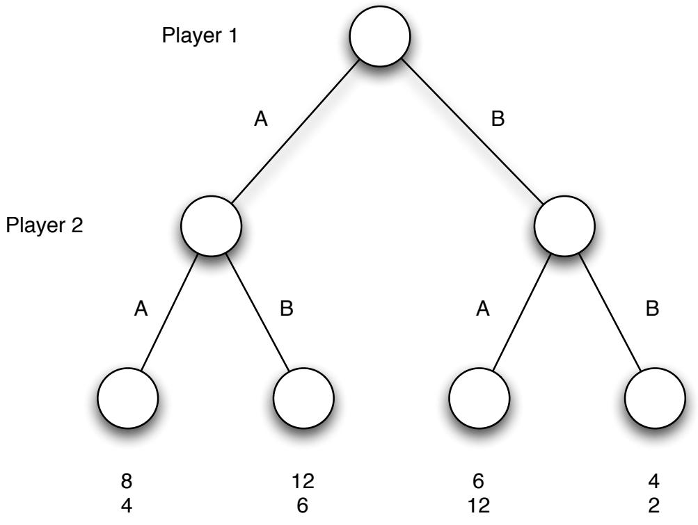  
شکل 6.24: یک بازی ساده در فرم گسترده.

فرم‌های نرمال و گسترده یک بازی. برای شروع، مشخص کردن یک بازی پویا نیاز به نوع جدیدی از نمادگذاری دارد. تاکنون، با چیزی به نمایش نرمال یک بازی کار کرده‌ایم؛ که لیست بازیکنان، استراتژی‌های ممکن آنها، و سودهای ناشی از هر انتخاب ممکن (همزمان) استراتژی‌ها توسط بازیکنان را مشخص می‌کند. (برای بازی‌های دو بازیکنی، ماتریس‌های سودی که در این فصل دیده‌ایم، نمایش نرمال یک بازی را به صورت فشرده کدگذاری می‌کنند.)

**GLOSSARY:**
Fitness: برازندگی

برای توصیف یک بازی پویا، به نمایشی غنی‌تر نیاز داریم؛ باید بتوانیم مشخص کنیم که چه کسی در چه زمانی حرکت می‌کند، هر بازیکن در هر فرصتی که برای حرکت دارد چه می‌داند، چه کارهایی می‌تواند انجام دهد وقتی نوبت اوست، و پرداخت‌ها در پایان بازی چگونه است. ما به این مشخصات، نمایش فرم گسترده بازی می‌گوییم.

بیایید با یک مثال بسیار ساده از یک بازی پویا شروع کنیم تا بتوانیم درباره ظاهر نمایش فرم گسترده آن بحث کنیم. همان‌طور که خواهیم دید، این بازی به‌قدری ساده است که برخی از ظرافت‌هایی که در تحلیل بازی‌های پویا به‌وجود می‌آیند را دور می‌زند، اما به‌عنوان یک نمایش اولیه مفید است و پس از آن به یک مثال دوم پیچیده‌تر خواهیم پرداخت.

در مثال اول، فرض می‌کنیم که دو شرکت — شرکت ۱ و شرکت ۲ — وجود دارند که هر کدام می‌خواهند تصمیم بگیرند که تبلیغات و بازاریابی خود را روی دو منطقه ممکن، به نام‌های $A$ یا $B$ ، متمرکز کنند. شرکت ۱ ابتدا حق انتخاب را دارد. اگر شرکت ۲ به همان منطقه که شرکت ۱ انتخاب کرده پیوست، آنگاه مزیت «حرکت اول» شرکت ۱ به آن $2 / 3$ از سود قابل‌دستیابی از بازار آن منطقه می‌دهد، در حالی که شرکت ۲ تنها $1 / 3$ را دریافت می‌کند. اگر شرکت ۲ به منطقه دیگر حرکت کند، هر شرکت تمام سود قابل‌دستیابی در منطقه خود را دریافت می‌کند. در نهایت، منطقه $A$ دو برابر بازار بزرگ‌تری نسبت به منطقه $B$ دارد: کل سود قابل‌دستیابی در منطقه $A$ برابر با ۱۲ است، در حالی که در منطقه $B$ ، ۶ است.

نمایش فرم گسترده را به‌صورت یک «درخت بازی» که در شکل ۶.۲۴ نشان داده شده است، می‌نویسیم. این درخت به‌گونه‌ای طراحی شده که از بالا به پایین خوانده می‌شود. گره بالایی نمایانگر حرکت اولیه شرکت ۱ است و دو لبه که از این گره پایین می‌آیند، دو گزینه $A$ یا $B$ آن را نشان می‌دهند. بر اساس اینکه کدام شاخه انتخاب شده است، این به یک گره که نمایانگر حرکت بعدی شرکت ۲ است منجر می‌شود. شرکت ۲ می‌تواند سپس گزینه $A$ یا $B$ را انتخاب کند، که باز هم با لبه‌های پایین‌آمده از گره نشان داده می‌شود. این منجر به یک گره پایانی می‌شود که پایان بازی را نشان می‌دهد؛ هر گره پایانی با پرداخت‌های دو بازیکن برچسب‌گذاری شده است.

بنابراین، یک بازی خاص — که توسط دنباله‌ای از انتخاب‌های شرکت ۱ و شرکت ۲ تعیین می‌شود — به یک مسیر از گره بالایی درخت تا یک گره پایانی خاص متناظر است. ابتدا شرکت ۱ $A$ یا $B$ را انتخاب می‌کند، سپس شرکت ۲ $A$ یا $B$ را انتخاب می‌کند، و سپس دو بازیکن پرداخت‌های خود را دریافت می‌کنند. در یک مدل کلی‌تر از بازی‌های پویا، هر گره می‌تواند حاوی یک یادداشت باشد که نشان می‌دهد چه اطلاعاتی درباره حرکات قبلی به بازیکن فعلی که در حال انجام حرکت است، شناخته شده است؛ با این حال، برای اهداف ما در اینجا، بر روی حالتی تمرکز خواهیم کرد که هر بازیکن هنگام انجام حرکت فعلی خود، تاریخچه کامل حرکات گذشته را می‌داند.

استدلال درباره رفتار در یک بازی پویا. مانند بازی‌های همزمان، می‌خواهیم پیش‌بینی کنیم که بازیکنان در بازی‌های پویا چه کاری انجام خواهند داد. یک روش این است که از درخت بازی استدلال کنیم. در مثال فعلی، می‌توانیم با بررسی اینکه شرکت ۲ چگونه پس از هر یک از دو حرکت اولیه ممکن شرکت ۱ رفتار خواهد کرد، شروع کنیم. اگر شرکت ۱ $A$ را انتخاب کند، شرکت ۲ با انتخاب $B$ سود خود را به حداکثر می‌رساند، در حالی که اگر شرکت ۱ $B$ را انتخاب کند، شرکت ۲ با انتخاب $A$ سود خود را به حداکثر می‌رساند. حال بیایید حرکت اولیه شرکت ۱ را با توجه به آنچه درباره رفتار بعدی شرکت ۲ نتیجه گرفته‌ایم، در نظر بگیریم. اگر شرکت ۱ $A$ را انتخاب کند، آنگاه انتظار دارد که شرکت ۲ $B$ را انتخاب کند، که منجر به پرداخت ۱۲ برای شرکت ۱ می‌شود. اگر شرکت ۱ $B$ را انتخاب کند، آنگاه انتظار دارد که شرکت ۲ $A$ را انتخاب کند، که منجر به پرداخت ۶ برای شرکت ۱ می‌شود. از آنجایی که انتظار داریم شرکت‌ها سعی کنند سود خود را به حداکثر برسانند، پیش‌بینی می‌کنیم که شرکت ۱ باید $A$ را انتخاب کند، پس از آن شرکت ۲ باید $B$ را انتخاب کند.

این روش مفیدی برای تحلیل بازی‌های پویا است. ما از یک مرحله بالاتر از گره‌های پایانی شروع می‌کنیم، جایی که آخرین بازیکنی که حرکت می‌کند کنترل کاملی بر روی نتیجه پرداخت‌ها دارد. این به ما امکان می‌دهد که پیش‌بینی کنیم آخرین بازیکن در همه موارد چه کاری انجام خواهد داد. پس از تعیین این موضوع، سپس یک مرحله دیگر به بالاتر در درخت بازی حرکت می‌کنیم و از این پیش‌بینی‌ها برای استدلال درباره آنچه بازیکنی که یک حرکت قبل‌تر است انجام خواهد داد، استفاده می‌کنیم. این روند را ادامه می‌دهیم تا به بالاترین گره درخت برسیم و در نهایت پیش‌بینی‌هایی برای بازی از ابتدا تا انتها انجام دهیم.

سبک دیگری از تحلیل از ارتباط جالبی بین فرم‌های نرمال و گسترده استفاده می‌کند که به ما امکان می‌دهد نمایش فرم نرمالی برای یک بازی پویا به شکل زیر بنویسیم. فرض کنید که قبل از اجرای بازی، هر بازیکن یک برنامه برای نحوه اجرای کل بازی تهیه می‌کند که همه احتمالات را پوشش دهد. این برنامه به‌عنوان استراتژی بازیکن عمل خواهد کرد. یک روش برای تفکر درباره چنین استراتژی‌هایی و روش مفیدی برای اطمینان از اینکه آنها توصیف کاملی از همه احتمالات را شامل می‌شوند، این است که تصور کنیم هر بازیکن باید تمام اطلاعات مورد نیاز برای نوشتن یک برنامه کامپیوتری را ارائه دهد که به جای او واقعاً بازی را اجرا کند.

برای بازی در شکل ۶.۲۴، شرکت ۱ تنها دو استراتژی ممکن دارد: $A$ یا $B$ . از آنجایی که شرکت ۲ پس از مشاهده آنچه شرکت ۱ انجام داده حرکت می‌کند و شرکت ۲ برای هر یک از دو گزینه شرکت ۱ دو انتخاب ممکن دارد، شرکت ۲ چهار برنامه ممکن برای بازی دارد. این برنامه‌ها می‌توانند به‌صورت شرایط احتمالی نوشته شوند که مشخص می‌کنند شرکت ۲ در پاسخ به هر حرکت ممکن شرکت ۱ چه کاری انجام خواهد داد:

( $A$ اگر $A$ ، A اگر $B$ ), ( $A$ اگر $A$ , $B$ اگر $B$ ), ( $B$ اگر $A$ , $A$ اگر $B$ ), و ( $B$ اگر $A$ , $B$ اگر $B$ ),

یا به‌صورت مختصر:

$$
( A A , A B ) , ( A A , B B ) , ( B A , A B ) , \mathrm { a n d } ( B A , B B ) ,
$$

اگر هر بازیکن یک برنامه کامل برای بازی به‌عنوان استراتژی انتخاب کند، می‌توانیم پرداخت‌ها را مستقیماً از این جفت استراتژی‌های انتخاب‌شده از طریق یک ماتریس پرداخت تعیین کنیم.

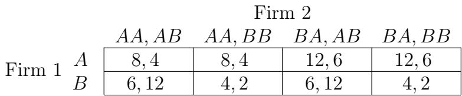  
شکل ۶.۲۵: تبدیل به فرم نرمال.

از آنجایی که این برنامه‌ها همه جنبه‌های رفتار یک بازیکن را توصیف می‌کنند، ما توانستیم این بازی پویا را به‌صورت فرم نرمال توصیف کنیم: هر بازیکن پیش از بازی یک استراتژی ( شامل یک برنامه کامل) انتخاب می‌کند و از این انتخاب مشترک استراتژی‌ها می‌توانیم پرداخت‌ها را تعیین کنیم. بعداً خواهیم دید که در استفاده از این تفسیر از بازی پویای اصلی، برخی ظرافت‌های مهم وجود دارد، و به‌ویژه ترجمه از فرم گسترده به فرم نرمال گاهی اوقات ساختار کامل ضمنی در بازی را حفظ نمی‌کند. اما این ترجمه یک ابزار مفید برای تحلیل است، و کمبود دقت ظریفی که ممکن است در ترجمه به‌وجود آید، خودش یک مفهوم آشکارساز برای توسعه و بررسی است.

با توجه به این مطلب، ابتدا مثال ساده خود را تکمیل می‌کنیم که در آن ترجمه به‌طور کامل کار می‌کند، سپس به مثال دومی می‌رویم که در آن پیچیدگی‌ها شروع به ظهور می‌کنند. برای ماتریس پرداخت فرم نرمال مربوط به مثال اول، ماتریس پرداخت هشت سلول دارد، در حالی که نمایش فرم گسترده تنها چهار گره پایانی با پرداخت دارد. این اتفاق می‌افتد چون هر گره پایانی می‌تواند با دو جفت استراتژی متفاوت به‌دست آید، که هر جفت یک سلول ماتریس پرداخت را تشکیل می‌دهد. هر دو جفت استراتژی در مسیر درخت بازی که واقعاً رخ می‌دهد، اقدامات یکسانی را تعیین می‌کنند، اما در مسیرهای غیر واقعی دیگر اقدامات فرضی متفاوتی را توصیف می‌کنند. به‌عنوان مثال، پرداخت‌های درون سلول‌های $( A , ( A A , A B ) )$ و $( A , ( A A , B B ) )$ یکسان هستند چون هر دو ترکیب استراتژی به همان گره پایانی منجر می‌شوند. در هر دو مورد، شرکت ۲ به‌دلیل آنچه شرکت ۱ واقعاً انجام داده، A را انتخاب می‌کند؛ برنامه شرکت ۲ برای اینکه در صورت انتخاب B توسط شرکت ۱ چه کاری انجام دهد، توسط بازی واقعی به‌کار گرفته نمی‌شود.

حال، با استفاده از نمایش فرم نرمال، می‌توانیم به‌سرعت ببینیم که برای شرکت ۱، استراتژی $A$ به‌طور قطع غالب است. شرکت ۲ استراتژی غالب قطعی ندارد، اما باید بهترین پاسخ را نسبت به شرکت ۱ ارائه دهد، که یا $( B A , A B )$ یا $( B A , B B )$ خواهد بود. توجه کنید که این پیش‌بینی بازی توسط شرکت ۱ و شرکت ۲ بر اساس نمایش فرم نرمال، با پیش‌بینی ما بر اساس تحلیل مستقیم درخت بازی، که از گره‌های پایانی به‌صورت صعودی استدلال کردیم، یکسان است: شرکت ۱ $A$ را انجام خواهد داد و در پاسخ شرکت ۲ $B$ را انجام خواهد داد.

مثال پیچیده‌تر: بازی ورود به بازار. در بازی پویای اول ما، استدلال بر اساس نمایش‌های فرم گسترده و نرمال به نتایج اساساً یکسانی منجر شد. همان‌طور که بازی‌ها بزرگ‌تر می‌شوند، فرم‌های گسترده برای بازی‌های پویا از نظر نمایشی روان‌تر از فرم‌های نرمال هستند، اما اگر این تنها تفاوت باشد، دشوار خواهد بود که بگوییم بازی‌های پویا واقعاً به نظریه کلی بازی‌ها چیز زیادی اضافه می‌کنند. در واقع، با این حال، جنبه پویایی منجر به ظرافت‌های جدید می‌شود، و این می‌تواند با در نظر گرفتن موردی که در آن ترجمه از فرم گسترده به فرم نرمال در نهایت برخی از ساختارهای ضمنی در بازی پویا را محو می‌کند، آشکار شود.

برای این منظور، یک مثال دوم از بازی پویا را در نظر می‌گیریم که بین دو شرکت رقیب انجام می‌شود. ما این بازی را «بازی ورود به بازار» می‌نامیم و از سناریوی زیر الهام گرفته شده است. یک منطقه را در نظر بگیرید که در آن شرکت ۲ تنها شرکت جدی در یک صنعت خاص است و شرکت ۱ در حال بررسی ورود به بازار است.

• حرکت اول این بازی توسط شرکت ۱ انجام می‌شود که باید تصمیم بگیرد که خارج از بازار بماند یا وارد آن شود.   
• اگر شرکت ۱ انتخاب کند که خارج بماند، بازی پایان می‌یابد، به‌طوری که شرکت ۱ پرداخت ۰ دریافت می‌کند و شرکت ۲ پرداخت کل بازار را حفظ می‌کند.

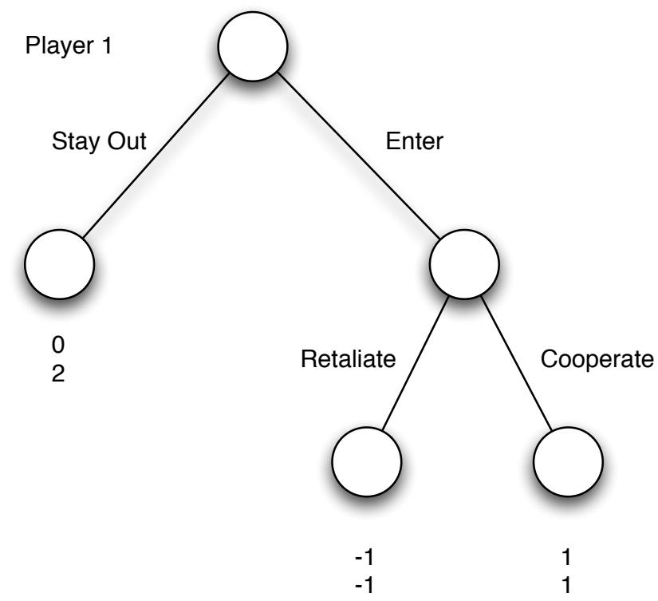  
بازیکن ۲  
شکل ۶.۲۶: نمایش فرم گسترده بازی ورود به بازار.

• اگر شرکت ۱ انتخاب کند که وارد شود، بازی به حرکت دومی توسط شرکت ۲ ادامه می‌یابد که باید تصمیم بگیرد که همکاری کند و بازار را به‌طور مساوی با شرکت ۱ تقسیم کند، یا انتقام بگیرد و جنگ قیمتی را آغاز کند.

– اگر شرکت ۲ همکاری کند، هر شرکت پرداختی معادل نیمی از بازار دریافت می‌کند.   
– اگر شرکت ۲ انتقام بگیرد، هر شرکت پرداخت منفی دریافت می‌کند.

با انتخاب پرداخت‌های عددی برای تکمیل این داستان، می‌توانیم نمایش فرم گسترده بازی ورود به بازار را مانند شکل ۶.۲۶ بنویسیم.

ظرافت‌های بین نمایش‌های فرم گسترده و نرمال. بیایید دو روشی که برای تحلیل بازی پویای قبلی توسعه دادیم را اینجا به‌کار ببریم. ابتدا می‌توانیم از گره‌های پایانی شروع کرده و به سمت بالا در درخت بازی حرکت کنیم، به‌شرح زیر. اگر شرکت ۱ تصمیم بگیرد وارد بازار شود، شرکت ۲ با همکاری پرداخت بیشتری نسبت به انتقام‌گیری به‌دست می‌آورد، بنابراین باید پیش‌بینی کنیم که در صورت رسیدن بازی به این نقطه، همکاری اتفاق خواهد افتاد. با توجه به این موضوع، هنگامی که شرکت ۱ برای انجام حرکت اولیه خود آماده می‌شود، می‌تواند با خروج از بازار پرداخت ۰ و با ورود به بازار پرداخت ۱ را انتظار داشته باشد، بنابراین باید وارد بازار شود. بنابراین می‌توانیم پیش‌بینی کنیم که شرکت ۱ وارد بازار خواهد شد و سپس شرکت ۲ همکاری خواهد کرد.

حال بیایید نمایش فرم نرمال را در نظر بگیریم. برنامه‌های ممکن شرکت ۱ برای بازی تنها شامل انتخاب «خارج شدن» ( $S$ ) یا «ورود» ( $E$ ) است. برنامه‌های ممکن شرکت ۲ شامل انتخاب انتقام‌گیری در صورت ورود یا همکاری در صورت ورود است. ما این دو برنامه را به‌ترتیب با $R$ و $C$ نمایش می‌دهیم. این به ما ماتریس پرداخت در شکل ۶.۲۷ را می‌دهد.

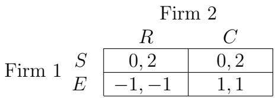  
شکل ۶.۲۷: فرم نرمال بازی ورود به بازار

این یک تعجب‌آور است: وقتی این بازی را به شکل نرمال بررسی می‌کنیم، دو تعادل نش متمایز (استراتژی خالص) پیدا می‌کنیم: $( E , C )$ و $( S , R )$ . اولین آن مربوط به پیش‌بینی بازی است که با تحلیل نمایش شکل گسترده به دست آوردیم. دومین آن به چه چیزی مربوط است؟

برای پاسخ به این سؤال، به یاد آوردن دیدگاه ما درباره نمایش شکل نرمال که ایده این را در بر می‌گیرد که هر بازیکن به طور از پیش به یک برنامه کامپیوتری تعهد می‌دهد که به جای او بازی را انجام دهد، کمک می‌کند. از این دیدگاه، تعادل $( S , R )$ مربوط به یک پیامد است که در آن شرکت 2 به طور از پیش به یک برنامه کامپیوتری تعهد می‌دهد که در صورت ورود شرکت 1 به بازار به طور خودکار واکنش نشان دهد. شرکت 1، در همین حال، به یک برنامه که از بازار باز می‌ماند تعهد می‌دهد. با توجه به این جفت انتخاب‌ها، هیچ شرکتی انگیزه‌ای برای تغییر برنامه کامپیوتری که استفاده می‌کند ندارد: به عنوان مثال، اگر شرکت 1 به برنامه‌ای که وارد بازار می‌شود تغییر کند، واکنش برنامه‌ای که شرکت 2 استفاده می‌کند را فعال خواهد کرد.

این تضاد بین پیش‌بینی‌های شکل گسترده و شکل نرمال برخی نکات مهم را برجسته می‌کند. اول، نشان می‌دهد که فرضیه پشت ترجمه از شکل گسترده به شکل نرمال — که هر بازیکن به طور پیش‌رو به یک طرح کامل برای اجرای بازی تعهد می‌دهد — واقعاً معادل با فرضیه اولیه ما در تعریف بازی‌های پویا — یعنی هر بازیکن در هر نقطه میانی بازی تصمیم بهینه‌ای بر اساس آنچه تا آن نقطه رخ داده گرفته است — نیست. تصمیم شرکت 2 برای واکنش در صورت ورود به این موضوع را به وضوح نشان می‌دهد. اگر شرکت 2 بتواند واقعاً به این طرح تعهد پیش‌رو کند، آنگاه تعادل $( S , R )$ معنا دارد، زیرا شرکت 1 نخواهد خواست واکنشی را که در طرح شرکت 2 کدگذاری شده است، تحریک کند. اما اگر بازی پویا را به شکل اولیه‌اش در شکل گسترده در نظر بگیریم، تعهد پیش‌رو به طرح بخشی از مدل نیست: بلکه شرکت 2 تنها پس از ورود شرکت 1 به بازار می‌تواند تصمیم خود را برای همکاری یا واکنش ارزیابی کند، و در آن نقطه سود آن بهتر است اگر همکاری کند. با توجه به این، شرکت 1 می‌تواند پیش‌بینی کند که ورود به بازار ایمن است.

در نظریه بازی‌ها، مدل استاندارد برای بازی‌های پویا در شکل گسترده فرض می‌کند که بازیکنان در هر مرحله میانی بازی که قابل دسترسی است، سعی می‌کنند سود خود را حداکثر کنند. در این تفسیر، برای بازی ورود به بازار یک پیش‌بینی منحصربه‌فرد وجود دارد که مربوط به تعادل $( E , C )$ در شکل نرمال است. با این حال، مسائل مربوط به تعادل دیگر $( S , R )$ صرفاً نمادین یا نمایشی نیستند؛ عمیق‌تر از این هستند. برای هر سناریوی داده شده، در واقع سؤال این است که چه چیزی توسط بازی پویای زیربنایی در شکل گسترده مدل‌سازی شده است. این سؤال است که آیا ما در شرایطی هستیم که یک بازیکن بتواند به طور غیرقابل بازگشت به یک طرح خاص تعهد کند به گونه‌ای که بازیکنان دیگر این تعهد را به عنوان تهدید معتبر بپذیرند — یا نه.

علاوه بر این، بازی ورود به بازار نشان می‌دهد که توانایی تعهد به یک مسیر اقدام خاص — هرگاه ممکن باشد — می‌تواند برای یک بازیکن فردی ارزشمند باشد، حتی اگر آن مسیر اقدام در صورت اجرا برای همه بد باشد. به‌طور خاص، اگر شرکت 2 بتواند شرکت 1 را متقاعد کند که واقعاً در صورت ورود واکنش نشان خواهد داد، آنگاه شرکت 1 انتخاب می‌کند که از بازار باز بماند، که منجر به سود بالاتری برای شرکت 2 می‌شود. در عمل، این امر پیشنهاد می‌کند که شرکت 2 چه اقداماتی قبل از شروع بازی می‌تواند انجام دهد. به عنوان مثال، فرض کنید که قبل از اینکه شرکت 1 تصمیم بگیرد وارد بازار شود یا نه، شرکت 2 یک پیشنهاد را به طور عمومی تبلیغ کند که قیمت هر رقیبی را با $1 0 \%$ پشتیبانی می‌کند. این کار تا زمانی که شرکت 2 تنها شرکت جدی در بازار باشد، ایمن است، اما اگر شرکت 1 واقعاً وارد بازار شود، برای هر دو شرکت خطرناک می‌شود. این واقعیت که طرح به طور عمومی اعلام شده است به این معناست که برای شرکت 2 بسیار هزینه‌بر (از نظر اعتبار و احتمالاً از نظر قانونی) خواهد بود که از آن عقب نشینی کند. به این ترتیب، اعلامیه می‌تواند به عنوان راهی برای تغییر مدل زیربنایی از حالتی که تهدید شرکت 2 برای واکنش معتبر نیست به حالتی که شرکت 2 واقعاً می‌تواند به طرحی برای واکنش تعهد پیش‌رو کند، عمل کند.

ارتباط با استراتژی‌های ضعیفاً مغلوب. در بحث این تفاوت‌ها، مشاهده نقش استراتژی‌های ضعیفاً مغلوب نیز جالب است. توجه کنید که در نمایش شکل نرمال در شکل 6.27، استراتژی $R$ برای شرکت 2 ضعیفاً مغلوب است، و به دلیل ساده‌ای: اگر شرکت 1 $S$ را انتخاب کند (چون آنگاه شرکت 2 واقعاً نمی‌تواند حرکت کند)، سود یکسانی می‌دهد، و اگر شرکت 1 $E$ را انتخاب کند، سود کمتری می‌دهد. بنابراین، ترجمه ما از شکل گسترده به شکل نرمال برای بازی‌های پویا دلیل دیگری برای احتیاط در مورد پیش‌بینی‌های بازی در یک بازی شکل نرمال که به استراتژی‌های ضعیفاً مغلوب وابسته هستند، فراهم می‌کند: اگر ساختار در واقع از یک بازی پویا در شکل گسترده نشأت بگیرد، اطلاعاتی درباره بازی پویا که در ترجمه به شکل نرمال از دست می‌رود ممکن است به اندازه‌ای کافی باشد تا چنین تعادل‌هایی را حذف کند.

با این حال، نمی‌توانیم به سادگی ترجمه را با حذف استراتژی‌های ضعیفاً مغلوب اصلاح کنیم. قبلاً دیدیم که حذف تکراری استراتژی‌های به‌طور سخت مغلوب را می‌توان به هر ترتیبی انجام داد: همه ترتیب‌ها نتیجه نهایی یکسانی می‌دهند. اما این برای حذف تکراری استراتژی‌های ضعیفاً مغلوب صادق نیست. برای مشاهده این، فرض کنید که بازی ورود به بازار را به طور کمی تغییر دهیم به گونه‌ای که سود از استراتژی مشترک $( E , C )$ برابر با $( 0 , 0 )$ باشد. (در این نسخه، هر دو شرکت می‌دانند که حتی اگر شرکت 2 در ورود همکاری کند، نمی‌توانند سود مثبتی به دست آورند، اگرچه بدتر از زمانی که شرکت 2 واکنش نشان می‌دهد نیستند.) $R$ به عنوان قبل استراتژی ضعیفاً مغلوب است، اما حالا $E$ نیز چنین است. ( $E$ و $S$ هنگامی که شرکت 2 $C$ را انتخاب می‌کند، سود یکسانی برای شرکت 1 تولید می‌کنند، و $S$ هنگامی که شرکت 2 $R$ را انتخاب می‌کند، سود به‌طور قطعی بالاتری تولید می‌کند.)

در این نسخه از بازی، حالا سه تعادل نش (استراتژی خالص) وجود دارد: $( S , C )$، $( E , C )$، و $( S , R )$ . اگر ابتدا استراتژی ضعیفاً مغلوب $R$ را حذف کنیم، آنگاه $( S , C )$ و $( E , C )$ به عنوان تعادل‌ها باقی می‌مانند. به‌صورت متناوب، اگر ابتدا استراتژی ضعیفاً مغلوب $E$ را حذف کنیم، آنگاه $( S , C )$ و $( S , R )$ به عنوان تعادل‌ها باقی می‌مانند. در هر دو مورد، حذف بیشتر استراتژی‌های ضعیفاً مغلوب ممکن نیست، بنابراین ترتیب حذف بر مجموعه نهایی تعادل‌ها تأثیر می‌گذارد. می‌توانیم بپرسیم که کدام یک از این تعادل‌ها در واقع به عنوان پیش‌بینی‌های بازی در این بازی معنا دارند. اگر این شکل نرمال واقعاً از نسخه پویای بازی ورود به بازار نشأت بگیرد، آنگاه $C$ همچنان تنها استراتژی منطقی برای شرکت 2 است، در حالی که شرکت 1 می‌تواند هم $S$ و هم $E$ را اجرا کند.

نظرات نهایی. چارچوب تحلیلی که برای بیشتر این فصل توسعه دادیم بر اساس بازی‌های شکل نرمال است. یک رویکرد برای تحلیل بازی‌های پویا در شکل گسترده این است که ابتدا تمام تعادل‌های نش ترجمه به شکل نرمال را پیدا کنیم، هر یک را به عنوان یک پیش‌بینی کاندید برای بازی پویا در نظر بگیریم، و سپس به نسخه شکل گسترده برگردیم تا ببینیم کدام یک به عنوان پیش‌بینی‌های واقعی معنا دارند.

یک نظریه جایگزین وجود دارد که مستقیماً با نمایش شکل گسترده کار می‌کند. ساده‌ترین تکنیک استفاده شده در این نظریه، سبک تحلیلی است که ما برای تحلیل نمایش شکل گسترده از گره‌های پایانی به سمت بالا به کار بردیم. اما اجزای پیچیده‌تری نیز در این نظریه وجود دارد که ساختار غنی‌تری مانند این امکان را فراهم می‌کند که بازیکنان در هر نقطه تنها اطلاعات جزئی درباره تاریخچه بازی تا آن نقطه داشته باشند. در حالی که ما در اینجا به جزئیات بیشتر این نظریه نمی‌پردازیم، این نظریه در تعدادی از کتاب‌های نظریه بازی و میکرواقتصاد [263, 288, 336, 398] توسعه یافته است.

# 6.11 تمرینات

1. تعیین کنید که آیا گزاره زیر درست است یا نادرست، و توضیح مختصر (1-3 جمله) برای پاسخ خود ارائه دهید.

گزاره: اگر بازیکن A در یک بازی دو نفره دارای استراتژی غالب $s _ { A }$ باشد، آنگاه یک تعادل نش استراتژی خالص وجود دارد که در آن بازیکن A $s _ { A }$ را اجرا می‌کند و بازیکن B بهترین پاسخ به $s _ { A }$ را انتخاب می‌کند.

2. به بیان زیر توجه کنید:

در یک تعادل نش یک بازی دو نفره، هر بازیکن استراتژی بهینه را اجرا می‌کند، بنابراین استراتژی‌های دو بازیکن، سود اجتماعی را حداکثر می‌کنند.

آیا این بیان درست یا نادرست است؟ اگر فکر می‌کنید درست است، توضیح مختصر (1-3 جمله) برای دلیل خود ارائه دهید. اگر فکر می‌کنید نادرست است، مثالی از بازی‌ای که در فصل 6 بحث شده است ارائه دهید که نشان دهد نادرست است (نیازی به ذکر جزئیات کامل بازی نیست، به شرطی که مشخص کنید به کدام بازی اشاره دارید)، همراه با توضیح مختصر (1-3 جمله).

3. تمام تعادل‌های نش استراتژی خالص در بازی زیر را پیدا کنید. در ماتریس سود زیر، سطرها مربوط به استراتژی‌های بازیکن A و ستون‌ها مربوط به استراتژی‌های بازیکن B هستند. اولین ورودی در هر خانه سود بازیکن A و دومین ورودی سود بازیکن B است.

4. بازی دو نفره‌ای را در نظر بگیرید که بازیکنان، استراتژی‌ها و سودهای آن در ماتریس بازی زیر توصیف شده‌اند.

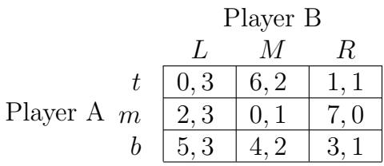  
شکل 6.28: ماتریس سود

(a) آیا هر بازیکنی دارای استراتژی غالب است؟ به طور مختصر (1-3 جمله) توضیح دهید.   
(b) تمام تعادل‌های نش استراتژی خالص برای این بازی را پیدا کنید.

5. بازی دو نفره زیر را در نظر بگیرید که هر بازیکن سه استراتژی دارد.

<table><tr><td rowspan=1 colspan=4>Player BL      M      R</td></tr><tr><td rowspan=3 colspan=1>UPlayer AMD</td><td rowspan=1 colspan=1>1,1</td><td rowspan=1 colspan=1>2,3</td><td rowspan=1 colspan=1>1,6</td></tr><tr><td rowspan=1 colspan=1>3,4</td><td rowspan=1 colspan=1>5,5</td><td rowspan=1 colspan=1>2,2</td></tr><tr><td rowspan=1 colspan=1>1,10</td><td rowspan=1 colspan=1>4,7</td><td rowspan=1 colspan=1>0,4</td></tr></table>

همه تعادل‌های نش استراتژی خالص برای این بازی را پیدا کنید.

6. در این سؤال، چندین بازی دو نفره را در نظر می‌گیریم. در هر ماتریس سود زیر، سطرها مربوط به استراتژی‌های بازیکن A و ستون‌ها مربوط به استراتژی‌های بازیکن B هستند. اولین ورودی در هر خانه سود بازیکن A و دومین ورودی سود بازیکن B است.

(a) تمام تعادل‌های نش استراتژی خالص (غیرتصادفی) برای بازی توصیف شده در ماتریس سود زیر را پیدا کنید.

<table><tr><td rowspan="3">U Player A D</td><td colspan="2">Player B L R</td></tr><tr><td>2,15</td><td>4,20</td></tr><tr><td>6,6</td><td>10,8</td></tr></table>

(b) تمام تعادل‌های نش استراتژی خالص (غیرتصادفی) برای بازی توصیف شده در ماتریس سود زیر را پیدا کنید.

<table><tr><td rowspan="3">U Player A D</td><td colspan="2">Player B L R</td></tr><tr><td>3,5</td><td>4,3</td></tr><tr><td>2,1</td><td>1,6</td></tr></table>

(c) تمام تعادل‌های نش برای بازی توصیف شده در ماتریس سود زیر را پیدا کنید.

<table><tr><td rowspan="3">U Player A D</td><td colspan="2">Player B L R</td></tr><tr><td>1,1</td><td>4,2</td></tr><tr><td>3,3</td><td>2,2</td></tr></table>

**واژه‌نامه:**
Fitness: برازندگی

[راهنما: این بازی دارای تعادل‌های استراتژی خالص و تعادل استراتژی مختلط است. برای یافتن تعادل استراتژی مختلط، احتمال استفاده بازیکن A از استراتژی U را $p$ و احتمال استفاده بازیکن B از استراتژی $\mathrm { L }$ را $q$ در نظر بگیرید. همان‌طور که در تحلیل بازی سکه‌های مطابق یاد گرفتیم، اگر بازیکنی از استراتژی مختلط استفاده کند (یعنی استراتژی خالصی که با احتمال یک اجرا شود) نباشد، آنگاه بازیکن بین دو استراتژی خالص بی‌تفاوت خواهد بود. به عبارت دیگر، این استراتژی‌ها باید بازدهی مورد انتظار برابر داشته باشند. بنابراین، برای مثال، اگر $p$ 0 یا 1 نباشد، باید $q + 4 ( 1 - q ) = 3 q + 2 ( 1 - q )$ باشد، زیرا این‌ها بازدهی‌های مورد انتظار بازیکن A از استراتژی‌های U و D هستند هنگامی که بازیکن B احتمال $q$ را استفاده می‌کند.]

7. در این سؤال، چند بازی دو بازیکنه را بررسی خواهیم کرد. در هر ماتریس پرداخت زیر، سطرها مربوط به استراتژی‌های بازیکن A و ستون‌ها مربوط به استراتژی‌های بازیکن B هستند. اولین ورودی در هر خانه، پرداخت بازیکن A و دومین ورودی، پرداخت بازیکن B است.

(a) همه تعادل‌های نش را برای بازی توصیف شده توسط ماتریس پرداخت زیر پیدا کنید.

<table><tr><td rowspan="3">U Player A D</td><td colspan="3">Player B L R</td></tr><tr><td>1,1</td><td>3,2</td><td></td></tr><tr><td>0,3</td><td>4,4</td><td>Player B</td></tr><tr><td rowspan="3">U Player A D</td><td colspan="4">L R</td></tr><tr><td>5,6</td><td></td><td>0,10</td></tr><tr><td>4,4</td><td></td><td>2,2</td></tr></table>

(b) همه تعادل‌های نش را برای بازی توصیف شده توسط ماتریس پرداخت زیر پیدا کنید (توضیحی برای پاسخ خود ارائه دهید).

[راهنما: این بازی دارای تعادل استراتژی مختلط است. برای یافتن تعادل، احتمال استفاده بازیکن A از استراتژی U را $p$ و احتمال استفاده بازیکن B از استراتژی L را $q$ در نظر بگیرید. همان‌طور که در تحلیل بازی سکه‌های مطابق یاد گرفتیم، اگر بازیکنی از استراتژی مختلط استفاده کند (یعنی استراتژی خالصی که با احتمال یک اجرا شود) نباشد، آنگاه بازیکن بین دو استراتژی خالص بی‌تفاوت خواهد بود. به عبارت دیگر، این استراتژی‌ها باید بازدهی مورد انتظار برابر داشته باشند. بنابراین، برای مثال، اگر $p$ $0$ یا 1 نباشد، باید $5 q + 0 ( 1 - q ) = 4 q + 2 ( 1 - q )$ باشد، زیرا این‌ها بازدهی‌های مورد انتظار بازیکن A از استراتژی‌های U و D هستند هنگامی که بازیکن B احتمال $q$ را استفاده می‌کند.]

8. بازی دو بازیکنه توصیف شده توسط ماتریس پرداخت زیر را در نظر بگیرید.

<table><tr><td rowspan="3">U Player A D</td><td colspan="2">Player B L R</td></tr><tr><td>1,1</td><td>0,0</td></tr><tr><td>0,0</td><td>4,4</td></tr></table>

(a) همه تعادل‌های نش استراتژی خالص برای این بازی را پیدا کنید.

(b) این بازی همچنین دارای یک تعادل نش استراتژی مختلط است؛ احتمال‌هایی را که بازیکنان در این تعادل استفاده می‌کنند، همراه با توضیحی برای پاسخ خود پیدا کنید.

(c) با توجه به ایده نقطه کانونی شلینگ از فصل 6، چه تعادلی را به عنوان بهترین پیش‌بینی از نحوه اجرای بازی در نظر می‌گیرید؟ توضیح دهید.

9. برای هر یک از بازی‌های دو بازیکنه زیر، همه تعادل‌های نش را پیدا کنید. در هر ماتریس پرداخت زیر، سطرها مربوط به استراتژی‌های بازیکن A و ستون‌ها مربوط به استراتژی‌های بازیکن B هستند. اولین ورودی در هر خانه، پرداخت بازیکن A و دومین ورودی، پرداخت بازیکن B است.

<table><tr><td rowspan="4">U Player A D</td><td>Player B L</td><td>R</td></tr><tr><td>8,4</td><td>5,5</td></tr><tr><td>3,3</td><td>4,8</td></tr><tr><td colspan="2">Player B L</td></tr><tr><td rowspan="2">U Player A D</td><td>0,0</td><td>R -1,1</td></tr><tr><td>-1,1</td><td>2,-2</td></tr></table>

10. در ماتریس پرداخت زیر، سطرها مربوط به استراتژی‌های بازیکن A و ستون‌ها مربوط به استراتژی‌های بازیکن B هستند. اولین ورودی در هر خانه، پرداخت بازیکن A و دومین ورودی، پرداخت بازیکن B است.

<table><tr><td rowspan="3">U Player A D</td><td colspan="2">Player B L R</td></tr><tr><td>3,3</td><td>1,2</td></tr><tr><td>2,1</td><td>3,0</td></tr></table>

(a) همه تعادل‌های نش استراتژی خالص این بازی را پیدا کنید.

(b) از ماتریس پرداخت بالا مشخص است که پرداخت بازیکن A از جفت استراتژی‌های $( U , L )$ برابر 3 است. آیا می‌توانید پرداخت بازیکن A را از این جفت استراتژی‌ها به عددی غیرمنفی تغییر دهید به گونه‌ای که بازی نتیجه‌ای دارای تعادل نش استراتژی خالص نباشد؟ توضیح مختصری (1-3 جمله) برای پاسخ خود ارائه دهید. (توجه: در پاسخ به این سؤال، تنها پرداخت بازیکن A برای این جفت استراتژی‌های $( U , L )$ را تغییر دهید. به طور خاص، ساختار باقی بازی را بدون تغییر بگذارید: بازیکنان، استراتژی‌ها، پرداخت از استراتژی‌های غیر از $( U , L )$ و پرداخت B از $( U , L )$.)

(c) حال به ماتریس پرداخت اصلی بخش (a) برگردیم و سؤال مشابهی را درباره بازیکن B مطرح کنیم. بنابراین، دوباره به ماتریس پرداختی برمی‌گردیم که در آن بازیکنان A و B هر دو از جفت استراتژی‌های $( U , L )$ پرداخت 3 دریافت می‌کنند. آیا می‌توانید پرداخت بازیکن B را از جفت استراتژی‌های $( U , L )$ به عددی غیرمنفی تغییر دهید به گونه‌ای که بازی نتیجه‌ای دارای $n o$ تعادل نش استراتژی خالص باشد؟ توضیح مختصری (1-3 جمله) برای پاسخ خود ارائه دهید. (دوباره، در پاسخ به این سؤال، تنها پرداخت بازیکن B برای این جفت استراتژی‌های $( U , L )$ را تغییر دهید. به طور خاص، ساختار باقی بازی را بدون تغییر بگذارید: بازیکنان، استراتژی‌ها، پرداخت از استراتژی‌های غیر از $( U , L )$ و پرداخت A از $( U , L )$.)

11. در متن، استراتژی‌های غالب را بحث کرده‌ایم و توجه کرده‌ایم که اگر بازیکنی دارای استراتژی غالب باشد، انتظار داریم که آن را استفاده کند. متضاد استراتژی غالب، استراتژی‌ای است که مغلوب باشد. تعریف مغلوب بودن:

استراتژی $s _ { i } ^ { * }$ مغلوب است اگر بازیکن $i$ استراتژی دیگری مانند $s _ { i } ^ { \prime }$ داشته باشد به‌گونه‌ای که پرداخت بازیکن $i$ از $s _ { i } ^ { \prime }$ بیشتر از $s _ { i } ^ { * }$ باشد، صرف‌نظر از اینکه بازیکنان دیگر در بازی چه استراتژی‌هایی انتخاب کنند.

ما انتظار نداریم بازیکنی از استراتژی مغلوب استفاده کند و این می‌تواند در یافتن تعادل‌های نش کمک کند. در اینجا مثالی از این ایده آورده شده است. در این بازی، M استراتژی مغلوب است (از سوی R مغلوب می‌شود) و بازیکن B آن را استفاده نخواهد کرد.

<table><tr><td rowspan="2">U Player A D</td><td>L</td><td>Player B M</td><td>R</td></tr><tr><td>2,4 1,2</td><td>2,1 3,3</td><td>3,2 2,4</td></tr></table>

بنابراین، در تحلیل بازی می‌توانیم M را حذف کرده و بازی باقی‌مانده را بررسی کنیم:

<table><tr><td rowspan="3">U Player A D</td><td colspan="2">Player B L R</td></tr><tr><td>2,4</td><td>3,2</td></tr><tr><td>1,2</td><td>2,4</td></tr></table>

اکنون بازیکن A دارای استراتژی غالب (U) است و به‌راحتی می‌توان دید که تعادل نش بازی 2×2 (U,L) است. می‌توانید بازی اصلی را بررسی کنید تا ببینید که (U,L) یک تعادل نش است. البته، استفاده از این روش نیاز دارد که بدانیم استراتژی مغلوب نمی‌تواند در تعادل نش استفاده شود.5

هر بازی دو بازیکنه‌ای را در نظر بگیرید که حداقل یک تعادل (استراتژی خالص) نش دارد. دلیل این را توضیح دهید که چرا استراتژی‌های استفاده شده در تعادل این بازی، استراتژی‌های مغلوب نخواهند بود.

12. در فصل 6، استراتژی‌های غالب را بحث کرده‌ایم و توجه کرده‌ایم که اگر بازیکنی دارای استراتژی غالب باشد، انتظار داریم که آن را استفاده کند. متضاد استراتژی غالب، استراتژی‌ای است که مغلوب باشد. چندین تعریف ممکن برای مغلوب بودن وجود دارد. در این مسئله، بر روی مغلوب بودن ضعیف تمرکز خواهیم کرد.

استراتژی $s _ { i } ^ { * }$ ضعیفاً مغلوب است اگر بازیکن $i$ استراتژی دیگری مانند $s _ { i } ^ { \prime }$ داشته باشد به‌گونه‌ای که:

(a) صرف‌نظر از اینکه بازیکن دیگر چه استراتژی‌ای انتخاب کند، پرداخت بازیکن $i$ از $s _ { i } ^ { \prime }$ حداقل به اندازه پرداخت از $s _ { i } ^ { * }$ باشد، و   
(b) حداقل یک استراتژی برای بازیکن دیگر وجود دارد به‌گونه‌ای که پرداخت بازیکن $i$ از $s _ { i } ^ { \prime }$ به‌طور قطع بیشتر از پرداخت از $s _ { i } ^ { * }$ باشد.

(a) غیرمحتمل به نظر می‌رسد که بازیکنی از استراتژی ضعیفاً مغلوب استفاده کند، اما این استراتژی‌ها می‌توانند در یک تعادل نش ظاهر شوند. همه تعادل‌های نش خالص (غیرتصادفی) را برای بازی زیر پیدا کنید. آیا در میان آن‌ها از استراتژی‌های ضعیفاً مغلوب استفاده شده است؟

<table><tr><td rowspan="3">U Player A D</td><td colspan="2">Player B L R</td></tr><tr><td>1,1</td><td>1,1</td></tr><tr><td>0,0</td><td>2,1</td></tr></table>

(b) یک روش برای استدلال درباره استراتژی‌های ضعیفاً مغلوب که در پاسخ به سؤال بالا یافتید، در نظر گرفتن بازی ترتیبی زیر است. فرض کنید بازیکنان واقعاً به‌صورت ترتیبی حرکت می‌کنند، اما بازیکنی که دوم حرکت می‌کند، نمی‌داند بازیکن اول چه انتخابی کرده است. بازیکن A اول حرکت می‌کند، و اگر U را انتخاب کند، انتخاب بازیکن B مهم نیست. به‌طور مؤثر، بازی پس از انتخاب A=U تمام می‌شود، چون صرف‌نظر از اینکه B چه کند، پرداخت $( 1 , 1 )$ خواهد بود. اگر بازیکن A D را انتخاب کند، حرکت بازیکن B مهم است، و پرداخت $( 0 , 0 )$ است اگر B L را انتخاب کند یا $( 2 , 1 )$ اگر B R را انتخاب کند. [توجه: از آنجایی که B حرکت A را مشاهده نمی‌کند، بازی همزمان با ماتریس پرداخت بالا معادل این بازی ترتیبی است.]

در این بازی، چگونه انتظار دارید بازیکنان رفتار کنند؟ دلیل خود را توضیح دهید. [بازیکنان مجاز به تغییر بازی نیستند. آن‌ها آن را یک بار به‌صورت داده شده اجرا می‌کنند. می‌توانید از ماتریس پرداخت یا داستان پشت بازی استدلال کنید، اما اگر از داستان استفاده کنید، به یاد داشته باشید که B تا پس از پایان بازی، حرکت A را مشاهده نمی‌کند.]

13. در اینجا بازی سه بازیکنه‌ای را در نظر می‌گیریم که بازیکنان 1، 2 و 3 نامیده می‌شوند. برای تعریف بازی، باید مجموعه استراتژی‌های در دسترس هر بازیکن را مشخص کنیم؛ همچنین، هنگامی که هر سه بازیکن استراتژی را انتخاب می‌کنند، این ترکیبی از استراتژی‌ها ایجاد می‌شود و باید پرداختی که هر بازیکن از هر ترکیب احتمالی استراتژی‌ها دریافت می‌کند را مشخص کنیم. فرض کنید مجموعه استراتژی‌های بازیکن 1 $\{ U , D \}$، مجموعه استراتژی‌های بازیکن 2 $\{ L , R \}$ و مجموعه استراتژی‌های بازیکن 3 $\{ l , r \}$ باشد.

یک روش برای مشخص کردن پرداخت‌ها، نوشتن همه ترکیب‌های ممکن استراتژی‌ها و پرداخت‌های مربوطه است. روش دیگر و معادل، تفسیر ترکیب‌های سه‌تایی استراتژی‌ها است که مشخص کردن پرداخت‌ها را آسان‌تر می‌کند: فرض کنید بازیکن 3 انتخاب می‌کند که بازیکنان 1 و 2 کدام یک از دو بازی دو بازیکنه متفاوت را اجرا کنند. اگر 3 $l$ را انتخاب کند، ماتریس پرداخت به‌شکل زیر است:

ماتریس پرداخت $l$:   

<table><tr><td rowspan="3">U Player A D</td><td colspan="2">Player B L R</td></tr><tr><td>4,4,4</td><td>0,0,1</td></tr><tr><td>0,2,1</td><td>2,1,0</td></tr></table>

که در آن اولین ورودی در هر سلول، پرداخت بازیکن 1، دومین ورودی پرداخت بازیکن 2 و سومین ورودی پرداخت بازیکن 3 است.

اگر 3 $r$ را انتخاب کند، ماتریس پرداخت به‌شکل زیر است:

ماتریس پرداخت $r$:   

<table><tr><td rowspan="3">U Player A D</td><td colspan="2">Player B L R</td></tr><tr><td>2,0,0</td><td>1, 1, 1</td></tr><tr><td>1, 1, 1</td><td>2,2,2</td></tr></table>

بنابراین، برای مثال، اگر بازیکن 1 $U$، بازیکن 2 $R$ و بازیکن 3 $r$ را انتخاب کنند، پرداخت‌ها برای هر بازیکن 1 خواهد بود.

(a) اول فرض کنید که بازیکنان همه همزمان حرکت می‌کنند. یعنی بازیکنان 1 و 2 تا پس از انتخاب استراتژی خود، متوجه نمی‌شوند که بازیکن 3 کدام بازی را انتخاب کرده است. همه تعادل‌های نش استراتژی خالص این بازی را پیدا کنید.

(b) حال فرض کنید که بازیکن 3 اول حرکت می‌کند و بازیکنان 1 و 2 حرکت بازیکن 3 را قبل از تصمیم‌گیری درباره نحوه بازی مشاهده می‌کنند. یعنی اگر بازیکن 3 استراتژی $r$ را انتخاب کند، بازیکنان 1 و 2 بازی تعریف شده توسط ماتریس پرداخت $r$ را اجرا می‌کنند و هر دو می‌دانند که این بازی را اجرا می‌کنند. به‌طور مشابه، اگر بازیکن 3 استراتژی $l$ را انتخاب کند، بازیکنان 1 و 2 بازی تعریف شده توسط ماتریس پرداخت $l$ را اجرا می‌کنند و هر دو می‌دانند که این بازی را اجرا می‌کنند.

**واژه‌نامه:**
Fitness: برازندگی

بیایید فرض کنیم که اگر بازیکنان 1 و 2 بازی تعریف شده توسط ماتریس پرداخت $r$ را اجرا کنند، آنها یک تعادل نش (استراتژی خالص) برای آن بازی را اجرا می‌کنند؛ و به طور مشابه، اگر بازیکنان 1 و 2 بازی تعریف شده توسط ماتریس پرداخت $l$ را اجرا کنند، آنها یک تعادل نش (استراتژی خالص) برای آن بازی را اجرا می‌کنند. در نهایت، فرض کنید که بازیکن 3 می‌داند که بازیکنان 1 و 2 چگونه رفتار خواهند کرد.

شما چه انتظاری از بازیکن 3 دارید و چرا؟ چه سه‌تایی از استراتژی‌ها را پیش‌بینی می‌کنید که اجرا شوند؟ آیا این لیست از استراتژی‌ها یک تعادل نش برای بازی همزمان بین سه بازیکن است؟

14. بازی دو نفره‌ای را در نظر بگیرید که بازیکنان، استراتژی‌ها و پرداخت‌های آن در ماتریس بازی زیر توصیف شده‌اند.

بازیکن 2 $L$ $R$   

<table><tr><td rowspan=2 colspan=1>UPlayer 1D</td><td rowspan=1 colspan=1>1,1</td><td rowspan=1 colspan=1>4,0</td></tr><tr><td rowspan=1 colspan=1>4,0</td><td rowspan=1 colspan=1>3,3</td></tr></table>

(الف) تمام تعادل‌های نش این بازی را پیدا کنید.

(ب) در تعادل استراتژی مخلوطی که در قسمت (الف) پیدا کردید، متوجه می‌شوید که بازیکن 1 استراتژی U را بیشتر از استراتژی D اجرا می‌کند. یکی از دوستانتان می‌گوید که پاسخ شما برای قسمت (الف) باید اشتباه باشد، زیرا واضح است که برای بازیکن 1 استراتژی D جذاب‌تر از استراتژی U است. هم U و هم D به بازیکن 1 پرداخت 4 را در عناصر غیرقطری ماتریس پرداخت می‌دهند، اما D به بازیکن 1 پرداخت 3 در قطر و U فقط پرداخت 1 در قطر می‌دهد. توضیح دهید چه اشتباهی در این استدلال وجود دارد.

15. دو شرکت یکسان — بیایید آنها را شرکت 1 و شرکت 2 بنامیم — باید به طور همزمان و مستقل تصمیم بگیرند که آیا وارد بازار جدیدی شوند و اگر وارد شوند، چه محصولی تولید کنند. هر شرکت، اگر وارد شود، می‌تواند محصول A یا محصول B را توسعه و تولید کند. اگر هر دو شرکت وارد شوند و محصول A را تولید کنند، هر کدام ده میلیون دلار ضرر می‌کنند. اگر هر دو شرکت وارد شوند و هر دو محصول B را تولید کنند، هر کدام پنج میلیون دلار سود کسب می‌کنند. اگر هر دو وارد شوند و یکی محصول A و دیگری محصول B تولید کند، هر کدام ده میلیون دلار سود کسب می‌کنند. هر شرکتی که وارد نشود، سود صفر دارد. در نهایت، اگر یک شرکت وارد نشود و شرکت دیگر محصول A تولید کند، سود پانزده میلیون دلار کسب می‌کند، در حالی که اگر شرکت وارد شده تنها محصول B تولید کند، سود سی میلیون دلار کسب می‌کند.

شما مدیر شرکت 1 هستید و باید استراتژی برای شرکت خود انتخاب کنید.

(الف) این وضعیت را به عنوان یک بازی با دو بازیکن، شرکت 1 و شرکت 2، و سه استراتژی برای هر شرکت تنظیم کنید: تولید A، تولید B یا ورود نکردن.

(ب) یکی از کارمندان شما استدلال می‌کند که شما باید وارد بازار شوید (هرچند مطمئن نیست که چه محصولی باید تولید کنید) زیرا بسته به اینکه شرکت 2 چه کاری انجام دهد، ورود و تولید محصول B بهتر از ورود نکردن است. این استدلال را ارزیابی کنید.

(ج) کارمند دیگری با کسی در قسمت (ب) موافق است و استدلال می‌کند که چون استراتژی A می‌تواند باعث ضرر شود (اگر شرکت دیگر نیز محصول A تولید کند) باید وارد شوید و محصول B تولید کنید. اگر هر دو شرکت به این شکل استدلال کنند و بنابراین وارد شوند و محصول B تولید کنند، آیا اجرای بازی آنها یک تعادل نش را تشکیل می‌دهد؟ توضیح دهید.

(د) تمام تعادل‌های نش استراتژی خالص این بازی را پیدا کنید.

(ه) کارمند دیگری از شرکت شما پیشنهاد می‌دهد که دو شرکت را ادغام کنید و به طور همکارانه در مورد استراتژی‌ها تصمیم بگیرید تا مجموع سودها را حداکثر کنید. بدون در نظر گرفتن اینکه آیا این ادغام توسط مسئولان مجاز خواهد بود، فکر می‌کنید این ایده خوبی است؟ توضیح دهید.