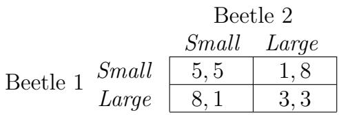
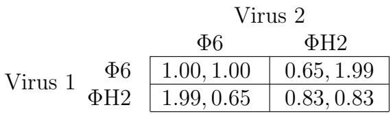
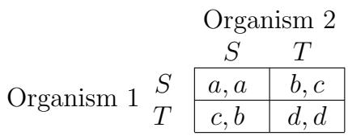
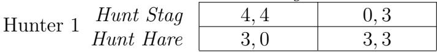
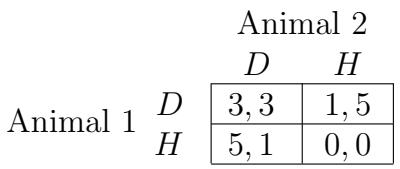

# فصل 7

# نظریه بازی‌های تکاملی

در فصل ۶، مفاهیم پایه‌ای نظریه بازی‌ها را توسعه دادیم، که در آن بازیکنان فردی تصمیمات می‌گیرند و پرداخت هر بازیکن به تصمیمات اتخاذ شده توسط همه بستگی دارد. همانطور که در آنجا دیدیم، یک سؤال کلیدی در نظریه بازی‌ها، استدلال درباره رفتاری است که باید انتظار آن را ببینیم هنگامی که بازیکنان در یک بازی خاص شرکت می‌کنند.

بحث در فصل ۶ بر اساس در نظر گرفتن نحوه‌ای بود که بازیکنان به طور همزمان درباره آنچه بازیکنان دیگر ممکن است انجام دهند استدلال می‌کردند. در این فصل، از طرف دیگر، ما به بررسی مفهوم نظریه بازی‌های تکاملی می‌پردازیم که نشان می‌دهد مفاهیم پایه‌ای نظریه بازی‌ها می‌توانند حتی در شرایطی که هیچ فردی به طور آشکار استدلال نمی‌کند یا حتی تصمیمات صریحی اتخاذ نمی‌کند، به کار گرفته شوند. در عوض، تحلیل نظریه بازی‌ها به محیط‌هایی اعمال خواهد شد که در آن افراد می‌توانند انواع مختلفی از رفتارها را نشان دهند (شامل آن‌هایی که ممکن است نتیجه انتخاب‌های آگاهانه نباشند)، و ما بررسی خواهیم کرد که کدام اشکال رفتاری توانایی پایدار ماندن در جمعیت را دارند و کدام اشکال رفتاری تمایل به دفع توسط دیگران دارند.

همان‌طور که نام آن نشان می‌دهد، این رویکرد بیشترین کاربرد را در حوزه زیست‌شناسی تکاملی داشته است، حوزه‌ای که ایده اولین بار توسط جان می‌نارد اسمیت و G. R. Price [375, 376] بیان شد. زیست‌شناسی تکاملی بر این ایده استوار است که ژن‌های یک موجود زنده به طور عمده ویژگی‌های قابل مشاهده آن را تعیین می‌کنند و بنابراین برازندگی آن در محیطی خاص. موجوداتی که برازندگی بیشتری دارند تمایل به تولید فرزند بیشتری دارند، که باعث می‌شود ژن‌هایی که برازندگی بیشتری فراهم می‌کنند، نمایندگی خود را در جمعیت افزایش دهند. به این ترتیب، ژن‌های برازنده‌تر به مرور زمان برنده می‌شوند، چون نرخ تولیدمثل بیشتری را فراهم می‌کنند.

نکته کلیدی نظریه بازی‌های تکاملی این است که بسیاری از رفتارها درگیری چندین موجود در یک جمعیت را در بر می‌گیرند و موفقیت هر یک از این موجودها به نحوه تعامل رفتار آن با رفتار دیگران بستگی دارد. بنابراین، برازندگی یک موجود زنده را نمی‌توان به صورت جداگانه اندازه‌گیری کرد؛ بلکه باید در چارچوب کل جمعیتی که در آن زندگی می‌کند ارزیابی شود. این امر دروازه‌ای را برای یک تشبیه طبیعی نظریه بازی‌ها باز می‌کند: ویژگی‌ها و رفتارهای تعیین‌شده ژنتیکی یک موجود زنده مانند استراتژی آن در یک بازی هستند، برازندگی آن مانند پرداخت آن است و این پرداخت به استراتژی‌ها (ویژگی‌ها) موجوداتی که با آن تعامل دارد بستگی دارد. اگر به این شکل بیان شود، پیش‌بینی کردن آن که این تشبیه سطحی است یا عمیق، دشوار است، اما در واقع ارتباطات بسیار عمیق هستند: ایده‌های نظریه بازی‌ها مانند تعادل خواهند ثابت شد که راهی مفید برای پیش‌بینی نتایج تکامل بر روی یک جمعیت هستند.

# 7.1 برازندگی به عنوان نتیجه تعامل

برای اینکه این مفاهیم ملموس‌تر شوند، در حال حاضر یک مثال ساده اولیه از نحوه کاربرد ایده‌های نظریه بازی‌ها در محیط‌های تکاملی را توصیف می‌کنیم. این مثال برای سهولت توضیح طراحی شده است تا اینکه وفاداری کامل به زیست‌شناسی پایه‌ای؛ اما پس از آن، مثال‌هایی را بررسی خواهیم کرد که در آن‌ها پدیده‌ای که در هسته این مثال قرار دارد، به طور تجربی در مجموعه‌ای از محیط‌های طبیعی مشاهده شده است.

برای مثال، به یک گونه خاص از سوسک فکر کنید و فرض کنید برازندگی هر سوسک در یک محیط خاص عمدتاً توسط میزانی که می‌تواند غذا پیدا کند و به‌طور مؤثر از مواد مغذی آن استفاده کند، تعیین می‌شود. حالا، فرض کنید یک جهش خاص در جمعیت وارد شود که باعث می‌شود سوسک‌های دارای این جهش اندازه بدن بسیار بزرگ‌تری را رشد دهند. بنابراین، در حال حاضر دو نوع متفاوت از سوسک‌ها در جمعیت وجود دارند — کوچک و بزرگ. در واقع برای سوسک‌های بزرگ دشوار است که نیازهای متابولیک اندازه بدن بزرگ‌تر خود را حفظ کنند — نیاز به جذب مواد مغذی بیشتری از غذایی که می‌خورند دارد — و بنابراین این امر تأثیر منفی بر برازندگی دارد.

اگر این داستان کامل باشد، به این نتیجه می‌رسیم که جهش اندازه بدن بزرگ باعث کاهش برازندگی می‌شود و بنابراین به احتمال زیاد در طول زمان و از طریق نسل‌های متعدد از جمعیت حذف خواهد شد. اما در واقع، داستان بیشتری وجود دارد، همان‌طور که در ادامه خواهیم دید.

تعامل بین موجودات. سوسک‌های این جمعیت برای غذا با یکدیگر رقابت می‌کنند – هنگامی که به منبع غذا می‌رسند، سوسک‌ها در هم می‌آیند چون هر کدام سعی می‌کنند بیشترین مقدار غذا را کسب کنند. و به‌طور غیر منتظره‌ای، سوسک‌هایی با اندازه بدن بزرگ‌تر در کسب سهم بالاتر از میانگین غذا مؤثرتر هستند.

برای سادگی، فرض کنید که رقابت برای غذا در این جمعیت شامل دو سوسک است که در هر لحظه با یکدیگر تعامل دارند. (این موضوع مفاهیم را برای توصیف آسان‌تر می‌کند، اما اصولی که توسعه می‌دهیم می‌توانند برای تعاملات بین بسیاری از افراد به طور همزمان نیز به کار روند.) هنگامی که دو سوسک برای غذا رقابت می‌کنند، نتایج زیر ممکن است رخ دهند.

• هنگامی که سوسک‌هایی با اندازه یکسان رقابت می‌کنند، سهم مساوی از غذا را دریافت می‌کنند. • هنگامی که یک سوسک بزرگ با یک سوسک کوچک رقابت می‌کند، سوسک بزرگ اکثریت غذا را دریافت می‌کند. • در همه موارد، سوسک‌های بزرگ از مقدار داده شده غذا برازندگی کمتری تجربه می‌کنند، چون بخشی از آن برای حفظ متابولیسم گران‌قیمت آن‌ها صرف می‌شود.

بنابراین، برازندگی که هر سوسک از یک تعامل مرتبط با غذا دریافت می‌کند، می‌تواند به عنوان یک پرداخت عددی در یک بازی دو بازیکنی بین یک سوسک اول و یک سوسک دوم در نظر گرفته شود، به شرح زیر. سوسک اول یکی از دو استراتژی کوچک یا بزرگ را بر اساس اندازه بدن خود انتخاب می‌کند و سوسک دوم نیز یکی از این دو استراتژی را انجام می‌دهد. بر اساس دو استراتژی استفاده شده، پرداخت‌ها به سوسک‌ها در شکل 7.1 توصیف شده‌اند.

  
شکل 7.1: بازی اندازه بدن

توجه کنید که پرداخت‌های عددی چگونه اصول اخیراً بیان شده را برآورده می‌کنند: هنگامی که دو سوسک کوچک با هم مواجه می‌شوند، برازندگی از منبع غذا را به طور مساوی به اشتراک می‌گذارند؛ سوسک‌های بزرگ به هزینه سوسک‌های کوچک عمل می‌کنند؛ اما سوسک‌های بزرگ نمی‌توانند کل مقدار برازندگی را از منبع غذا استخراج کنند. (در این ماتریس پرداخت، کاهش برازندگی هنگام مواجهه دو سوسک بزرگ به‌طور خاص مشخص است، چون یک سوسک بزرگ باید انرژی اضافی را برای رقابت با سوسک بزرگ دیگر هزینه کند.)

این ماتریس پرداخت راه خوبی برای خلاصه‌سازی آنچه هنگام مواجهه دو سوسک اتفاق می‌افتد است، اما در مقایسه با بازی فصل ۶، چیزی بنیادی متفاوت در آنچه اینجا توصیف شده است وجود دارد. سوسک‌های این بازی خودشان را نمی‌پرسند، «من می‌خواهم اندازه بدنم در این تعامل چه باشد؟» بلکه هر کدام به طور ژنتیکی سخت‌کار شده‌اند تا در طول عمر خود یکی از این دو استراتژی را اجرا کنند. با توجه به این تفاوت مهم، مفهوم انتخاب استراتژی — که مرکزیت را در فرموله‌سازی نظریه بازی‌ها داشت — از سمت بیولوژیکی این تشبیه حذف شده است. بنابراین، به جای مفهوم تعادل نش — که به طور بنیادی بر اساس مزیت نسبی تغییر استراتژی شخصی خود است — باید درباره تغییرات استراتژی که در مقیاس زمانی طولانی‌تر عمل می‌کنند و به صورت تغییراتی در جمعیت تحت نیروهای تکاملی رخ می‌دهند، فکر کنیم. ما در بخش بعدی تعاریف بنیادین این موضوع را توسعه می‌دهیم.

# 7.2 استراتژی‌های تکاملی پایدار

در فصل ۶، مفهوم تعادل نش در استدلال درباره نتیجه یک بازی مرکزی بود. در یک تعادل نش برای یک بازی دو بازیکنی، هیچ بازیکنی انگیزه‌ای برای انحراف از استراتژی فعلی خود ندارد — تعادل یک انتخاب استراتژی است که پس از استفاده بازیکنان تمایل به پایدار ماندن دارد. مفهوم مشابه برای محیط‌های تکاملی، استراتژی تکاملی پایدار خواهد بود — یک استراتژی تعیین‌شده ژنتیکی که پس از رایج شدن در جمعیت تمایل به پایدار ماندن دارد.

این را به شکل زیر فرموله می‌کنیم. فرض کنید در مثال ما، هر سوسک به طور مکرر در طول عمر خود با سوسک‌های دیگر در رقابت‌های غذایی جفت می‌شود. فرض خواهیم کرد که جمعیت به اندازه کافی بزرگ است که هیچ دو سوسک خاصی احتمال قابل توجهی برای تعامل مکرر با یکدیگر نداشته باشند. برازندگی کلی یک سوسک برابر با میانگین برازندگی است که از هر یک از تعاملات جفتی خود با دیگران تجربه می‌کند، و این برازندگی کلی موفقیت تولیدمثل آن را تعیین می‌کند — تعداد فرزندانی که ژن‌های آن (و بنابراین استراتژی آن) را به نسل بعد منتقل می‌کنند.

در این محیط، می‌گوییم یک استراتژی داده شده تکاملی پایدار است اگر، هنگامی که کل جمعیت از این استراتژی استفاده کند، هر گروه کوچکی از مهاجمان که از استراتژی متفاوتی استفاده می‌کنند در نهایت در طول نسل‌های متعدد از بین بروند. (می‌توانیم این مهاجمان را به عنوان مهاجرانی که برای پیوستن به جمعیت می‌آیند، یا به عنوان جهش‌یافته‌هایی که مستقیماً با رفتار جدید به دنیا می‌آیند، در نظر بگیریم.) ما این ایده را به صورت پرداخت‌های عددی بیان می‌کنیم که هنگامی که کل جمعیت از استراتژی $S$ استفاده می‌کند، یک گروه کوچک مهاجمان که از هر استراتژی جایگزین $T$ استفاده می‌کنند، برازندگی به طور قطعی کمتری نسبت به کاربران استراتژی اکثریت $S$ داشته باشند. از آنجا که برازندگی به موفقیت تولیدمثل تبدیل می‌شود، اصول تکاملی می‌گویند که برازندگی به طور قطعی کمتر شرطی است که باعث کاهش یک زیرجمعیت (مانند کاربران استراتژی $T$ ) در طول زمان، از طریق نسل‌های متعدد و در نهایت احتمال بالایی برای نابودی آن می‌شود.

به طور رسمی‌تر، تعاریف پایه‌ای را به شکل زیر بیان می‌کنیم.

• می‌گوییم برازندگی یک موجود در یک جمعیت، پرداخت مورد انتظاری است که از تعامل با یک عضو تصادفی جمعیت دریافت می‌کند.   
• می‌گوییم یک استراتژی $T$ با سطح $x$ (برای یک عدد مثبت کوچک $x$ ) به استراتژی $S$ نفوذ می‌کند اگر بخشی از جمعیت پایه $x$ از $T$ استفاده کند و بخشی دیگر $1 - x$ از جمعیت پایه از $S$ استفاده کند.   
• در نهایت، می‌گوییم یک استراتژی $S$ تکاملی پایدار است اگر عدد مثبت کوچکی مانند $y$ وجود داشته باشد به طوری که هنگامی که هر استراتژی دیگر $T$ با هر سطح $x < y$ به $S$ نفوذ کند، برازندگی یک موجود که $S$ را اجرا می‌کند به طور قطعی بیشتر از برازندگی یک موجود که $T$ را اجرا می‌کند باشد.

استراتژی‌های تکاملی پایدار در مثال اول. ببینیم چه اتفاقی می‌افتد وقتی این تعریف را برای مثال ما در مورد سوسک‌های رقیب برای غذا اعمال می‌کنیم. ابتدا بررسی می‌کنیم که آیا استراتژی کوچک تکاملی پایدار است، سپس همین کار را برای استراتژی بزرگ انجام می‌دهیم.

بر اساس تعریف، فرض کنید برای یک عدد مثبت کوچک $x$ ، بخشی از جمعیت $1 - x$ از کوچک استفاده می‌کند و بخشی $x$ از جمعیت از بزرگ استفاده می‌کند. (این دقیقاً شکلی است که پس از ورود یک جمعیت مهاجم کوچک از سوسک‌های بزرگ ظاهر می‌شود.)

• پرداخت مورد انتظار برای یک سوسک کوچک در یک تعامل تصادفی در این جمعیت چیست؟ با احتمال $1 - x$ ، با یک سوسک کوچک دیگر مواجه می‌شود و پرداخت 5 را دریافت می‌کند، در حالی که با احتمال $x$ ، با یک سوسک بزرگ مواجه می‌شود و پرداخت 1 را دریافت می‌کند. بنابراین پرداخت مورد انتظار آن است

$$
5 ( 1 - x ) + 1 \cdot x = 5 - 4 x .
$$

• پرداخت مورد انتظار برای یک سوسک بزرگ در یک تعامل تصادفی در این جمعیت چیست؟ با احتمال $1 - x$ ، با یک سوسک کوچک مواجه می‌شود و پرداخت 8 را دریافت می‌کند، در حالی که با احتمال $x$ ، با یک سوسک بزرگ دیگر مواجه می‌شود و پرداخت 3 را دریافت می‌کند. بنابراین پرداخت مورد انتظار آن است

$$
8 ( 1 - x ) + 3 \cdot x = 8 - 5 x .
$$

بررسی آسان است که برای مقادیر کافی کوچک $x$ (و حتی برای مقادیر نسبتاً بزرگ در این مورد)، برازندگی مورد انتظار سوسک‌های بزرگ در این جمعیت از برازندگی مورد انتظار سوسک‌های کوچک بیشتر است. بنابراین کوچک تکاملی پایدار نیست.

**واژه‌نامه:**
برازندگی: برازندگی

حالا بیایید بررسی کنیم که آیا بزرگ پایدار تکاملی است. برای این کار، فرض می‌کنیم که برای یک عدد مثبت بسیار کوچک $x$، $1 - x$ کسر از جمعیت از بزرگ استفاده می‌کند و $x$ کسر از جمعیت از کوچک استفاده می‌کند.

• پرداخت مورد انتظار برای یک کفتو بزرگ در یک برخورد تصادفی در این جمعیت چیست؟ با احتمال $1 - x$، با یک کفتو بزرگ دیگر مواجه می‌شود و پرداخت ۳ را دریافت می‌کند، در حالی که با احتمال $x$، با یک کفتو کوچک مواجه می‌شود و پرداخت ۸ را دریافت می‌کند. بنابراین پرداخت مورد انتظار آن $$
3 ( 1 - x ) + 8 \cdot x = 3 + 5 x .
$$ است.

• پرداخت مورد انتظار برای یک کفتو کوچک در یک برخورد تصادفی در این جمعیت چیست؟ با احتمال $1 - x$، با یک کفتو بزرگ مواجه می‌شود و پرداخت ۱ را دریافت می‌کند، در حالی که با احتمال $x$، با یک کفتو کوچک دیگر مواجه می‌شود و پرداخت ۵ را دریافت می‌کند. بنابراین پرداخت مورد انتظار آن $$
( 1 - x ) + 5 \cdot x = 1 + 4 x .
$$ است.

در این حالت، برازندگی مورد انتظار کفتوهای بزرگ در این جمعیت از برازندگی مورد انتظار کفتوهای کوچک بیشتر است و بنابراین بزرگ پایدار تکاملی است.

تفسیر استراتژی پایدار تکاملی در مثال ما. به طور شهودی، این تحلیل را می‌توان به این صورت خلاصه کرد که اگر تعداد کمی کفتوی بزرگ به جمعیتی از کفتوهای کوچک وارد شوند، کفتوهای بزرگ عملکرد بسیار خوبی خواهند داشت — چرا که به ندرت با یکدیگر مواجه می‌شوند، بنابراین در تقریباً هر رقابتی که تجربه می‌کنند، بیشترین غذا را دریافت می‌کنند. در نتیجه، جمعیت کفتوهای کوچک نمی‌تواند کفتوهای بزرگ را از بین ببرد، و بنابراین کوچک پایدار تکاملی نیست.

از سوی دیگر، در جمعیتی از کفتوهای بزرگ، تعداد کمی کفتوی کوچک عملکرد بسیار ضعیفی خواهند داشت و در تقریباً همه رقابت‌ها برای غذا شکست می‌خورند. در نتیجه، جمعیت کفتوهای بزرگ در برابر تهاجم کفتوهای کوچک مقاومت می‌کند و بنابراین بزرگ پایدار تکاملی است.

بنابراین، اگر بدانیم که جهش به سایز بزرگ بدن ممکن است، باید انتظار داشته باشیم که در طبیعت جمعیت‌هایی از کفتوهای بزرگ به جای جمعیت‌های کوچک مشاهده شوند. به این ترتیب، مفهوم پایداری تکاملی ما یک استراتژی را برای جمعیت پیش‌بینی کرده است — همان‌طور که در فصل ۶ برای بازی‌های بین بازیکنان عقلانی پیش‌بینی کردیم، اما با روش‌های متفاوت.

اما چیزی که در این پیش‌بینی خاص قابل توجه است، این حقیقت است که برازندگی هر موجود در جمعیتی از کفتوهای کوچک ۵ است، که بیشتر از برازندگی هر موجود در جمعیتی از کفتوهای بزرگ است. در واقع، بازی بین کفتوهای کوچک و بزرگ دقیقاً ساختار بازی دیلمای زندانی دارد؛ سناریوی محرک مبتنی بر رقابت برای غذا روشن می‌کند که کفتوها در یک رقابت تسلیحاتی مشابه بازی فصل ۶ قرار دارند که در آن دو ورزشکار رقابتی باید تصمیم بگیرند که آیا از داروهای بهبود عملکرد استفاده کنند یا نه. در آن بازی، استراتژی غالب استفاده از داروها بود، حتی اگر هر دو ورزشکار بدانند که در یک نتیجه که هیچ‌کدام از داروها استفاده نمی‌کنند، بهتر از آن هستند — این فقط به این دلیل است که این نتیجه مشترک بهتر قابل دوام نیست. در مورد فعلی، کفتوها به طور فردی هیچ چیزی را نمی‌فهمند و حتی اگر بخواهند نمی‌توانند اندازه بدن خود را تغییر دهند. با این حال، نیروهای تکاملی در طول چندین نسل، اثر کاملاً مشابهی را ایجاد می‌کنند، چرا که کفتوهای بزرگ با هزینه کفتوهای کوچک سود می‌برند. در ادامه این فصل، خواهیم دید که این شباهت در نتایج دو سبک تحلیل متفاوت، در واقع بخشی از یک اصل گسترده‌تر است.

روش دیگری برای خلاصه کردن ویژگی قابل توجه مثال ما این است: با شروع از جمعیتی از کفتوهای کوچک، تکامل از طریق انتخاب طبیعی باعث کاهش برازندگی موجودات در طول زمان می‌شود. این ابتدا ممکن است نگران‌کننده به نظر برسد، زیرا ما فکر می‌کنیم که انتخاب طبیعی باعث افزایش برازندگی می‌شود. اما در واقع، سازگاری این اتفاق با این اصل کلی انتخاب طبیعی سخت نیست. انتخاب طبیعی برازندگی افراد را در یک محیط ثابت افزایش می‌دهد — اگر محیط تغییر کند و دشمن‌تر شود، واضح است که این می‌تواند باعث کاهش برازندگی آن‌ها شود. این دقیقاً چیزی است که با جمعیت کفتوها اتفاق می‌افتد. محیط هر کفتو شامل تمام کفتوهای دیگر است، چرا که این کفتوهای دیگر موفقیت آن را در رقابت‌های غذایی تعیین می‌کنند؛ بنابراین، افزایش نسبت کفتوهای بزرگ را می‌توان به نوعی به عنوان تغییری به محیطی دشمن‌تر برای همه در نظر گرفت.

شواهد تجربی برای رقابت‌های تکاملی. زیست‌شناسان شواهد جدیدی را برای وجود بازی‌های تکاملی در طبیعت با ساختار دیلمای زندانی که تازه دیدیم ارائه کرده‌اند. تعیین دقیق پرداخت‌ها در هر محیط واقعی بسیار دشوار است و بنابراین تمام این مطالعات موضوع بررسی و بحث مداوم هستند. برای اهداف ما در این بحث، این مطالعات بهتر است به عنوان مثال‌های ساده‌سازی‌شده‌ی هدفمند بیان شوند که نشان می‌دهند چگونه استدلال بازی‌های تئوری می‌تواند به ارائه درک کیفی از انواع تعاملات بیولوژیکی کمک کند.

استدلال شده است که ارتفاع درختان می‌تواند پرداخت‌های دیلمای زندانی را دنبال کند [156, 226]. اگر دو درخت همسایه هر دو کوتاه رشد کنند، آن‌ها نور خورشید را به طور مساوی تقسیم می‌کنند. اگر هر دو بلند رشد کنند، نیز نور خورشید را به طور مساوی تقسیم می‌کنند، اما در این حالت پرداخت‌های آن‌ها هر دو پایین‌تر است، چرا که باید منابع زیادی را برای دستیابی به ارتفاع اضافی سرمایه‌گذاری کنند. مشکل این است که اگر یک درخت کوتاه باشد و همسایه‌اش بلند، درخت بلند بیشترین نور خورشید را دریافت می‌کند. بنابراین، به راحتی می‌توانیم به پرداخت‌هایی مشابه بازی اندازه بدن در کفتوها برسیم، جایی که استراتژی‌های تکاملی درختان کوتاه و بلند به عنوان معادل‌هایی برای استراتژی‌های کوچک و بزرگ کفتوها عمل می‌کنند. البته، وضعیت واقعی پیچیده‌تر از این است، زیرا تنوع ژنتیکی در درختان می‌تواند به طیف گسترده‌ای از ارتفاع‌ها و در نتیجه طیفی از استراتژی‌های مختلف (به جای فقط دو استراتژی کوتاه و بلند) منجر شود. در این پیوستگی، پرداخت‌های دیلمای زندانی تنها برای محدوده خاصی از ارتفاع درختان قابل اعمال است: حدی وجود دارد که فراتر از آن، جهش‌های افزایشی ارتفاع دیگر ساختار پرداخت یکسانی را ارائه نمی‌دهند، چرا که نور خورشید اضافی با کاهش برازندگی ناشی از حفظ ارتفاع بسیار زیاد جبران می‌شود.

انواع مشابهی از رقابت در سیستم‌های ریشه گیاهان [181] اتفاق می‌افتد. فرض کنید دو گیاه سویا را در دو انتهای یک گلدان بزرخ خاک رشد دهید؛ سپس سیستم‌های ریشه‌ای هر کدام خاک موجود را پر می‌کنند و با هم تداخل پیدا می‌کنند در حالی که تلاش می‌کنند تا بیشترین منابع را به دست آورند. در این صورت، منابع موجود در خاک را به طور مساوی تقسیم می‌کنند. حالا، فرض کنید به جای آن، مقدار یکسانی از خاک را با دیواری در میانه تقسیم کنید، به طوری که دو گیاه در دو طرف دیوار قرار بگیرند. سپس هر کدام همچنان نصف منابع موجود در خاک را دریافت می‌کنند، اما هر کدام انرژی کمتری را در تولید ریشه سرمایه‌گذاری می‌کنند و در نتیجه موفقیت تولیدی بیشتری از طریق تولید دانه دارند.

این مشاهده پیامدهایی برای بازی تکاملی ساده‌شده‌ای که شامل سیستم‌های ریشه است دارد. تصور کنید به جای دیوار، دو نوع استراتژی توسعه ریشه برای گیاهان سویا وجود داشت: Conserve (حفظ)، جایی که ریشه‌های گیاه فقط به سهم خود از خاک رشد می‌کنند، و Explore (کاوش)، جایی که ریشه‌ها در همه جایی که می‌توانند رشد می‌کنند. سپس دوباره سناریو و پرداخت‌های بازی اندازه بدن را خواهیم داشت، با همان نتیجه: تمام گیاهان در جمعیتی که همه Conserve انجام می‌دهند بهتر هستند، اما تنها Explore پایدار تکاملی است.

به عنوان سومین مثال، اخیراً هیجان‌انگیز بود که کشف شد جمعیت‌های ویروسی نیز می‌توانند نسخه‌ای تکاملی از دیلمای زندانی را بازی کنند [326, 392]. ترنر و چائو یک ویروس به نام فیج $\Phi 6$ را مطالعه کردند که باکتری‌ها را آلوده می‌کند و محصولات مورد نیاز برای تکثیر خود را تولید می‌کند. یک واریانت جهش‌یافته از این ویروس به نام فیج $\Phi$ H2 نیز قادر به تکثیر در میزبان‌های باکتریایی است، اگرچه به طور خودی خود کمتر مؤثر است. با این حال، $\Phi \mathrm { H 2 }$ قادر است از محصولات شیمیایی تولید شده توسط $\Phi 6$ استفاده کند، که به $\Phi$ H2 مزیت برازندگی می‌دهد وقتی در حضور $\Phi 6$ باشد. این امر ساختار دیلمای زندانی را به دست می‌دهد: ویروس‌ها دو استراتژی تکاملی $\Phi 6$ و $\Phi$ H2 دارند؛ ویروس‌ها در جمعیت خالص $\Phi 6$ همه بهتر از ویروس‌ها در جمعیت خالص $\Phi$ H2 عمل می‌کنند؛ و بدون توجه به اینکه ویروس‌های دیگر چه کار می‌کنند، شما (به عنوان یک ویروس) با بازی کردن $\Phi$ H2 بهتر عمل می‌کنید. بنابراین تنها $\Phi \mathrm { H 2 }$ پایدار تکاملی است.

سیستم ویروسی مورد مطالعه آنقدر ساده بود که ترنر و چائو توانستند ماتریس پرداخت واقعی را بر اساس اندازه‌گیری نرخ‌های نسبی تکثیر دو واریانت ویروسی در شرایط مختلف استنباط کنند. با استفاده از یک روش تخمین مشتق شده از این اندازه‌گیری‌ها، آن‌ها پرداخت‌های موجود در شکل ۷.۲ را به دست آوردند. پرداخت‌ها بازاسکیل شده‌اند به طوری که جعبه سمت چپ بالا مقدار ۱٫۰۰، ۱٫۰۰ را دارد.۱

  
شکل ۷.۲: بازی ویروسی

در حالی که مثال‌های قبلی ما داستان پایه‌ای بسیار مشابه استفاده از داروهای بهبود عملکرد داشتند، این بازی بین فیج‌ها در واقع به داستان دیگری یادآوری می‌شود که ساختار پرداخت دیلمای زندانی را نیز توجیه می‌کند: سناریوی پشت بازی امتحان یا ارائه که با آن فصل ۶ را آغاز کردیم. آنجا، دو دانشجو اگر به طور مشترک برای ارائه آماده می‌شدند بهتر بودند، اما پرداخت‌ها باعث می‌شدند هر کدام به طور ایگویستی برای امتحان مطالعه کنند. آنچه بازی ویروسی اینجا نشان می‌دهد این است که اجتناب از مسئولیت مشترک تنها کار تصمیم‌گیرندگان عقلانی نیست؛ نیروهای تکاملی می‌توانند ویروس‌ها را به اجرای این استراتژی ترغیب کنند.

# ۷.۳ توصیف کلی از استراتژی‌های پایدار تکاملی

ارتباطات بین بازی‌های تکاملی و بازی‌هایی که توسط شرکت‌کنندگان عقلانی اجرا می‌شوند به اندازه‌ای پیشنهادگر است که درک چگونگی کارکرد این رابطه به طور کلی معنا دارد. ما در اینجا، مانند تاکنون، بر روی بازی‌های دو بازیکن و دو استراتژی تمرکز خواهیم کرد. همچنین توجه خود را به بازی‌های متقارن محدود خواهیم کرد، مانند بخش‌های قبلی این فصل، جایی که نقش‌های دو بازیکن قابل تعویض است.

ماتریس پرداخت برای یک بازی دو بازیکن و دو استراتژی کاملاً کلی که متقارن است، مانند شکل ۷.۳ قابل نوشتن است.

  
شکل ۷.۳: بازی متقارن کلی

بیایید بررسی کنیم که چگونه شرطی که $S$ پایدار تکاملی است را بر حسب چهار متغیر $a$ ، $b$ ، $c$ و $d$ بنویسیم. مانند قبل، با فرض این شروع می‌کنیم که برای یک عدد مثبت بسیار کوچک $x$، $1 - x$ کسر از جمعیت از $S$ استفاده می‌کند و $x$ کسر از جمعیت از $T$ استفاده می‌کند.

• پرداخت مورد انتظار برای یک موجود که $S$ را اجرا می‌کند در یک برخورد تصادفی در این جمعیت چیست؟ با احتمال $1 - x$، با یک بازیکن دیگر از $S$ مواجه می‌شود و پرداخت $a$ را دریافت می‌کند، در حالی که با احتمال $x$، با یک بازیکن از $T$ مواجه می‌شود و پرداخت $b$ را دریافت می‌کند. بنابراین پرداخت مورد انتظار آن $$
a ( 1 - x ) + b x .
$$ است.

• پرداخت مورد انتظار برای یک موجود که $T$ را اجرا می‌کند در یک برخورد تصادفی در این جمعیت چیست؟ با احتمال $1 - x$، با یک بازیکن از $S$ مواجه می‌شود و پرداخت $c$ را دریافت می‌کند، در حالی که با احتمال $x$، با یک بازیکن دیگر از $T$ مواجه می‌شود و پرداخت $d$ را دریافت می‌کند. بنابراین پرداخت مورد انتظار آن $$
c ( 1 - x ) + d x .
$$ است.

واژه‌نامه:
Fitness: برازندگی

ترجمه:
بنابراین، $S$ پایدار تکاملی است اگر برای تمام مقادیر به‌اندازه کافی کوچک $x ~ > ~ 0$، نابرابری $$
a ( 1 - x ) + b x > c ( 1 - x ) + d x
$$ برقرار باشد. هنگامی که $x$ به $0$ میل می‌کند، سمت چپ برابری $a$ و سمت راست $c$ می‌شود. بنابراین، اگر $a > c$ باشد، سمت چپ پس از کوچک شدن به اندازه کافی $x$ بزرگ‌تر خواهد بود، در حالی که اگر $a < c$ باشد، سمت چپ پس از کوچک شدن به اندازه کافی $x$ کوچک‌تر خواهد بود. در نهایت، اگر $a = c$ باشد، سمت چپ دقیقاً هنگامی بزرگ‌تر است که $b > d$ باشد. بنابراین، راه ساده‌ای برای بیان شرط پایداری تکاملی $S$ وجود دارد:

در بازی دو بازیکنه، دو استراتژیه، متقارن، $S$ دقیقاً پایدار تکاملی است اگر یا (i) $a > c$ باشد، یا (ii) $a = c$ و $b > d$ باشد.

دیدن اینکه چگونه محاسبات ما به این شرط منجر می‌شود، آسان است، به شرح زیر:

• اول، برای اینکه $S$ پایدار تکاملی باشد، پرداخت به کاربردن استراتژی $S$ در برابر $S$ باید حداقل به اندازه پرداخت به کاربردن استراتژی $T$ در برابر $S$ باشد. در غیر این صورت، مهاجمی که از استراتژی $T$ استفاده می‌کند، برازندگی بالاتری نسبت به بقیه جمعیت خواهد داشت و سهم جمعیت مهاجمان احتمال خوبی برای رشد در طول زمان خواهد داشت.

• دوم، اگر $S$ و $T$ به‌طور برابر پاسخ خوبی به $S$ باشند، برای اینکه $S$ پایدار تکاملی باشد، بازیکنانی که از $S$ استفاده می‌کنند باید در تعاملاتشان با $T$ بهتر از بازیکنان $T$ در تعاملاتشان با یکدیگر عمل کنند. در غیر این صورت، بازیکنان $T$ به‌طور برابر با بخش $S$ جمعیت عمل خواهند کرد و حداقل به‌طور برابر با بخش $T$ جمعیت عمل خواهند کرد، بنابراین برازندگی کلی آنها حداقل به‌اندازه برازندگی بازیکنان $S$ خواهد بود.

# 7.4 رابطه بین تعادل‌های تکاملی و نش

با استفاده از روش کلی ما برای مشخص کردن استراتژی‌های پایدار تکاملی، می‌توانیم حالا بفهمیم چگونه با تعادل‌های نش مرتبط هستند. اگر به بازی متقارن کلی بخش قبلی برگردیم، می‌توانیم شرطی برای $( S , S )$ (یعنی انتخاب $S$ توسط هر دو بازیکن) به عنوان یک تعادل نش بنویسیم. $( S , S )$ یک تعادل نش است اگر $S$ بهترین پاسخ به انتخاب $S$ توسط بازیکن دیگر باشد: این به شرط ساده زیر منجر می‌شود

$$
a \geq c .
$$

اگر این را با شرط پایداری تکاملی $S$ مقایسه کنیم، بلافاصله نتیجه می‌گیریم که

اگر استراتژی $S$ پایدار تکاملی باشد، آنگاه $( S , S )$ یک تعادل نش است.

همچنین می‌توانیم ببینیم که جهت دیگر برقرار نیست: ممکن است بازی‌ای وجود داشته باشد که $( S , S )$ یک تعادل نش است، اما $S$ پایدار تکاملی نیست. تفاوت در دو شرط فوق به ما می‌گوید که چگونه چنین بازی‌ای را بسازیم: باید $a = c$ و $b < d$ باشد.

برای درک اینکه چنین بازی‌ای از کجا می‌آید، به بازی شکار بره‌آهنگ (Stag Hunt) از فصل 6 یادآوری می‌کنیم. در این بازی، هر بازیکن می‌تواند بره‌آهنگ یا خرگوش شکار کند؛ شکار خرگوش با موفقیت نیازمند تنها تلاش خودتان است، در حالی که شکار بره‌آهنگ ارزشمندتر نیازمند انجام آن توسط هر دو بازیکن است. این منجر به پرداخت‌هایی مانند شکل 7.4 می‌شود.

در این بازی، به‌طوری که نوشته شده، شکار بره‌آهنگ و شکار خرگوش هر دو پایدار تکاملی هستند، زیرا می‌توانیم شرایط مربوط به $a$ ، $b$ ، $c$ ، و $d$ را بررسی کنیم. (برای بررسی شرط شکار خرگوش، کافی است سطرها و ستون‌های ماتریس پرداخت را تعویض کنیم تا شکار خرگوش در سطر و ستون اول قرار گیرد.)

با این حال، فرض کنید که یک تغییر در بازی شکار بره‌آهنگ ایجاد می‌کنیم، به‌گونه‌ای که پرداخت‌ها به شرح زیر تغییر کنند. در این نسخه جدید، هنگامی که بازیکنان به‌درستی هماهنگ نمی‌شوند و یکی بره‌آهنگ و دیگری خرگوش شکار می‌کند، شکارچی خرگوش مزیت اضافی به دلیل عدم رقابت برای خرگوش دریافت می‌کند. به این ترتیب، ماتریس پرداختی مانند شکل 7.5 به دست می‌آید.

Hunter 2 Hunt Stag Hunt Hare   
Figure 7.4: Stag Hunt   
Hunter 2 Hunt Stag Hunt Hare   
Figure 7.5: Stag Hunt: A version with added benefit from hunting hare alone   

<table><tr><td rowspan=2 colspan=1>Hunt StagHunter 1Hunt Hare</td><td rowspan=1 colspan=1>4,4</td><td rowspan=1 colspan=1>0,4</td></tr><tr><td rowspan=1 colspan=1>4,0</td><td rowspan=1 colspan=1>3,3</td></tr></table>

در این حالت، انتخاب استراتژی‌ها (شکار بره‌آهنگ، شکار بره‌آهنگ) همچنان یک تعادل نش است: اگر هر بازیکن انتظار داشته باشد که بازیکن دیگر بره‌آهنگ شکار کند، آنگاه شکار بره‌آهنگ بهترین پاسخ است. اما شکار بره‌آهنگ برای این نسخه از بازی یک استراتژی پایدار تکاملی نیست، زیرا (در نمادگذاری بازی متقارن کلی ما) $a = c$ و $b < d$ داریم. به‌صورت غیررسمی، مشکل این است که یک شکارچی خرگوش و یک شکارچی بره‌آهنگ هنگامی که هر کدام با یک شکارچی بره‌آهنگ جفت می‌شوند، به‌طور برابر عمل می‌کنند؛ اما شکارچیان خرگوش هنگامی که هر کدام با یک شکارچی خرگوش جفت می‌شوند، بهتر از شکارچیان بره‌آهنگ عمل می‌کنند.

همچنین رابطه‌ای بین استراتژی‌های پایدار تکاملی و مفهوم تعادل نش سخت‌گیرانه وجود دارد. ما می‌گوییم که انتخاب استراتژی‌ها یک تعادل نش سخت‌گیرانه است اگر هر بازیکن از بهترین پاسخ منحصربه‌فرد به آنچه بازیکن دیگر انجام می‌دهد استفاده کند. می‌توانیم بررسی کنیم که برای بازی‌های متقارن دو بازیکنه و دو استراتژی، شرط اینکه $( S , S )$ یک تعادل نش سخت‌گیرانه باشد، $a > c$ است. بنابراین می‌بینیم که در واقع این مفاهیم مختلف تعادل به‌طور طبیعی یکدیگر را اصلاح می‌کنند. مفهوم استراتژی پایدار تکاملی می‌تواند به‌عنوان یک اصلاح مفهوم تعادل نش در نظر گرفته شود: مجموعه استراتژی‌های پایدار تکاملی $S$ زیرمجموعه‌ای از مجموعه استراتژی‌های $S$ است که $( S , S )$ یک تعادل نش است. به‌طور مشابه، مفهوم تعادل نش سخت‌گیرانه (هنگامی که بازیکنان از یک استراتژی استفاده می‌کنند) یک اصلاح از پایداری تکاملی است: اگر $( S , S )$ یک تعادل نش سخت‌گیرانه باشد، آنگاه $S$ پایدار تکاملی است.

جالب است که، علیرغم شباهت‌های بسیار نزدیک بین نتایج پایداری تکاملی و تعادل نش، آن‌ها بر پایه‌ی داستان‌های بنیادی کاملاً متفاوتی ساخته شده‌اند. در یک تعادل نش، بازیکنانی را در نظر می‌گیریم که به‌طور متقابل بهترین پاسخ‌ها را به استراتژی‌های یکدیگر انتخاب می‌کنند. این مفهوم تعادل نیازهای بزرگی بر توانایی بازیکنان برای انتخاب بهینه و هماهنگی بر روی استراتژی‌هایی که بهترین پاسخ‌های متقابل هستند، می‌گذارد. از سوی دیگر، پایداری تکاملی فرض می‌کند که بازیکنان هوش یا هماهنگی ندارند. به‌جای آن، استراتژی‌ها به‌عنوان سخت‌کار شده در بازیکنان در نظر گرفته می‌شوند، شاید به‌دلیل اینکه رفتار آن‌ها در ژن‌هایشان کدگذاری شده است. بر اساس این مفهوم، استراتژی‌هایی که در تولید فرزند موفق‌تر هستند انتخاب می‌شوند.

اگرچه این رویکرد تکاملی برای تحلیل بازی‌ها در زیست‌شناسی شروع شده است، اما می‌تواند در بسیاری از زمینه‌های دیگر به کار رود. به‌عنوان مثال، فرض کنید گروه بزرگی از افراد به‌طور مکرر در طول زمان برای بازی بازی متقارن کلی از شکل 7.3 هم‌گروه می‌شوند. در این حالت، پرداخت‌ها باید به‌عنوان منعکس‌کننده رفاه بازیکنان و نه تعداد فرزندانشان تفسیر شوند. اگر هر بازیکن بتواند به نحوه بازی دیگران نگاه کند و پرداخت‌های آن‌ها را مشاهده کند، آنگاه تقلید از استراتژی‌هایی که موفق‌تر بوده‌اند ممکن است یک دینامیک تکاملی را القا کند. به‌طور جایگزین، اگر یک بازیکن بتواند موفقیت‌ها و شکست‌های گذشته خود را مشاهده کند، یادگیری او ممکن است یک دینامیک تکاملی را القا کند. در هر دو حالت، استراتژی‌هایی که در گذشته نسبتاً خوب عمل کرده‌اند تمایل دارند که در آینده توسط تعداد بیشتری از افراد استفاده شوند. این می‌تواند به رفتاری منجر شود که پایه‌ی مفهوم استراتژی‌های پایدار تکاملی است، و بنابراین می‌تواند اجرای چنین استراتژی‌هایی را ترویج دهد.

# 7.5 استراتژی‌های ترکیبی پایدار تکاملی

به‌عنوان گامی دیگر در توسعه نظریه تکاملی بازی‌ها، حالا به بررسی نحوه برخورد با مواردی می‌پردازیم که در آن‌ها هیچ استراتژی پایدار تکاملی نیست.

در واقع، دیدن اینکه چگونه این اتفاق می‌افتد حتی در بازی‌های دو بازیکنه‌ای که دارای تعادل‌های نش استراتژی خالص هستند، سخت نیست.2 شاید نمونه‌ی طبیعی‌تر، بازی گنجشک-باز (Hawk-Dove) از فصل 6 باشد، و ما از آن برای معرفی ایده‌های اساسی این بخش استفاده می‌کنیم. به‌یاد آورید که در بازی گنجشک-باز، دو حیوان برای یک قطعه غذا رقابت می‌کنند؛ حیوانی که استراتژی گنجشک ( $H$ ) را اجرا می‌کند به‌صورت تهاجمی رفتار می‌کند، در حالی که حیوانی که استراتژی باز ( $\boldsymbol { D }$ ) را اجرا می‌کند به‌صورت خوش‌آمد رفتار می‌کند. اگر یک حیوان تهاجمی و دیگری خوش‌آمد باشد، حیوان تهاجمی با دریافت بیشترین بخش غذا سود می‌برد؛ اما اگر هر دو حیوان تهاجمی باشند، خطر از بین رفتن غذا و آسیب به هم را دارند. این منجر به ماتریس پرداختی مانند شکل 7.6 می‌شود.

در فصل 6، این بازی را در زمینه‌هایی در نظر گرفتیم که دو بازیکن درباره نحوه رفتار انتخاب می‌کردند. حالا بیایید همین بازی را در یک محیط در نظر بگیریم که هر حیوان به‌طور ژنتیکی سخت‌کار شده است تا استراتژی خاصی را اجرا کند. چگونه از این دیدگاه به نظر می‌رسد وقتی به پایداری تکاملی فکر می‌کنیم؟

  
شکل 7.6: بازی گنجشک-باز

همه‌ی $D$ و همچنین $H$ بهترین پاسخ به خودشان نیستند، و بنابراین با استفاده از اصول کلی دو بخش قبلی، می‌بینیم که هیچ‌کدام پایدار تکاملی نیستند. به‌صورت شهودی، گنجشک در جمعیتی از بازها بسیار خوب عمل می‌کند — اما در جمعیتی از تمام گنجشک‌ها، باز بهتر عمل می‌کند با حفظ فاصله در حالی که گنجشک‌ها با هم می‌جنگند.

به‌عنوان یک بازی دو بازیکنه‌ای که بازیکنان در حال انتخاب استراتژی‌ها هستند، بازی گنجشک-باز دارای دو تعادل نش خالص است: $( D , H )$ و $( H , D )$ . اما این مستقیماً به ما کمک نمی‌کند تا یک استراتژی پایدار تکاملی را شناسایی کنیم، زیرا تاکنون تعریف پایداری تکاملی ما محدود به جمعیت‌هایی بوده که (تقریباً) تمام اعضایشان یک استراتژی خالص را اجرا می‌کنند. برای استدلال درباره آنچه در بازی گنجشک-باز تحت نیروهای تکاملی اتفاق می‌افتد، باید مفهوم پایداری تکاملی را با اجازه دادن به مفهومی از «ترکیب» بین استراتژی‌ها تعمیم دهیم.

تعریف استراتژی‌های ترکیبی در نظریه بازی‌های تکاملی. حداقل دو راه طبیعی برای معرفی مفهوم ترکیب به چارچوب تکاملی وجود دارد. اول، ممکن است هر فرد به‌طور سخت‌کار شده استراتژی خالصی را اجرا کند، اما بخشی از جمعیت یک استراتژی را اجرا می‌کند و بقیه جمعیت استراتژی دیگری را. اگر برازندگی افراد در هر بخش جمعیت یکسان باشد و اگر مهاجمان در نهایت نابود شوند، آنگاه این می‌تواند به‌عنوان نمایانگر نوعی پایداری تکاملی در نظر گرفته شود. دوم، ممکن است هر فرد به‌طور سخت‌کار شده یک استراتژی ترکیبی خاص را اجرا کند — یعنی به‌طور ژنتیکی تنظیم شده‌اند تا به‌صورت تصادفی از میان گزینه‌های خاصی با احتمالات خاص انتخاب کنند. اگر مهاجمانی که از هر استراتژی ترکیبی دیگری استفاده می‌کنند در نهایت نابود شوند، آنگاه این نیز می‌تواند به‌عنوان نوعی پایداری تکاملی در نظر گرفته شود. خواهیم دید که برای اهداف ما در اینجا، این دو مفهوم در واقع معادل هستند، و ما در ابتدا بر روی ایده دوم تمرکز خواهیم کرد، در که افراد از استراتژی‌های ترکیبی استفاده می‌کنند. به‌طور اساسی، خواهیم دید که در موقعیت‌هایی مانند بازی گنجشک-باز، افراد یا کل جمعیت باید ترکیبی از دو رفتار را نشان دهند تا شانسی برای پایدار بودن در برابر تهاجم از سوی سایر فرم‌های رفتار داشته باشند.

**فهرست اصطلاحات:**
برازندگی: برازندگی

**ترجمه:**
تعریف یک استراتژی مختلط پایدار تحولی در واقع کاملاً موازی با تعریف پایداری تحولی است که تاکنون دیده‌ایم — این به این دلیل است که اکنون مجموعه استراتژی‌های ممکن را به طور قابل توجهی گسترش می‌دهیم، به طوری که هر استراتژی مربوط به یک انتخاب تصادفی روی استراتژی‌های خالص است.

به طور خاص، بیایید بازی متقارن کلی را از شکل 7.3 در نظر بگیریم. یک استراتژی مختلط در اینجا به احتمال $p$ بین 0 و 1 اشاره دارد که نشان می‌دهد موجود با احتمال $p$ از $S$ استفاده می‌کند و با احتمال $1 - p$ از $T$ استفاده می‌کند. همانطور که در بحث استراتژی‌های مختلط در فصل 6 دیدیم، این شامل امکان اجرای استراتژی‌های خالص $S$ یا $T$ با تنظیم ساده $p = 1$ یا $p = 0$ است. وقتی موجود ۱ از استراتژی مختلط $p$ استفاده می‌کند و موجود ۲ از استراتژی مختلط $q$ استفاده می‌کند، بازده مورد انتظار برای موجود ۱ به صورت زیر محاسبه می‌شود. یک احتمال $p q$ برای یک جفت‌شدن $( X , X )$ وجود دارد که برای بازیکن اول $a$ به همراه می‌آورد؛ یک احتمال $p ( 1 - q )$ برای یک جفت‌شدن $( X , Y )$ وجود دارد که برای بازیکن اول $b$ به همراه می‌آورد؛ یک احتمال $( 1 - p ) q$ برای یک جفت‌شدن $( Y , X )$ وجود دارد که برای بازیکن اول $c$ به همراه می‌آورد؛ و یک احتمال $( 1 - p ) ( 1 - q )$ برای یک جفت‌شدن $( Y , Y )$ وجود دارد که برای بازیکن اول $d$ به همراه می‌آورد. بنابراین بازده مورد انتظار برای این بازیکن اول به صورت زیر است:

$$
V ( p , q ) = p q a + p ( 1 - q ) b + ( 1 - p ) q c + ( 1 - p ) ( 1 - q ) d .
$$

همانطور که قبلاً، برازندگی یک موجود، بازده مورد انتظار آن در تعامل با یک عضو تصادفی جمعیت است. می‌توانیم حالا تعریف دقیق یک استراتژی مختلط پایدار تحولی را ارائه دهیم.

در بازی متقارن کلی، $p$ یک استراتژی مختلط پایدار تحولی است اگر عدد مثبت کوچک y وجود داشته باشد به طوری که هرگاه هر استراتژی مختلط دیگری $q$ با میزان $x \ < \ y$ در p نفوذ کند، برازندگی موجودی که از $p$ استفاده می‌کند به طور سخت‌گیرانه بیشتر از برازندگی موجودی که از $q$ استفاده می‌کند باشد.

این دقیقاً مانند تعریف قبلی استراتژی‌های پایدار تحولی (خالص) است، با این تفاوت که اجازه می‌دهیم استراتژی مختلط باشد و نفوذکنندگان بتوانند از استراتژی مختلط استفاده کنند. یک استراتژی مختلط پایدار تحولی با $p = 1$ یا $p = 0$ تحت تعریف اصلی برای استراتژی‌های خالص نیز پایدار تحولی است. با این حال، نکته ظریفی را توجه داشته باشید که حتی اگر $S$ تحت تعریف قبلی یک استراتژی پایدار تحولی باشد، لزوماً تحت این تعریف جدید با $p = 1$ یک استراتژی مختلط پایدار تحولی نیست. مشکل این است که ممکن است بازی‌هایی ساخته شوند که در آن‌ها هیچ استراتژی خالصی نتواند موفقیت‌آمیز به جمعیتی که از $S$ استفاده می‌کند نفوذ کند، اما یک استراتژی مختلط می‌تواند. در نتیجه، در هر بحثی درباره پایداری تحولی، مشخص بودن درباره اینکه نفوذکننده چه نوع رفتارهایی می‌تواند به کار بگیرد، مهم خواهد بود.

مستقیماً از تعریف، می‌توانیم شرط برای اینکه $p$ یک استراتژی مختلط پایدار تحولی باشد را به صورت زیر بنویسیم: برای برخی $y$ و هر $x < y$ ، نابرابری زیر برای همه استراتژی‌های مختلط $q \neq p$ برقرار است:

$$
( 1 - x ) V ( p , p ) + x V ( p , q ) > ( 1 - x ) V ( q , p ) + x V ( q , q ) .
$$

این نابرابری همچنین نشان می‌دهد که رابطه‌ای بین تعادل‌های نش مختلط و استراتژی‌های مختلط پایدار تحولی وجود دارد، و این رابطه مشابه آنچه برای استراتژی‌های خالص دیدیم است. به ویژه، اگر $p$ یک استراتژی مختلط پایدار تحولی باشد، باید $V ( p , p ) \geq V ( q , p )$ برقرار باشد، و بنابراین $p$ بهترین پاسخ به $p$ است. در نتیجه، جفت استراتژی‌های $( p , p )$ یک تعادل نش مختلط است. با این حال، به دلیل نابرابری سخت‌گیرانه در معادله (7.1)، ممکن است $( p , p )$ یک تعادل نش مختلط باشد بدون اینکه $p$ پایدار تحولی باشد. بنابراین، دوباره، پایداری تحولی به عنوان یک ترقی برای مفهوم تعادل نش مختلط عمل می‌کند.

استراتژی‌های مختلط پایدار تحولی در بازی شاهین-کبوتر. حال بیایید ببینیم چگونه این ایده‌ها را به بازی شاهین-کبوتر اعمال کنیم. ابتدا، از آنجا که هر استراتژی مختلط پایدار تحولی باید متناظر با یک تعادل نش مختلط بازی باشد، این به ما راهی برای جستجوی استراتژی‌های پایدار تحولی ممکن می‌دهد: ابتدا تعادل‌های نش مختلط بازی شاهین-کبوتر را محاسبه می‌کنیم و سپس بررسی می‌کنیم که آیا آن‌ها پایدار تحولی هستند یا خیر.

همانطور که در فصل 6 دیدیم، برای اینکه $( p , p )$ یک تعادل نش مختلط باشد، باید دو بازیکن را بین دو استراتژی خالص خود بی‌تفاوت کند. وقتی بازیکن دیگر از استراتژی $p$ استفاده می‌کند، بازده مورد انتظار از اجرای $\boldsymbol { D }$ برابر با $3 p + ( 1 - p ) = 1 + 2 p$ است، در حالی که بازده مورد انتظار از اجرای $H$ برابر با $5 p$ است. با برابر قرار دادن این دو مقدار (برای نشان دادن بی‌تفاوتی بین دو استراتژی)، به $p = 1 / 3$ می‌رسیم. بنابراین $( 1 / 3 , 1 / 3 )$ یک تعادل نش مختلط است. در این حالت، هر دو استراتژی خالص و هر ترکیبی بین آن‌ها، هنگامی که در مقابل استراتژی $p = 1 / 3$ اجرا می‌شوند، بازده مورد انتظاری برابر با $5 / 3$ تولید می‌کنند.

حال، برای بررسی اینکه آیا $p = 1 / 3$ پایدار تحولی است، باید نابرابری (7.1) را هنگامی که استراتژی مختلط دیگری $q$ با سطح کوچک $x$ نفوذ می‌کند، بررسی کنیم. این یک مشاهده اولیه است که ارزیابی این نابرابری را کمی آسان‌تر می‌کند. از آنجا که $( p , p )$ یک تعادل نش مختلط است که از هر دو استراتژی خالص استفاده می‌کند، اخیراً استدلال کردیم که تمام استراتژی‌های مختلط $q$ هنگامی که در مقابل $p$ اجرا می‌شوند، بازده یکسانی دارند. در نتیجه، برای همه $q$ داریم $V ( p , p ) = V ( q , p )$ . با کسر این عبارات از دو طرف نابرابری (7.1) و سپس تقسیم بر $x$ ، نابرابری زیر را برای بررسی به دست می‌آوریم:

$$
V ( p , q ) > V ( q , q ) .
$$

نکته این است که از آنجا که $( p , p )$ یک تعادل مختلط است، استراتژی $p$ نمی‌تواند به طور سخت‌گیرانه بهترین پاسخ به خودش باشد — تمام استراتژی‌های مختلط دیگر در مقابل آن به همان اندازه خوب هستند. بنابراین، برای اینکه $p$ پایدار تحولی باشد، باید به هر استراتژی مختلط دیگر $q$ به طور سخت‌گیرانه بهتر از آنچه $q$ به خودش پاسخ می‌دهد باشد. این است که باعث می‌شود هنگام نفوذ $q$، برازندگی آن بالاتر باشد.

در واقع، این حقیقت است که $V ( p , q ) > V ( q , q )$ برای همه استراتژی‌های مختلط $q \neq p$ برقرار است، و می‌توانیم این را به صورت زیر بررسی کنیم. با استفاده از این حقیقت که $p = 1 / 3$ ، داریم

$$
V ( p , q ) = 1 / 3 \cdot q \cdot 3 + 1 / 3 ( 1 - q ) \cdot 1 + 2 / 3 \cdot q \cdot 5 = 4 q + 1 / 3
$$

در حالی که

$$
V ( q , q ) = q ^ { 2 } \cdot 3 + q ( 1 - q ) \cdot 1 + ( 1 - q ) \cdot q \cdot 5 = 6 q - 3 q ^ { 2 } .
$$

اکنون داریم

$$
V ( p , q ) - V ( q , q ) = 3 q ^ { 2 } - 2 q + 1 / 3 = { \frac { 1 } { 3 } } ( 9 q ^ { 2 } - 6 q + 1 ) = { \frac { 1 } { 3 } } ( 3 q - 1 ) ^ { 2 } .
$$

این روش آخر برای نوشتن $V ( p , q ) - V ( q , q )$ نشان می‌دهد که آن یک مربع کامل است و بنابراین هرگاه $q \neq 1 / 3$ مثبت است. این دقیقاً آنچه می‌خواهیم برای نشان دادن اینکه $V ( p , q ) > V ( q , q )$ هرگاه $q \neq p$ باشد، است، و بنابراین $p$ در واقع یک استراتژی مختلط پایدار تحولی است.

تفسیرهای استراتژی‌های مختلط پایدار تحولی. نوع تعادل مختلطی که در اینجا در بازی شاهین-کبوتر مشاهده می‌کنیم، مثالی از موقعیت‌های بیولوژیکی است که در آن موجودات باید تقارن بین دو رفتار متمایز را بشکنند، زمانی که پیروی مداوم از یکی از این رفتارها از نظر تحولی غیرقابل تحمل است.

می‌توانیم نتیجه این مثال را به دو روش ممکن تفسیر کنیم. اول، تمام شرکت‌کنندگان در جمعیت ممکن است واقعاً بین دو استراتژی خالص ممکن با احتمال داده شده ترکیب کنند. در این حالت، تمام اعضای جمعیت از نظر ژنتیکی یکسان هستند، اما هر زمان که دو نفر برای بازی جفت شوند، هر ترکیبی از $D$ و $H$ ممکن است اجرا شود. ما فراوانی تجربی را می‌دانیم که هر جفت استراتژی‌ها اجرا می‌شوند، اما نمی‌دانیم دو حیوان واقعاً چه کاری انجام خواهند داد.

تفسیر دوم این است که ترکیب در سطح جمعیت انجام می‌شود: ممکن است $1 / 3$ از حیوانات به طور پیش‌ساخته همیشه $\boldsymbol { D }$ بازی کنند و $2 / 3$ به طور پیش‌ساخته همیشه $H$ بازی کنند. در این حالت، هیچ فردی واقعاً ترکیب نمی‌کند، اما تا زمانی که از پیش نتوان گفت کدام حیوان $D$ و کدام $H$ بازی خواهد کرد، تعامل دو حیوان تصادفی انتخاب‌شده، فراوانی نتایجی را به دست می‌دهد که همان‌طور که هر حیوان واقعاً ترکیب می‌کند، مشاهده می‌شود. همچنین توجه داشته باشید که در این حالت، برازندگی هر دو نوع حیوان یکسان است، زیرا هر دو $\boldsymbol { D }$ و $H$ بهترین پاسخ‌ها به استراتژی مختلط $p = 1 / 3$ هستند. بنابراین، این دو تفسیر مختلف از استراتژی مختلط پایدار تحولی به محاسبات یکسان و رفتار مشاهده‌شده یکسان در جمعیت منجر می‌شوند.

تعدادی سایر موقعیت‌ها وجود دارد که در آن‌ها این نوع ترکیب بین استراتژی‌های خالص در زیست‌شناسی مورد بحث قرار گرفته است. یک سناریوی رایج این است که در جمعیتی از موجودات، یک نقش نامطلوب و کاهش‌دهنده برازندگی وجود دارد — اما اگر برخی موجودات انتخاب نکنند که این نقش را ایفا کنند، همه به شدت دچار مشکل می‌شوند. به عنوان مثال، بیایید به بازی ویروس در شکل 7.2 برویم و فرض کنیم (فقط به صورت فرضی، برای این مثال) که بازده هنگامی که هر دو ویروس از استراتژی $\Phi$ H2 استفاده می‌کنند (0.50, 0.50) باشد، مانند شکل 7.7 نشان داده شده است.

<table><tr><td colspan="3">Virus 2</td></tr><tr><td rowspan="2">Φ6 Virus 1 ΦH2</td><td>Φ6 1.00, 1.00</td><td>ΦH2 0.65, 1.99</td></tr><tr><td>1.99, 0.65</td><td>0.50,0.50</td></tr></table>

شکل 7.7: بازی ویروس: بازده‌های فرضی با مجازات‌های برازندگی قوی‌تر برای $\Phi \mathrm { H 2 }$ .

در این حالت، به جای داشتن ساختار بازدهی مثل چالش زندانی، یک ساختار بازدهی شاهین-کبوتر خواهیم داشت: اینکه هر دو ویروس از $\Phi$ H2 استفاده کنند به اندازه‌ای بد است که یکی از آن‌ها نیاز دارد نقش $\Phi 6$ را ایفا کند. دو تعادل خالص بازی دو بازیکن حاصل — از دیدگاه یک بازی بین بازیکنان عقلانی، به جای یک تعامل بیولوژیکی — ( $\Phi$ 6, $\Phi$ H2) و ( $\Phi$ H2, $\Phi$ 6) خواهند بود. در جمعیت ویروسی، انتظار می‌رود یک استراتژی مختلط پایدار تحولی وجود داشته باشد که در آن هر دو نوع رفتار ویروس مشاهده شود.

این مثال، مانند مثال‌هایی از بحث قبلی درباره بازی شاهین-کبوتر در بخش 6.6، مرز ظریفی بین چالش زندانی و بازی شاهین-کبوتر را نشان می‌دهد. در هر دو مورد، بازیکن می‌تواند انتخاب کند که به بازیکن دیگر "کمک‌کننده" باشد یا "خودخواه". با این حال، در چالش زندانی، مجازات‌های بازدهی از خودخواهی به اندازه‌ای ملایم است که خودخواهی هر دو بازیکن تنها تعادل است — در حالی که در بازی شاهین-کبوتر، خودخواهی به اندازه‌ای مضر است که حداقل یک بازیکن باید سعی کند آن را اجتناب کند.

**واژه‌نامه:**
برازندگی: برازندگی

تحقیقاتی درباره این مرز بین دو بازی در سایر محیط‌های بیولوژیکی نیز انجام شده است. یک مثال، بازی ضمنی انجام‌شده توسط شیرهای ماده در دفاع از قلمرو خود [218, 327] است. هنگامی که دو شیر ماده با یک مهاجم در لبه قلمرو خود مواجه می‌شوند، هر کدام می‌توانند استراتژی «مواجهه» را انتخاب کنند، که در آن با مهاجم روبرو می‌شوند، یا «تأخیر»، که در آن عقب می‌مانند و سعی می‌کنند شیر دیگر ابتدا با مهاجم روبرو شود. اگر شما یکی از شیرها هستید و هم‌دفاع‌کننده‌تان استراتژی «مواجهه» را انتخاب کند، با انتخاب «تأخیر» سود بیشتری خواهید داشت، چون احتمال آسیب دیدن کمتر است. آنچه در مطالعات تجربی تعیین کردن آن دشوارتر است، پاسخ بهتر یک شیر در مقابل انتخاب «تأخیر» توسط هم‌شیرش است. انتخاب «مواجهه» خطر آسیب را دارد، اما پیوستن به هم‌شیر در «تأخیر» خطر حمله موفقیت‌آمیز مهاجم به قلمرو را دارد. درک اینکه کدام یک پاسخ بهتر است، برای درک اینکه این بازی بیشتر شبیه «دیلمای زندانی» است یا «بازی شاهین و کبوتر»، و پیامدهای تکاملی برای رفتار مشاهده‌شده در جمعیت شیرها مهم است.

در این مورد و همانند بسیاری از مثال‌های نظریه بازی تکاملی، توانایی مطالعات تجربی فعلی برای محاسبه مقادیر دقیق برازندگی برای استراتژی‌های خاص فراتر از حد است. با این حال، حتی در شرایطی که پرداخت‌های دقیق ناشناخته هستند، چارچوب تکاملی می‌تواند دیدگاه روشن‌کننده‌ای درباره تعاملات بین انواع مختلف رفتار در جمعیت زمینه‌ای و چگونگی شکل‌گیری ترکیب جمعیت از این تعاملات ارائه دهد.

# 7.6 تمرینات

1. در ماتریس پرداخت زیر، ردیف‌ها مربوط به استراتژی‌های بازیکن A و ستون‌ها مربوط به استراتژی‌های بازیکن B هستند. اولین ورودی در هر خانه، پرداخت بازیکن A و دومین ورودی پرداخت بازیکن B است.

<table><tr><td rowspan="2">Player A</td><td colspan="2">Player B x</td></tr><tr><td>2,2</td><td>y 0,0</td></tr><tr><td>x y</td><td>0,0</td><td>1,1</td></tr></table>

(الف) همه تعادل‌های استراتژی خالص را پیدا کنید.   
(ب) همه استراتژی‌های پایدار تکاملی را پیدا کنید. توضیح مختصری برای پاسخ خود ارائه دهید.   
(ج) به طور مختصر توضیح دهید که مجموعه پیش‌بینی‌شده نتایج چگونه با هم رابطه دارند.

2. در ماتریس پرداخت زیر، ردیف‌ها مربوط به استراتژی‌های بازیکن A و ستون‌ها مربوط به استراتژی‌های بازیکن B هستند. اولین ورودی در هر خانه، پرداخت بازیکن A و دومین ورودی پرداخت بازیکن B است.

<table><tr><td rowspan="2">x</td><td colspan="3">Player B</td></tr><tr><td>x 4,4</td><td>y 3,5</td></tr><tr><td>Player A y</td><td>5,3</td><td>5,5</td></tr></table>

(الف) همه تعادل‌های استراتژی خالص را پیدا کنید.   
(ب) همه استراتژی‌های پایدار تکاملی را پیدا کنید. توضیح مختصری برای پاسخ خود ارائه دهید.   
(ج) به طور مختصر توضیح دهید که پاسخ‌های بخش‌های (2a) و (2b) چگونه با هم رابطه دارند.

3. در این مسئله، رابطه بین تعادل‌های نش و استراتژی‌های پایدار تکاملی برای بازی‌هایی با استراتژی کاملاً غالب را بررسی خواهیم کرد. ابتدا، تعریف ما از استراتژی کاملاً غالب را مشخص می‌کنیم. در یک بازی دو بازیکنه، استراتژی $X$ به عنوان یک استراتژی کاملاً غالب برای بازیکن $i$ در نظر گرفته می‌شود اگر، به هر حال که بازیکن دیگر $j$ چه استراتژی‌ای استفاده کند، پرداخت بازیکن $i$ از استفاده از استراتژی $X$ کاملاً بزرگ‌تر از پرداخت او از هر استراتژی دیگری باشد. بازی زیر را در نظر بگیرید که در آن $a , b , c$ و $d$ اعداد غیرمنفی هستند.

<table><tr><td rowspan="3">Y} Player A</td><td colspan="2">Player B X Y</td></tr><tr><td>a,a</td><td>b,c</td></tr><tr><td>C, b</td><td>d, d</td></tr></table>

فرض کنید استراتژی X برای هر بازیکن یک استراتژی کاملاً غالب است، یعنی $a > c$ و $b > d$ .

(الف) همه تعادل‌های استراتژی خالص این بازی را پیدا کنید.   
(ب) همه استراتژی‌های پایدار تکاملی این بازی را پیدا کنید.   
(ج) اگر فرض پرداخت‌ها را به $a > c$ و $b = d$ تغییر دهیم، پاسخ‌های بخش‌های (الف) و (ب) چگونه تغییر می‌کنند؟

4. بازی دو بازیکنه و متقارن زیر را در نظر بگیرید که $x$ می‌تواند $0$، $1$، یا 2 باشد.

(الف) برای هر مقدار ممکن $x$، همه تعادل‌های استراتژی خالص و همه استراتژی‌های پایدار تکاملی را پیدا کنید.

(ب) پاسخ‌های بخش (الف) باید نشان دهد که تفاوت بین پیش‌بینی‌های پایداری تکاملی و تعادل نش زمانی رخ می‌دهد که یک تعادل نش از استراتژی مغلوب ضعیف استفاده کند. ما می‌گوییم که استراتژی $s _ { i } ^ { * }$ به طور ضعیف مغلوب است اگر بازیکن $i$ استراتژی دیگری به نام $s _ { i } ^ { \prime }$ داشته باشد به طوری که:

بازیکن B $X$ $Y$   

<table><tr><td rowspan="3">Y} Player A</td><td colspan="2">Player B X Y</td></tr><tr><td>a,a</td><td>b,c</td></tr><tr><td>c, b</td><td>d, d</td></tr></table>

(الف) هر چه بازیکن دیگر انجام دهد، پرداخت بازیکن $i$ از $s _ { i } ^ { \prime }$ حداقل به اندازه پرداخت از $s _ { i } ^ { * }$ است، و   
(ب) حداقل یک استراتژی برای بازیکن دیگر وجود دارد به طوری که پرداخت بازیکن $i$ از $s _ { i } ^ { \prime }$ به طور سخت‌افزاری بیشتر از پرداخت از $s _ { i } ^ { * }$ باشد.

اکنون، ادعا زیر را در نظر بگیرید که ارتباطی بین استراتژی‌های پایدار تکاملی و استراتژی‌های مغلوب ضعیف برقرار می‌کند.

ادعا: فرض کنید در بازی زیر، $( X , X )$ یک تعادل نش است و استراتژی $X$ به طور ضعیف مغلوب است. آنگاه $X$ یک استراتژی پایدار تکاملی نیست.

دلیل درستی این ادعا را توضیح دهید. (شما نیازی به نوشتن اثبات رسمی ندارید؛ توضیح دقیق کافی است.)