**GLOSSARY:**
Fitness: برازندگی

# فصل 8

# مدلسازی ترافیک شبکه با استفاده از نظریه بازی‌ها

در میان مثال‌های اولیه در بحث ما درباره نظریه بازی‌ها در فصل 6، متوجه شدیم که حرکت در یک شبکه حمل‌ونقل یا ارسال بسته‌ها از طریق اینترنت، مستلزم استدلال بنیادی نظریه بازی‌ها است: به جای انتخاب مسیر به‌صورت جداگانه، افراد باید مسیرها را در حضور تراکم ناشی از تصمیمات خود و دیگران ارزیابی کنند. در این فصل، مدل‌هایی برای ترافیک شبکه با استفاده از ایده‌های نظریه بازی‌ای که تاکنون توسعه داده‌ایم، ارائه می‌کنیم. در این روند، نتیجه‌ای بسیار غیرمنتظره کشف خواهیم کرد — که به عنوان پارادوکس براس [76] شناخته می‌شود — که نشان می‌دهد افزودن ظرفیت به یک شبکه گاهی می‌تواند باعث کند شدن ترافیک شود.

# 8.1 ترافیک در تعادل

بیایید با ایجاد مدلی از یک شبکه حمل‌ونقل و نحوه پاسخ آن به تراکم ترافیک شروع کنیم؛ با این مدل، می‌توانیم جنبه‌های نظریه بازی‌ای مسئله را معرفی کنیم.

شبکه حمل‌ونقل را با یک گراف جهت‌دار نمایش می‌دهیم: یال‌ها را به عنوان بزرگراه‌ها و گره‌ها را به عنوان خروجی‌هایی که می‌توان از آن‌ها وارد یا از آن‌ها خارج شد، در نظر می‌گیریم. دو گره خاص وجود دارد که آن‌ها را $A$ و $B$ می‌نامیم و فرض می‌کنیم همه می‌خواهند از $A$ به $B$ بروند. به عنوان مثال، می‌توانیم تصور کنیم که $A$ یک خروجی در حومه است، $B$ یک خروجی در مرکز شهر است و به تعداد زیادی مسافران صبحگاهی نگاه می‌کنیم. در نهایت، هر یال زمان سفر مشخصی دارد که به میزان ترافیک موجود در آن بستگی دارد.

برای ملموس‌تر کردن این موضوع، گراف موجود در شکل 8.1 را در نظر بگیرید. برچسب روی هر یال، زمان سفر (به دقیقه) را نشان می‌دهد که هنگامی که $x$ ماشین از آن یال استفاده می‌کنند. در این مثال ساده‌شده، یال‌های $A$ - $\boldsymbol { D }$ و $C$ - $B$ نسبت به تراکم بی‌احساس هستند: هر کدام به‌صرفه 45 دقیقه برای عبور هستند، بدون توجه به تعداد ماشین‌هایی که از آن‌ها عبور می‌کنند. از سوی دیگر، یال‌های $A$ - $C$ و $\boldsymbol { D }$ - $B$ بسیار حساس به تراکم هستند: برای هر کدام، زمان عبور $x / 1 0 0$ دقیقه است هنگامی که $x$ ماشین از آن استفاده می‌کنند.1

  
شکل 8.1: یک شبکه بزرگراهی، که هر یال با زمان سفر (به دقیقه) آن هنگامی که $x$ ماشین از آن استفاده می‌کند، برچسب‌گذاری شده است. هنگامی که 4000 ماشین نیاز به رفتن از $A$ به $B$ دارند، در تعادل به‌طور مساوی بین دو مسیر تقسیم می‌شوند و زمان سفر 65 دقیقه است.

حالا، فرض کنید 4000 ماشین می‌خواهند به‌عنوان بخشی از ترافیک صبحگاهی از $A$ به $B$ بروند. دو مسیر ممکن وجود دارد که هر ماشین می‌تواند انتخاب کند: مسیر بالایی از طریق $C$ یا مسیر پایینی از طریق $D$ . به عنوان مثال، اگر هر ماشین مسیر بالایی (از طریق $C$ ) را انتخاب کند، زمان سفر کل برای همه 85 دقیقه است، چون $4 0 0 0 / 1 0 0 + 4 5 = 8 5 $ . همین حالت اگر همه مسیر پایینی را انتخاب کنند نیز صادق است. از سوی دیگر، اگر ماشین‌ها به‌طور مساوی بین دو مسیر تقسیم شوند، به‌طوری که هر مسیر 2000 ماشین را حمل کند، زمان سفر کل برای افراد در هر دو مسیر $2 0 0 0 / 1 0 0 + 4 5 = 6 5$ خواهد بود.

ترافیک در تعادل. پس چه انتظاری داریم؟ مدل ترافیکی که توصیف کردیم در واقع یک بازی است که بازیکنان آن متناظر با رانندگان هستند و استراتژی‌های ممکن هر بازیکن شامل مسیرهای ممکن از $A$ به $B$ است. در مثال ما، این بدان معناست که هر بازیکن تنها دو استراتژی دارد؛ اما در شبکه‌های بزرگ‌تر، ممکن است هر بازیکن چندین استراتژی داشته باشد. پرداخت برای یک بازیکن منفی زمان سفر او است (از منفی استفاده می‌کنیم چون زمان‌های سفر بزرگ بد هستند).

همه این‌ها به‌طور طبیعی در چارچوبی که تاکنون استفاده کرده‌ایم جا می‌گیرد. یک نکته که باید توجه کرد، این است که تاکنون عمدتاً بر بازی‌های دو بازیکنه تمرکز کرده‌ایم، در حالی که بازی فعلی معمولاً تعداد بسیار زیادی بازیکن دارد (4000 در مثال ما). اما این هیچ مشکل مستقیمی برای به‌کارگیری ایده‌هایی که توسعه داده‌ایم ایجاد نمی‌کند. یک بازی می‌تواند هر تعداد بازیکن داشته باشد، هر بازیکن می‌تواند هر تعداد استراتژی در دسترس داشته باشد و پرداخت هر بازیکن به استراتژی‌های انتخاب‌شده توسط همه بستگی دارد. تعادل نش همچنان لیستی از استراتژی‌ها است، یکی برای هر بازیکن، به‌طوری که استراتژی هر بازیکن بهترین پاسخ به سایرین باشد. مفاهیم استراتژی‌های غالب، استراتژی‌های ترکیبی و تعادل نش با استراتژی‌های ترکیبی همگی تطابق مستقیمی با تعاریف آن‌ها برای بازی‌های دو بازیکنه دارند.

در این بازی ترافیک، معمولاً استراتژی غالبی وجود ندارد؛ به عنوان مثال، در شکل 8.1 هر دو مسیر می‌توانند بهترین انتخاب برای یک بازیکن باشند اگر همه بازیکنان دیگر از مسیر دیگر استفاده کنند. بازی دارای تعادل‌های نش است، اما: همان‌طور که خواهیم دید، هر لیستی از استراتژی‌ها که رانندگان به‌طور مساوی بین دو مسیر تعادل داشته باشند (2000 روی هر کدام) یک تعادل نش است و این‌ها تنها تعادل‌های نش هستند.

چرا تعادل برابر یک تعادل نش ایجاد می‌کند و چرا همه تعادل‌های نش دارای تعادل برابر هستند؟ برای پاسخ به سوال اول، فقط متوجه می‌شویم که با تعادل برابر بین دو مسیر، هیچ راننده‌ای انگیزه‌ای برای تغییر به مسیر دیگر ندارد. برای سوال دوم، لیستی از استراتژی‌ها را در نظر بگیرید که $x$ راننده از مسیر بالایی استفاده می‌کنند و $4 0 0 0 - x$ راننده باقی‌مانده از مسیر پایینی استفاده می‌کنند. اگر $x$ برابر 2000 نباشد، دو مسیر زمان‌های سفر نابرابری خواهند داشت و هر راننده‌ای در مسیر کندتر انگیزه‌ای برای تغییر به مسیر سریع‌تر دارد. بنابراین هر لیستی از استراتژی‌ها که $x$ برابر 2000 نباشد نمی‌تواند یک تعادل نش باشد؛ و هر لیستی از استراتژی‌ها که $x = \mathrm { 2 0 0 0 }$ یک تعادل نش است.

# 8.2 پارادوکس براس

در شکل 8.1، همه چیز بسیار واضح است: رفتار خودخواهانه تمام رانندگان باعث می‌شود که — در تعادل — به‌طور کامل بین مسیرهای موجود تعادل داشته باشند. اما با تنها یک تغییر کوچک در شبکه، می‌توانیم به سرعت در محدوده‌ای واقعاً غیرقابل‌تصور قرار بگیریم.

تغییر به این شکل است: فرض کنید شهرداری تصمیم می‌گیرد یک بزرگراه جدید و بسیار سریع از $C$ به $D$ بسازد، همان‌طور که در شکل 8.2 نشان داده شده است. برای ساده‌سازی، زمان سفر آن را به‌صورت $0$ مدل می‌کنیم، بدون توجه به تعداد ماشین‌ها روی آن، هرچند این اثر حتی با زمان‌های سفر واقعی‌تر (اما کوچک) نیز رخ می‌دهد. منطقی است که زمان سفر افراد از $A$ به $B$ پس از اضافه شدن این یال از $C$ به $D$ بهبود یابد. آیا این‌طور است؟

این همان غریب‌ترین نتیجه است: در این شبکه بزرگراهی جدید، یک تعادل نش منحصربه‌فرد وجود دارد، اما این تعادل باعث می‌شود که زمان سفر برای همه بدتر شود. در تعادل، هر راننده از مسیری که از هر دو $C$ و $D$ عبور می‌کند استفاده می‌کند؛ و در نتیجه، زمان سفر برای هر راننده 80 است (چون $4 0 0 0 / 1 0 0 + 0 + 4 0 0 0 / 1 0 0 = 8 0$ ). برای دیدن دلیل اینکه این یک تعادل است، توجه کنید که هیچ راننده‌ای با تغییر مسیرش سودی ندارد: با ترافیکی که از $C$ و $D$ عبور می‌کند، هر مسیر دیگری اکنون 85 دقیقه طول می‌کشد. و برای دیدن دلیل اینکه تنها تعادل است، می‌توانید بررسی کنید که ایجاد یال از $C$ به $D$ در واقع مسیر از $C$ به $\boldsymbol { D }$ را به یک استراتژی غالب برای همه رانندگان تبدیل کرده است: بدون توجه الگوی فعلی ترافیک، با تغییر مسیر خود برای عبور از $C$ و $D$ سود می‌برید.

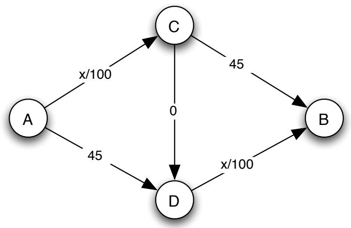  
شکل 8.2: شبکه بزرگراهی از شکل قبلی، پس از اضافه شدن یک یال بسیار سریع از $C$ به $\boldsymbol { D }$ . اگرچه سیستم بزرگراهی «بهبود یافته» شده است، زمان سفر در تعادل اکنون 80 دقیقه است، چون همه ماشین‌ها از مسیری که از $C$ و $\boldsymbol { D }$ عبور می‌کند استفاده می‌کنند.

به عبارت دیگر، پس از ساخت بزرگراه سریع از $C$ به $D$، مسیر از $C$ به $\boldsymbol { D }$ مثل یک «گرداب» عمل می‌کند که تمام رانندگان را به خود جذب می‌کند — به ضرر همه. در شبکه جدید، با توجه به رفتار خودخواهانه جداگانه رانندگان، راهی برای بازگشت به راه‌حل تعادل برابر که برای همه بهتر بود، وجود ندارد.

این پدیده — که افزودن منابع به یک شبکه حمل‌ونقل گاهی می‌تواند عملکرد در تعادل را آسیب برساند — اولین بار توسط دیتریش براس در سال 1968 [76] بیان شد و به عنوان پارادوکس براس شناخته می‌شود. مانند بسیاری از ناهنجاری‌های غیرمنطقی، برای وقوع در دنیای واقعی به ترکیب مناسبی از شرایط نیاز دارد؛ اما به‌صورت تجربی در شبکه‌های حمل‌ونقل واقعی مشاهده شده است — از جمله در سئول، کره، که نابود کردن یک بزرگراه شش‌لایه برای ساخت یک پارک عمومی در واقع زمان سفر ورود و خروج از شهر را بهبود بخشید (حتی با اینکه حجم ترافیک قبل و بعد از تغییر تقریباً یکسان بود) [37].

برخی بازتاب‌ها درباره پارادوکس براس. پس از دیدن نحوه کار پارادوکس براس، می‌توانیم درک کنیم که در واقع هیچ چیز «پارادوکسی» در آن وجود ندارد. بسیاری از موقعیت‌ها وجود دارند که افزودن یک استراتژی جدید به یک بازی باعث بدتر شدن وضعیت برای همه می‌شود. به عنوان مثال، گرفتاری زندانی از فصل 6 می‌تواند برای توضیح این نکته استفاده شود: اگر تنها استراتژی برای هر بازیکن «عدم اعتراف» بود (یک بازی به‌طور قطع بسیار ساده)، آنگاه هر دو بازیکن در مقایسه با بازی که «اعتراف» به عنوان گزینه اضافه شده، بهتر بودند. (در واقع، همین است که پلیس اولین بار «اعتراف» را به عنوان گزینه ارائه می‌دهد.)

با این حال، دیدن پدیده مشابه در هسته پارادوکس براس به‌عنوان چیزی پارادوکسی‌تر، از نظر ادراکی، منطقی است. همه ما احساس غیررسمی داریم که «بهبود» یک شبکه حتماً چیز خوبی است، و بنابراین وقتی متوجه می‌شویم که باعث بدتر شدن می‌شود، شگفت‌زده می‌شویم.

این مثال در این بخش در واقع نقطه شروع برای مجموعه‌ای گسترده از کارها در تحلیل نظریه بازی‌ای ترافیک شبکه است. به عنوان مثال، می‌توانیم بپرسیم که پارادوکس براس برای شبکه‌ها به چه حد بد می‌تواند باشد: زمان سفر در تعادل پس از اضافه شدن یک یال چقدر بزرگ‌تر می‌شود نسبت به قبل؟ فرض کنید به‌طور خاص که گراف را دلخواه می‌گیریم و فرض می‌کنیم زمان سفر روی هر یال به‌صورت خطی به تعداد ماشین‌های عبوری بستگی دارد — یعنی تمام زمان‌های سفر در یال‌ها به شکل $a x + b$ هستند، که هر یک از $a$ و $b$ یا 0 یا یک عدد مثبت است. در این حالت، نتایج زیبا تیم راگردن و $\check { \mathrm { E } }$ va Tardos می‌توانند نشان دهند که اگر یال‌ها را به یک شبکه با الگوی تعادلی ترافیک اضافه کنیم، همیشه یک تعادل در شبکه جدید وجود دارد که زمان سفر آن حداکثر $4 / 3$ برابر زمان سفر قبلی است [18, 353]. علاوه بر این، $4 / 3$ عامل افزایشی است که در مثال از شکل‌های 8.1 و 8.2 به‌دست می‌آید اگر دو زمان سفر 45 را با 40 جایگزین کنیم. (در این حالت، زمان سفر در تعادل از 60 به 80 می‌پرید وقتی یال از $C$ به $D$ اضافه می‌شود.) بنابراین نتیجه راگردن-تاردوس نشان می‌دهد که این مثال ساده از نظر کمی، بدترین حالت ممکن برای پارادوکس براس است، وقتی یال‌ها به‌صورت خطی به ترافیک واکنش نشان می‌دهند. (وقتی یال‌ها می‌توانند به‌صورت غیرخطی واکنش نشان دهند، وضعیت‌ها می‌توانند بسیار بدتر باشند.)

**GLOSSARY:**
Fitness: برازندگی

انواع دیگری از سؤالات نیز وجود دارند که می‌توان به آنها پرداخت. به عنوان مثال، می‌توانیم به روش‌های طراحی شبکه‌ها برای جلوگیری از به وجود آمدن تعادل‌های بد یا اجتناب از تعادل‌های بد با استفاده هوشمندانه از حق عبور در بخش‌های خاصی از شبکه فکر کنیم. بسیاری از این گسترش‌ها و سایر موارد در کتاب تیم راگرایدن در مورد مدل‌های بازی‌محور ترافیک شبکه [352] مورد بحث قرار گرفته‌اند.

# 8.3 مطالب پیشرفته: هزینه اجتماعی ترافیک در تعادل

پارادوکس براس یک جنبه از پدیده گسترده‌تری است که ترافیک شبکه در تعادل ممکن است بهینه اجتماعی نباشد. در این بخش، سعی می‌کنیم اندازه‌گیری کنیم که ترافیک در تعادل چقدر از بهینه فاصله دارد.

ما می‌خواهیم تحلیل‌مان برای هر شبکه‌ای قابل اعمال باشد، بنابراین تعاریف کلی زیر را معرفی می‌کنیم. شبکه می‌تواند هر گراف جهت‌داری باشد. مجموعه‌ای از رانندگان وجود دارد و رانندگان مختلف ممکن است مبدأ و مقصد متفاوتی داشته باشند. حال، هر لبه $e$ دارای

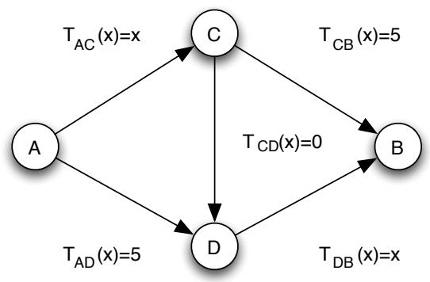  
(ب) زمان‌های سفر به عنوان یادداشت‌ها روی لبه‌ها.

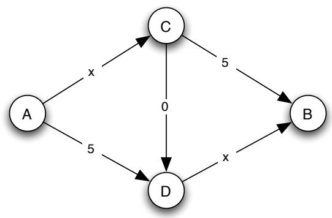  
شکل 8.3: یک شبکه با تابع زمان سفر روی هر لبه مشخص شده.

(الف) زمان‌های سفر به صورت توابع صریح از $x$ .

یک تابع زمان سفر $T _ { e } ( x )$ که زمان لازم برای همه رانندگان عبور از لبه را هنگامی که $x$ راننده از آن استفاده می‌کنند، مشخص می‌کند. این زمان‌های سفر دقیقاً همان توابعی هستند که در شکل‌های بخش 8.1 به عنوان برچسب‌های داخل لبه‌ها رسم کرده‌ایم. ما فرض خواهیم کرد که تمام توابع زمان سفر خطی در میزان ترافیک باشند، بنابراین $T _ { e } ( x ) = a _ { e } x + b _ { e }$ برای برخی از انتخاب اعداد $a _ { e }$ و $b _ { e }$ که مثبت یا صفر هستند. به عنوان مثال، در شکل 8.3 یک شبکه دیگری رسم شده است که پارادوکس براس در آن به وجود می‌آید، با توابع زمان سفر که به اعداد کوچک‌تری مقیاس شده‌اند. نسخه رسم شده در شکل 8.3(a) توابع زمان سفر را به صورت صریح نوشته شده دارد، در حالی که نسخه رسم شده در شکل 8.3(b) توابع زمان سفر را به صورت برچسب‌های داخل لبه‌ها نوشته شده دارد.

در نهایت، می‌گوییم که الگوی ترافیکی به سادگی انتخاب یک مسیر توسط هر راننده است، و هزینه اجتماعی یک الگوی ترافیکی داده شده، مجموع زمان‌های سفری است که همه رانندگان هنگام استفاده از این الگوی ترافیکی تحمل می‌کنند. به عنوان مثال، شکل 8.4 دو الگوی ترافیکی متفاوت را روی شبکه شکل 8.3 نشان می‌دهد، وقتی چهار راننده وجود دارد، هر کدام با گره مبدأ $A$ و گره مقصد $B$ . اولین الگوی ترافیکی، در شکل 8.4(a)، کمترین هزینه اجتماعی ممکن را به دست می‌آورد — هر راننده به 7 واحد زمان برای رسیدن به مقصد نیاز دارد، بنابراین هزینه اجتماعی 28 است. ما به چنین الگوی ترافیکی که کمترین هزینه اجتماعی ممکن را به دست می‌آورد، بهینه اجتماعی می‌گوییم. (الگوهای ترافیکی دیگری روی این شبکه نیز هزینه اجتماعی 28 را به دست می‌آورند؛ یعنی چندین الگوی ترافیکی برای این شبکه وجود دارند که بهینه اجتماعی هستند.) توجه داشته باشید که الگوهای ترافیکی بهینه اجتماعی، به سادگی ماکزیمای کل رفاه اجتماعی این بازی ترافیکی هستند، زیرا مجموع پرداخت‌های رانندگان منفی هزینه اجتماعی است. الگوی ترافیکی دوم، شکل 8.4(b)، تنها تعادل نش است و هزینه اجتماعی بزرگ‌تری به مقدار 32 دارد.

دو سؤال اصلی که در باقی این فصل بررسی می‌کنیم عبارتند از: اول، در هر شبکه (با توابع زمان سفر خطی)، آیا همیشه یک الگوی ترافیکی تعادلی وجود دارد؟ ما در فصل 6 مثال‌هایی از بازی‌هایی دیده‌ایم که در آن‌ها با استراتژی‌های خالص تعادل وجود ندارد، و از قبل مشخص نیست که برای بازی ترافیکی که اینجا تعریف کرده‌ایم، همیشه وجود داشته باشند. با این حال، در واقع خواهیم دید که تعادل‌ها همیشه وجود دارند. سؤال اصلی دوم این است که آیا همیشه یک الگوی ترافیکی تعادلی وجود دارد که هزینه اجتماعی آن چندان بیشتر از بهینه اجتماعی نباشد؟ ما خواهیم دید که این در واقع صدق می‌کند: نتیجه‌ای را که به دلیل راگرایدن و تاردوس است، نشان خواهیم داد که همیشه یک تعادل وجود دارد که هزینه اجتماعی آن حداکثر دو برابر بهینه است [353].2

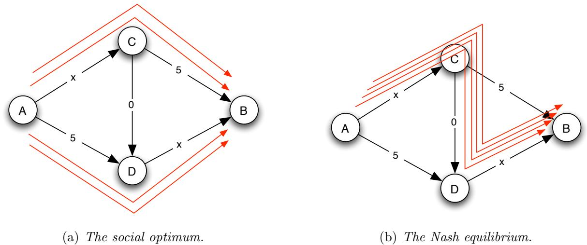  
شکل 8.4: نسخه‌ای از پارادوکس براس: در الگوی ترافیکی بهینه اجتماعی (سمت چپ)، هزینه اجتماعی 28 است، در حالی که در تنها تعادل نش (سمت راست)، هزینه اجتماعی 32 است.

# A. چگونه الگوی ترافیکی در تعادل را پیدا کنیم

ما ثابت خواهیم کرد که تعادل وجود دارد با تحلیل روش زیر که به صورت صریح برای یافتن آن طراحی شده است. این روش از هر الگوی ترافیکی شروع می‌شود. اگر تعادل باشد، کار تمام شده است. در غیر این صورت، حداقل یک راننده وجود دارد که بهترین پاسخ او، با توجه به اقدامات دیگران، یک مسیر جایگزین با زمان سفری به طور قطعی کمتر است. ما یکی از چنین رانندگانی را انتخاب می‌کنیم و او را به این مسیر جایگزین منتقل می‌کنیم. حالا یک الگوی ترافیکی جدید داریم و دوباره بررسی می‌کنیم که آیا تعادل است — اگر نباشد، یک راننده دیگر به بهترین پاسخ خودش تغییر می‌کند و این روند را ادامه می‌دهیم.

این روش به نام دینامیک بهترین پاسخ نامیده می‌شود، زیرا به طور پویا استراتژی‌های بازیکنان را با مداوم داشتن برخی بازیکنان که بهترین پاسخ خود را به وضعیت فعلی انجام می‌دهند، دوباره تنظیم می‌کند. اگر این روش هرگز متوقف شود، در حالتی که همه در واقع بهترین پاسخ خود را به وضعیت فعلی انجام می‌دهند، آنگاه یک تعادل داریم. بنابراین کلید این است که نشان دهیم در هر نمونه از بازی ترافیکی ما، دینامیک بهترین پاسخ در نهایت در یک تعادل متوقف می‌شود.

اما چرا اینطور باشد؟ قطعاً برای بازی‌هایی که تعادل ندارند، دینامیک بهترین پاسخ برای همیشه ادامه خواهد یافت: به عنوان مثال، در بازی سکه‌های تطابقی از فصل 6، وقتی فقط استراتژی‌های خالص مجاز هستند، دینامیک بهترین پاسخ به سادگی شامل تغییر مداوم استراتژی‌های دو بازیکن بین $H$ و $T$ است. به نظر می‌رسد که برای برخی شبکه‌ها، این امر در بازی ترافیکی نیز ممکن است: رانندگان به ترتیب مسیرهای خود را به مسیرهای بهتر برای خود تغییر می‌دهند، که باعث افزایش تأخیر برای راننده دیگری می‌شود که سپس تغییر می‌کند و این کASCADE را ادامه می‌دهد.

با این حال، در واقع این امر در بازی ترافیکی نمی‌تواند رخ دهد. ما اکنون نشان خواهیم داد که دینامیک بهترین پاسخ همیشه در یک تعادل پایان می‌یابد، بنابراین نه تنها ثابت می‌کند که تعادل‌ها وجود دارند بلکه اینکه می‌توانند با یک فرآیند ساده که رانندگان به طور مداوم بر اساس بهترین پاسخ‌ها آنچه را انجام می‌دهند به‌روزرسانی می‌کنند، به دست آیند.

تحلیل دینامیک بهترین پاسخ از طریق انرژی پتانسیل. چگونه باید ثابت کنیم که دینامیک بهترین پاسخ باید متوقف شود؟ وقتی یک فرآیند دارید که بر اساس مجموعه‌ای از دستورالعمل‌ها مانند «ده کار زیر را انجام دهید و سپس متوقف شوید» اجرا می‌شود، معمولاً واضح است که در نهایت به پایان می‌رسد: فرآیند به طور ذاتی گارانتی پایان خود را دارد. اما ما یک فرآیند داریم که بر اساس نوع دیگری از قاعده اجرا می‌شود، قاعده‌ای که می‌گوید «تا زمانی که شرط خاصی برقرار شود، ادامه دهید». در این حالت، دلیل اولیه‌ای برای باور به اینکه هرگز متوقف نخواهد شد وجود ندارد.

در چنین مواردی، یک تکنیک تحلیلی مفید این است که اندازه‌گیری پیشرفتی تعریف کنیم که فرآیند را هنگام اجرا ردیابی کند، و نشان دهیم که در نهایت به اندازه کافی «پیشرفت» انجام خواهد شد که فرآیند باید متوقف شود. برای بازی ترافیکی، طبیعی است که هزینه اجتماعی الگوی ترافیکی فعلی را به عنوان یک اندازه‌گیری پیشرفت ممکن در نظر بگیریم، اما در واقع هزینه اجتماعی برای این منظور چندان مفید نیست. برخی به‌روزرسانی‌های بهترین پاسخ توسط رانندگان می‌توانند هزینه اجتماعی را بهبود بخشند (به عنوان مثال، اگر یک راننده از جاده پرترافیک به جاده نسبتاً خالی بروند)، اما برخی دیگر آن را بدتر می‌کنند (مانند دنباله‌ای از به‌روزرسانی‌های بهترین پاسخ که الگوی ترافیکی را از بهینه اجتماعی به تعادل ضعیف‌تر در پارادوکس براس منتقل می‌کند). بنابراین به طور کلی، هنگامی که دینامیک بهترین پاسخ اجرا می‌شود، هزینه اجتماعی الگوی ترافیکی فعلی می‌تواند بین افزایش و کاهش نوسان کند، و مشخص نیست که این چگونه با پیشرفت ما به سمت تعادل مرتبط است.

به جای آن، ما یک کمیت جایگزین تعریف خواهیم کرد که اول به نظر کمی مرموز می‌رسد. با این حال، خواهیم دید که این ویژگی را دارد که با هر به‌روزرسانی بهترین پاسخ به طور قطعی کاهش می‌یابد، بنابراین می‌تواند برای ردیابی پیشرفت دینامیک بهترین پاسخ استفاده شود [303]. ما به این کمیت به عنوان انرژی پتانسیل یک الگوی ترافیکی اشاره خواهیم کرد.

انرژی پتانسیل یک الگوی ترافیکی به صورت لبه‌به‌لبه تعریف می‌شود، به شرح زیر. اگر لبه $e$ در حال حاضر $x$ راننده روی آن داشته باشد، سپس انرژی پتانسیل این لبه را $$
\mathrm { E n e r g y } ( e ) = T _ { e } ( 1 ) + T _ { e } ( 2 ) + \cdots + T _ { e } ( x ) .
$$ تعریف می‌کنیم

اگر لبه‌ای راننده‌ای نداشته باشد، انرژی پتانسیل آن 0 تعریف می‌شود. انرژی پتانسیل یک الگوی ترافیکی سپس به سادگی مجموع انرژی‌های پتانسیل همه لبه‌ها، با تعداد فعلی رانندگان در این الگوی ترافیکی است. در شکل 8.5، انرژی پتانسیل هر لبه را برای پنج الگوی ترافیکی که دینامیک بهترین پاسخ در حرکت از بهینه اجتماعی به تعادل منحصربه‌فرد در شبکه پارادوکس براس شکل 8.4 تولید می‌کند، نشان می‌دهیم.

توجه داشته باشید که انرژی پتانسیل یک لبه $e$ با $x$ راننده، مجموع زمان سفر تجربه شده توسط رانندگان عبوری از آن لبه نیست. چون $x$ راننده هر کدام زمان سفر $T _ { e } ( x )$ را تجربه می‌کنند، مجموع زمان سفر آن‌ها $x T _ { e } ( x )$ است، که عددی متفاوت است. انرژی پتانسیل، در عوض، نوعی کمیت «تراکمی» است که در آن تصور می‌کنیم رانندگان به ترتیب از لبه عبور می‌کنند و هر راننده تنها «احساس» تأخیر ناشی از خود و رانندگانی که در جلوی او از لبه عبور می‌کنند را دارد.

البته، انرژی پتانسیل تنها برای هدف ما مفید است اگر به ما امکان تحلیل پیشرفت دینامیک بهترین پاسخ را بدهد. در ادامه نشان می‌دهیم که چگونه این کار را انجام دهیم.

اثبات اینکه دینامیک بهترین پاسخ به پایان می‌رسد. ادعای اصلی ما به شرح زیر است: هر مرحله از دینامیک بهترین پاسخ باعث کاهش قطعی انرژی پتانسیل الگوی ترافیکی فعلی می‌شود. اثبات این مطلب کافی است تا نشان دهیم که دینامیک بهترین پاسخ باید به پایان برسد، به دلیل زیر. انرژی پتانسیل تنها تعداد محدودی از مقادیر ممکن را می‌تواند بگیرد — یکی برای هر الگوی ترافیکی ممکن. اگر با هر مرحله دینامیک بهترین پاسخ به طور قطعی کاهش یابد، این به این معناست که این منبع محدود مقادیر ممکن را «مصرف» می‌کند، زیرا پس از کاهش زیر یک مقدار، دیگر نمی‌تواند به آن مقدار بازگردد. بنابراین دینامیک بهترین پاسخ باید تا زمانی که انرژی پتانسیل به کمترین مقدار ممکن برسد (اگر زودتر نباشد) متوقف شود. و هنگامی که دینامیک بهترین پاسخ متوقف شود، ما حتماً در یک تعادل هستیم — در غیر این صورت، دینامیک راهی برای ادامه داشت. بنابراین، نشان دادن اینکه انرژی پتانسیل در هر مرحله دینامیک بهترین پاسخ به طور قطعی کاهش می‌یابد، کافی است تا وجود یک الگوی ترافیکی تعادلی را ثابت کنیم.

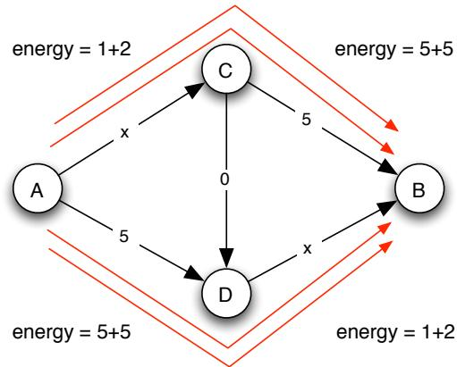  
(الف) الگوی ترافیکی اولیه. (انرژی پتانسیل 26 است.)

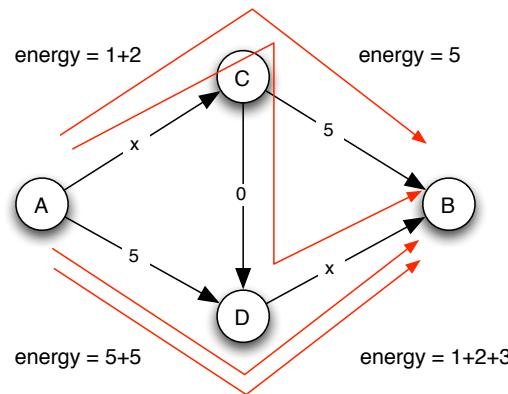  
(ب) پس از یک مرحله دینامیک بهترین پاسخ. (انرژی پتانسیل 24 است.)

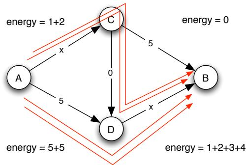  
(ج) پس از دو مرحله. (انرژی پتانسیل 23 است.)

**واژه‌نامه:**
Fitness: برازندگی

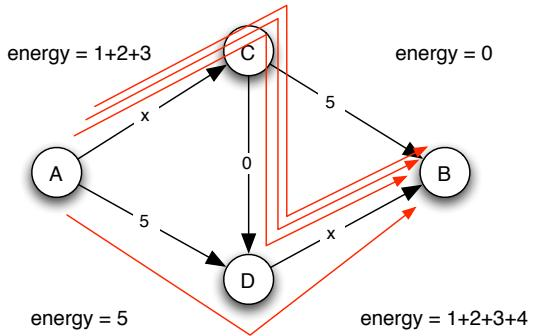  
(d) پس از سه مرحله. (انرژی پتانسیل 21 است.)

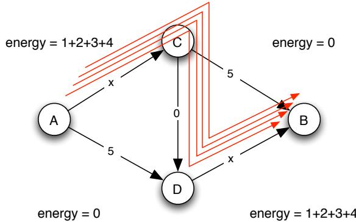  
(e) پس از چهار مرحله: تعادل حاصل شده است. (انرژی پتانسیل 20 است.)

شکل 8.5: می‌توانیم پیشرفت دینامیک بهترین پاسخ در بازی ترافیک را با مشاهده تغییرات انرژی پتانسیل ردیابی کنیم.

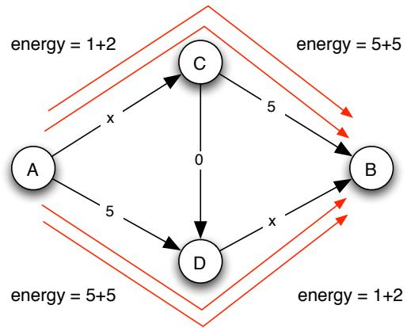  
(a) انرژی پتانسیل یک الگوی ترافیکی که در تعادل نیست.

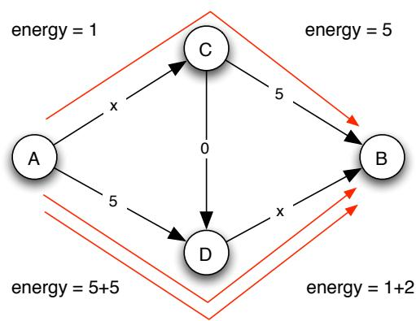  
(b) هنگامی که راننده مسیر فعلی خود را ترک می‌کند، انرژی پتانسیل آزاد می‌شود.

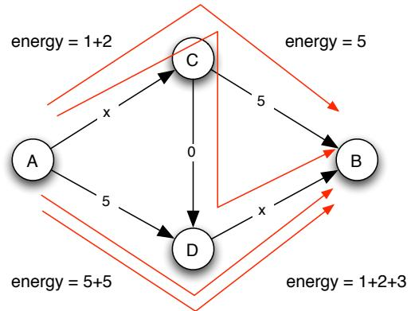  
(c) هنگامی که راننده مسیر جدیدی انتخاب می‌کند، انرژی پتانسیل به سیستم بازمی‌گردد.

شکل 8.6: هنگامی که راننده یک مسیر را به نفع مسیر دیگری ترک می‌کند، تغییر انرژی پتانسیل دقیقاً بهبود زمان سفر راننده است.

راننده مسیر فعلی خود را ترک می‌کند و به طور موقت از سیستم خارج می‌شود؛ سپس راننده با پذیرفتن مسیر جدیدی به سیستم بازمی‌گردد. این مرحله اول باعث آزاد شدن انرژی پتانسیل هنگام خروج راننده از سیستم می‌شود و مرحله دوم انرژی پتانسیل را هنگام بازگشت به سیستم اضافه می‌کند. تغییر خالص چیست؟

مثال، گذار از شکل 8.5(a) به 8.5(b) به این دلیل رخ می‌دهد که یک راننده مسیر بالایی را ترک می‌کند و مسیر زیگزاگ را انتخاب می‌کند. همانطور که در شکل 8.6 نشان داده شده، ترک مسیر بالایی $2 + 5 = 7$ واحد انرژی پتانسیل را آزاد می‌کند، در حالی که انتخاب مسیر زیگزاگ $2 + 0 + 3$ واحد انرژی پتانسیل را به سیستم بازمی‌گرداند. تغییر نتیجه‌ای یک کاهش 2 واحد است.

توجه کنید که کاهش 7 دقیقاً زمان سفری است که راننده در مسیر ترک‌شده تجربه می‌کرد، و افزایش 5 بعدی زمان سفری است که راننده حالا در مسیر جدید تجربه می‌کند. این رابطه در واقع برای هر شبکه و هر پاسخ بهینه راننده صادق است و دلیل ساده‌ای دارد. به طور خاص، انرژی پتانسیل لبه $e$ با $x$ راننده برابر است با

$$
T _ { e } ( 1 ) + T _ { e } ( 2 ) + \cdots + T _ { e } ( x - 1 ) + T _ { e } ( x ) ,
$$

و هنگامی که یکی از این رانندگان آن را ترک می‌کند، به

$$
T _ { e } ( 1 ) + T _ { e } ( 2 ) + \cdot \cdot \cdot + T _ { e } ( x - 1 ) .
$$

کاهش می‌یابد. بنابراین تغییر انرژی پتانسیل در لبه $e$ برابر است با $T _ { e } ( x )$، که دقیقاً زمان سفری است که راننده در $e$ تجربه می‌کرد. با جمع کردن این مقدار برای تمام لبه‌های مورد استفاده توسط راننده، می‌بینیم که انرژی پتانسیل آزاد شده هنگام ترک مسیر فعلی دقیقاً برابر با زمان سفری است که راننده تجربه می‌کرد. با استدلال مشابه، هنگامی که راننده مسیر جدیدی انتخاب می‌کند، انرژی پتانسیل در هر لبه $e$ که به آن می‌پیوندد از

$$
T _ { e } ( 1 ) + T _ { e } ( 2 ) + \cdot \cdot \cdot + T _ { e } ( x )
$$

به

$$
T _ { e } ( 1 ) + T _ { e } ( 2 ) + \cdots + T _ { e } ( x ) + T _ { e } ( x + 1 ) ,
$$

افزایش می‌یابد و افزایش $T _ { e } ( x + 1 )$ دقیقاً زمان سفر جدیدی است که راننده در این لبه تجربه می‌کند. بنابراین، انرژی پتانسیل اضافه شده به سیستم هنگام انتخاب مسیر جدید دقیقاً برابر با زمان سفری است که راننده حالا تجربه می‌کند.

در نتیجه، هنگامی که راننده مسیر را تغییر می‌دهد، تغییر خالص انرژی پتانسیل برابر است با زمان سفر جدید منهای زمان سفر قدیم. اما در دینامیک بهترین پاسخ، راننده تنها زمانی مسیر را تغییر می‌دهد که باعث کاهش زمان سفر شود — بنابراین تغییر انرژی پتانسیل برای هر حرکت بهترین پاسخ منفی است. این نشان می‌دهد که انرژی پتانسیل در سیستم در طول دینامیک بهترین پاسخ به طور سخت‌گیرانه کاهش می‌یابد. همانطور که بالاتر استدلال شد، از آنجا که انرژی پتانسیل نمی‌تواند بی‌نهایت کاهش یابد، دینامیک بهترین پاسخ حتماً در نهایت به پایان می‌رسد و یک الگوی ترافیکی در تعادل تشکیل می‌شود.

# ب. مقایسه ترافیک تعادلی با بهینه اجتماعی

با نشان دادن اینکه الگوی ترافیکی تعادلی همیشه وجود دارد، حالا به بررسی این می‌پردازیم که زمان سفر آن چگونه با الگوی ترافیکی بهینه اجتماعی مقایسه می‌شود. خواهیم دید که انرژی پتانسیل تعریف شده برای این مقایسه بسیار مفید است. ایده اصلی این است که رابطه‌ای بین انرژی پتانسیل یک لبه و زمان سفر کلی تمام رانندگان عبوری از آن لبه برقرار کنیم. پس از این کار، این دو مقدار را بر روی تمام لبه‌ها جمع می‌کنیم تا زمان‌های سفر در تعادل و بهینه اجتماعی را مقایسه کنیم.

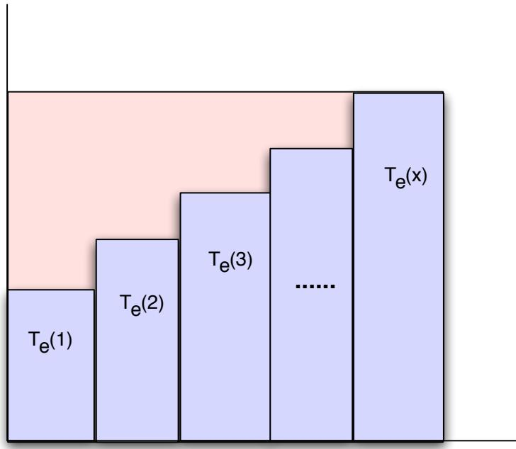  
شکل 8.7: انرژی پتانسیل مساحت زیر مستطیل‌های سایه‌دار است؛ همیشه حداقل نصف زمان سفر کلی است، که مساحت داخل مستطیل محیطی است.

ارتباط انرژی پتانسیل با زمان سفر برای یک لبه. ما انرژی پتانسیل یک لبه را با Energy $( e )$ نمایش می‌دهیم و به یاد می‌آوریم که وقتی $x$ راننده وجود دارد، این انرژی پتانسیل توسط

$$
\mathrm { E n e r g y } ( e ) = T _ { e } ( 1 ) + T _ { e } ( 2 ) + \cdots + T _ { e } ( x ) .
$$

تعریف می‌شود.

از سوی دیگر، هر یک از $x$ راننده زمان سفر $T _ { e } ( x )$ را تجربه می‌کند، بنابراین زمان سفر کلی تجربه شده توسط تمام رانندگان روی لبه برابر است با

$$
\mathrm { T o t a l \mathrm { - } T r a v e l \mathrm { - } T i m e } ( e ) = x T _ { e } ( x )
$$

برای مقایسه با انرژی پتانسیل، مفید است که آن را به صورت زیر بنویسیم:

$$
\mathrm { T o t a l - T r a v e l - T i m e } ( e ) = \underbrace { T _ { e } ( x ) + T _ { e } ( x ) + \dots + T _ { e } ( x ) } _ { x \mathrm { ~ t e r m s } } .
$$

از آنجا که انرژی پتانسیل و زمان سفر کلی هر دو $x$ جمله دارند، اما جملات در عبارت دوم حداقل به اندازه جملات در عبارت اول بزرگ هستند، داریم

$$
\mathrm { E n e r g y } ( e ) \leq \mathrm { T o t a l - T r a v e l - T i m e } ( e ) .
$$

شکل 8.7 نشان می‌دهد که انرژی پتانسیل و زمان سفر کلی چگونه مقایسه می‌شوند وقتی $T _ { e }$ یک تابع خطی است: زمان سفر کلی مساحت زیر خط افقی با مقدار $y$ برابر $T _ { e } ( x )$ است، در حالی که انرژی پتانسیل مجموع مساحت زیر تمام مستطیل‌های با عرض واحد و ارتفاع‌های $T _ { e } ( 1 ) , T _ { e } ( 2 ) , \dots , T _ { e } ( x )$ است. همانطور که این شکل به طور هندسی روشن می‌کند، از آنجا که $T _ { e }$ یک تابع خطی است، داریم

$$
T _ { e } ( 1 ) + T _ { e } ( 2 ) + \cdots + T _ { e } ( x ) \geq { \frac { 1 } { 2 } } x T _ { e } ( x ) .
$$

به طور جایگزین، می‌توانیم این را با جبر ساده ببینیم، با یادآوری $T _ { e } ( x ) = a _ { e } x + b _ { e }$ :

$$
\begin{array} { r c l } { { T _ { e } ( 1 ) + T _ { e } ( 2 ) + \cdots + T _ { e } ( x ) } } & { { = } } & { { a _ { e } ( 1 + 2 + \cdots + x ) + b _ { e } x } } \\ { { } } & { { = } } & { { \displaystyle \frac { a _ { e } x ( x + 1 ) } { 2 } + b _ { e } x } } \\ { { } } & { { = } } & { { \displaystyle x \left( \frac { a _ { e } ( x + 1 ) } { 2 } + b _ { e } \right) } } \\ { { } } & { { \geq } } & { { \displaystyle \frac { 1 } { 2 } x ( a _ { e } x + b _ { e } ) } } \\ { { } } & { { = } } & { { \displaystyle \frac { 1 } { 2 } x T _ { e } ( x ) . } } \end{array}
$$

از نظر انرژی‌ها و زمان‌های سفر کلی، این بیان می‌کند

$$
{ \mathrm { E n e r g y } } ( e ) \geq { \frac { 1 } { 2 } } \cdot { \mathrm { T o t a l } } { \mathrm { - T r a v e l } } { \mathrm { - T i m e } } ( e ) .
$$

بنابراین نتیجه این است که انرژی پتانسیل یک لبه هرگز خیلی دور از زمان سفر کلی نیست: آن بین زمان سفر کلی و نصف آن قرار گرفته است.

ارتباط زمان سفر در تعادل و بهینه اجتماعی. حالا از این رابطه بین انرژی پتانسیل و زمان سفر کلی برای ارتباط دادن الگوهای ترافیکی تعادلی و بهینه اجتماعی استفاده می‌کنیم.

فرض کنید $Z$ یک الگوی ترافیکی باشد؛ ما Energy $( Z )$ را به عنوان مجموع انرژی پتانسیل تمام لبه‌ها هنگامی که رانندگان الگوی ترافیکی $Z$ را دنبال می‌کنند تعریف می‌کنیم. ما Social- $\mathrm { C o s t } ( Z )$ را برای نشان دادن هزینه اجتماعی الگوی ترافیکی می‌نویسیم؛ به یاد داشته باشید که این مجموع زمان‌های سفر تجربه شده توسط تمام رانندگان است. به طور معادل، با جمع کردن هزینه اجتماعی لبه به لبه، Social- $\mathrm { C o s t } ( Z )$ مجموع زمان‌های سفر کلی روی تمام لبه‌ها است. بنابراین با اعمال روابط بین انرژی پتانسیل و زمان سفر بر اساس لبه، می‌بینیم که همان روابط بر روی انرژی پتانسیل و هزینه اجتماعی یک الگوی ترافیکی حاکم است:

$$
{ \frac { 1 } { 2 } } \cdot \operatorname { S o c i a l - C o s t } ( Z ) \leq \operatorname { E n e r g y } ( Z ) \leq \operatorname { S o c i a l - C o s t } ( Z ) .
$$

حال فرض کنید که از یک الگوی ترافیکی بهینه اجتماعی $Z$ شروع می‌کنیم و سپس دینامیک بهترین پاسخ را تا زمانی که در یک الگوی ترافیکی تعادلی $Z ^ { \prime }$ متوقف شود، اجرا می‌کنیم. هزینه اجتماعی ممکن است هنگام اجرای دینامیک بهترین پاسخ افزایش یابد، اما انرژی پتانسیل فقط می‌تواند کاهش یابد — و از آنجا که هزینه اجتماعی هرگز بیشتر از دو برابر انرژی پتانسیل نمی‌شود، این کاهش انرژی پتانسیل مانع از افزایش هزینه اجتماعی بیش از دو برابر مقدار اولیه می‌شود. این نشان می‌دهد که هزینه اجتماعی تعادلی که به دست می‌آوریم حداکثر دو برابر هزینه بهینه اجتماعی شروع‌شده است — بنابراین یک تعادل وجود دارد که حداکثر دو برابر هزینه بهینه اجتماعی دارد، همانطور که می‌خواستیم نشان دهیم.

بیایید این استدلال را بر اساس نابرابری‌های انرژی و هزینه اجتماعی بنویسیم. اول، در بخش قبلی دیدیم که انرژی پتانسیل هنگام حرکت دینامیک بهترین پاسخ از $Z$ به $Z ^ { \prime }$ کاهش می‌یابد، بنابراین

$$
\operatorname { E n e r g y } ( Z ^ { \prime } ) \leq \operatorname { E n e r g y } ( Z ) .
$$

دوم، روابط کمی بین انرژی‌ها و هزینه اجتماعی می‌گویند که

$$
\operatorname { S o c i a l - C o s t } ( Z ^ { \prime } ) \leq 2 \cdot \operatorname { E n e r g y } ( Z ^ { \prime } )
$$

و

$$
\operatorname { E n e r g y } ( Z ) \leq \operatorname { S o c i a l - C o s t } ( Z ) .
$$

حالا این نابرابری‌ها را به هم متصل می‌کنیم و نتیجه می‌گیریم که

$$
\operatorname { S o c i a l - C o s t } ( Z ^ { \prime } ) \leq 2 \cdot \operatorname { E n e r g y } ( Z ^ { \prime } ) \leq 2 \cdot \operatorname { E n e r g y } ( Z ) \leq 2 \cdot \operatorname { S o c i a l - C o s t } ( Z ) .
$$

توجه کنید که این واقعاً همان استدلالی است که در پاراگراف قبل به زبان ساده بیان کردیم: انرژی پتانسیل در طول دینامیک بهترین پاسخ کاهش می‌یابد و این کاهش مانع از افزایش هزینه اجتماعی بیش از دو برابر می‌شود.

بنابراین، ردیابی انرژی پتانسیل نه تنها برای نشان دادن اینکه دینامیک بهترین پاسخ باید به تعادل برسد مفید است؛ با ارتباط دادن این انرژی پتانسیل به هزینه اجتماعی، می‌توانیم از آن برای محدود کردن هزینه اجتماعی تعادل به دست آمده استفاده کنیم.

# 8.4 تمرینات

1. 1000 خودرو وجود دارند که باید از شهر A به شهر B بروند. دو مسیر ممکن برای هر خودرو وجود دارد: مسیر بالایی از طریق شهر C یا مسیر پایینی از طریق شهر D. فرض کنید $x$ تعداد خودروهایی باشد که روی لبه AC حرکت می‌کنند و $y$ تعداد خودروهایی باشد که روی لبه DB حرکت می‌کنند. گراف جهت‌دار در شکل 8.8 نشان می‌دهد که زمان سفر هر خودرو روی لبه AC برابر است با $x / 1 0 0$ اگر $x$ خودرو از لبه AC استفاده کنند، و به طور مشابه زمان سفر هر خودرو روی لبه DB برابر است با $y / 1 0 0$ اگر $y$ خودرو از لبه DB استفاده کنند. زمان سفر هر خودرو روی لبه‌های CB و AD 12 است، بدون توجه به تعداد خودروهای روی این لبه‌ها. هر راننده می‌خواهد مسیری را انتخاب کند تا زمان سفر خود را به حداقل برساند. رانندگان به طور همزمان انتخاب می‌کنند.

(a) مقادیر تعادل نش $x$ و $y$ را پیدا کنید.

(b) حالا دولت یک جاده جدید (یک‌طرفه) از شهر C به شهر D می‌سازد. این جاده جدید مسیر ACDB را به شبکه اضافه می‌کند. این جاده جدید از C به D زمان سفر 0 برای هر خودرو دارد، بدون توجه به تعداد خودروهایی که از آن استفاده می‌کنند. یک تعادل نش برای بازی انجام شده در شبکه جدید پیدا کنید. مقادیر تعادل $x$ و $y$ چیست؟ زمان کل سفر (مجموع زمان‌های سفر برای 1000 خودرو) به دلیل وجود جاده جدید چه تغییری می‌کند؟

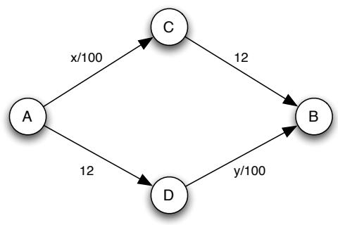  
شکل 8.8: شبکه ترافیکی.

(c) فرض کنید حالا شرایط روی لبه‌های CB و AD بهبود یابد به طوری که زمان سفر هر لبه به 5 کاهش یابد. جاده از C به D که در بخش (b) ساخته شده همچنان موجود است. یک تعادل نش برای بازی انجام شده در شبکه با زمان‌های سفر کوچک‌تر برای CB و AD پیدا کنید. مقادیر تعادل $x$ و $y$ چیست؟ زمان کل سفر چقدر است؟ اگر دولت جاده از C به D را ببندد، زمان کل سفر چه تغییری می‌کند؟

2. دو شهر A و B با دو مسیر به هم متصل شده‌اند. 80 مسافر در شهر A شروع به حرکت می‌کنند و باید به شهر B بروند. دو مسیر بین A و B وجود دارد. مسیر I با یک بزرگراه از شهر A شروع می‌شود که زمان سفر یک ساعت را بدون توجه به تعداد مسافرانی که از آن استفاده می‌کنند، طول می‌کشد و با یک خیابان محلی به شهر B ختم می‌شود. این خیابان محلی نزدیک به شهر B زمان سفری به دقیقه برابر با 10 به علاوه تعداد مسافرانی که از آن استفاده می‌کنند، نیاز دارد. مسیر II با یک خیابان محلی از شهر A شروع می‌شود که زمان سفری به دقیقه برابر با 10 به علاوه تعداد مسافرانی که از آن استفاده می‌کنند، نیاز دارد و با یک بزرگراه به شهر B ختم می‌شود که زمان سفر یک ساعت را بدون توجه به تعداد مسافرانی که از آن استفاده می‌کنند، طول می‌کشد.

(a) شبکه توصیف شده را رسم کنید و لبه‌ها را با زمان سفر مورد نیاز برای حرکت روی آنها برچسب‌گذاری کنید. فرض کنید $x$ تعداد مسافرانی باشد که از مسیر I استفاده می‌کنند. شبکه باید یک گراف جهت‌دار باشد چون تمام جاده‌ها یک‌طرفه هستند.

(b) مسافران به طور همزمان انتخاب می‌کنند که از کدام مسیر استفاده کنند. مقدار تعادل نش $x$ را پیدا کنید.

**واژه‌نامه:**
Fitness: برازندگی

**(c)** اکنون دولت یک جاده جدید (دوطرفه) می‌سازد که گره‌هایی را که خیابان‌های محلی و بزرگراه‌ها در آنها به هم متصل می‌شوند، به هم پیوند می‌دهد. این دو مسیر جدید اضافه می‌کند. یک مسیر جدید شامل خیابان محلی خروجی از شهر A (در مسیر II)، جاده جدید و خیابان محلی ورودی به شهر B (در مسیر I) است. مسیر دوم جدید شامل بزرگراه خروجی از شهر A (در مسیر I)، جاده جدید و بزرگراه ورودی به شهر B (در مسیر II) است. جاده جدید بسیار کوتاه است و زمان سفری ندارد. تعادل نش جدید را پیدا کنید. (راهنما: تعادلی وجود دارد که در آن کسی از مسیر جدید دوم توصیف شده استفاده نمی‌کند.)

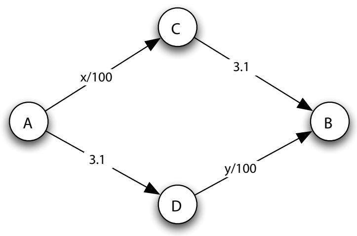  
شکل 8.9: شبکه ترافیکی

**(d)** با ایجاد جاده جدید، زمان سفر کل چه تغییری می‌کند؟

**(e)** اگر بتوانید مسافران را به مسیرها اختصاص دهید، در واقع ممکن است زمان سفر کل را نسبت به قبل از ساخت جاده جدید کاهش داد. به عبارت دیگر، با اختصاص مسافران به مسیرها، می‌توان زمان سفر کل جمعیت را کاهش داد (پایین‌تر از آن در تعادل نش اصلی بخش (b)). تعداد زیادی از اختصاص‌های مسیر وجود دارد که این کار را انجام می‌دهند. یکی را پیدا کنید. دلیل کاهش زمان سفر کل به دلیل تغییر اختصاص را توضیح دهید. (راهنما: به یاد داشته باشید که حرکت بر روی جاده جدید می‌تواند در هر دو جهت باشد. شما نیازی به یافتن اختصاص مسافرانی که زمان سفر کل را به حداقل می‌رساند ندارید. یک روش برای پاسخ به این سوال، شروع از تعادل نش بخش (b) و جستجوی راهی برای اختصاص برخی مسافران به مسیرهای دیگر به منظور کاهش زمان سفر کل است.)

3. 300 ماشین وجود دارند که باید از شهر A به شهر B سفر کنند. هر ماشین می‌تواند از دو مسیر ممکن استفاده کند: مسیر بالایی از طریق شهر C یا مسیر پایینی از طریق شهر D. فرض کنید $x$ تعداد ماشین‌هایی باشد که روی لبه AC سفر می‌کنند و $y$ تعداد ماشین‌هایی باشد که روی لبه DB سفر می‌کنند. گراف جهت‌دار در شکل 8.9 نشان می‌دهد که زمان سفر کل برای هر ماشین در مسیر بالایی $( x / 1 0 0 ) + 3 . 1 $ است اگر $x$ ماشین از مسیر بالایی استفاده کنند، و به‌طور مشابه، زمان سفر کل برای هر ماشین در مسیر پایینی $3 . 1 + ( y / 1 0 0 )$ است اگر $y$ ماشین از مسیر پایینی استفاده کنند. هر راننده می‌خواهد مسیری را انتخاب کند که زمان سفر کل خود را به حداقل برساند. رانندگان به‌صورت همزمان انتخاب می‌کنند.

**(a)** مقادیر تعادل نش $x$ و $y$ را پیدا کنید.

**(b)** اکنون دولت یک جاده جدید (یک‌طرفه) از شهر A به شهر B می‌سازد. مسیر جدید دارای زمان سفر 5 برای هر ماشین است، بدون توجه به تعداد ماشین‌هایی که از آن استفاده می‌کنند. شبکه جدید را رسم کنید و لبه‌ها را با هزینه سفر لازم برای حرکت روی آن‌ها برچسب‌گذاری کنید. شبکه باید یک گراف جهت‌دار باشد چون تمام جاده‌ها یک‌طرفه هستند. تعادل نش برای بازی انجام شده روی شبکه جدید را پیدا کنید. زمان سفر کل (مجموع زمان‌های سفر 300 ماشین) به دلیل وجود جاده جدید چه تغییری می‌کند؟

**(c)** اکنون دولت مسیر مستقیم بین شهر A و B را بسته و یک جاده جدید یک‌طرفه بین شهر C و D می‌سازد. این جاده جدید بین C و D بسیار کوتاه است و زمان سفر 0 دارد، بدون توجه به تعداد ماشین‌هایی که از آن استفاده می‌کنند. شبکه جدید را رسم کنید و لبه‌ها را با هزینه سفر لازم برای حرکت روی آن‌ها برچسب‌گذاری کنید. شبکه باید یک گراف جهت‌دار باشد چون تمام جاده‌ها یک‌طرفه هستند. تعادل نش برای بازی انجام شده روی شبکه جدید را پیدا کنید. زمان سفر کل به دلیل وجود جاده جدید چه تغییری می‌کند؟

**(d)** دولت ناراضی از نتیجه بخش (c) است و تصمیم می‌گیرد جاده مستقیم بین شهر A و B (جاده‌ای که در بخش (b) ساخته شد و در بخش (c) بسته شد) را دوباره باز کند. مسیر بین C و D که در بخش (c) ساخته شد، همچنان باز است. این جاده همچنان دارای زمان سفر 5 برای هر ماشین است، بدون توجه به تعداد ماشین‌هایی که از آن استفاده می‌کنند. شبکه جدید را رسم کنید و لبه‌ها را با هزینه سفر لازم برای حرکت روی آن‌ها برچسب‌گذاری کنید. شبکه باید یک گراف جهت‌دار باشد چون تمام جاده‌ها یک‌طرفه هستند. تعادل نش برای بازی انجام شده روی شبکه جدید را پیدا کنید. زمان سفر کل به دلیل بازکردن مسیر مستقیم بین A و B چه تغییری می‌کند؟

4. دو شهر A و B وجود دارند که با دو مسیر I و II به هم متصل شده‌اند. تمام جاده‌ها یک‌طرفه هستند. 100 مسافر وجود دارند که از شهر A شروع به سفر می‌کنند و باید به شهر B برسند. مسیر I شهر A را از طریق شهر C به شهر B متصل می‌کند. این مسیر با جاده‌ای که شهر A را به شهر C متصل می‌کند شروع می‌شود که هزینه سفر برای هر مسافر برابر با $0 . 5 + x / 2 0 0$ است، به‌طوری که $x$ تعداد مسافران روی این جاده است. مسیر I با یک بزرگراه از شهر C به شهر B پایان می‌یابد که هزینه سفر برای هر مسافر 1 است، بدون توجه به تعداد مسافرانی که از آن استفاده می‌کنند. مسیر II شهر A را از طریق شهر D به شهر B متصل می‌کند. این مسیر با یک بزرگراه که شهر A را به شهر D متصل می‌کند شروع می‌شود که هزینه سفر برای هر مسافر 1 است، بدون توجه به تعداد مسافرانی که از آن استفاده می‌کنند. مسیر II با جاده‌ای که شهر D را به شهر B متصل می‌کند پایان می‌یابد که هزینه سفر برای هر مسافر برابر با $0 . 5 + y / 2 0 0$ است، به‌طوری که $y$ تعداد مسافران روی این جاده است.

این هزینه‌های سفر مقداری است که مسافران برای زمان از دست رفته به دلیل سفر و هزینه سوخت قرار می‌دهند. در حال حاضر، هیچ گونه عوارضی بر روی این جاده‌ها وجود ندارد. بنابراین، دولت درآمدی از سفر بر روی آن‌ها دریافت نمی‌کند.

**(a)** شبکه توصیف شده را رسم کنید و لبه‌ها را با هزینه سفر لازم برای حرکت روی آن‌ها برچسب‌گذاری کنید. شبکه باید یک گراف جهت‌دار باشد چون تمام جاده‌ها یک‌طرفه هستند.

**(b)** مسافران به‌صورت همزمان مسیر مورد استفاده را انتخاب می‌کنند. مقادیر تعادل نش $x$ و $y$ را پیدا کنید.

**(c)** اکنون دولت یک جاده جدید (یک‌طرفه) از شهر C به شهر D می‌سازد. جاده جدید بسیار کوتاه است و هزینه سفر 0 دارد. تعادل نش برای بازی انجام شده روی شبکه جدید را پیدا کنید.

**(d)** با وجود جاده جدید، هزینه سفر کل چه تغییری می‌کند؟

**(e)** دولت ناراضی از نتیجه بخش (c) است و تصمیم می‌گیرد عوارضی بر روی کاربران جاده از شهر A به شهر C تحمیل کند و همزمان به کاربران بزرگراه از شهر A به شهر D یارانه بدهد. آن‌ها به هر کاربر عوارض 0.125 تحمیل می‌کنند و بنابراین هزینه سفر را به این مقدار برای کاربران جاده از شهر A به شهر C افزایش می‌دهند. همچنین، به هر کاربر بزرگراه از شهر A به شهر D 0.125 یارانه می‌دهند و بنابراین هزینه سفر را به این مقدار کاهش می‌دهند. تعادل نش جدید را پیدا کنید. [اگر به نحوه کارکرد یارانه علاقه‌مند هستید، می‌توانید آن را به عنوان یک عوارض منفی در نظر بگیرید. در این اقتصاد، تمام عوارض به‌صورت الکترونیکی جمع‌آوری می‌شوند، مشابه آنچه که ایالت نیویورک با سیستم E-ZPass خود تلاش می‌کند. بنابراین، یارانه تنها میزان کلی را که کاربران بزرگراه باید پرداخت کنند کاهش می‌دهد.]

**(f)** همان‌طور که در حل بخش (e) خواهید دید، عوارض و یارانه بخش (e) طوری طراحی شده‌اند که تعادل نشی وجود دارد که میزانی که دولت از عوارض جمع می‌کند دقیقاً برابر با میزانی است که از یارانه از دست می‌دهد. بنابراین، دولت در این سیاست تعادل مالی دارد. هزینه سفر کل بین بخش‌های (c) و (e) چه تغییری می‌کند؟ دلیل این اتفاق را توضیح دهید. آیا می‌توانید عوارض و یارانه‌هایی را که در جاده‌های از شهر C به B و از شهر D به B اعمال می‌شوند و تعادل مالی دارند، اما هزینه سفر کل را بیشتر کاهش می‌دهند، پیدا کنید؟