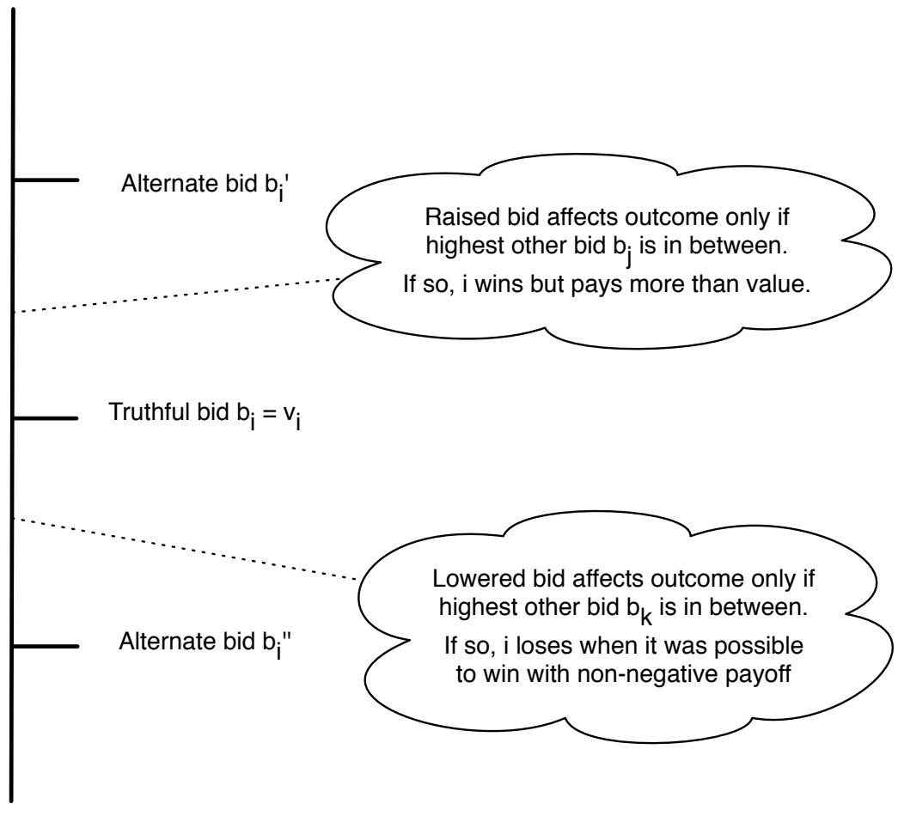

فصل ۹

مزایده

در فصل ۸، اولین کاربرد گسترده‌ی ایده‌های نظریه بازی را در تحلیل جریان ترافیک در یک شبکه بررسی کردیم. در اینجا، دومین کاربرد اصلی را در رفتار خریداران و فروشندگان در یک مزایده در نظر می‌گیریم.

مزایده نوعی فعالیت اقتصادی است که اینترنت آن را به زندگی روزمره بسیاری از افراد آورده است، از طریق سایت‌هایی مانند ایبی. اما مزایده‌ها تاریخچه‌ای طولانی دارند که به حوزه‌های مختلف گسترده شده است. به‌عنوان مثال، دولت ایالات متحده از مزایده برای فروش اوراق خزانه‌داری، چوب و مجوزهای نفت استفاده می‌کند؛ کریستیز و سوتهبی از آن برای فروش هنر استفاده می‌کنند؛ و شرکت مورل $\&$ و شرکت وین چیکاگو از آن برای فروش شراب استفاده می‌کنند.

مزایده‌ها نیز نقش مهم و مکرری در این کتاب خواهند داشت، زیرا شکل ساده‌شده تعامل خریدار-فروشنده که در آن‌ها به‌کار می‌رود، به‌طور نزدیکی با اشکال پیچیده‌تر تعاملات اقتصادی مرتبط است. به‌ویژه، هنگامی که در بخش بعدی کتاب به بازارهایی فکر می‌کنیم که در آن‌ها چندین خریدار و فروشنده توسط یک ساختار شبکه‌ای زیربنایی به هم متصل هستند، از ایده‌هایی که در این فصل برای درک فرمت‌های ساده‌تر مزایده توسعه یافته‌اند، استفاده خواهیم کرد. به‌طور مشابه، در فصل ۱۵، نوعی پیچیده‌تر از مزایده را در زمینه کاربرد جستجوی وب بررسی خواهیم کرد و روش‌هایی را که شرکت‌های جستجو مانند گوگل، یاهو! و مایکروسافت از طریق فرمت مزایده برای فروش حقوق تبلیغات کلیدواژه‌ها استفاده می‌کنند، تحلیل خواهیم کرد.

# ۹.۱ انواع مزایده‌ها

در این فصل بر روی انواع ساده مزایده‌ها و نحوه تأثیر آن‌ها بر رفتار مزایده‌کنندگان تمرکز می‌کنیم. موردی را در نظر می‌گیریم که در آن فروشنده یک کالا را به مجموعه‌ای از خریداران مزایده می‌کند. به‌طور متقارن می‌توانیم به یک موقعیت فکر کنیم که در آن خریدار سعی دارد یک کالا را خریداری کند و مزایده‌ای بین مجموعه‌ای از فروشندگان چندگانه برگزار می‌کند، که هر کدام قادر به ارائه کالا هستند. چنین مزایده‌های تأمینی معمولاً توسط دولت‌ها برای خرید کالاها برگزار می‌شوند. اما در اینجا بر روی موردی تمرکز می‌کنیم که فروشنده مزایده را برگزار می‌کند.

روش‌های مختلف زیادی برای تعریف مزایده‌ها وجود دارد که بسیار پیچیده‌تر از آنچه در اینجا بررسی می‌کنیم هستند. فصل‌های بعدی تحلیل ما را به حالتی تعمیم خواهند داد که در آن چندین کالا فروخته می‌شود و خریداران ارزش‌های مختلفی به این کالاها نسبت می‌دهند. سایر واریاسیون‌ها، که خارج از حوزه این کتاب هستند، شامل مزایده‌هایی هستند که کالاها به‌صورت متوالی در طول زمان فروخته می‌شوند. این واریاسیون‌های پیچیده‌تر نیز با استفاده از تعمیم‌هایی از ایده‌هایی که در اینجا بحث خواهیم کرد، قابل تحلیل هستند و ادبیات گسترده‌ای در اقتصاد وجود دارد که مزایده‌ها را در این سطح گسترده از عمومیت بررسی می‌کند [256, 292].

فرضیه پایه‌ای که در مدل‌سازی مزایده‌ها انجام می‌دهیم این است که هر مزایده‌کننده ارزش ذاتی برای کالای مزایده شده دارد؛ او حاضر است کالا را به قیمتی تا این ارزش خریداری کند، اما نه بالاتر از آن. این ارزش ذاتی را نیز ارزش واقعی مزایده‌کننده برای کالا خواهیم نامید. هنگامی که یک کالا فروخته می‌شود، چهار نوع اصلی مزایده وجود دارد (و بسیاری از واریانت‌های این انواع).

۱. مزایده‌های صعودی، که به آن‌ها مزایده‌های انگلیسی نیز می‌گویند. این مزایده‌ها به‌صورت تعاملی در زمان واقعی انجام می‌شوند، با حضور مزایده‌کنندگان به‌صورت فیزیکی یا الکترونیکی. فروشنده به‌تدریج قیمت را افزایش می‌دهد، مزایده‌کنندگان خارج می‌شوند تا در نهایت تنها یک مزایده‌کننده باقی بماند که در این قیمت نهایی شیء را می‌برد. مزایده‌های شفاهی که در آن‌ها مزایده‌کنندگان قیمت‌ها را بلند می‌گویند یا به‌صورت الکترونیکی ارائه می‌دهند، از انواع مزایده‌های صعودی هستند.

۲. مزایده‌های نزولی، که به آن‌ها مزایده‌های هلندی نیز می‌گویند. این نیز یک فرمت مزایده تعاملی است که در آن فروشنده به‌تدریج قیمت را از یک مقدار اولیه بالا کاهش می‌دهد تا به لحظه‌ای برسد که یک مزایده‌کننده قیمت فعلی را پذیرفته و آن را پرداخت کند. این مزایده‌ها به دلیل اینکه گل‌ها به‌طور طولانی در هلند با این روش فروخته می‌شوند، مزایده‌های هلندی نامیده می‌شوند.

۳. مزایده‌های مناقصه مخفی با قیمت اول. در این نوع مزایده، مزایده‌کنندگان «مناقصه‌های مخفی» را به‌صورت همزمان به فروشنده ارائه می‌دهند. این اصطلاح از فرمت اصلی این مزایده‌ها گرفته شده است، که در آن مناقصه‌ها روی کاغذ نوشته و در پاکت‌های مsealed به فروشنده ارائه می‌شدند، سپس فروشنده آن‌ها را باز می‌کرد. بالاترین مزایده‌کننده شیء را می‌برد و مبلغ مناقصه خود را پرداخت می‌کند.

۴. مزایده‌های مناقصه مخفی با قیمت دوم، که به آن‌ها مزایده‌های ویکری نیز می‌گویند. مزایده‌کنندگان مناقصه‌های مخفی همزمان را به فروشندگان ارائه می‌دهند؛ بالاترین مزایده‌کننده شیء را می‌برد و مبلغ مناقصه دومین بالاتر را پرداخت می‌کند. این مزایده‌ها به افتخار ویلیام ویکری نامیده می‌شوند، که اولین تحلیل نظریه بازی از مزایده‌ها (شامل مزایده با قیمت دوم [400]) را نوشت. ویکری در سال ۱۹۹۶ جایزه نوبل یادبود اقتصاد را به‌خاطر این مجموعه کارها دریافت کرد.

# ۹.۲ چه زمانی مزایده مناسب است؟

مزایده‌ها معمولاً توسط فروشندگان در موقعیت‌هایی استفاده می‌شوند که آن‌ها تخمین خوبی از ارزش واقعی خریداران برای یک کالا ندارند و خریداران نیز ارزش‌های یکدیگر را نمی‌دانند. در این حالت، همان‌طور که خواهیم دید، برخی از فرمت‌های اصلی مزایده می‌توانند برای جلب مناقصه‌هایی از خریداران استفاده شوند که این ارزش‌ها را آشکار می‌کنند.

مقادیر شناخته شده. برای توجیه وضعیتی که ارزش‌های واقعی خریداران ناشناخته هستند، بیایید با در نظر گرفتن موردی شروع کنیم که در آن فروشنده و خریداران ارزش‌های یکدیگر برای یک کالا را می‌دانند و استدلال کنیم که در این سناریو مزایده غیرضروری است. به‌ویژه، فرض کنید فروشنده در حال فروش یک کالا است که او آن را در ارزش $x$ می‌داند، و فرض کنید بیشترین ارزشی که یک خریدار بالقوه برای این کالا دارد، عدد بزرگ‌تری است $y$ . در این حالت، می‌گوییم سودی به مقدار $y - x$ از فروش کالا قابل تولید است: کالا می‌تواند از کسی که ارزش کمتری به آن می‌دهد ( $x$ ) به کسی که ارزش بیشتری به آن می‌دهد ($( y )$) منتقل شود.

اگر فروشنده ارزش‌های واقعی را که خریداران بالقوه به کالا نسبت می‌دهند بداند، می‌تواند به‌سادگی اعلام کند که کالا به قیمت ثابتی کمی پایین‌تر از $y$ برای فروش است و هیچ قیمت پایین‌تری را قبول نمی‌کند. در این حالت، خریدار با ارزش $y$ کالا را خریداری می‌کند و کل ارزش سود به فروشنده می‌رسد. به‌عبارت دیگر، فروشنده در این مورد نیازی به مزایده ندارد: او دقیقاً آنچه که به‌طور منطقی انتظار دارد را تنها با اعلام قیمت مناسب دریافت می‌کند.

توجه کنید که در فرمول‌بندی این مثال یک عدم تقارن وجود دارد: به فروشنده قابلیت تعهد به مکانیزمی که برای فروش شیء استفاده می‌شود داده شد. این قابلیت فروشنده برای «بستن دست‌های خود» با تعهد به قیمت ثابت، در واقع برای او بسیار ارزشمند است: با فرض اینکه خریداران به این تعهد باور داشته باشند، کالا به قیمتی کمی پایین‌تر از $y$ فروخته می‌شود و فروشنده کل سود را کسب می‌کند. در مقابل، در نظر بگیرید که اگر به خریدار با بیشترین ارزش $y$ قابلیت تعهد به مکانیزم را بدهیم. در این حالت، این خریدار می‌تواند اعلام کند که حاضر است کالا را به قیمتی کمی بالاتر از بزرگ‌ترین مقدار بین $x$ و ارزش‌های دیگر خریداران بخرد. با این اعلام، فروشنده همچنان حاضر به فروش خواهد بود — زیرا قیمت بالاتر از $x$ است — اما حالا حداقل بخشی از سود به خریدار می‌رسد. همان‌طور که تعهد فروشنده نیز نیازمند دانستن ارزش‌های دیگران است، این تعهد توسط خریدار نیز نیاز به دانستن ارزش‌های همه دیگران دارد.

مقادیر ناشناخته. تاکنون درباره نحوه تعامل فروشندگان و خریداران در مواقعی که همه ارزش‌های واقعی یکدیگر برای کالا را می‌دانند بحث کرده‌ایم. از بخش بعدی شروع می‌کنیم و خواهیم دید که چگونه مزایده‌ها در مواقعی که شرکت‌کنندگان ارزش‌های یکدیگر را نمی‌دانند، نقش ایفا می‌کنند.

برای بیشتر این فصل توجه خود را به موردی محدود خواهیم کرد که خریداران ارزش‌های مستقل و خصوصی برای کالا دارند. به‌عبارت دیگر، هر خریدار می‌داند که چقدر به کالا ارزش می‌دهد، نمی‌داند دیگران چقدر به آن ارزش می‌دهند و ارزش او برای آن به ارزش دیگران وابسته نیست. به‌عنوان مثال، خریداران ممکن است به مصرف کالا علاقه‌مند باشند و ارزش‌هایشان نشان‌دهنده میزان لذتی است که هر کدام از آن می‌برند.

در ادامه، ما همچنین مورد متضاد این تنظیم — مورد ارزش‌های مشترک — را نیز در نظر خواهیم گرفت. فرض کنید کالایی در مزایده است و به‌جای مصرف کالا، هر خریدار در صورت دریافت آن قصد فروش مجدد آن را دارد. در این حالت (با فرض اینکه خریداران به‌طور قابل مقایسه‌ای خوب موفق به فروش مجدد خواهند شد)، کالا دارای ارزشی ناشناخته اما مشترک است، بی‌آنکه کی آن را به دست آورد: ارزش آن برابر با درآمدی است که این فروش مجدد آینده تولید خواهد کرد. تخمین‌های خریداران از این درآمد ممکن است متفاوت باشد اگر اطلاعات خصوصی درباره ارزش مشترک داشته باشند، بنابراین ارزش‌گذاری آن‌ها برای کالا متفاوت خواهد بود. در این تنظیم، ارزشی که هر خریدار به شیء نسبت می‌دهد تحت تأثیر دانستن ارزش‌گذاری خریداران دیگر قرار می‌گیرد، زیرا خریداران می‌توانند از این دانش برای بهبود تخمین‌های خود از ارزش مشترک استفاده کنند.

# ۹.۳ روابط بین فرمت‌های مختلف مزایده

هدف اصلی ما بررسی رفتار مزایده‌کنندگان در انواع مختلف مزایده‌ها خواهد بود. در این بخش با مشاهدات ساده و غیررسمی شروع می‌کنیم که رفتار در مزایده‌های تعاملی (مزایده‌های صعودی و نزولی که در زمان واقعی انجام می‌شوند) را با رفتار در مزایده‌های مناقصه مخفی مرتبط می‌کند. این مشاهدات می‌توانند به‌صورت ریاضی دقیق شوند، اما برای بحث اینجا به توصیف غیررسمی اکتفا خواهیم کرد.

مزایده‌های نزولی و مناقصه با قیمت اول. ابتدا یک مزایده نزولی را در نظر بگیرید. در اینجا، هنگامی که فروشنده قیمت را از مقدار اولیه بالا کاهش می‌دهد، هیچ مزایده‌کننده‌ای چیزی نمی‌گوید تا اینکه در نهایت کسی قیمت را پذیرفته و آن را پرداخت کند. بنابراین مزایده‌کنندگان در طول مزایده هیچ اطلاعاتی جز این حقیقت را نمی‌آموزند که هنوز کسی قیمت فعلی را پذیرفته نشده است. برای هر مزایده‌کننده $i$، قیمت اولیه $b _ { i }$ وجود دارد که در آن او حاضر است سکوت را شکند و کالا را به قیمت $b _ { i }$ بپذیرد. بنابراین با این دیدگاه، این فرآیند معادل یک مزایده مناقصه مخفی با قیمت اول است: این قیمت $b _ { i }$ نقش مناقصه مزایده‌کننده $i$ را ایفا می‌کند؛ کالا به مزایده‌کننده با بالاترین ارزش مناقصه می‌رود؛ و این مزایده‌کننده مبلغ مناقصه خود را در ازای دریافت کالا پرداخت می‌کند.

مزایده‌های صعودی و مناقصه با قیمت دوم. حالا بیایید درباره یک مزایده صعودی فکر کنیم، که در آن مزایده‌کنندگان به‌تدریج خارج می‌شوند هنگامی که فروشنده به‌طور پیوسته قیمت را افزایش می‌دهد. برنده مزایده آخرین مزایده‌کننده باقی‌مانده است و او قیمتی را پرداخت می‌کند که در آن مزایده‌کننده قبل از آخر خارج می‌شود.۱

فرض کنید شما یک مزایده‌کننده در چنین مزایده‌ای هستید؛ بیایید در نظر بگیریم که چقدر باید در مزایده بمانید تا قبل از خروج. اول، آیا هرگز منطقی است که پس از رسیدن قیمت به ارزش واقعی خود در مزایده بمانید؟ خیر: با ماندن در مزایده، یا باخته و هیچ چیز دریافت نمی‌کنید، یا برنده می‌شوید و باید بیشتر از ارزش کالا پرداخت کنید. دوم، آیا هرگز منطقی است که قبل از رسیدن قیمت به ارزش واقعی خود از مزایده خارج شوید؟ دوباره خیر: اگر زودتر (قبل از رسیدن ارزش واقعی) خارج شوید، هیچ چیز دریافت نمی‌کنید، در حالی که با ماندن ممکن است کالا را به قیمتی پایین‌تر از ارزش واقعی خود ببرید.

بنابراین این استدلال غیررسمی نشان می‌دهد که شما باید تا لحظه دقیقی که قیمت به ارزش واقعی شما می‌رسد در مزایده صعودی بمانید. اگر قیمت «خروج» هر مزایده‌کننده $i$ را به عنوان مناقصه او $b _ { i }$ در نظر بگیریم، این بدان معناست که افراد باید ارزش‌های واقعی خود را به عنوان مناقصه‌های خود استفاده کنند.

علاوه بر این، با این تعریف از پیشنهادها، قاعده تعیین نتیجه حراج صعودی را می‌توان به صورت زیر بازفرمول‌بندی کرد. فردی که بالاترین پیشنهاد را دارد، آن‌که طولانی‌تر در حراج باقی می‌ماند و در نتیجه آیتم را می‌برد، و قیمتی را پرداخت می‌کند که در آن فرد دوم آخرین از حراج خارج شده است — یعنی پیشنهاد این فرد دوم آخرین را پرداخت می‌کند. بنابراین، آیتم به بالاترین پیشنهاددهنده با قیمتی برابر با بالاترین پیشنهاد دوم می‌رسد. این دقیقاً همان قاعده‌ای است که در حراج مخفی دومین قیمتی استفاده می‌شود، با این تفاوت که حراج صعودی شامل تعامل بلادرنگ بین خریداران و فروشنده است، در حالی که نسخه مخفی صرفاً از طریق پیشنهادهای مخفی که فروشنده باز می‌کند و ارزیابی می‌کند، انجام می‌شود. اما شباهت نزدیک در قواعد به توجیه قاعده قیمت‌گذاری ابتدا غیرمنتظره برای حراج دومین قیمتی کمک می‌کند: می‌توان آن را به عنوان یک شبیه‌سازی، با استفاده از پیشنهادهای مخفی، از یک حراج صعودی در نظر گرفت. علاوه بر این، این واقعیت که پیشنهاددهندگان می‌خواهند تا دقیقاً به نقطه‌ای که ارزش واقعی آنها رسیده است در حراج صعودی باقی بمانند، الهام‌بخش نتیجه اصلی ما در بخش بعدی است: پس از بیان حراج مخفی دومین قیمتی به زبان نظریه بازی، متوجه خواهیم شد که پیشنهاد دادن ارزش واقعی خود یک استراتژی غالب است.

مقایسه فرمت‌های حراج. در دو بخش بعدی به بررسی دقیق‌تر دو فرمت اصلی حراج‌های مخفی خواهیم پرداخت. قبل از اینکه به این کار بپردازیم، ارزش دارد دو نکته را بیان کنیم. اول، بحث این بخش نشان می‌دهد که هنگامی که رفتار پیشنهاددهندگان در حراج‌های مخفی را تحلیل می‌کنیم، در واقع درباره معادل‌های تعاملی آنها نیز یاد می‌گیریم — با حراج نزولی به عنوان معادل حراج مخفی اولین قیمتی، و حراج صعودی به عنوان معادل حراج مخفی دومین قیمتی.

دوم، مقایسه سطحی و ظاهری حراج‌های مخفی اولین قیمتی و دومین قیمتی ممکن است نشان دهد که فروشنده اگر حراج اولین قیمتی برگزار کند، پول بیشتری برای آیتم دریافت خواهد کرد: در نهایت، او بالاترین پیشنهاد را دریافت می‌کند به جای بالاترین پیشنهاد دوم. ممکن است عجیب به نظر برسد که در حراج دومین قیمتی، فروشنده به طور عمدی از پیشنهاددهندگان کم‌قیمت می‌کند. اما چنین استدلالی یکی از پیام‌های اصلی از مطالعه نظریه بازی را نادیده می‌گیرد — که هنگامی که قواعدی برای هدایت رفتار افراد ایجاد می‌کنید، باید فرض کنید که آنها رفتار خود را بر اساس آن قواعد تغییر خواهند داد. در اینجا، نکته این است که پیشنهاددهندگان در حراج اولین قیمتی تمایل دارند کمتر از حراج دومین قیمتی پیشنهاد دهند، و در واقع این کاهش پیشنهادها تمایل دارد آنچه که در غیر این صورت تفاوت در اندازه پیشنهاد برنده به نظر می‌رسد را خنثی کند. این ملاحظه در نقاط مختلف بعدی فصل به عنوان یک مسئله مرکزی مطرح خواهد شد.

# 9.4 حراج‌های دومین قیمتی

حراج مخفی دومین قیمتی به ویژه جالب است و نمونه‌های زیادی از آن در کاربردهای گسترده وجود دارد. فرمت حراج استفاده شده در eBay در واقع یک حراج دومین قیمتی است. مکانیزم قیمت‌گذاری که موتورهای جستجو برای فروش تبلیغات مبتنی بر کلمات کلیدی استفاده می‌کنند، تعمیمی از حراج دومین قیمتی است، همانطور که در فصل 15 خواهیم دید. یکی از مهم‌ترین نتایج در نظریه حراج، واقعیتی است که در پایان بخش قبلی به آن اشاره کردیم: با ارزش‌های مستقل و خصوصی، پیشنهاد دادن ارزش واقعی خود یک استراتژی غالب در حراج مخفی دومین قیمتی است. به عبارت دیگر، بهترین انتخاب پیشنهاد دقیقاً همان مقداری است که آیتم برای شما ارزش دارد.

فرمول‌بندی حراج دومین قیمتی به عنوان یک بازی. برای دیدن اینکه چرا این امر درست است، از زبان نظریه بازی استفاده می‌کنیم و حراج را بر اساس بازیکنان، استراتژی‌ها و سودها تعریف می‌کنیم. پیشنهاددهندگان معادل بازیکنان خواهند بود. فرض کنید $v _ { i }$ ارزش واقعی فرد $i$ برای آیتم باشد. استراتژی فرد $i$ مقدار $b _ { i }$ برای پیشنهاد به عنوان تابعی از ارزش واقعی $v _ { i }$ است. در حراج مخفی دومین قیمتی، سود فرد $i$ با ارزش $v _ { i }$ و پیشنهاد $b _ { i }$ به صورت زیر تعریف می‌شود.

اگر $b _ { i }$ پیشنهاد برنده نباشد، سود فرد i برابر با 0 است. اگر $b _ { i }$ پیشنهاد برنده باشد و $b _ { j }$ پیشنهاد دوم باشد، سود فرد $i$ برابر با $v _ { i } - b _ { j }$ است.

  
شکل 9.1: اگر فرد $i$ از پیشنهاد صادقانه در حراج دومین قیمتی انحراف کند، سود تنها زمانی تحت تأثیر قرار می‌گیرد که تغییر پیشنهاد، نتیجه برنده شدن یا باختن را تغییر دهد.

برای اینکه این مسئله کاملاً مشخص شود، باید احتمال برابری‌ها را بررسی کنیم: اگر دو نفر پیشنهاد یکسانی بدهند و آن پیشنهاد برای بزرگ‌ترین پیشنهاد مساوی باشد، چه کاری انجام می‌دهیم؟ یک روش برای رسیدگی به این موضوع این است که فرض کنیم ترتیب ثابتی برای پیشنهاددهندگان وجود دارد که قبل از حراج توافق شده است، و اگر مجموعه‌ای از پیشنهاددهندگان برای بزرگ‌ترین پیشنهاد عددی مساوی شوند، پیشنهاد برنده آنی است که توسط پیشنهاددهنده‌ای ارائه شده که در این ترتیب اول باشد. فرمول‌بندی ما از سودها با این تعریف دقیق‌تر از «پیشنهاد برنده» و «پیشنهاد دوم» کار می‌کند. (و توجه داشته باشید که در صورت برابری، پیشنهاددهنده برنده آیتم را دریافت می‌کند اما مبلغ کامل پیشنهاد خود را پرداخت می‌کند، بنابراین سود او صفر است، زیرا در صورت برابری، پیشنهاد اول و دوم برابر هستند.)

نکته دیگری که ارزش دارد در مورد فرمول‌بندی حراج‌ها به زبان نظریه بازی یادآوری شود. هنگامی که در فصل 6 بازی‌ها را تعریف کردیم، فرض کردیم که هر بازیکن سود همه بازیکنان را در بازی می‌داند. در اینجا اینطور نیست، زیرا پیشنهاددهندگان ارزش‌های یکدیگر را نمی‌دانند، و بنابراین به طور دقیق نیاز است از تعمیم جزئی از مفاهیم فصل 6 برای رسیدگی به این عدم دانش استفاده کنیم. با این حال، برای تحلیل ما در اینجا، از آنجا که بر استراتژی‌های غالب تمرکز داریم که در آن یک بازیکن استراتژی بهینه دارد بی‌درنگ از رفتار بازیکنان دیگر، می‌توانیم این ظریفیت را نادیده بگیریم.

پیشنهاد صادقانه در حراج‌های دومین قیمتی. بیان دقیق ادعا درباره حراج‌های دومین قیمتی به صورت زیر است.

ادعا: در حراج مخفی دومین قیمتی، برای هر فرد i انتخاب پیشنهاد $b _ { i } = v _ { i }$ یک استراتژی غالب است.

برای اثبات این ادعا، باید نشان دهیم که اگر فرد $i$ پیشنهاد $b _ { i } = v _ { i }$ بدهد، هیچ انحرافی از این پیشنهاد سود او را بهبود نمی‌بخشد، بی‌درنگ از اینکه سایرین چه استراتژی‌ای دارند. دو حالت وجود دارد: انحراف‌هایی که در آن‌ها فرد $i$ پیشنهاد خود را افزایش می‌دهد، و انحراف‌هایی که در آن‌ها فرد $i$ پیشنهاد خود را کاهش می‌دهد. نکته کلیدی در هر دو حالت این است که مقدار پیشنهاد فرد $i$ تنها بر اینکه او برنده می‌شود یا نه تأثیر می‌گذارد، اما هرگز بر اینکه چقدر پرداخت می‌کند در صورت برنده شدن تأثیر نمی‌گذارد — مبلغ پرداختی کاملاً توسط پیشنهادهای دیگران تعیین می‌شود، و به ویژه توسط بزرگ‌ترین پیشنهاد بین پیشنهادهای دیگران. از آنجا که همه پیشنهادهای دیگر هنگامی که فرد $i$ پیشنهاد خود را تغییر می‌دهد ثابت می‌مانند، تغییر در پیشنهاد فرد $i$ تنها زمانی سود او را تأثیر می‌گذارد که نتیجه برنده شدن یا باختن را تغییر دهد. این استدلال در شکل 9.1 خلاصه شده است.

با این در نظر، دو حالت را بررسی می‌کنیم. اول، فرض کنید به جای پیشنهاد دادن $v _ { i }$، فرد $i$ پیشنهاد $b _ { i } ^ { \prime } > v _ { i }$ را انتخاب می‌کند. این تنها زمانی بر سود فرد $i$ تأثیر می‌گذارد که با پیشنهاد $v _ { i }$ باخته باشد اما با پیشنهاد $b _ { i } ^ { \prime }$ برنده شود. برای اینکه این اتفاق بیفتد، بالاترین پیشنهاد دیگر $b _ { j }$ باید بین $b _ { i }$ و $b _ { i } ^ { \prime }$ باشد. در این صورت، سود فرد $i$ از انحراف حداکثر $v _ { i } - b _ { j } \leq 0$ خواهد بود، و بنابراین این انحراف به پیشنهاد $b _ { i } ^ { \prime }$ سود فرد $i$ را بهبود نمی‌بخشد.

بعد، فرض کنید به جای پیشنهاد دادن $v _ { i }$، فرد $i$ پیشنهاد $b _ { i } ^ { \prime \prime } < v _ { i }$ را انتخاب می‌کند. این تنها زمانی بر سود فرد $i$ تأثیر می‌گذارد که با پیشنهاد $v _ { i }$ برنده شود اما با پیشنهاد $b _ { i } ^ { \prime \prime }$ باخته شود. بنابراین قبل از انحراف، $v _ { i }$ پیشنهاد برنده بود و پیشنهاد دوم $b _ { k }$ بین $v _ { i }$ و $b _ { i } ^ { \prime \prime }$ بود. در این صورت، سود فرد $i$ قبل از انحراف $v _ { i } - b _ { k } \geq 0$ بود و بعد از انحراف 0 است (از آنجا که باخته است)، بنابراین این انحراف نیز سود فرد $i$ را بهبود نمی‌بخشد.

این استدلال را کامل می‌کند که پیشنهاد صادقانه یک استراتژی غالب در حراج مخفی دومین قیمتی است. هسته اصلی این استدلال واقعیتی است که در ابتدا متوجه شدیم: در حراج دومین قیمتی، پیشنهاد شما تعیین می‌کند که برنده می‌شوید یا نه، اما مبلغی که در صورت برنده شدن پرداخت می‌کنید را تعیین نمی‌کند. بنابراین، باید تغییرات پیشنهاد خود را بر اساس این واقعیت ارزیابی کنید. این همچنین شباهت‌های بیشتری را با حراج صعودی برجسته می‌کند. در آنجا نیز، معادل پیشنهاد شما — یعنی نقطه‌ای که تمایل دارید در حراج باقی بمانید — تعیین می‌کند که آیا به اندازه کافی طولانی باقی خواهید ماند تا برنده شوید؛ اما مبلغی که در صورت برنده شدن پرداخت می‌کنید توسط نقطه‌ای تعیین می‌شود که پیشنهاددهنده دوم از حراج خارج می‌شود.

این واقعیت که صداقت یک استراتژی غالب است، حراج‌های دومین قیمتی را از نظر مفهومی بسیار ساده می‌کند. چون پیشنهاد صادقانه یک استراتژی غالب است، بهترین کاری است که باید انجام دهید بی‌درنگ از اینکه سایر پیشنهاددهندگان چه کار می‌کنند. بنابراین، در حراج دومین قیمتی، پیشنهاد دادن ارزش واقعی خود معقول است حتی اگر سایر پیشنهاددهندگان بیش‌پیشنهاد دهند، کم‌پیشنهاد دهند، همکاری کنند یا به شیوه‌های غیرقابل پیش‌بینی دیگری رفتار کنند. به عبارت دیگر، پیشنهاد صادقانه حتی اگر پیشنهاددهندگان رقیب در حراج ندانند که باید به طور صادقانه پیشنهاد دهند، همچنان یک ایده خوب است.

اکنون به سراغ حراج‌های اولین قیمتی می‌رویم، جایی که متوجه خواهیم شد که موقعیت بسیار پیچیده‌تر است. به ویژه، هر پیشنهاددهنده اکنون باید درباره رفتار رقبای خود استدلال کند تا به بهترین انتخاب برای پیشنهاد خود برسد.

# 9.5 حراج‌های اولین قیمتی و سایر فرمت‌ها

در حراج مخفی اولین قیمتی، مقدار پیشنهاد شما نه تنها بر اینکه برنده شوید یا نه تأثیر می‌گذارد، بلکه بر اینکه چقدر پرداخت می‌کنید نیز تأثیر می‌گذارد. در نتیجه، بیشتر استدلال‌های بخش قبلی باید انجام مجدد شوند و نتایج حالا متفاوت هستند.

ابتدا، می‌توانیم حراج اولین قیمتی را به همان شیوه‌ای که برای حراج دومین قیمتی انجام دادیم به عنوان یک بازی تنظیم کنیم. همان‌طور که قبل، پیشنهاددهندگان بازیکنان هستند، و استراتژی هر پیشنهاددهنده مقداری برای پیشنهاد به عنوان تابعی از ارزش واقعی اوست. سود فرد $i$ با ارزش $v _ { i }$ و پیشنهاد $b _ { i }$ به سادگی به صورت زیر است.

اگر $b _ { i }$ پیشنهاد برنده نباشد، سود فرد $i$ برابر با 0 است. اگر $b _ { i }$ پیشنهاد برنده باشد، سود فرد $i$ برابر با $v _ { i } - b _ { i }$ است.

اولین چیزی که متوجه می‌شویم این است که پیشنهاد دادن ارزش واقعی دیگر یک استراتژی غالب نیست. با پیشنهاد دادن ارزش واقعی، اگر باختید، سود شما 0 خواهد بود (همانطور معمول)، و اگر برنده شدید نیز سود شما 0 خواهد بود، زیرا دقیقاً همان مقداری را پرداخت خواهید کرد که برای شما ارزش داشته است.

در نتیجه، بهترین روش برای پیشنهاد دادن در حراج اولین قیمتی این است که پیشنهاد خود را کمی به پایین کاهش دهید، به طوری که اگر برنده شوید، سود مثبتی دریافت کنید. تعیین میزان کاهش پیشنهاد شامل تعادل بین دو نیروی مخالف است. اگر پیشنهاد خود را بسیار به نزدیکی ارزش واقعی بدهید، سود شما در صورت برنده شدن خیلی زیاد نخواهد بود. اما اگر پیشنهاد خود را بسیار پایین‌تر از ارزش واقعی بدهید تا سود در صورت برنده شدن افزایش یابد، شانس خود را به عنوان بالاترین پیشنهاددهنده کاهش می‌دهید و بنابراین شانس برنده شدن را به طور کلی کاهش می‌دهید.

**GLOSSARY:**
Fitness: برازندگی

یافتن تعادل بهینه بین این دو عامل یک مسئله پیچیده است که به دانش درباره سایر مزایده‌کنندگان و توزیع ارزش‌های ممکن آن‌ها بستگی دارد. به‌عنوان مثال، به‌طور شهودی طبیعی است که پیشنهاد شما در یک حراج قیمت اول با بسیاری از مزایده‌کنندگان رقیب بالاتر باشد — یعنی کمتر سایه‌دار شده و نزدیک‌تر به ارزش واقعی شما — نسبت به یک حراج قیمت اول با تعداد کمی رقیب (با فرض ثابت بودن سایر ویژگی‌های مزایده‌کنندگان). این به‌دلیل این است که با وجود تعداد زیادی رقیب، بالاترین پیشنهاد رقیب احتمالاً بزرگ‌تر خواهد بود و بنابراین شما باید پیشنهاد بالاتری بدهید تا بالاتر از آن قرار گیرید و بالاترین پیشنهاد را داشته باشید. در بخش 9.7 به بررسی نحوه تعیین پیشنهاد بهینه برای یک حراج قیمت اول خواهیم پرداخت.

حراج‌های همه-پرداخت. فرمت‌های دیگری از حراج‌های پیشنهاد مخفی در محیط‌های مختلف وجود دارند. یکی از آن‌ها که در فرمول‌بندی خود ابتدا غیرمعقول به نظر می‌رسد، حراج همه-پرداخت است: هر مزایده‌کننده پیشنهادی می‌دهد؛ بالاترین پیشنهاددهنده مال را دریافت می‌کند؛ و همه مزایده‌کنندگان پیشنهاد خود را پرداخت می‌کنند، صرف نظر از اینکه برنده شوند یا نه. به‌عبارت دیگر، بازده‌ها به‌شرح زیر هستند.

اگر $b _ { i }$ پیشنهاد برنده نباشد، بازده به i برابر است با $- b _ { i }$. اگر $b _ { i }$ پیشنهاد برنده باشد، بازده به $i$ برابر است با $v _ { i } - b _ { i }$.

بازی‌هایی با این نوع بازده در موارد متعددی رخ می‌دهند، معمولاً در مواردی که مفهوم «مزایده» به‌طور ضمنی وجود دارد. لو بی سیاسی را می‌توان به این شکل مدل‌سازی کرد: هر طرف باید پول هزینه لو بی کند، اما فقط طرف موفق، چیزی ارزشمند برای این هزینه دریافت می‌کند. هرچند این درست نیست که طرفی که بیشتر در لو بی هزینه می‌کند همیشه برنده شود، اما تشبیه واضحی بین میزان هزینه شده در لو بی و یک پیشنهاد وجود دارد، به‌طوری که همه طرف‌ها پیشنهاد خود را پرداخت می‌کنند، صرف نظر از اینکه برنده شوند یا نه. می‌توان مشابه این ملاحظات را در محیط‌هایی مانند رقابت‌های طراحی تصور کرد، که در آن شرکت‌های معماری رقیب پولی را برای طرح‌های اولیه هزینه می‌کنند تا قراردادی از یک مشتری به دست آورند. این پول باید قبل از تصمیم‌گیری مشتری هزینه شود.

تعیین پیشنهاد بهینه در یک حراج همه-پرداخت ویژگی‌های کیفی متعددی با استدلال در حراج قیمت اول به اشتراک می‌گذارد: به‌طور کلی می‌خواهید پیشنهادی پایین‌تر از ارزش واقعی خود بدهید و باید تعادل بین پیشنهاد بالا (افزایش احتمال برنده شدن) و پیشنهاد پایین (کاهش هزینه در صورت باخت و افزایش بازده در صورت برنده شدن) را برقرار کنید. به‌طور کلی، این واقعیت که در این فرمت حراج همه باید پرداخت کنند به این معناست که پیشنهادها معمولاً بسیار پایین‌تر از حراج قیمت اول سایه‌دار می‌شوند. چارچوبی که برای تعیین پیشنهادهای بهینه در حراج‌های قیمت اول ارائه می‌دهیم، همچنین برای حراج‌های همه-پرداخت نیز قابل اعمال خواهد بود، همان‌طور که در بخش 9.7 خواهیم دید.

# بخش 9.6 ارزش‌های مشترک و لعنت برنده

تاکنون فرض کرده‌ایم که ارزش‌های مزایده‌کنندگان برای مورد مزایده مستقل هستند: هر مزایده‌کننده ارزش خود را برای مورد مزایده می‌داند و نگرانی درباره ارزش آن برای دیگران ندارد. این در بسیاری از موقعیت‌ها منطقی است، اما به‌وضوح در مواردی که مزایده‌کنندگان قصد فروش مجدد مورد را دارند، اعمال نمی‌شود. در این حالت، یک ارزش نهایی مشترک برای مورد وجود دارد — مقداری که در فروش مجدد تولید خواهد کرد — اما لزوماً مشخص نیست. هر مزایده‌کننده $i$ ممکن است اطلاعات خصوصی درباره ارزش مشترک داشته باشد که منجر به برآورد $v _ { i }$ از این ارزش می‌شود. برآوردهای فردی مزایده‌کنندگان معمولاً کمی اشتباه هستند و همچنین معمولاً مستقل از یکدیگر نیستند. یک مدل ممکن برای چنین برآوردها این است که فرض کنیم ارزش واقعی $\boldsymbol { v }$ است و برآورد هر مزایده‌کننده $i$ به‌صورت $v _ { i } = v + x _ { i }$ تعریف شده است، که در آن $x _ { i }$ یک عدد تصادفی با میانگین $0$ است که خطا در برآورد $i$ را نشان می‌دهد.

حراج‌هایی با ارزش‌های مشترک منابع جدیدی از پیچیدگی را معرفی می‌کنند. برای درک این موضوع، فرض کنید که یک مورد با ارزش مشترک با استفاده از یک حراج قیمت دوم فروخته می‌شود. آیا همچنان استراتژی غالب برای مزایده‌کننده $i$ پیشنهاد دادن $v _ { i }$ است؟ در واقع، این‌طور نیست. برای درک دلیل این موضوع، می‌توانیم از مدل با خطاهای تصادفی $v + x _ { i }$ استفاده کنیم. فرض کنید تعداد زیادی مزایده‌کننده وجود دارد و هر کدام پیشنهاد برآورد ارزش واقعی خود را می‌دهند. سپس از نتیجه حراج، مزایده‌کننده برنده نه تنها مال را دریافت می‌کند، بلکه چیزی درباره برآورد خود از ارزش مشترک نیز می‌آموزد — که این برآورد بالاترین برآورد بین همه بوده است. بنابراین، به‌طور خاص، برآورد او احتمال بیشتری دارد که یک برآورد بیش‌ازحد باشد تا کم‌ازحد. علاوه بر این، با تعداد زیادی مزایده‌کننده، پیشنهاد در جای دوم — که همان چیزی است که او پرداخت کرده است — نیز احتمالاً یک برآورد بیش‌ازحد است. در نتیجه، او احتمالاً در فروش مجدد نسبت به میزانی که پرداخت کرده است، پول از دست می‌دهد.

این پدیده به عنوان «لعنت برنده» شناخته می‌شود و تاریخچه غنی‌ای در مطالعه حراج‌ها دارد. بررسی Richard Thaler از این تاریخچه [387] نشان می‌دهد که لعنت برنده احتمالاً اولین‌بار توسط پژوهشگران صنعت نفت [95] بیان شده است. در این حوزه، شرکت‌ها برای حقوق حفاری چاه‌های نفتی در قطعات زمینی که ارزش مشترکی دارند (برابر با ارزش نفت موجود در آن قطعه) مزایده می‌کنند. لعنت برنده همچنین در زمینه پیشنهادهای رقابتی قرارداد به آزادگان بیسبال مورد مطالعه قرار گرفته است [98] — به‌طوری که ارزش مشترک ناشناخته مربوط به عملکرد آینده بازیکن بیسبال مورد علاقه است.2

# بخش 9.7 مطالب پیشرفته: استراتژی‌های پیشنهاد در حراج‌های قیمت اول و همه-پرداخت

در دو بخش قبلی، برخی از شهود درباره نحوه پیشنهاد دادن در حراج‌های قیمت اول و همه-پرداخت ارائه دادیم، اما به‌دست‌آوردن پیشنهادهای بهینه را انجام ندادیم. حالا مدل‌هایی از رفتار مزایده‌کنندگان را توسعه می‌دهیم که با آن‌ها می‌توانیم استراتژی‌های پیشنهاد تعادلی در این حراج‌ها را به‌دست آوریم. سپس بررسی می‌کنیم که رفتار بهینه چگونه بسته به تعداد مزایده‌کنندگان و توزیع ارزش‌ها متفاوت می‌شود. در نهایت، تحلیل می‌کنیم که فروشنده چقدر درآمد از حراج‌های مختلف می‌تواند انتظار داشته باشد. تحلیل این بخش از حساب دیفرانسیل و احتمالات پایه استفاده خواهد کرد.

# الف. پیشنهاد تعادلی در حراج‌های قیمت اول

به‌عنوان پایه برای مدل، می‌خواهیم شرایطی را که مزایده‌کنندگان تعداد رقیبان خود را می‌دانند و اطلاعات جزئی درباره ارزش‌های رقیبان خود دارند، اما دقیقاً ارزش‌های رقیبان را نمی‌دانند، توصیف کنیم.

ابتدا یک مورد ساده را در نظر بگیریم و سپس به فرمول‌بندی عمومی‌تری برویم. در مورد ساده، فرض کنید دو مزایده‌کننده وجود دارند، هر کدام با ارزش خصوصی که به‌صورت مستقل و یکنواخت بین 0 و 1.3 این اطلاعات به‌عنوان دانش مشترک بین دو مزایده‌کننده وجود دارد. یک استراتژی برای یک مزایده‌کننده تابع $s ( v ) = b$ است که ارزش واقعی او $\boldsymbol { v }$ را به یک پیشنهاد غیرمنفی $b$ نگاشت می‌دهد. ما فرضیات ساده زیر را درباره استراتژی‌های مزایده‌کنندگان اعمال خواهیم کرد:

(i) $s ( \cdot )$ یک تابع سخت‌افزایشی و قابل‌مشتق است؛ به‌طور خاص، اگر دو مزایده‌کننده ارزش‌های متفاوتی داشته باشند، پیشنهادهای متفاوتی تولید خواهند کرد.   
(ii) $s ( v ) \leq v$ برای همه $\boldsymbol { v }$ : مزایده‌کنندگان می‌توانند پیشنهاد خود را کاهش دهند، اما هرگز بالاتر از ارزش واقعی خود پیشنهاد نمی‌دهند. توجه کنید که از آنجایی که پیشنهادها همیشه غیرمنفی هستند، این به این معناست که $s ( 0 ) = 0$ .

این دو فرضیه محدوده گسترده‌ای از استراتژی‌ها را ممکن می‌سازند. به‌عنوان مثال، استراتژی پیشنهاد دادن ارزش واقعی خود توسط تابع $s ( v ) = v$ نمایش داده می‌شود، در حالی که استراتژی کاهش پیشنهاد به‌اندازه ضریب $c < 1$ از ارزش واقعی خود توسط $s ( v ) = c v$ نمایش داده می‌شود. استراتژی‌های پیچیده‌تر مانند $s ( v ) = v ^ { 2 }$ نیز مجاز هستند، اگرچه خواهیم دید که در حراج‌های قیمت اول بهینه نیستند.

این دو فرضیه به ما کمک می‌کنند جستجو برای استراتژی‌های تعادلی را محدود کنیم. فرضیه دوم تنها استراتژی‌های غیربهینه (مبتنی بر پیشنهاد بیش‌ازحد) را حذف می‌کند.

فرضیه اول محدوده استراتژی‌های ممکن تعادلی را محدود می‌کند، اما تحلیل را آسان‌تر می‌کند و در عین حال امکان مطالعه مسائل مهم را فراهم می‌آورد.

در نهایت، از آنجایی که دو مزایده‌کننده به‌جز ارزش واقعی که از توزیع استخراج می‌کنند، در همه جهات یکسان هستند، جستجو برای تعادل را به‌صورت دیگری محدود می‌کنیم: موردی را در نظر می‌گیریم که دو مزایده‌کننده از همان استراتژی $s ( \cdot )$ پیروی می‌کنند.

تعادل با دو مزایده‌کننده: اصل آشکارسازی. بیایید ببینیم چنین استراتژی تعادلی باید چگونه باشد. اولاً، فرضیه (i) بیان می‌کند که مزایده‌کننده با ارزش بالاتر، پیشنهاد بالاتری نیز تولید خواهد کرد. اگر مزایده‌کننده $i$ ارزش $v _ { i }$ داشته باشد، احتمال اینکه این ارزش بالاتر از ارزش رقیب $i$ در بازه $[ 0 , 1 ]$ باشد دقیقاً $v _ { i }$ است. بنابراین، $i$ با احتمال $v _ { i }$ برنده حراج خواهد شد. اگر $i$ برنده شود، بازده او $v _ { i } - s ( v _ { i } )$ خواهد بود. با جمع‌آوری همه این موارد، مشاهده می‌کنیم که بازده مورد انتظار $i$ برابر است با

$$
g ( v _ { i } ) = v _ { i } ( v _ { i } - s ( v _ { i } ) ) .
$$

حالا، به‌معنای چیست که $s ( \cdot )$ یک استراتژی تعادلی باشد؟ این بدان معناست که برای هر مزایده‌کننده $i$، هیچ انگیزه‌ای برای انحراف از استراتژی $s ( \cdot )$ وجود ندارد، اگر رقیب $i$ نیز از استراتژی $s ( \cdot )$ استفاده کند. به‌صورت فوری مشخص نیست که چگونه انحراف‌ها به استراتژی‌های دلخواهی که فرضیات (i) و (ii) را رعایت می‌کنند را تحلیل کنیم. خوشبختانه، یک ابزار ظریف وجود دارد که به ما امکان می‌دهد درباره انحراف‌ها به‌صورت زیر استدلال کنیم: به‌جای تغییر واقعی به استراتژی دیگر، مزایده‌کننده $i$ می‌تواند انحراف خود را با حفظ استراتژی $s ( \cdot )$ و ارائه یک «ارزش واقعی» متفاوت به آن پیاده‌سازی کند.

اینکه چگونه این کار انجام می‌شود: اولاً، اگر رقیب $i$ نیز از استراتژی $s ( \cdot )$ استفاده کند، $i$ هرگز پیشنهادی بالاتر از $s ( 1 )$ اعلام نخواهد کرد، زیرا $i$ می‌تواند با پیشنهاد $s ( 1 )$ برنده شود و بازده بالاتری با پیشنهاد $s ( 1 )$ نسبت به هر پیشنهاد $b > s ( 1 )$ داشته باشد. بنابراین، در هر انحراف احتمالی توسط $i$، پیشنهادی که واقعاً گزارش خواهد داد بین $s ( 0 ) = 0$ و $s ( 1 )$ خواهد بود. بنابراین، برای اهداف حراج، او می‌تواند انحراف خود به استراتژی جایگزین را با فرض اینکه ارزش واقعی‌اش $\boldsymbol { v } _ { i } ^ { \prime }$ به‌جای $v _ { i }$ است و سپس اعمال کردن تابع موجود $s ( \cdot )$ بر روی $\boldsymbol { v } _ { i } ^ { \prime }$ به‌جای $v _ { i }$ شبیه‌سازی کند. این یک مورد خاص از ایده گسترده‌تری به‌نام «اصل آشکارسازی» [124, 207, 310] است؛ برای اهداف ما، می‌توانیم آن را به‌عنوان گفتن این تفسیر در نظر بگیریم که انحراف‌ها در تابع استراتژی پیشنهاد به‌جای آن می‌توانند به‌عنوان انحراف‌ها در «ارزش واقعی» که مزایده‌کننده $i$ به استراتژی فعلی خود $s ( \cdot )$ ارائه می‌دهد، در نظر گرفته شوند.

**واژه‌نامه:**
Fitness: برازندگی

**ترجمه:**
با توجه به این مطلب، می‌توانیم شرطی را که $i$ تمایلی به انحراف از استراتژی $s ( \cdot )$ ندارد به صورت زیر بنویسیم:

$$
v _ { i } ( v _ { i } - s ( v _ { i } ) ) \geq v ( v _ { i } - s ( v ) )
$$

برای تمام مقادیر «واقعی» جایگزین ممکن $\boldsymbol { v }$ بین 0 و $_ 1$ که حراجی‌کننده $i$ ممکن است به تابع $s ( \cdot )$ ارائه دهد.

آیا تابعی وجود دارد که این ویژگی را داشته باشد؟ در واقع، به راحتی می‌توان بررسی کرد که $s ( v ) \ = \ v / 2$ این ویژگی را دارد. برای دیدن دلیل این موضوع، توجه کنید که با انتخاب $s ( \cdot )$، طرف چپ نامساوی (9.2) به $v _ { i } ( v _ { i } - v _ { i } / 2 ) = v _ { i } ^ { 2 } / 2$ تبدیل می‌شود و طرف راست به $v ( v _ { i } - v / 2 ) = v v _ { i } - v ^ { 2 } / 2$. با جمع‌آوری تمام جملات در سمت چپ، نامساوی به سادگی $$
\frac { 1 } { 2 } ( v ^ { 2 } - 2 v v _ { i } + v _ { i } ^ { 2 } ) \geq 0 ,
$$ می‌شود که برقرار است زیرا طرف چپ مربع $\textstyle { \frac { 1 } { 2 } } ( v - v _ { i } ) ^ { 2 }$ است.

بنابراین، نتیجه در این حالت بسیار ساده بیان می‌شود. اگر دو حراجی‌کننده بدانند که در حال رقابت با یکدیگر هستند و هر کدام مقدار خصوصی‌ای را به صورت یکنواخت تصادفی از بازه $[ 0 , 1 ]$ دریافت کرده‌اند، آنگاه تعادل این است که هر کدام پیشنهاد خود را نصف کنند. پیشنهاد دادن نصف مقدار واقعی خود رفتار بهینه است اگر حراجی‌کننده دیگر نیز این کار را انجام دهد.

توجه کنید که برخلاف حالت حراجی دومین قیمت، ما یک استراتژی غالب شناسایی نکرده‌ایم، بلکه تنها یک تعادل را شناسایی کرده‌ایم. در حل برای استراتژی بهینه یک حراجی‌کننده، از انتظارات هر حراجی‌کننده درباره استراتژی پیشنهادی رقیب استفاده کرده‌ایم. در تعادل، این انتظارات صحیح هستند. اما اگر به دلیلی دیگری حراجی‌کنندگان از استراتژی‌های غیرتعادلی استفاده کنند، هر حراجی‌کننده باید به بهترین شکل پاسخ دهد و احتمالاً از استراتژی پیشنهادی دیگری نیز استفاده کند.

استخراج تعادل دو حراجی‌کننده. در بحث ما درباره تعادل $s ( v ) = v / 2$، ابتدا فرض کردیم که شکل تابع $s ( \cdot )$ چیست، سپس بررسی کردیم که آیا این نامساوی (9.2) را برآورده می‌کند یا خیر. اما این روش نشان نمی‌دهد که چگونه تابع $s ( \cdot )$ را برای فرضیه‌سازی کشف کنیم.

روش جایگزین این است که $s ( \cdot )$ را مستقیماً با استدلال درباره شرط در نامساوی (9.2) استخراج کنیم. اینطوری می‌توانیم این کار را انجام دهیم. برای اینکه $s ( \cdot )$ نامساوی (9.2) را برآورده کند، باید دارای خاصیتی باشد که برای هر مقدار واقعی $v _ { i }$، تابع سود انتظاری $g ( v ) =$ $v ( v _ { i } - s ( v ) )$ با تنظیم $v = v _ { i }$ بیشینه شود. بنابراین، $v _ { i }$ باید $g ^ { \prime } ( v _ { i } ) = 0$ را برآورده کند، که در آن $g ^ { \prime }$ مشتق اول $g ( \cdot )$ نسبت به $\boldsymbol { v }$ است. از آنجایی که $$
g ^ { \prime } ( v ) = v _ { i } - s ( v ) - v s ^ { \prime } ( v )
$$ بر اساس قانون حاصلضرب برای مشتق‌ها، می‌بینیم که $s ( \cdot )$ باید معادله دیفرانسیل $$
s ^ { \prime } ( v _ { i } ) = 1 - \frac { s ( v _ { i } ) } { v _ { i } }
$$ را برای همه $v _ { i }$ در بازه $\lfloor 0 , 1 \rfloor$ حل کند. این معادله دیفرانسیل توسط تابع $s ( v _ { i } ) = v _ { i } / 2$ حل می‌شود.

تعادل با تعداد زیادی حراجی‌کننده. حال فرض کنید که $n$ حراجی‌کننده وجود دارد، که $n$ می‌تواند بزرگ‌تر از دو باشد. ابتدا، فرض می‌کنیم که هر حراجی‌کننده $i$ مقدار واقعی خود $v _ { i }$ را به طور مستقل و یکنواخت تصادفی از بازه بین 0 و 1 انتخاب می‌کند.

بسیاری از استدلال‌ها برای حالت دو حراجی‌کننده همچنان کار می‌کنند، هرچند فرمول اصلی سود انتظاری تغییر می‌کند. به طور خاص، فرضیه (i) همچنان نشان می‌دهد که حراجی‌کننده‌ای با بیشترین مقدار واقعی بالاترین پیشنهاد را می‌دهد و بنابراین در حراجی پیروز می‌شود. برای یک حراجی‌کننده داده شده $i$ با مقدار واقعی $v _ { i }$، احتمال اینکه پیشنهاد او بالاترین باشد چقدر است؟ این نیاز دارد که هر حراجی‌کننده دیگر مقداری کمتر از $v _ { i }$ داشته باشد؛ از آنجایی که مقادیر به طور مستقل انتخاب شده‌اند، این رویداد احتمال $v _ { i } ^ { n - 1 }$ دارد. بنابراین، سود انتظاری حراجی‌کننده $i$ برابر است با $$
G ( v _ { i } ) = v _ { i } ^ { n - 1 } ( v _ { i } - s ( v _ { i } ) ) .
$$.

شرط اینکه $s ( \cdot )$ یک استراتژی تعادلی باشد، همانند حالت دو حراجی‌کننده باقی می‌ماند. با استفاده از اصل فاش‌سازی، انحراف از استراتژی پیشنهادی را به عنوان ارائه یک مقدار «جعلی» $\boldsymbol { v }$ به تابع $s ( \cdot )$ در نظر می‌گیریم؛ با توجه به این موضوع، ما نیاز داریم که مقدار واقعی $v _ { i }$ سود انتظاری حداقل به اندازه سود هر انحراف را تولید کند: $$
v _ { i } ^ { n - 1 } ( v _ { i } - s ( v _ { i } ) ) \geq v ^ { n - 1 } ( v _ { i } - s ( v ) )
$$ برای همه $\boldsymbol { v }$ بین 0 و 1.

از اینجا، می‌توانیم شکل تابع پیشنهاد $s ( \cdot )$ را با استفاده از روش معادله دیفرانسیل که برای دو حراجی‌کننده کار می‌کرد، استخراج کنیم. تابع سود انتظاری $G ( v ) =$ $v ^ { n - 1 } ( v _ { i } - s ( v ) )$ باید با تنظیم $\ v \ = \ v _ { i }$ بیشینه شود. با قرار دادن مشتق $G ^ { \prime } ( v _ { i } ) = 0$ و به کار بردن قانون حاصلضرب برای مشتق‌گیری از $G$، به $$
( n - 1 ) v ^ { n - 2 } v _ { i } - ( n - 1 ) v ^ { n - 2 } s ( v _ { i } ) - v _ { i } ^ { n - 1 } s ^ { \prime } ( v _ { i } ) = 0
$$ برای همه $v _ { i }$ بین 0 و $1$ می‌رسیم. با تقسیم بر $( n - 1 ) v ^ { n - 2 }$ و حل برای $s ^ { \prime } ( v _ { i } )$، معادله معادل اما ساده‌تر از نظر تایپوگرافی $$
s ^ { \prime } ( v _ { i } ) = ( n - 1 ) \left( 1 - \frac { s ( v _ { i } ) } { v _ { i } } \right)
$$ برای همه $v _ { i }$ بین 0 و $1$ به دست می‌آید. این معادله دیفرانسیل توسط تابع $$
s ( v _ { i } ) = \left( { \frac { n - 1 } { n } } \right) v _ { i } .
$$ حل می‌شود.

بنابراین، اگر هر حراجی‌کننده پیشنهاد خود را به عامل $( n - 1 ) / n$ کاهش دهد، این رفتار بهینه است با توجه به آنچه دیگران انجام می‌دهند. توجه کنید که هنگامی که $n = 2$، این استراتژی دو حراجی‌کننده‌مان است. شکل این استراتژی اصل مهمی را برجسته می‌کند که در بخش 9.5 درباره پیشنهاد استراتژیک در حراجی‌های قیمت اول در مورد آن بحث کردیم: همان‌طور که تعداد حراجی‌کنندگان افزایش می‌یابد، برای پیروز شدن باید به طور کلی پیشنهادهای «پرخاشگرانه‌تری» داد، یعنی کاهش پیشنهاد را کمتر انجام داد. برای حالت ساده مقادیری که به طور مستقل از توزیع یکنواخت استخراج می‌شوند، تحلیل ما در اینجا دقیقاً مشخص می‌کند که این افزایش پرخاشگری باید چگونه به تعداد حراجی‌کنندگان $n$ وابسته باشد.

توزیع‌های عمومی. علاوه بر در نظر گرفتن تعداد بیشتری حراجی‌کننده، می‌توانیم فرض اینکه مقادیر حراجی‌کنندگان از توزیع یکنواخت روی یک بازه استخراج می‌شوند را نیز لغو کنیم.

فرض کنید که هر حراجی‌کننده مقدار خود را از یک توزیع احتمال روی اعداد حقیقی نامنفی استخراج کند. می‌توانیم توزیع احتمال را با تابع توزیع تجمعی $F ( \cdot )$ نمایش دهیم: برای هر $x$، مقدار $F ( x )$ احتمال آن است که عددی که از توزیع استخراج شده، حداکثر $x$ باشد. فرض می‌کنیم که $F$ یک تابع قابل مشتق‌گیری است.

بسیاری از تحلیل‌های قبلی در سطح عمومی همچنان صادق هستند. احتمال اینکه حراجی‌کننده $i$ با مقدار واقعی $v _ { i }$ در حراجی پیروز شود، احتمال آن است که هیچ حراجی‌کننده دیگری مقدار بزرگ‌تری نداشته باشد، بنابراین برابر است با $F ( v _ { i } ) ^ { n - 1 }$ . بنابراین، سود انتظاری برای $v _ { i }$ برابر است با $$
F ( v _ { i } ) ^ { n - 1 } ( v _ { i } - s ( v _ { i } ) ) .
$$.

سپس، شرط اینکه حراجی‌کننده $i$ تمایلی به انحراف از این استراتژی نداشته باشد به صورت $$
F ( v _ { i } ) ^ { n - 1 } ( v _ { i } - s ( v _ { i } ) ) \geq F ( v ) ^ { n - 1 } ( v _ { i } - s ( v ) )
$$ برای همه $\boldsymbol { v }$ بین 0 و 1 می‌شود.

در نهایت، این شرط تعادل را می‌توان برای نوشتن یک معادله دیفرانسیل دقیقاً مانند قبل استفاده کرد، با استفاده از این واقعیت که تابع $\boldsymbol { v }$ در طرف راست نامساوی (9.6) باید هنگامی که $\ v \ = \ v _ { i }$ بیشینه شود. قانون حاصلضرب و همچنین قانون زنجیره‌ای برای مشتق‌گیری را به کار می‌بریم، با توجه به اینکه مشتق تابع توزیع تجمعی $F ( \cdot )$ تابع چگالی احتمال $f ( \cdot )$ برای توزیع است. با پیش رفتن به صورت قیاس با تحلیل برای توزیع یکنواخت، معادله دیفرانسیل $$
s ^ { \prime } ( v _ { i } ) = ( n - 1 ) \left( { \frac { f ( v _ { i } ) v _ { i } - f ( v _ { i } ) s ( v _ { i } ) } { F ( v _ { i } ) } } \right) .
$$ را به دست می‌آوریم.

توجه کنید که برای توزیع یکنواخت روی بازه $\lfloor 0 , 1 \rfloor$، تابع توزیع تجمعی $F ( v ) = v$ و چگالی $f ( v ) = 1$ است، که با اعمال آن بر روی معادله (9.7) به معادله (9.5) برمی‌گردیم.

یافتن یک راه‌حل صریح برای معادله (9.7) غیرممکن است مگر اینکه شکل صریحی برای توزیع مقادیر داشته باشیم، اما این یک چارچوب برای در نظر گرفتن توزیع‌های دلخواه و حل برای استراتژی‌های پیشنهادی تعادلی فراهم می‌کند.

# ب. درآمد فروشنده

اکنون که استراتژی‌های پیشنهادی برای حراجی‌های قیمت اول را تحلیل کرده‌ایم، می‌توانیم به یک مسئله‌ای که در پایان بخش 9.3 مطرح شد بازگردیم: چگونه درآمدی که فروشنده در حراجی‌های قیمت اول و دوم انتظار دارد را مقایسه کنیم.

دو نیروی رقیب در اینجا عمل می‌کنند. از یک سو، در حراجی دومین قیمت، فروشنده به طور صریح تعهد می‌کند که مقدار کمتری دریافت کند، چون تنها قیمت دومین بالاترین پیشنهاد را دریافت می‌کند. از سوی دیگر، در حراجی قیمت اول، حراجی‌کنندگان پیشنهادهای خود را کاهش می‌دهند که این نیز مقداری را که فروشنده می‌تواند جمع کند کاهش می‌دهد.

برای درک چگونگی معادله‌سازی این عوامل مخالف، فرض کنید که $n$ حراجی‌کننده داریم که مقادیرشان به طور مستقل از توزیع یکنواخت روی بازه $[ 0 , 1 ]$ استخراج شده‌اند. از آنجایی که درآمد فروشنده بر اساس مقادیر بالاترین و دومین بالاترین پیشنهادها است، که خود به نوبه خود به بالاترین و دومین بالاترین مقادیر وابسته هستند، باید انتظارات این مقادیر را بدانیم. 4 محاسبه این انتظارات پیچیده است، اما فرم پاسخ بسیار ساده است. این جمله اصلی است:

فرض کنید n عدد به طور مستقل از توزیع یکنواخت روی بازه [0, 1] استخراج شده و سپس از کوچک به بزرگ مرتب شوند. مقدار انتظاری عدد در موقعیت $k ^ { \mathrm { t h } }$ این لیست برابر است با $\frac { k } { n + 1 }$

اکنون، اگر فروشنده حراجی دومین قیمت برگزار کند و حراجی‌کنندگان استراتژی‌های غالب خود را دنبال کنند و به صراحت پیشنهاد دهند، درآمد انتظاری فروشنده انتظار مقدار دومین بالاترین است. از آنجایی که این مقدار در موقعیت $n - 1$ در ترتیب مرتب‌شده $n$ مقدار تصادفی از کوچک به بزرگ خواهد بود، مقدار انتظاری $( n - 1 ) / ( n + 1 )$ است، بر اساس فرمول توضیح داده شده. از سوی دیگر، اگر فروشنده حراجی قیمت اول برگزار کند، در تعادل انتظار می‌رود که حراجی‌کننده پیروز، پیشنهادی برابر با $( n - 1 ) / n$ برابر مقدار واقعی خود ارائه دهد. مقدار واقعی او انتظار $n / ( n + 1 )$ دارد (چون بزرگ‌ترین عدد از $n$ عدد استخراج‌شده به طور مستقل از بازه واحد است)، بنابراین درآمد انتظاری فروشنده $$
\left( { \frac { n - 1 } { n } } \right) \left( { \frac { n } { n + 1 } } \right) = { \frac { n - 1 } { n + 1 } } .
$$ است.

این دو حراجی دقیقاً درآمد انتظاری یکسانی به فروشنده می‌دهند!

معادل‌سازی درآمد. از نظر درآمد فروشنده، این محاسبه به نوعی اوج کوه یخ است: این نمایانگر یک اصل گسترده‌تر و عمیق‌تری است که در ادبیات حراجی به عنوان معادل‌سازی درآمد شناخته می‌شود [256, 288, 311]. به طور خلاصه، معادل‌سازی درآمد ادعا می‌کند که درآمد فروشنده در یک طیف گسترده از حراجی‌ها و توزیع‌های مستقل دلخواه مقادیر حراجی‌کنندگان، هنگامی که حراجی‌کنندگان استراتژی‌های تعادلی را دنبال می‌کنند، یکسان خواهد بود. فرمول‌بندی و اثبات اصل معادل‌سازی درآمد در [256] موجود است.

از بحث انجام‌شده در اینجا، آسان است که ببینیم چگونه توانایی تعهد به یک مکانیسم فروش برای فروشنده ارزشمند است. برای مثال، فروشنده‌ای که از حراجی دومین قیمت استفاده می‌کند. اگر حراجی‌کنندگان به صراحت پیشنهاد دهند و فروشنده مانع از فروش شیء به طور قول داده‌شده شود، آنگاه فروشنده مقادیر حراجی‌کنندگان را می‌داند و می‌تواند از این موقعیت مزیت‌دار با آنها مذاکره کند. بدترین حالت، فروشنده باید بتواند شیء را به حراجی‌کننده با بالاترین مقدار به قیمتی برابر با دومین بالاترین قیمت بفروشد. (حراجی‌کننده با بالاترین مقدار می‌داند که اگر این معامله را رد کند، حراجی‌کننده با دومین بالاترین مقدار آن را خواهد گرفت.) اما فروشنده ممکن است در مذاکره بتواند بهتر از این عمل کند، و بنابراین به طور کلی حراجی‌کنندگان نسبت به حراجی دومین قیمت قول داده‌شده ضرر می‌کنند. اگر حراجی‌کنندگان مشکوک باشند که این سناریو با احتمالی رخ دهد، آنگاه دیگر پیدا کردن بهینه بودن پیشنهاد دادن به صراحت در حراجی برای آنها واضح نیست، و بنابراین مشخص نیست که فروشنده چه چیزی دریافت می‌کند.

**GLOSSARY:**
Fitness: برازندگی

**Translate:**
قیمت های رزرو. در بحث ما درباره نحوه انتخاب فرمت حراج توسط فروشنده، به طور ضمنی فرض کرده‌ایم که فروشنده باید شیء را بفروشد. بیایید به طور خلاصه بررسی کنیم که درآمد مورد انتظار فروشنده چگونه تغییر می‌کند اگر او گزینه نگه داشتن کالا و انتخاب نفروختن آن را داشته باشد. برای توانایی استدلال درباره سود فروشنده در صورتی که این اتفاق بیفتد، فرض می‌کنیم که فروشنده ارزشی برابر با $u \geq 0$ برای کالا دارد، که این همان سودی است که از نگه داشتن کالا به جای فروختن آن دریافت می‌کند.

مشخص است که اگر $u > 0$ ، آنگاه فروشنده نباید از حراج قیمت اول یا قیمت دوم ساده استفاده کند. در هر دو مورد، پیشنهاد برنده ممکن است کمتر از $u$ باشد و فروشنده نخواهد کالا را بفروشد. اگر فروشنده پس از مشخص کردن حراج قیمت اول یا قیمت دوم، فروختن را رد کند، آنگاه دوباره به حالتی بر می‌گردیم که فروشنده ممکن است به تعهد اولیه‌اش درباره فرمت نقض کند.

به جای آن، بهتر است فروشنده قبل از برگزاری حراج، قیمت رزروی $r$ را اعلام کند. با وجود قیمت رزرو، کالا به بالاترین پیشنهاددهنده فروخته می‌شود اگر بالاترین پیشنهاد از $r$ بالاتر باشد؛ در غیر این صورت، کالا فروخته نمی‌شود. در یک حراج قیمت اول با قیمت رزرو، پیشنهاددهنده برنده (اگر وجود داشته باشد) همچنان پیشنهاد خود را پرداخت می‌کند. در یک حراج قیمت دوم با قیمت رزرو، پیشنهاددهنده برنده (اگر وجود داشته باشد) بیشترین مقدار بین پیشنهاد جای دوم و قیمت رزرو $r$ را پرداخت می‌کند. همان‌طور که خواهیم دید، برای فروشنده اعلام کردن قیمت رزرو مفید است حتی اگر ارزش او برای کالا $u = 0$ باشد.

بیایید به بررسی نحوه استدلال درباره مقدار بهینه قیمت رزرو در حالت حراج قیمت دوم بپردازیم. اول، بازگشت به استدلالی که نشان می‌دهد تبلیغ صادقانه استراتژی غالب در حراج‌های قیمت دوم است و بررسی اینکه در حضور قیمت رزرو همچنان صدق می‌کند، سخت نیست. به طور اساسی، چنان‌گویی فروشنده یک پیشنهاددهنده «شبیه‌سازی‌شده» دیگر است که همیشه با $r$ پیشنهاد می‌دهد؛ و چون تبلیغ صادقانه به‌هرحال بهترین است، صرف‌نظر از رفتار سایر پیشنهاددهندگان، حضور این پیشنهاددهنده شبیه‌سازی‌شده اضافی بر نحوه رفتار هر یک از پیشنهاددهندگان واقعی تأثیری ندارد.

حال، فروشنده چه مقداری را برای قیمت رزرو انتخاب کند؟ اگر کالا برای فروشنده ارزش $u$ داشته باشد، به‌وضوح باید $r \geq u$ را تنظیم کند. اما در واقع، قیمت رزروی که درآمد مورد انتظار فروشنده را حداکثر می‌کند، به‌طور سخت‌گیرانه بیشتر از $u$ است. برای دیدن دلیل این امر، ابتدا یک مورد بسیار ساده را در نظر بگیرید: یک حراج قیمت دوم با یک پیشنهاددهنده که ارزش او به‌طور یکنواخت روی $\lfloor 0 , 1 \rfloor$ توزیع شده است، و فروشنده‌ای که ارزش او برای کالا $u = 0$ است. با تنها یک پیشنهاددهنده، حراج قیمت دوم بدون قیمت رزرو کالا را به قیمت ۰ به پیشنهاددهنده می‌فروشد. از سوی دیگر، فرض کنید فروشنده قیمت رزروی $r > 0$ را تنظیم کند. در این صورت، با احتمال $1 - r$ ، ارزش پیشنهاددهنده از $r$ بالاتر است و کالا به قیمت $r$ به پیشنهاددهنده فروخته می‌شود. با احتمال $r$ ، ارزش پیشنهاددهنده پایین‌تر از $r$ است و بنابراین فروشنده کالا را نگه می‌دارد و سودی برابر با $u = 0$ دریافت می‌کند. بنابراین، درآمد مورد انتظار فروشنده $r ( 1 - r )$ است و این مقدار در $r = 1 / 2$ حداکثر می‌شود. اگر ارزش فروشنده $u$ بزرگتر از صفر باشد، آنگاه سود مورد انتظار او $r ( 1 - r ) + r u$ است (چون زمانی که کالا فروخته نمی‌شود، سودی برابر با $u$ دریافت می‌کند) و این مقدار با تنظیم $r = ( 1 + u ) / 2$ حداکثر می‌شود. بنابراین، با یک پیشنهاددهنده، قیمت رزرو بهینه در میانه بین ارزش کالا برای فروشنده و بیشترین ارزش ممکن پیشنهاددهنده قرار دارد. با تحلیل‌های پیچیده‌تر، می‌توان به‌صورت مشابه قیمت رزرو بهینه را برای حراج قیمت دوم با چندین پیشنهاددهنده و همچنین برای حراج قیمت اول با استراتژی‌های تعادلی پیشنهاد که قبلاً به‌دست آوردیم، تعیین کرد.

# C. پیشنهاد تعادلی در حراج‌های پرداخت کل

روش تحلیلی که برای حراج‌های قیمت اول استفاده کرده‌ایم، می‌تواند بدون دشواری زیاد به سایر فرمت‌ها نیز تطبیق داده شود. در اینجا نشان خواهیم داد که این روش چگونه برای تحلیل حراج‌های پرداخت کل کار می‌کند: همان‌طور که در بخش 9.5 یادآوری شد، این یک فرمت حراج است — که برای مدل‌سازی فعالیت‌هایی مانند لابی‌گری طراحی شده — که در آن بالاترین پیشنهاددهنده کالا را می‌برد اما همه پیشنهاددهندگان پیشنهاد خود را پرداخت می‌کنند.

ما چارچوب کلی که برای حراج‌های قیمت اول در این بخش استفاده کردیم را حفظ می‌کنیم، با $n$ پیشنهاددهنده، هر کدام با ارزشی که به‌صورت مستقل و یکنواخت به‌طور تصادفی بین ۰ و ۱ انتخاب شده است. همان‌طور که قبلاً، می‌خواهیم تابع $s ( \cdot )$ را پیدا کنیم که ارزش‌ها را به پیشنهادها نگاشت می‌کند، به‌طوری که استفاده از $s ( \cdot )$ بهینه باشد اگر سایر پیشنهاددهندگان نیز از آن استفاده کنند.

در حراج پرداخت کل، سود مورد انتظار برای پیشنهاددهنده $i$ یک عبارت منفی دارد اگر $i$ برنده نشود. فرمول حالا $$
v _ { i } ^ { n - 1 } ( v _ { i } - s ( v _ { i } ) ) + ( 1 - v _ { i } ^ { n - 1 } ) ( - s ( v _ { i } ) ) ,
$$ است که اولین عبارت مربوط به سود در صورتی است که $i$ برنده شود و عبارت دوم مربوط به سود در صورتی است که $i$ بازنده شود. همان‌طور که قبلاً، می‌توانیم انحراف از این استراتژی پیشنهادی را به‌عنوان ارائه یک ارزش جعلی $\boldsymbol { v }$ به تابع $s ( \cdot )$ در نظر بگیریم؛ بنابراین اگر $s ( \cdot )$ انتخاب تعادلی استراتژی‌ها توسط پیشنهاددهندگان باشد، آنگاه $$
v _ { i } ^ { n - 1 } ( v _ { i } - s ( v _ { i } ) ) + ( 1 - v _ { i } ^ { n - 1 } ) ( - s ( v _ { i } ) ) \geq v ^ { n - 1 } ( v _ { i } - s ( v ) ) + ( 1 - v ^ { n - 1 } ) ( - s ( v ) )
$$ برای همه $\boldsymbol { v }$ در بازه $\lfloor 0 , 1 \rfloor$ .

توجه کنید که سود مورد انتظار شامل هزینه ثابت $s ( v )$ است که بدون توجه به نتیجه برنده یا بازنده بودن پرداخت می‌شود، به‌علاوه ارزشی برابر با $v _ { i }$ در صورتی که $i$ برنده شود. با حذف عبارات مشترک در نامعادله (9.8)، می‌توانیم آن را به شکل $$
v _ { i } ^ { n } - s ( v _ { i } ) \geq v ^ { n - 1 } v _ { i } - s ( v ) .
$$ برای همه $\boldsymbol { v }$ در بازه $\lfloor 0 , 1 \rfloor$ بازنویسی کنیم. حال، با نوشتن سمت راست به‌عنوان تابع $g ( v ) = v ^ { n - 1 } v _ { i } -$ $s ( v )$ ، می‌توانیم نامعادله (9.9) را به‌عنوان نیاز به آن که $v = v _ { i }$ تابع $g ( \cdot )$ را حداکثر کند، در نظر بگیریم. معادله حاصل $g ^ { \prime } ( v _ { i } ) = 0$ سپس به ما یک معادله دیفرانسیل می‌دهد که $s ( \cdot )$ را به‌طور ساده‌ای مشخص می‌کند: $$
s ^ { \prime } ( v _ { i } ) = ( n - 1 ) v _ { i } ^ { n - 1 } ,
$$ $s ( v ) = \left( \frac { n - 1 } { n } \right) v _ { i } ^ { n }$

از آنجا که $v _ { i } ~ < ~ 1$ ، افزایش آن به توان $n ^ { \mathrm { t h } }$ (همان‌طور که توسط تابع $s ( \cdot )$ مشخص شده است) آن را به‌صورت نمایی در تعداد پیشنهاددهندگان کاهش می‌دهد. این نشان می‌دهد که پیشنهاددهندگان به‌طور قابل توجهی پیشنهادهای خود را به سمت پایین کاهش می‌دهند همان‌طور که تعداد پیشنهاددهندگان در حراج پرداخت کل افزایش می‌یابد.

ما می‌توانیم درآمد مورد انتظار فروشنده را نیز محاسبه کنیم. فروشنده در حراج پرداخت کل از همه پیشنهاددهندگان پول جمع می‌کند؛ از سوی دیگر، پیشنهاددهندگان همه پیشنهادهای پایینی ارائه می‌دهند. ارزش مورد انتظار سهم یک پیشنهاددهنده در درآمد فروشنده به‌سادگی $$
\int _ { 0 } ^ { 1 } s ( v ) \ d v = \left( { \frac { n - 1 } { n } } \right) \int _ { 0 } ^ { 1 } v ^ { n } \ d v = \left( { \frac { n - 1 } { n } } \right) \left( { \frac { 1 } { n + 1 } } \right) .
$$ است. از آنجا که فروشنده از هر پیشنهاددهنده به‌طور میانگین این مقدار را جمع می‌کند، درآمد مورد انتظار کلی فروشنده $$
n \left( { \frac { n - 1 } { n } } \right) \left( { \frac { 1 } { n + 1 } } \right) = { \frac { n - 1 } { n + 1 } } .
$$ است. این دقیقاً مشابه درآمد مورد انتظار فروشنده در حراج‌های قیمت اول و قیمت دوم با فرضیات مشابه درباره ارزش پیشنهاددهندگان است. دوباره، این بازتابی از اصل گسترده‌تر هم‌ارزی درآمد [256, 288] است که حراج‌های پرداخت کل را نیز در مجموعه گسترده‌ای از فرمت‌های حراج شامل می‌شود.

# 9.8 تمرینات

1. در این سؤال، به بررسی یک حراج می‌پردازیم که در آن یک فروشنده می‌خواهد یک واحد کالا بفروشد و گروهی از پیشنهاددهندگان علاقه‌مند به خرید کالا هستند. فروشنده یک حراج مناقصه‌ای مخفی و قیمت دوم برگزار خواهد کرد. شرکت شما در این حراج پیشنهاد خواهد داد، اما مطمئن نیست که چند پیشنهاددهنده دیگر در حراج شرکت خواهند کرد. علاوه بر شرکت شما، دو یا سه پیشنهاددهنده دیگر خواهد بود. همه پیشنهاددهندگان ارزش‌های مستقل و خصوصی برای کالا دارند. ارزش شرکت شما برای کالا $c$ است. شرکت شما باید چه پیشنهادی ارائه دهد و چگونه این پیشنهاد به تعداد پیشنهاددهندگان دیگری که شرکت می‌کنند بستگی دارد؟ پاسخ خود را به‌طور خلاصه (1-3 جمله) توضیح دهید.

2. در این مسئله، به بررسی این می‌پردازیم که چگونه تعداد پیشنهاددهندگان در یک حراج مناقصه‌ای مخفی و قیمت دوم بر میزانی که فروشنده می‌تواند برای کالایش انتظار داشته باشد تأثیر می‌گذارد. فرض کنید دو پیشنهاددهنده وجود دارند که ارزش‌های مستقل و خصوصی $v _ { i }$ دارند که یا ۱ یا ۳ هستند. برای هر پیشنهاددهنده، احتمالات ۱ و ۳ هر دو $1 / 2$ هستند. (اگر در بالاترین پیشنهاد $x$ تساوی وجود داشته باشد، برنده به‌صورت تصادفی از میان پیشنهاددهندگان بالاترین پیشنهاد انتخاب می‌شود و قیمت $x$ است.) (a) نشان دهید که درآمد مورد انتظار فروشنده $6 / 4$ است. (b) حال فرض کنید که سه پیشنهاددهنده وجود دارند که ارزش‌های مستقل و خصوصی $v _ { i }$ دارند که یا ۱ یا ۳ هستند. برای هر پیشنهاددهنده، احتمالات ۱ و ۳ هر دو $1 / 2$ هستند. درآمد مورد انتظار فروشنده در این حالت چقدر است؟ (c) به‌طور خلاصه توضیح دهید که چرا تغییر تعداد پیشنهاددهندگان بر درآمد مورد انتظار فروشنده تأثیر می‌گذارد.

3. در این مسئله، به بررسی این می‌پردازیم که فروشنده چقدر می‌تواند برای کالایش انتظار داشته باشد در یک حراج مناقصه‌ای مخفی و قیمت دوم. فرض کنید همه پیشنهاددهندگان ارزش‌های مستقل و خصوصی $v _ { i }$ دارند که یا ۰ یا $1$ هستند. احتمال ۰ و ۱ هر دو $1 / 2$ هستند. (a) فرض کنید دو پیشنهاددهنده وجود دارند. آنگاه چهار جفت ممکن از ارزش‌های آن‌ها $( v _ { 1 } , v _ { 2 } )$ : $( 0 , 0 ) , ( 1 , 0 ) , ( 0 , 1 )$ و $( 1 , 1 )$ وجود دارد. هر جفت از ارزش‌ها احتمال $1 / 4$ دارد. نشان دهید که درآمد مورد انتظار فروشنده $1 / 4$ است. (فرض کنید که اگر در بالاترین پیشنهاد $x$ تساوی وجود داشته باشد، برنده به‌صورت تصادفی از میان پیشنهاددهندگان بالاترین پیشنهاد انتخاب می‌شود و قیمت $x$ است.) (b) درآمد مورد انتظار فروشنده چقدر است اگر سه پیشنهاددهنده وجود داشته باشد؟ (c) این موضوع فرضیه‌ای را پیشنهاد می‌کند که همان‌طور که تعداد پیشنهاددهندگان افزایش می‌یابد، درآمد مورد انتظار فروشنده نیز افزایش می‌یابد. در مثالی که در نظر می‌گیریم، درآمد مورد انتظار فروشنده در واقع به ۱ همگرا می‌شود همان‌طور که تعداد پیشنهاددهندگان رشد می‌کند. دلیل این امر را توضیح دهید. نیازی به نوشتن اثبات نیست؛ توضیح انتuitive کافی است.

4. یک فروشنده یک حراج مناقصه‌ای مخفی و قیمت دوم برای یک کالا برگزار خواهد کرد. دو پیشنهاددهنده وجود دارند، $a$ و $b$ ، که ارزش‌های مستقل و خصوصی $v _ { i }$ دارند که یا ۰ یا ۱ هستند. برای هر دو پیشنهاددهنده، احتمالات $v _ { i } = 0$ و $v _ { i } = 1$ هر کدام $1 / 2$ است. هر دو پیشنهاددهنده حراج را درک می‌کنند، اما پیشنهاددهنده $b$ گاهی اوقات در مورد ارزش کالا اشتباه می‌کند. نیمی از زمان‌ها ارزش او ۱ است و او آگاه است که ارزش او ۱ است؛ نیمی دیگر از زمان‌ها ارزش او $0$ است اما گاهی به اشتباه باور دارد که ارزش او ۱ است. فرض کنید که وقتی ارزش $b$ $0$ است، او با احتمال $\frac { 1 } { 2 }$ رفتار می‌کند که ارزش او ۱ است و با احتمال $\frac { 1 } { 2 }$ رفتار می‌کند که ارزش او ۰ است. بنابراین در عمل، پیشنهاددهنده $b$ با احتمال $\frac { 1 } { 4 }$ ارزش ۰ و با احتمال $\frac 3 4$ ارزش ۱ را می‌بیند. پیشنهاددهنده $a$ هرگز در مورد ارزش کالا اشتباه نمی‌کند، اما او از اشتباهاتی که پیشنهاددهنده $b$ می‌کند آگاه است. هر دو پیشنهاددهنده با توجه به درک‌هایشان از ارزش کالا به‌صورت بهینه پیشنهاد می‌دهند. فرض کنید که اگر در بالاترین پیشنهاد $x$ تساوی وجود داشته باشد، برنده به‌صورت تصادفی از میان پیشنهاددهندگان بالاترین پیشنهاد انتخاب می‌شود و قیمت $x$ است. (a) آیا پیشنهاد دادن ارزش واقعی هنوز هم یک استراتژی غالب برای پیشنهاددهنده $a$ است؟ به‌طور خلاصه توضیح دهید (b) درآمد مورد انتظار فروشنده چقدر است؟ به‌طور خلاصه توضیح دهید.

**واژه‌نامه:**
Fitness: برازندگی

**ترجمه:**
5. یک حراج پیشنهاد بسته دومین قیمت را در نظر بگیرید که یک فروشنده با یک واحد از کالایی دارد که او آن را با ارزش $s$ ارزیابی می‌کند و دو خریدار $1 , 2$ که ارزش‌هایی به ترتیب $v _ { 1 }$ و $v _ { 2 }$ برای این کالا دارند. ارزش‌های $s , v _ { 1 } , v _ { 2 }$ همگی مستقل و ارزش‌های خصوصی هستند. فرض کنید هر دو خریدار می‌دانند که فروشنده خودش یک پیشنهاد بسته به ارزش $s$ ارائه خواهد داد، اما آنها ارزش $s$ را نمی‌دانند. آیا برای خریداران بهینه است که صادقانه پیشنهاد دهند؛ یعنی آیا هر کدام باید ارزش واقعی خود را پیشنهاد دهند؟ توضیح دهید.

6. در این سؤال، تأثیر همکاری بین خریداران در یک حراج دومین قیمت بسته را بررسی خواهیم کرد. یک فروشنده وجود دارد که یک کالا را با استفاده از حراج دومین قیمت بسته می‌فروشد. خریداران ارزش‌های مستقل و خصوصی دارند که از توزیعی روی $\lfloor 0 , 1 \rfloor$ استخراج شده‌اند. اگر یک خریدار با ارزش $\boldsymbol { v }$ کالا را به قیمت $p$ دریافت کند، سود او $v - p$ است؛ اگر خریدار کالا را نگیرد، سود او 0 است. ما امکان همکاری بین دو خریدار را در نظر می‌گیریم که ارزش یکدیگر را می‌دانند. فرض کنید هدف این دو خریدار همکار کرده، انتخاب دو پیشنهاد به گونه‌ای است که مجموع سود آنها را حداکثر کند. خریداران می‌توانند هر پیشنهادی را ارائه دهند به شرطی که پیشنهادها در $\lfloor 0 , 1 \rfloor$ باشند.

(a) ابتدا حالتی را در نظر بگیرید که فقط دو خریدار وجود دارد. آنها باید چه دو پیشنهادی ارائه دهند؟ توضیح دهید.

(b) حال فرض کنید یک خریدار سوم وجود دارد که بخشی از همکاری نیست. وجود این خریدار آیا پیشنهادهای بهینه برای دو خریدار همکار را تغییر می‌دهد؟ توضیح دهید.

7. یک فروشنده اعلام می‌کند که یک مجموعه از شراب نادر را با استفاده از حراج پیشنهاد بسته دومین قیمت می‌فروشد. گروهی از $I$ فرد قصد دارند روی این مجموعه شراب شرکت کنند. هر خریدار برای مصرف شخصی خود به شراب علاقه‌مند است؛ ارزش مصرفی خریداران برای شراب ممکن است متفاوت باشد، اما آنها قصد بازفروش ندارند. بنابراین ارزش‌های آنها برای شراب را به عنوان ارزش‌های مستقل و خصوصی در نظر می‌گیریم (همانند فصل ۹). شما یکی از این خریداران هستید؛ به‌طور خاص، شما خریدار شماره $i$ هستید و ارزش شما برای شراب $v _ { i }$ است.

در هر یک از شرایط زیر، چگونه باید پیشنهاد دهید؟ در هر مورد، توضیح دهید؛ اثبات رسمی لازم نیست.

(a) می‌دانید که گروهی از خریداران در مورد پیشنهادها همکاری خواهند کرد. این گروه یک خریدار را انتخاب می‌کند تا یک «پیشنهاد واقعی» به مقدار $\boldsymbol { v }$ ارائه دهد و بقیه پیشنهادهای 0 خواهند داد. شما عضو این گروه همکاری نیستید و نمی‌توانید با هیچ خریدار دیگری همکاری کنید.

(b) شما و تمام خریداران دیگر متوجه شده‌اید که این فروشنده پیشنهادها را جمع‌آوری می‌کند، اما به‌طور واقعی شراب را بر اساس قوانین حراج دومین قیمت نمی‌فروشد. برعکس، پس از جمع‌آوری پیشنهادها، فروشنده به همه خریداران خبر می‌دهد که یک خریدار فرضی دیگر بالاترین پیشنهاد را داده و برنده حراج شده است. البته این خریدار وجود ندارد، بنابراین فروشنده پس از حراج همچنان شراب را خواهد داشت. فروشنده قصد دارد به بالاترین خریدار واقعی تماس خصوصی بگیرد و به او بگوید که خریدار فرضی بالاترین پیشنهاد، تسلیم شده است (در واقع شراب را نخریده) و این خریدار می‌تواند شراب را به قیمتی که در حراج پیشنهاد داده است بخرد. شما نمی‌توانید با هیچ خریداری همکاری کنید. [نیازی به استنتاج استراتژی بهینه پیشنهاد نیست. کافی است توضیح دهید که آیا پیشنهاد شما با ارزش واقعی‌تان متفاوت خواهد بود و اگر بله، در چه جهتی.]

8. در این مسئله، بررسی می‌کنیم که رفتار غیرمنطقی یک خریدار چگونه بر رفتار بهینه سایر خریداران در یک حراج تأثیر می‌گذارد. در این حراج، فروشنده یک واحد از کالا دارد که با استفاده از حراج دومین قیمت بسته فروخته می‌شود. فرض کنید سه خریدار وجود دارند که ارزش‌های مستقل و خصوصی برای کالا دارند، $v _ { 1 }$ ، $v _ { 2 }$ ، $v _ { 3 }$ ، که به‌طور یکنواخت روی بازه [0, 1] توزیع شده‌اند.

(a) ابتدا فرض کنید همه خریداران به‌صورت منطقی رفتار می‌کنند؛ یعنی پیشنهادهای بهینه ارائه می‌دهند. کدام خریدار (بر اساس ارزش‌ها) برنده می‌شود و این خریدار چقدر می‌پردازد (دوباره بر اساس ارزش‌های خریداران)?

(b) حال فرض کنید خریدار 3 به‌صورت غیرمنطقی بیش از ارزش واقعی خود برای کالا پیشنهاد می‌دهد؛ به‌طور خاص، پیشنهاد خریدار 3 برابر $( v _ { 3 } + 1 ) / 2$ است. سایر خریداران می‌دانند که خریدار 3 به این شکل غیرمنطقی است، هرچند آنها ارزش واقعی خریدار 3 را نمی‌دانند. این امر چگونه بر رفتار سایر خریداران تأثیر می‌گذارد؟

(c) رفتار غیرمنطقی خریدار 3 چه تأثیری بر سودهای مورد انتظار خریدار 1 دارد؟ در اینجا امید ریاضی بر اساس ارزش‌های $v _ { 2 }$ و $v _ { 3 }$ محاسبه می‌شود که خریدار 1 نمی‌داند. نیازی به ارائه راه‌حل صریح یا اثبات نیست؛ توضیح انتزاعی از تأثیر کافی است. [یادآوری: سود یک خریدار برابر است با ارزش او برای کالا منهای قیمت، اگر برنده شود؛ یا $0$ ، اگر برنده نشود.]

9. در این مسئله، بررسی می‌کنیم که فروشنده چقدر از فروش کالایش در یک حراج دومین قیمت بسته انتظار دارد. فرض کنید دو خریدار وجود دارند که ارزش‌های مستقل و خصوصی $v _ { i }$ دارند که هر کدام 1 یا 2 است. برای هر خریدار، احتمالات $v _ { i } = 1$ و $v _ { i } = 2$ هر کدام $1 / 2$ است. فرض کنید اگر در بالاترین پیشنهاد تساوی وجود داشته باشد، برنده به‌صورت تصادفی از میان بالاترین خریداران انتخاب می‌شود و قیمت $x$ است. همچنین فرض کنید ارزش کالا برای فروشنده $0$ است.

(a) نشان دهید که درآمد مورد انتظار فروشنده $5 / 4$ است.

(b) حال فرض کنید فروشنده قیمت محدودیتی به مقدار $R$ با $1 < R < 2$ تعیین می‌کند؛ یعنی کالا به بالاترین خریدار فروخته می‌شود اگر پیشنهاد او حداقل $R$ باشد، و قیمتی که این خریدار پرداخت می‌کند برابر حداکثر بین دومین بالاترین پیشنهاد و $R$ است. اگر هیچ پیشنهادی حداقل $R$ نباشد، کالا فروخته نمی‌شود و فروشنده درآمد 0 دریافت می‌کند. فرض کنید همه خریداران $R$ را می‌دانند. درآمد مورد انتظار فروشنده به‌عنوان تابعی از $R$ چیست؟

(c) با استفاده از قسمت قبلی، نشان دهید که فروشنده‌ای که می‌خواهد درآمد مورد انتظار را حداکثر کند، هرگز قیمت محدودیتی $R$ را بین 1 و 1.5 تنظیم نخواهد کرد.

10. در این مسئله، حراج دومین قیمت بسته را بررسی خواهیم کرد. فرض کنید دو خریدار وجود دارند که ارزش‌های مستقل و خصوصی $v _ { i }$ دارند که هر کدام 1 یا 7 است. برای هر خریدار، احتمالات $v _ { i } = 1$ و $v _ { i } = 7$ هر کدام $1 / 2$ است. بنابراین چهار جفت ممکن از ارزش‌های خریداران $( v _ { 1 } , v _ { 2 } )$ وجود دارد: $( 1 , 1 ) , ( 1 , 7 ) , ( 7 , 1 )$ و $( 7 , 7 )$ . هر جفت از ارزش‌ها با احتمال $1 / 4$ رخ می‌دهد.

فرض کنید اگر در بالاترین پیشنهاد تساوی وجود داشته باشد، برنده به‌صورت تصادفی از میان بالاترین خریداران انتخاب می‌شود و قیمت $x$ است.

(a) برای هر جفت از ارزش‌ها، هر خریدار چه پیشنهادی ارائه خواهد داد، قیمتی که خریدار برنده پرداخت می‌کند چقدر است، و سود (تفاوت بین ارزش خریدار برنده و قیمتی که پرداخت می‌کند) چقدر خواهد بود؟

(b) حال بررسی می‌کنیم که فروشنده چقدر درآمد مورد انتظار دارد و خریداران چقدر سود مورد انتظار دارند در حراج دومین قیمت. هم درآمد و هم سود به ارزش‌ها بستگی دارد، بنابراین میانگین هر یک از این اعداد را در تمام چهار جفت ممکن از ارزش‌ها محاسبه می‌کنیم. [توجه: در اینجا، سود مورد انتظار هر خریدار را قبل از آنکه ارزش خود را بداند محاسبه می‌کنیم.] درآمد مورد انتظار فروشنده در حراج دومین قیمت چقدر است؟ سود مورد انتظار برای هر خریدار چقدر است؟

(c) فروشنده تصمیم می‌گیرد حق ورود 1 واحد دریافت کند. هر خریداری که می‌خواهد در حراج شرکت کند باید قبل از شروع پیشنهاددهی این هزینه را به فروشنده پرداخت کند و در واقع این هزینه قبل از آنکه هر خریدار ارزش خود را بداند دریافت می‌شود. خریداران تنها توزیع ارزش‌ها را می‌دانند و اینکه هر کسی که هزینه را پرداخت کند مجاز به شرکت در حراج دومین قیمت برای کالا است. این مرحله اول جدیدی به بازی اضافه می‌کند که در آن خریداران به‌صورت همزمان تصمیم می‌گیرند که آیا هزینه را پرداخت کرده و وارد حراج می‌شوند یا هزینه را نپرداخته و از حراج خارج می‌مانند. این مرحله اول سپس به مرحله دومی دنبال می‌شود که در آن هر کسی که هزینه را پرداخت کرده در حراج شرکت می‌کند. فرض می‌کنیم که پس از پایان مرحله اول، هر دو خریدار بالقوه ارزش خود را برای کالا می‌دانند (اما ارزش خریدار بالقوه دیگر را نمی‌دانند) و هر دو می‌دانند که آیا خریدار بالقوه دیگر تصمیم به ورود به حراج گرفته است یا خیر.

فرض کنید هر خریدار بالقوه‌ای که در حراج شرکت نمی‌کند سود $0$ دارد، اگر کسی وارد حراج نشود فروشنده کالا را نگه می‌دارد و حراجی برگزار نمی‌کند، اگر فقط یک خریدار وارد حراج شود فروشنده حراج دومین قیمت با تنها این خریدار برگزار می‌کند (و دومین بالاترین پیشنهاد را $0$ در نظر می‌گیرد)، و در نهایت اگر هر دو خریدار وارد شوند حراج دومین قیمت همانی است که در قسمت (a) حل کردید.

آیا تعادلی وجود دارد که در آن هر خریدار هزینه را پرداخت کرده و وارد حراج شود؟ توضیح دهید.

11. در این سؤال، حراج دومین قیمت بسته برای یک مورد را بررسی خواهیم کرد. یک مورد را در نظر می‌گیریم که در آن ارزش‌های واقعی ممکن است بین خریداران متفاوت باشد و برای تعیین ارزش واقعی خود، خریدار باید تحقیقات گسترده‌ای انجام دهد — شاید به‌دلیل اینکه خریدار نیاز دارد توانایی خود را برای استخراج ارزش از کالا پس از خرید آن تعیین کند (و این توانایی ممکن است بین خریداران متفاوت باشد).

سه خریدار وجود دارد. خریداران 1 و 2 ارزش‌های $v _ { 1 }$ و $v _ { 2 }$ دارند، که هر کدام یک عدد تصادفی به‌صورت مستقل و یکنواخت روی بازه $[ 0 , 1 ]$ توزیع شده‌اند. با انجام سطح لازم از تحقیقات، خریداران 1 و 2 ارزش‌های خود را برای کالا، به‌ترتیب $v _ { 1 }$ و $v _ { 2 }$ می‌دانند، اما ارزش یکدیگر را نمی‌دانند.

خریدار 3 به اندازه کافی تحقیق نکرده است تا ارزش واقعی خود را برای کالا بداند. او می‌داند که او و خریدار 2 بسیار شبیه هم هستند، بنابراین ارزش واقعی او $v _ { 3 }$ دقیقاً برابر با ارزش واقعی خریدار 2، $v _ { 2 }$ است. مشکل این است که خریدار 3 این ارزش $v _ { 2 }$ (و همچنین $v _ { 1 }$) را نمی‌داند.

(a) خریدار 1 باید چگونه پیشنهاد دهد؟ خریدار 2 باید چگونه پیشنهاد دهد؟ (b) خریدار 3 باید در این حراج چگونه رفتار کند؟ توضیح دهید؛ اثبات رسمی لازم نیست.

# بخش سوم

# بازارها و تعامل استراتژیک در شبکه‌ها